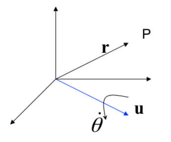
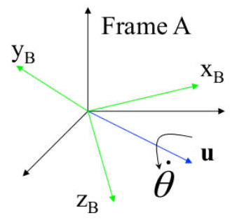

# IMU涉及的坐标系

## IMU 坐标系（Body / IMU frame）

- **记作**
  $$
  \{B\}\quad\text{或}\quad\{I\}
  $$

- **定义**：IMU 自己的坐标系，固定在IMU上，跟着机器人一起运动。

  这个坐标系：

  - 原点：IMU 的中心
  - 轴方向：由硬件定义
  - 会随着机器人运动

- **作用**：**所有 IMU 测量都是在这个坐标系下给出的**。

  例如：

  IMU 输出：

  ```
  gyro: [0.1, 0.0, 0.2] rad/s
  acc:  [0.0, 0.0, 9.8] m/s²
  ```

  意思是：

  ```
  在 IMU 坐标系下：
  x方向角速度 = 0.1
  y方向角速度 = 0
  z方向角速度 = 0.2
  ```

## 参考坐标系（Reference frame / Initial frame）

- **记作**：
  $$
  \{G\}
  $$

- **定义**：**系统刚启动时的世界坐标系**。
- **作用**：**因为 SLAM/LIO没有GPS时，不知道真实世界位置**。所以我们人为规定：<span style="color:red">系统启动那一刻的 IMU坐标系 就是 世界坐标系</span>


# 总览

- I常见的IMU为六轴传感器，配备输出`三轴加速度`的**加速度计**和输出`三轴角速度`的**陀螺仪**。

- `IMU 状态表示`：
  $$
  \mathbf{X}_{IMU} = \begin{bmatrix} {}^I_G\bar{q}^T & \mathbf{b}_g^T & {}^G\mathbf{v}_I^T & \mathbf{b}_a^T & {}^G\mathbf{p}_I^T \end{bmatrix}
  $$
  其中：

  - **约定一个notation规则（人为规定）**：${}^A_B \mathbf{x}$，读作：**B 的某个量，用 A 坐标系表示**

  - $\{I\}$ 表示IMU坐标系，$\{G\}$表示参考坐标系

  - ${}^I_G\bar{q}^T$：IMU姿态中的`旋转量`。表示将任意向量 从 $\{G\}$坐标系 旋转到 $\{I\}$坐标系

    - $G$：被旋转的坐标系是$\{G\}$
  
    - $I$：旋转后表达在坐标系$\{I\}$

    - $\bar{q}$：四元数`共轭`。但是在IMU姿态中，四元数总是取`单位四元数`，那么这时候就有 $\bar{q}=q^{-1}$（因为此时$\|q\|=1$）

      > [!NOTE]
      >
      > 四元数的`四个分量`：
      >
      > 四元数本质上表示：
      > $$
      > \boxed{
      > \text{旋转轴} + \text{旋转角度}
      > }
      > $$
      > 具体关系是：
      > $$
      > q =
      > \begin{bmatrix}
      > \cos(\theta/2) \\
      > u_x \sin(\theta/2) \\
      > u_y \sin(\theta/2) \\
      > u_z \sin(\theta/2)
      > \end{bmatrix}
      > $$
      > 其中：
      >
      > - $\theta$：旋转角度
      > - $(u_x, u_y, u_z)$：单位旋转轴
      >
      > 四个分量分别代表什么？
      >
      > | 分量  | 物理意义      | 数学                |
      > | ----- | ------------- | ------------------- |
      > | $q_w$ | 旋转角度信息  | $\cos(\theta/2)$    |
      > | $q_x$ | 旋转轴 x 分量 | $u_x\sin(\theta/2)$ |
      > | $q_y$ | 旋转轴 y 分量 | $u_y\sin(\theta/2)$ |
      > | $q_z$ | 旋转轴 z 分量 | $u_z\sin(\theta/2)$ |
  
      > [!NOTE]
      >
      > 四元数的`共轭`：（实部不变，虚部取负号）
      >
      > 如果一个四元数是
      > $$
      > q =
      > \begin{bmatrix}
      > q_w \\
      > q_x \\
      > q_y \\
      > q_z
      > \end{bmatrix}
      > $$
      > 那么它的 `共轭` 定义为：
      > $$
      > \bar{q} =
      > \begin{bmatrix}
      > q_w \\
      > - q_x \\
      > - q_y \\
      > - q_z
      > \end{bmatrix}
      > $$
      > `共轭`表达了什么？
      >
      > - 我们看一个四元数：${}^W_I q$ ，表示的是 <span style="color:red">一个向量 从 IMU坐标系 到 世界坐标系 的旋转</span>
      >
      > - 那么： $({}^W_I q)^{-1}=\overline{{}^W_I q}={}^I_W q$ 。也就是说 ${}^W_I q$ 的`共轭` 等于 ${}^I_W q$，表示 <span style="color:red">一个向量 从 世界坐标系 到 IMU坐标系 的旋转</span>
      > - 也就是说 四元数的`共轭`表达了 <span style="color:red">同一个姿态的反方向旋转</span>
  
      >[!NOTE]
      >
      >四元数的`逆`：
      >$$
      >q^{-1}=\frac{\bar{q}}{\|q\|^2}
      >$$
  
  - $\mathbf{b}_g$：陀螺仪（测量角速度）的`bias（零偏）`
  
    - 维度是 $3\times1$，对应 $x,y,z$轴 的角速度
  
    - 什么是`bias`？
  
      例如当 **真实角速度**为$0$时，**IMU可能读到**$0.02rad/s$，这就是`零偏`
  
    - 为什么IMU需要`估计`？
  
      因为 **IMU的误差主要来自`bias`，而且误差会随时间慢慢漂移**
  
      **例如**：
  
      假设设备完全静止，也就是真实角速度是$0$，但是陀螺仪因为`零偏`会输出$0.01rad/s$
  
      所以系统会认为：**你在旋转**，然后系统就会进行积分 $\theta=\omega t$
  
      结果，在10秒后：$0.01\times10=0.1\mathrm{~rad}$。也就是说系统认为你已经转了 5.7°
  
  - ${}^{G}\mathbf{v}_{I}$：IMU姿态中的`线速度`，用 $\{G\}$坐标系 表示（用$\{G\}$坐标系表示更加稳定）
  
    - 维度是 $3\times1$，对应 $x,y,z$轴 的线速度
    - 例如：机器人在地面上移动：$\left[1,0,0\right]m/s$，意思是 向x方向$1m/s$
  
  - $\mathbf{b}_{a}$：加速度计的`bias（零偏）`
  
    - 维度是 $3\times1$，对应 $x,y,z$轴 的加速度的零偏
  
    - 例如：（在静止时测量`重力加速度`）
  
      IMU 静止放在桌子上，z 轴朝上。
  
      真实测量应该是：$[0, 0, 9.81]^T \, m/s^2$
  
      但实际测量为：$[0, 0, 9.95]^T \, m/s^2$
  
      因此此时加速度零偏为：$\mathbf{b}_a=[0, 0, 0.14]^T \, m/s^2$
  
  - ${}^G\mathbf{p}_I$：IMU 的位置，用 $\{G\}$坐标系 表示（用$\{G\}$坐标系表示更加稳定）、
  
    - 例如：
  
      有一个世界坐标 $[2,1,0]$ ，意思是：
  
      IMU 在 **世界坐标系** 中的坐标为：x=2m y=1m z=0m
  
- 对于IMU`状态估计问题`，需要提供

  - `运动模型`：状态是如何随时间变化的
    $$
    \dot{\mathbf{x}}=f(\mathbf{x})
    $$
    其中：

    - $\mathbf{x}$：真实状态量（待估计，不可知）
    - $\dot{\mathbf{x}}$：状态量$\mathbf{x}$对时间的导数（也就是速度），$\dot{\mathbf{x}}=\frac{d\mathbf{x}}{dt}$

  - `观测模型`：
    $$
    \mathbf{z}=g(\mathbf{x})+\mathbf{n} \\
    实际测量值=根据真实状态计算出来的理想测量值+测量噪声
    $$
    其中：

    - $\mathbf{z}$：观测量（传感器读数）

    - $\mathbf{x}$：真实状态量（待估计，不可知）
    - $g(\mathbf{x})$：如果系统处在状态 $\mathbf{x}$，传感器得到的理想测量值
    - $\mathbf{n}$：观测噪声

  - `估计误差模型`：表示 真实值 和 估计值 之间的误差
    $$
    \delta\mathbf{x}=e(\mathbf{\hat{x}},\mathbf{x})
    $$
    其中：

    - $\delta_{\mathbf{x}}$：状态误差

    - $\hat{\mathbf{x}}$：当前算法算出来的估计值
    - $\mathbf{x}$：真实状态量（待估计，不可知）
    - $e(\hat{\mathbf{x}},\mathbf{x})$：误差函数，表示 如何从“估计值”和“真实值”计算误差


# 前置知识

## 前置（1）：向量的点乘和叉乘

### 点乘（内积）

- `交换律`
  $$
  \mathbf{a}\cdot\mathbf{b}=\mathbf{b}\cdot\mathbf{a}
  $$

- `结合律`

  > [!WARNING]
  >
  > 严格来说交换律没有意义。因为两个向量点积是一个标量，标量不能跟向量点积

  $$
  (\mathbf{a}\cdot\mathbf{b})\cdot\mathbf{c}=\mathbf{a}\cdot(\mathbf{b}\cdot\mathbf{c})
  $$

- `分配律`（对加法成立）
  $$
  \begin{aligned}\mathbf{a}\cdot(\mathbf{b}+\mathbf{c})&=\mathbf{a}\cdot\mathbf{b}+\mathbf{a}\cdot\mathbf{c}\\\\(\mathbf{a}+\mathbf{b})\cdot\mathbf{c}&=\mathbf{a}\cdot\mathbf{c}+\mathbf{b}\cdot\mathbf{c}\end{aligned}
  $$

- `数乘结合`
  $$
  (k\mathbf{a})\cdot\mathbf{b}=k(\mathbf{a}\cdot\mathbf{b})
  \\\\
  \mathbf{a}\cdot(k\mathbf{b})=k(\mathbf{a}\cdot\mathbf{b})
  $$

- `重要恒等式`

  - `模长平方`
    $$
    \mathbf{a}\cdot\mathbf{a}
    =
    |\mathbf{a}|^2
    $$
  
  - `夹角公式`
    $$
    \mathbf{a}\cdot\mathbf{b}
    =
    |\mathbf{a}||\mathbf{b}|\cos\theta
    $$
  
  - `正交条件`
    $$
    \mathbf{a}\cdot\mathbf{b}=0
    \iff
    \mathbf{a}\perp\mathbf{b}
    $$
  
  - `柯西不等式`
    $$
    |\mathbf{a}\cdot\mathbf{b}|
    \le
    |\mathbf{a}||\mathbf{b}|
    $$
  


### 叉乘（外积）

- `反交换律`
  $$
  \mathbf{a}\times\mathbf{b}=-\mathbf{b}\times\mathbf{a}
  $$

- 不满足`结合律`！！！
  $$
  (\mathbf{a}\times\mathbf{b})\times\mathbf{c}
  \ne
  \mathbf{a}\times(\mathbf{b}\times\mathbf{c})
  $$

- `分配律`（对加法成立）

  1. 左分配律
     $$
     \mathbf{a} \times (\mathbf{b} + \mathbf{c}) 
     = \mathbf{a} \times \mathbf{b} + \mathbf{a} \times \mathbf{c}
     $$

  2. 右分配律
     $$
     (\mathbf{a} + \mathbf{b}) \times \mathbf{c}
     = \mathbf{a} \times \mathbf{c} + \mathbf{b} \times \mathbf{c}
     $$


- `数乘结合`
  $$
  (k\mathbf{a})\times\mathbf{b}=k(\mathbf{a}\times\mathbf{b})
  \\\\
  \mathbf{a}\times(k\mathbf{b})=k(\mathbf{a}\times\mathbf{b})
  $$

- `自身叉乘`
  $$
  \mathbf{a}\times\mathbf{a}=\mathbf{0}
  $$

- `模长公式`
  $$
  |\mathbf{a}\times\mathbf{b}|=|\mathbf{a}||\mathbf{b}|\sin\theta
  $$

- `平行条件`
  $$
  \mathbf{a}\times\mathbf{b}=\mathbf{0}\Longleftrightarrow\mathbf{a}\parallel\mathbf{b}
  $$


### 混合恒等式

- `标量三重积（Scalar Triple Product）`
  $$
  \mathbf{a}\cdot(\mathbf{b}\times\mathbf{c})
  $$

  - 循环不变
    $$
    \mathbf{a}\cdot(\mathbf{b}\times\mathbf{c})
    =
    \mathbf{b}\cdot(\mathbf{c}\times\mathbf{a})
    =
    \mathbf{c}\cdot(\mathbf{a}\times\mathbf{b})
    $$

  - 交换两个向量会变号
    $$
    \mathbf{a}\cdot(\mathbf{b}\times\mathbf{c})
    =
    -
    \mathbf{a}\cdot(\mathbf{c}\times\mathbf{b})
    $$

  - 行列式形式
    $$
    \mathbf{a}\cdot(\mathbf{b}\times\mathbf{c})
    =
    \begin{vmatrix}
    a_x & a_y & a_z \\
    b_x & b_y & b_z \\
    c_x & c_y & c_z
    \end{vmatrix}
    $$

- `向量三重积（Vector Triple Product）（BAC–CAB 公式）`
  $$
  \mathbf{a}\times(\mathbf{b}\times\mathbf{c})
  =
  \mathbf{b}(\mathbf{a}\cdot\mathbf{c})
  -
  \mathbf{c}(\mathbf{a}\cdot\mathbf{b})
  \\
  保留中间 \; 减最后
  $$
  另一个顺序：
  $$
  (\mathbf{a}\times\mathbf{b})\times\mathbf{c}
  =
  \mathbf{b}(\mathbf{a}\cdot\mathbf{c})
  -
  \mathbf{a}(\mathbf{b}\cdot\mathbf{c})
  \\
  保留中间 \; 减第一
  $$


## 前置（2）：旋转量求导

> 该部分知识涉及 **刚体动力学**

- 在`惯性坐标系`下，如果一个刚体进行`平移运动`，
  - 那么其平移量对时间的**一阶导**为`速度`： $\dot{\mathbf{p}}=\mathbf{v}$
  - 其平移量对时间的**二阶导**为`加速度`： $\dot{\mathbf{p}}=\mathbf{v},\dot{\mathbf{v}}=\mathbf{a}$

- 🤔那么，对于`旋转量`和`非惯性坐标系`呢？

  - 考虑一个从原点出发的 向量$r$ 绕 单位轴$u$ 旋转，角速度大小为$\dot{\theta}$，如下图所示👇

    

    所以`角速度矢量`为 $\boldsymbol{\omega}=\dot{\theta}\mathbf{u}$ 

    得到 向量$r$ 末端点$P$ 的`线速度矢量`，即 $r$的时间一阶导：
    $$
    \frac{d\mathbf{r}}{dt}=\omega\times\mathbf{r}
    $$

  - 这时，如果 坐标系$\{B\}=[\mathbf{i}_B\quad\mathbf{j}_B\quad\mathbf{k}_B]^T$ 绕 单位轴$\mathbf{u}$ 旋转，如下图所示：

    

    那么 三个轴 对时间的一阶导，即 坐标系$\{B\}$ 的`线速度矢量`为：
    $$
    \frac{d\mathbf{i}_B}{dt}=\boldsymbol{\omega}\times\mathbf{i}_B,\frac{d\mathbf{j}_B}{dt}=\boldsymbol{\omega}\times\mathbf{j}_B,\frac{d\mathbf{k}_B}{dt}=\boldsymbol{\omega}\times\mathbf{k}_B
    $$

  - 我们知道，$[ \mathbf{i} _B$ $\mathbf{j} _B$ $\mathbf{k} _B]$ 实际上就是 `坐标系{B}` 相对于 `参考坐标系` 的旋转矩阵$\mathbf{R}$（即把一个**向量** 从 **坐标系{B}** 转换到 **参考坐标系**）。

    所以 $\mathbf{R}$ 的 时间一阶导 为
    $$
    \dot{\mathbf{R}}=[\omega\times\mathbf{i}_B\quad\omega\times\mathbf{j}_B\quad\omega\times\mathbf{k}_B]=\omega\times\mathbf{R}=\omega^{\wedge}\mathbf{R}
    $$
    其中：

    - $\dot{\mathbf{R}}$ 表达的含义是 **姿态变化速度**

    - $\omega^{\wedge}$：（`参考坐标系`下的）角速度的反对称矩阵，$\boldsymbol{\omega}^{\wedge}=\begin{bmatrix}0&-\omega_3&\omega_2\\\omega_3&0&-\omega_1\\-\omega_2&\omega_1&0\end{bmatrix}$
    - 该式子可以写成 $\dot{R}=R\omega_B^{\wedge}$ ，其中 角速度在`坐标系{B}`中

  - 在上面，我们讨论的 角速度$\boldsymbol{\omega}$ 都是在 `参考坐标系`下的。在实际运算中，我们经常在 `坐标系{B}` 下表达。

    > - $\mathbf{R}$ = `坐标系{B}` 相对于 `参考坐标系` 的旋转矩阵
    >
    >   约定：$\mathbf{R}={}^A\mathbf{R}_B$，表示 **坐标系B** 相对于 **坐标系A** 的旋转矩阵
    >
    >   例如：$\mathbf{v}^A=\mathbf{R}\mathbf{v}^B$，意思是 R 把 向量v 从 B坐标系 表示，转换成 A坐标系 表示
    >
    > - $\mathbf{R}^T=\mathbf{R}^{-1}$
    >
    >   因为旋转矩阵是`正交矩阵`，所以 $\mathbf{R}^{T}\mathbf{R}=I$ 。所以：
    >
    >   如果 $\mathbf{R}$ 表示 把一个向量 从 坐标系B 变换到 坐标系A
    >
    >   那么 $\mathbf{R}^T$ 表示 把一个向量 从 坐标系A 变换到 坐标系B

    所以 $^B\omega=\mathbf{R}^T\boldsymbol{\omega}$

  


## 前置（3）：四元数

- `四元数`的定义

  > `四元数`是一个由 **1个实数** 和 **1个三维向量** 组成的四维数

  四元数由一个实部和一个虚部组成。

  这里使用`Hamilton Notation四元数（一个notation规范）`
  $$
  q =
  \begin{bmatrix}
  q_w \\
  q_x \\
  q_y \\
  q_z
  \end{bmatrix}
  =\begin{bmatrix}q_w & v^T\end{bmatrix}^T
  $$
  虚部 $\boldsymbol{v}=[q_x\quad q_y\quad q_z]^{T}$。虚部的三个基 $i,j,k$ 满足 $i^{2}=j^{2}=k^{2}=ijk=-1$

- 四元数的`轴角表示`
  $$
  \begin{equation}\begin{array}{c}b\\R\end{array}\mathbf{q}=\cos\frac{\theta}{2}+\mathbf{u}^{R}\cdot\sin\frac{\theta}{2}\end{equation}
  $$
  其中：

  - $\theta$：旋转角度（单位：弧度）。旋转是绕某个轴旋转 $\theta$ 弧度
  
  - $\mathbf{u}^{R}$：$\mathbf{u}^R=[u_x,u_y,u_z]^T\mathrm{,}|\mathbf{u}^R|=1$。
  
    - $\mathbf{u}$ 是一个 几何向量（单位旋转轴本身）

    - $\mathbf{u}^R$ 表示 **单位旋转轴$\mathbf{u}$** 在参考坐标系 $R$ 下的**坐标表示**（**其中 $R$ 是一个坐标系的符号而非旋转矩阵**）。该轴定义了旋转的方向，其正方向由`右手定则`确定。
  
  - $\cos(\theta/2)$ 与 $\sin(\theta/2)$：
    四元数的`标量`部分：$q_w = \cos(\theta/2)$
    四元数的`向量`部分：$\mathbf{v} = \mathbf{u}^R \cdot \sin(\theta/2)$
  
  - $\begin{array}{c}b\\R\end{array}\mathbf{q}$：一个旋转四元数，将`坐标系R` 旋转成为新的`坐标系b`
  
    > [!IMPORTANT]
    >
    > 注意 $\begin{array}{c}b\\R\end{array}\mathbf{q}$ 是**旋转坐标系**，是`被动旋转`
    >
    > <div style="color:red;  text-align: center;">旋转坐标系（被动） == 反向旋转向量（主动）</div>

- 四元数与旋转矩阵的`转换`

  - 根据上面所说的$\begin{array}{c}b\\R\end{array}\mathbf{q}$，我们可以理解`旋转四元数`与`旋转矩阵`的映射为
    $$
    C_S\left(\begin{array}{l}b\\R\end{array}\mathbf{q}\right)=\mathbf{R}_R^b
    $$
    其中：

    - $\mathbf{R}_R^b$：将 一个向量 从 $R$坐标系下的坐标表示 转换为 $b$坐标系下的坐标表示（即$\mathbf{v}^b=\mathbf{R}_R^b\cdot\mathbf{v}^R$）

- `homomorphy映射`

  当**两个旋转四元数进行了乘法运算**之后，**对应的旋转矩阵**就是原先两个旋转四元数对应旋转矩阵按照相同顺序进行乘法的结果（即维持了`链式法则`的顺序），称这样的旋转四元数到旋转矩阵的映射是一个`homomorphy的映射`，即：
  $$
  R(q_2\otimes q_1)=R(q_2)R(q_1)
  $$
  🤔那么上面定义的$C_S\left(\bullet\right)$是否是homomorphy的呢？

  - 设
    $$
    \begin{equation}\begin{array}{c}\mathbf{Q}={}_{1}^{2}\mathbf{q}\\\mathbf{P}={}_{0}^{1}\mathbf{q}\end{array}\end{equation}
    $$

  - 根据前述 旋转四元数 到 旋转矩阵 的映射$C_S\left(\bullet\right)$，有：
    $$
    \begin{equation}\begin{aligned}C_{S}\left(\mathbf{Q}\right)&=\mathbf{R}_{1}^{2}\\C_{S}\left(\mathbf{P}\right)&=\mathbf{R}_{0}^{1}\end{aligned}\end{equation}
    $$

  - 根据旋转四元数乘法的定义，有：
    $$
    \begin{equation}\begin{aligned}
    \mathbf{Q}\otimes\mathbf{r}^{2}\otimes\mathbf{Q}^{-1}&=\mathbf{r}^{1}\\\mathbf{P}\otimes\mathbf{r}^{1}\otimes\mathbf{P}^{-1}&=\mathbf{r}^{0} \\
    这里是旋转坐标系，&相当于反向旋转向量
    \end{aligned}\end{equation}
    $$
    也就是说：
    $$
    \begin{aligned}&\mathbf{P}\otimes\mathbf{Q}\otimes\mathbf{r}^{2}\otimes\mathbf{Q}^{-1}\otimes\mathbf{P}^{-1}=\mathbf{r}^{0}\\&\Rightarrow(\mathbf{P}\otimes\mathbf{Q})\otimes\mathbf{r}^{2}\otimes(\mathbf{P}\otimes\mathbf{Q})^{-1}=\mathbf{r}^{0}\end{aligned}
    $$
    根据旋转四元数的定义，可得：
    $$
    \mathbf{P}\otimes\mathbf{Q}={}_0^2\mathbf{q}
    $$
    代入映射 $C_S(\bullet)$ ，有：
    $$
    C_{S}\left(\mathbf{P}\otimes\mathbf{Q}\right)=C_{S}\left(_{0}^{2}\mathbf{q}\right)=\mathbf{R}_{0}^{2}
    $$
    这时我们发现，$C_S\left(\mathbf{P}\otimes\mathbf{Q}\right)\neq C_S\left(\mathbf{P}\right)\cdot C_S\left(\mathbf{Q}\right)$，而是$C_{S}\left(\mathbf{P}\otimes\mathbf{Q}\right)=C_{S}\left(\mathbf{Q}\right)\cdot C_{S}\left(\mathbf{P}\right)$

    **也就是说在采用四元数的`Hamilton Notation`时，映射$\boldsymbol{C}_S\left(\bullet\right)$不是`homomorphy`的**。


- 事实上，只要我们按照`Rodrigues Rotation Formula（罗德里格旋转公式）`来定义 **旋转四元数 到 方向余弦阵（或旋转矩阵 Rotation Matrix）的映射**

  就可以直接得到`HN四元数体系`下所谓`homomorphy的形式`，即
  $$
  C_H\left(_R^b\mathbf{q}\right)=\mathbf{R}_b^R
  $$
  🤔为什么呢？**（注意：我们把 $C_S\left(\begin{array}{l}b\\R\end{array}\mathbf{q}\right)=\mathbf{R}_R^b$ 和 $C_H\left(_R^b\mathbf{q}\right)=\mathbf{R}_b^R$ 放在一起时确实很容易把人搞晕）**

  - 设
    $$
    \begin{aligned}\mathbf{Q}&=\mathbf{_1^2q}\\\mathbf{P}&=\mathbf{_0^1q}\end{aligned}
    $$

  - 根据`罗德里格旋转公式`的定义，得到：
    $$
    \begin{aligned}C_{\boldsymbol{H}}\left(\mathbf{Q}\right)&=\mathbf{R}_{2}^{1}\\C_{\boldsymbol{H}}\left(\mathbf{P}\right)&=\mathbf{R}_{1}^{0}\end{aligned}
    $$

  - 因为我们采用`HN四元数体系`，仍有：
    $$
    \begin{aligned}
    \mathbf{Q}\otimes\mathbf{r}^{2}\otimes\mathbf{Q}^{-1}&=\mathbf{r}^{1}\\\mathbf{P}\otimes\mathbf{r}^{1}\otimes\mathbf{P}^{-1}&=\mathbf{r}^{0} \\
    这里是旋转坐标系，&相当于反向旋转向量
    \end{aligned}
    $$
    即：
    $$
    \begin{aligned}&\mathbf{P}\otimes\mathbf{Q}\otimes\mathbf{r}^2\otimes\mathbf{Q}^{-1}\otimes\mathbf{P}^{-1}=\mathbf{r}^0\\&\Rightarrow(\mathbf{P}\otimes\mathbf{Q})\otimes\mathbf{r}^2\otimes(\mathbf{P}\otimes\mathbf{Q})^{-1}=\mathbf{r}^0\\&\Rightarrow\mathbf{P}\otimes\mathbf{Q}={}_0^2\mathbf{q}\end{aligned}
    $$

  - 我们把 $\mathbf{P}\otimes\mathbf{Q}$ 套入 `罗德里格旋转公式`：
    $$
    \begin{aligned}&C_H\left(\mathbf{P}\otimes\mathbf{Q}\right)=C_H\left(_0^2\mathbf{q}\right)=\mathbf{R}_2^0\\&=\mathbf{R}_1^0\cdot\mathbf{R}_2^1=C_H\left(_0^1\mathbf{q}\right)\cdot C_H\left(_1^2\mathbf{q}\right)=C_H\left(\mathbf{P}\right)\cdot C_H\left(\mathbf{Q}\right)\end{aligned}
    $$
    

- 四元数的`旋转公式`：
  $$
  x^{\prime}=qxq^{-1}
  $$
  其中：

  - $q$：`单位四元数`，四元数“`半角`”是因为旋转被“分配”在 $q$ 和 $q^{-1}$ 两边，每边贡献 $\theta/2$
  - $x$：一个普通的三维向量，但是要**写成四元数的格式**，即 $x=\begin{bmatrix}0\\x\\y\\z\end{bmatrix}$
  - **几何意义：向量 $x$ 沿着单位旋转轴 $\mathbf u$ 旋转 $\theta$**（其中 $\mathbf{u}$ 和 $\theta$ 都是在 单位四元数$q$ 中）

- 四元数的乘法$\bigotimes$ **（类似于多项式乘法的逐项相乘）**

  - 有两个四元数：
    $$
    q=\begin{bmatrix}q_w\\q_x\\q_y\\q_z\end{bmatrix}=\begin{bmatrix}q_w\\\mathbf{v}_q\end{bmatrix}\\p=\begin{bmatrix}p_w\\p_x\\p_y\\p_z\end{bmatrix}=\begin{bmatrix}p_w\\\mathbf{v}_p\end{bmatrix}
    $$
  
  - 那么这两个四元数的乘法是：
    $$
    q\otimes p=(q_w+q_xi+q_yj+q_zk)(p_w+p_xi+p_yj+p_zk) \\
    \begin{gathered}=q_wp_w+q_wp_xi+q_wp_yj+q_wp_zk\\+q_xip_w+q_xip_xi+q_xip_yj+q_xip_zk\\+q_yjp_w+q_yjp_xi+q_yjp_yj+q_yjp_zk\\+q_zkp_w+q_zkp_xi+q_zkp_yj+q_zkp_zk\end{gathered} \\
    \begin{aligned}&=q_wp_w-q_xp_x-q_yp_y-q_zp_z\\&+(q_wp_x+q_xp_w+q_yp_z-q_zp_y)i\\&+(q_wp_y-q_xp_z+q_yp_w+q_zp_x)j\\&+(q_wp_z+q_xp_y-q_yp_x+q_zp_w)k\end{aligned}
    $$
  
    - 处理`向量`部分（$i,j,k$）：写成向量形式，定义$\mathbf{v}=\begin{bmatrix}\text{i系数}\\\text{j系数}\\\text{k系数}\end{bmatrix}$，所以 
      $$
      \mathbf{v}=\begin{bmatrix}q_wp_x+q_xp_w+q_yp_z-q_zp_y\\q_wp_y-q_xp_z+q_yp_w+q_zp_x\\q_wp_z+q_xp_y-q_yp_x+q_zp_w\end{bmatrix} \\
      =\underbrace{\begin{bmatrix}q_wp_x\\q_wp_y\\q_wp_z\end{bmatrix}}_{q_w\mathbf{v}_p}+\underbrace{\begin{bmatrix}q_xp_w\\q_yp_w\\q_zp_w\end{bmatrix}}_{p_w\mathbf{v}_q}+\underbrace{\begin{bmatrix}q_yp_z-q_zp_y\\q_zp_x-q_xp_z\\q_xp_y-q_yp_x\end{bmatrix}}_{\mathbf{v}_q\times\mathbf{v}_p}
      $$
  
    - 得到最终向量形式：
  
      $$
      \begin{aligned}
      q\otimes p=&\;
      q_wp_w-q_xp_x-q_yp_y-q_zp_z\\
      &+
      \left(
      q_w\mathbf{v}_p
      +
      p_w\mathbf{v}_q
      +
      \mathbf{v}_q\times\mathbf{v}_p
      \right)
      \end{aligned}
      $$
      或者标准紧凑形式：
      $$
      \begin{equation}
      \label{Quaternion_multiplication}
      q\otimes p=
      \begin{bmatrix}
      q_wp_w-\mathbf{v}_q\cdot\mathbf{v}_p\\
      q_w\mathbf{v}_p+p_w\mathbf{v}_q+\mathbf{v}_q\times\mathbf{v}_p
      \end{bmatrix}
      \end{equation}
      $$
      上面是标量，下面是向量。如果是两个单位四元数相乘，得到的还是单位四元数
  
      

# 误差方程推导

## INS误差状态微分方程

> [!NOTE]
>
> `INS 误差`：`真实状态`（true state）与`导航系统估计状态`（estimated / nominal state）之间的差值。
>
> 在 **惯性导航系统（INS）误差状态方程** 里，这些误差被单独建模，并写成一个**线性微分方程**，用于滤波（比如 ESKF / Kalman Filter）。
>
> 一个标准 **15 维 INS 误差状态** 是：
>$$
> \boxed{\delta\mathbf{x}=\begin{bmatrix}\delta\mathbf{p}\\\delta\mathbf{v}\\\delta\boldsymbol{\theta}\\\delta\mathbf{b}_a\\\delta\mathbf{b}_g\end{bmatrix}}
> $$
> 
> | 误差               | 含义             | 维度 |
>| ------------------ | ---------------- | ---- |
> | 位置误差           | position error   | 3    |
> | 速度误差           | velocity error   | 3    |
> | 姿态误差           | attitude error   | 3    |
> | 加速度计 bias 误差 | accel bias error | 3    |
> | 陀螺 bias 误差     | gyro bias error  | 3    |

### 符号说明以及常用公式

#### 旋转四元数 及其与 方向余弦阵的映射

> 这里的推导基于`static world assumption` ，即认为在**载体运动范围内**地球表面是一个平面，且不考虑地球自转，即可认为初始时刻的水平地理系（$\mathrm{n}$）是一个惯性系，选择这个坐标系作为为世界坐标系（$\boldsymbol{w}$）。

- 定义一个旋转四元数${}^b_w\mathbf{q}$：描述 **载体系（imu本身）（$b$）** 相对于 **世界系（$w$）** 姿态的转变

- 定义 旋转四元数${}^b_w\mathbf{q}$ 到 旋转矩阵$\mathbf{R}_b^w$ 的映射形式：
  $$
  \begin{equation}
  \label{q2R}
  C\left(\mathbf{q}\right)=C_H\begin{pmatrix}{}^b_w\mathbf{q}\end{pmatrix}=\mathbf{R}_b^w
  \end{equation}
  $$

#### 误差四元数

- **误差四元数的`定义`**：
  $$
  \mathbf{{}^b_w q=\delta q \otimes \hat{{}^b_w q}} \\
  真实姿态 = 误差 × 估计姿态
  $$
  由于四元数的结合律，我们得到
  $$
  \delta\mathbf{q}=\mathbf{{}^b_w q}\otimes\mathbf{\hat{{}^b_w q}}^{-1}
  $$
  其中：

  - $\delta \mathbf{q}$：**`误差四元数（相对旋转）`**。表示：**“`估计值`差了多少旋转才能变成`真实值`”**

    - **左乘误差**：表示误差在 **世界坐标系**下 作用的**（先施加误差，后旋转）**

    - **右乘误差**：表示误差在 **机体坐标系**下 作用的**（先旋转，后施加误差）**

      > [!NOTE] 
      >
      > 这是因为 四元数 不满足 `交换律`

  - ${}^b_w q$：`真实四元数（绝对姿态）`。表示从 世界坐标系$w$ 到 机体坐标系$b$ 的真实旋转

  - $\hat{{}^b_w q}$：当前估计的四元数。这是**IMU算出来的姿态**，但是因为`零偏`，所以会有`误差`

- 由于 $C_H\begin{pmatrix}{}^b_w\mathbf{q}\end{pmatrix}=\mathbf{R}_b^w$，根据`homomorphy性质`，可知上式对应于：

  $$
  \begin{equation}
  \label{homomorphy_R}
  \mathbf{R}_{w^{\prime}}^w=\mathbf{R}_b^w\cdot\left(\mathbf{R}_b^{w^{\prime}}\right)^T=\mathbf{R}_b^w\cdot\mathbf{R}_{w^{\prime}}^b
  \end{equation}
  $$
  其中：
  
  - $\mathbf{R}_{w^{\prime}}^w$：$\delta\mathbf{q}$ 经过映射 $C_H\begin{pmatrix}{}^b_w\mathbf{q}\end{pmatrix}$得到的 旋转矩阵
  
  - $w^{\prime}$​：`摄动世界坐标系`（即**存在误差的世界坐标系**）
  
    > [!IMPORTANT]
    >
    > `摄动坐标系`：
    >
    > - 我们认为：<span style="color:red">真实姿态 ＝ 估计姿态 + 一个小扰动</span>
    >
    >   在数学上表示：
    >   $$
    >   \mathbf{R}_b^w=\mathbf{R}_b^{w^{\prime}}\exp(\delta\boldsymbol{\theta}^\wedge)
    >   $$
    >   其中：
    >
    >   - $w$：真实世界系
    >
    >   - $w'$：摄动坐标系（估计世界系）
    >
    >   - $\delta\boldsymbol{\theta}$：小角度误差
    >
    >   也就是说：
    >   $$
    >   w'是w的一个小偏差。\\
    >   坐标系几乎重合，但是w'与w相差一个\;小旋转\delta\boldsymbol{\theta}
    >   $$
    >
    > - **直观的集合图表示**：
    >
    >   ```
    >   真实世界系 w
    >                   
    >           z
    >           ↑
    >           |
    >           |
    >           o------→ x
    >          /
    >         y
    >   ```
    >
    >   ```
    >   摄动坐标系 w'
    >                   
    >           z'
    >           ↑
    >           |
    >           |
    >           o------→ x'
    >          /
    >         y'
    >   ```
    >
    >   两个坐标系：
    >
    >   - 几乎重合
    >   - 但有一个 小旋转$\delta\theta$
  
- 把 $\delta\mathbf{q}$ 按 四元数的定义$\mathbf{q}=\cos\frac{\theta}{2}+\mathbf{u}^R\cdot\sin\frac{\theta}{2}$ 展开得：
  $$
  \delta\mathbf{q}=\cos\frac{|\delta\boldsymbol{\theta}|}{2}+\frac{\delta\boldsymbol{\theta}^w}{|\delta\boldsymbol{\theta}|}\cdot\sin\frac{|\delta\boldsymbol{\theta}|}{2}
  $$
  其中：

  - $\delta\theta^{w}$：在 世界坐标系$w$系下 的误差角旋转向量（姿态误差角）
    - `方向`代表旋转轴
    - `长度`代表旋转角度
  - $\left|\delta\theta\right|$：误差四元数对应的旋转向量**旋转角度大小**
  - $\delta\theta^w/|\delta\theta|$：单位旋转轴（$w$系下的摄动旋转轴）

- 对 $\delta\mathbf{q}$ 进行一阶近似

  - 前提：误差是一个`小量`，在 **IMU / 卡尔曼滤波**里：
    $$
    |\delta\boldsymbol{\theta}| \ll 1
    $$
    可能在几度以内（甚至更小），那么这就提供了做`泰勒展开`的前提

  - 对 $\cos\frac{|\delta\boldsymbol{\theta}|}{2}$ 和 $\sin\frac{|\delta\boldsymbol{\theta}|}{2}$ 进行`泰勒展开`

    （这里只给出了两项）
    $$
    \cos x\approx1-\frac{x^2}{2} \\
    \sin x\approx x
    $$

  - 给出一阶近似：
    $$
    \delta\mathbf{q}\approx1+\frac{1}{2}\delta\boldsymbol{\theta}^w==1+\frac{1}{2}[\mathbf{i}^w\quad\mathbf{j}^w\quad\mathbf{k}^w]\begin{bmatrix}\delta\theta_x\\\delta\theta_y\\\delta\theta_z\end{bmatrix}
    $$


#### $C(\bullet)$ 的具体形式及 $\mathbf{R}_{w^{\prime}}^{w}$

- 设把 **世界坐标系$w$** 旋转成 **机体坐标系$b$** 的旋转表示的`旋转四元数`$q$ 为：（注意：四元数在表示旋转时，必须是`单位四元数`）
  $$
  \mathbf{{}^b_w q}=q_0+q_1\mathbf{i}+q_2\mathbf{j}+q_3\mathbf{k}
  $$

- 则映射$C\left(\bullet\right)$的具体表达式为
  $$
  \left.\mathbf{R}_b^w=C\left(\mathbf{q}\right)=\left[\begin{array}{ccc}q_0^2+q_1^2-q_2^2-q_3^2&2\left(q_1q_2-q_0q_3\right)&2\left(q_1q_3+q_0q_2\right)\\2\left(q_1q_2+q_0q_3\right)&q_0^2-q_1^2+q_2^2-q_3^2&2\left(q_2q_3-q_0q_1\right)\\2\left(q_1q_3-q_0q_2\right)&2\left(q_2q_3+q_0q_1\right)&q_0^2-q_1^2-q_2^2+q_3^2\end{array}\right.\right]
  $$
  推导过程：
  
  - 用四元数旋转一个向量，即使用四元数乘法，即：
    $$
    \mathbf{v}_w=\mathbf{q}\otimes\mathbf{v}_b\otimes\mathbf{q}^{-1}
    $$
    其中：
  
    - $\mathbf{v}_b$ 被视为实部为 0 的虚四元数，即 $\mathbf{v}_b = [0, \vec{v}_b]^T$
    
    - 在单位四元数中，$\mathbf{q}^{-1} = \mathbf{q}^*$。$\mathbf{q}^*$ 的性质为 $\mathbf{q} \otimes \mathbf{q}^* = q_0^2 + q_1^2 + q_2^2 + q_3^2 = \|\mathbf{q}\|^2$
    
      > [!NOTE]
      >
      > 1. 在四元数中
      >    $$
      >    q^{-1}=\frac{q^*}{\|q\|^2}
      >    $$
      >
      > 2. 所以在`单位四元数`中（旋转四元数就是单位四元数）
      >    $$
      >    \mathbf{q}^{-1} = \mathbf{q}^*
      >    $$
      >    也就是说 $q$的共轭 也代表了逆旋转
    
  - 展开四元数乘法
  
    利用四元数乘法规则 $\eqref{Quaternion_multiplication}$，我们可以将上述算式展开。
  
    - 计算 $\mathbf{q}\otimes\mathbf{v}_b$
      $$
      \mathbf{a} = \mathbf{q} \otimes \mathbf{v}_b = ( - \mathbf{q}_v \cdot \mathbf{v}_b, \;\; q_0 \mathbf{v}_b + \mathbf{q}_v \times \mathbf{v}_b )
      $$
  
    - 计算 $\mathbf{a} \otimes \mathbf{q}^*$
      $$
      \mathbf{v}_w = \mathbf{a} \otimes \mathbf{q}^* = ( a_0 q_0 - \mathbf{a}_v \cdot (-\mathbf{q}_v), \;\; a_0 (-\mathbf{q}_v) + q_0 \mathbf{a}_v + \mathbf{a}_v \times (-\mathbf{q}_v) )
      $$
  
    - <span style="color:red">由于旋转不改变向量的实部（旋转后依然是纯虚四元数），所以实部计算结果一定是 0。</span>我们重点看**虚部（向量部分）**：
      $$
      \text{Vector part} = -a_0 \mathbf{q}_v + q_0 \mathbf{a}_v - \mathbf{a}_v \times \mathbf{q}_v
      $$
      现在我们把第一步得到的 $a_0$ 和 $\mathbf{a}_v$ 代入上面的式子：
  
      1. $-a_0 \mathbf{q}_v = -(- \mathbf{q}_v \cdot \mathbf{v}_b) \mathbf{q}_v = \mathbf{(q}_v \cdot \mathbf{v}_b) \mathbf{q}_v$
      2. $q_0 \mathbf{a}_v = q_0 (q_0 \mathbf{v}_b + \mathbf{q}_v \times \mathbf{v}_b) = q_0^2 \mathbf{v}_b + q_0 (\mathbf{q}_v \times \mathbf{v}_b)$
      3. $- \mathbf{a}_v \times \mathbf{q}_v = - (q_0 \mathbf{v}_b + \mathbf{q}_v \times \mathbf{v}_b) \times \mathbf{q}_v=-(q_0\mathbf{v}_b\times\mathbf{q}_v)+\mathbf{q}_v(\mathbf{q}_v\cdot\mathbf{v}_b)-\mathbf{v}_b(\mathbf{q}_v\cdot\mathbf{q}_v)$
  
      合并同类项:
  
      - 两个 $q_0 (\mathbf{q}_v \times \mathbf{v}_b)$ 凑成了 **$2q_0 (\mathbf{q}_v \times \mathbf{v}_b)$**。
  
      - 两个 $(\mathbf{q}_v \cdot \mathbf{v}_b) \mathbf{q}_v$ 凑成了 **$2(\mathbf{q}_v \cdot \mathbf{v}_b) \mathbf{q}_v$**。
  
      - 剩下的 $q_0^2 \mathbf{v}_b$ 和 $-\|\mathbf{q}_v\|^2 \mathbf{v}_b$ 凑成了 **$(q_0^2 - \|\mathbf{q}_v\|^2) \mathbf{v}_b$**。
  
    - 得到`罗德里格斯旋转公式 (Rodrigues' Rotation Formula)`，即$\mathbf{v}_w = \mathbf{q} \otimes \mathbf{v}_b \otimes \mathbf{q}^*$ 的矢量部分可以表示为：
    
      > [!IMPORTANT]
      >
      > 当我们旋转一个`三维向量`（计算时会变成纯虚四元数）时，旋转后的结果`标量（实部）部分`**恒等于 0**。
      >
      > 所以 `罗德里格斯旋转公式` 计算的是 `（变成纯虚四元数后）三维向量` 的 `向量部分`
    
      $$
      \mathbf{v}_w = (q_0^2 - \|\mathbf{q}_v\|^2)\mathbf{v}_b + 2(\mathbf{q}_v \cdot \mathbf{v}_b)\mathbf{q}_v + 2q_0(\mathbf{q}_v \times \mathbf{v}_b)
      $$
    
  - 转换为`矩阵形式`
  
    为了得到 $\mathbf{R}_b^w$，我们需要将上面的矢量运算改写成矩阵与向量相乘的形式 $\mathbf{v}_w = \mathbf{R} \mathbf{v}_b$。
  
    > `叉乘写成反对称矩阵`： $\mathbf{q}_v \times \mathbf{v}_b = [\mathbf{q}_v]_\times \mathbf{v}_b$，其中：
    > $$
    > [\mathbf{q}_v]_\times=\begin{bmatrix}0&-q_3&q_2\\q_3&0&-q_1\\-q_2&q_1&0\end{bmatrix}
    > $$
    > `点乘结合`：$(\mathbf{q}_v \cdot \mathbf{v}_b)\mathbf{q}_v = (\mathbf{q}_v \mathbf{q}_v^T) \mathbf{v}_b$
  
    代入`罗德里格斯旋转公式`：
    $$
    \mathbf{v}_w = \left[ (q_0^2 - \mathbf{q}_v^T \mathbf{q}_v)\mathbf{I} + 2\mathbf{q}_v \mathbf{q}_v^T + 2q_0 [\mathbf{q}_v]_\times \right] \mathbf{v}_b
    $$
    因此，**旋转矩阵 $\mathbf{R}$ 就是中括号内的部分**，也就是：
    $$
    \mathbf{R}=(q_0^2-\mathbf{q}_v^T\mathbf{q}_v)\mathbf{I}+2\mathbf{q}_v\mathbf{q}_v^T+2q_0[\mathbf{q}_v]_\times
    $$
  
  - 展开得到最终表达式
  
    - 计算 $(q_0^2-\mathbf{q}_v^T\mathbf{q}_v)\mathbf{I}$
  
      先算：
      $$
      \mathbf{q}_v^T \mathbf{q}_v
      =
      q_1^2 + q_2^2 + q_3^2
      $$
      所以：
      $$
      q_0^2 - \mathbf{q}_v^T \mathbf{q}_v
      =
      q_0^2 - q_1^2 - q_2^2 - q_3^2
      $$
      乘上单位矩阵：
      $$
      =
      \begin{bmatrix}
      q_0^2 - q_1^2 - q_2^2 - q_3^2 & 0 & 0 \\
      0 & q_0^2 - q_1^2 - q_2^2 - q_3^2 & 0 \\
      0 & 0 & q_0^2 - q_1^2 - q_2^2 - q_3^2
      \end{bmatrix}
      $$
    
    - 计算 $2\mathbf{q}_v\mathbf{q}_v^T$
    
      先写：
      $$
      \mathbf{q}_v =
      \begin{bmatrix}
      q_1\\
      q_2\\
      q_3
      \end{bmatrix}
      $$
      外积：
      $$
      \mathbf{q}_v \mathbf{q}_v^T
      =
      \begin{bmatrix}
      q_1^2 & q_1 q_2 & q_1 q_3 \\
      q_2 q_1 & q_2^2 & q_2 q_3 \\
      q_3 q_1 & q_3 q_2 & q_3^2
      \end{bmatrix}
      $$
      乘以 2：
      $$
      =
      \begin{bmatrix}
      2q_1^2 & 2q_1 q_2 & 2q_1 q_3 \\
      2q_2 q_1 & 2q_2^2 & 2q_2 q_3 \\
      2q_3 q_1 & 2q_3 q_2 & 2q_3^2
      \end{bmatrix}
      $$
    
    - 计算 $2q_0[\mathbf{q}_v]_\times$
      $$
      [\mathbf{q}_v]_\times
      $$
      定义：
      $$
      [\mathbf{q}_v]_\times
      =
      \begin{bmatrix}
      0 & -q_3 & q_2 \\
      q_3 & 0 & -q_1 \\
      - q_2 & q_1 & 0
      \end{bmatrix}
      $$
      乘以：
      $$
      2 q_0
      $$
      得到：
      $$
      =
      \begin{bmatrix}
      0 & -2q_0 q_3 & 2q_0 q_2 \\
      2q_0 q_3 & 0 & -2q_0 q_1 \\
      -2q_0 q_2 & 2q_0 q_1 & 0
      \end{bmatrix}
      $$
    
    - 得到矩阵：
      $$
      \mathbf{R}_b^w = \begin{bmatrix} q_0^2+q_1^2-q_2^2-q_3^2 & 2(q_1q_2-q_0q_3) & 2(q_1q_3+q_0q_2) \\ 2(q_1q_2+q_0q_3) & q_0^2-q_1^2+q_2^2-q_3^2 & 2(q_2q_3-q_0q_1) \\ 2(q_1q_3-q_0q_2) & 2(q_2q_3+q_0q_1) & q_0^2-q_1^2-q_2^2+q_3^2 \end{bmatrix}
      $$
  
- 代入 $\delta\mathbf{q}\approx1+\frac{1}{2}\delta\boldsymbol{\theta}^w==1+\frac{1}{2}[\mathbf{i}^w\quad\mathbf{j}^w\quad\mathbf{k}^w]\begin{bmatrix}\delta\theta_x\\\delta\theta_y\\\delta\theta_z\end{bmatrix}$，并且忽略高阶小量，得到
  $$
  \mathbf{R}_{w^{\prime}}^{w}\approx\begin{bmatrix}1&-\delta\theta_{z}&\delta\theta_{y}\\\delta\theta_{z}&1&-\delta\theta_{x}\\-\delta\theta_{y}&\delta\theta_{x}&1\end{bmatrix}=\mathbf{I}+[\delta\boldsymbol{\theta}^{w}\times]
  $$

- 推导出 $\mathbf{R}_w^{\boldsymbol{w}\prime}$ 的近似表达：
  $$
  \begin{equation}
  \label{R_w^w'}
  \begin{aligned}&\mathbf{R}_{w}^{w^{\prime}}=\mathbf{R}_{w^{\prime}}^{w}{}^{T}\\&\approx\begin{bmatrix}1&\delta\theta_{z}&-\delta\theta_{y}\\-\delta\theta_{z}&1&\delta\theta_{x}\\\delta\theta_{y}&-\delta\theta_{x}&1\end{bmatrix}=\mathbf{I}-[\delta\boldsymbol{\theta}^{w}\times]\end{aligned}
  \end{equation}
  $$
  


#### 陀螺和加计测量模型

- 在`static world assumption`下，且针对MEMS器件，陀螺仪无法敏感到地球自转角速度，重力加速度矢量方向恒定。则**陀螺测量值**为
  $$
  \boldsymbol{\omega}_m^b=\boldsymbol{\omega}_{wb}^b+\mathbf{b}_g+\mathbf{n}_g
  $$
  其中：

  - $\omega_m^b$：IMU（陀螺仪）`测量到的角速度`，表达在 机体系（$b$系）中（其中下标$m$表示测量值）
  
  - $\omega_{wb}^{b}$：机体系（$b$系）相对于世界系（$w$系）的`真实角速度`，并且是在机体系下表达的
  
    - $\omega_{wb}$：机体系（$b$）相对于世界系（$w$）在旋转，得到的 角速度为 $\omega_{wb}$
    - 上标 $b$：这个旋转（角速度向量）用机体系的坐标来表示。
  
    > [!NOTE]
    >
    > **对 $\omega_{wb}$ 举个例子**
    >
    > - 设定：
    >
    >   世界坐标系 $w$：z轴朝上（垂直桌面）
    >
    >   机体系 $b$：手机自身坐标（x 向右，y 向前，z 向上）
    >
    >   初始时：两个坐标系**对齐**
    >
    > - 动作：让手机绕“**竖直方向**”匀速旋转
    >
    >   - **从世界坐标系看（$w$系）**
    >
    >     世界看到的是：
    >     $$
    >     \omega_{wb}^{w} = [0, 0, 1]
    >     $$
    >     👉 意思是：
    >
    >     - 绕世界 z 轴旋转
    >     - 角速度 = 1 rad/s
    >
    >   - **从IMU（机体系）看**
    >
    >     IMU测到的是
    >     $$
    >     \omega_{wb}^b
    >     $$
    >
    >     1. 情况1：手机始终“平放旋转”（z轴始终竖直）
    >
    >        这时：
    >
    >        - 手机 z 轴 = 世界 z 轴
    >        - 所以：
    >
    >        $$
    >        \omega_{wb}^{b} = [0, 0, 1]
    >        $$
    >
    >        👉 和世界系一样
    >
    >     2. 情况2：手机是“歪着”的（把手机倾斜45°，再旋转）
    >
    >        - 世界系看到：
    >          $$
    >          [0, 0, 1]
    >          $$
    >
    >        - IMU看到的：
    >
    >          因为手机歪了，它自己的坐标轴变了。同一个旋转，在它看来变成：
    >          $$
    >          \omega_{wb}^b=[0,0.707,0.707]
    >          $$
    >
    >          - 不再只在 z 轴
    >
    >          - 分布到 x / y / z 上
  
  - $b_g$：陀螺仪的零偏（偏置）
  
  - $n_{g}$：陀螺仪测量中的随机白噪声（通常建模为高斯白噪声）


- `加计测量模型`

  > [!IMPORTANT]
  >
  > `加计测量模型` 测量的不是 真实加速度，而是`比力（specific force）`
  >
  > `比力` = 所有“接触力 / 推力 / 支撑力”带来的加速度，即 $\mathbf{f}=\frac{\mathbf{F}_\text{非重力}}{m}=\mathbf{a}-\mathbf{g}$

  模型为：
  $$
  \begin{gathered}\mathbf{f}_m^b=\mathbf{a}^b-\mathbf{R}_w^b\cdot\mathbf{g}^w+\mathbf{b}_a+\mathbf{n}_a\\=\mathbf{R}_w^b\cdot(\mathbf{a}^w-\mathbf{g}^w)+\mathbf{b}_a+\mathbf{n}_a\end{gathered}
  $$

  - $\mathbf{f}_m^b$：`加速度计测量值`（在 机体系$b$ 下）（其中下标$m$表示测量值）

  - $\mathbf{a}^{b}$：物体实际加速度 在 坐标系$b$ 下的投影

    $\mathbf{a}^{\boldsymbol{w}}$：物体实际加速度 在 坐标系$w$ 下的投影

  - $\mathbf{g}^{w}$：坐标系$w$ 下的重力加速度向量

  - $\mathbf{b}_a$：其实是 $\mathbf{b}_a^b$，表示坐标系$b$ 下的加速计测量值的bias（其中下标$a$表示`加速度计`）。**因为bias是传感器内部的误差，所以一般去除上标$b$**

  - $\mathbf{n}_a$：其实是$\mathbf{n}_a^b$，表示坐标系$b$ 下的加速计测量值白噪声。**因为bias是传感器内部的误差，所以一般去除上标$b$**

  注意：

  > `随机游走`：**每一时刻都被一点随机噪声“推一下”**（越久越偏）

  $\mathbf{b}_g$和$\mathbf{b}_a$满足`随机游走`（bias（偏置）不是常数，而是在“随机地慢慢变化”）：
  $$
  \dot{\mathbf{b}}_g=\mathbf{n}_{wg} \\
  \dot{\mathbf{b}}_a=\mathbf{n}_{wa}
  $$

  其中：
  
  - 意义：<span style="color:red">bias的变化率 = 白噪声</span>，也就是说**bias 是一个随机游走（Random Walk）过程**
  - $\dot{\mathbf{b}}_g$：陀螺仪bias的 变化率
  - $\dot{\mathbf{b}}_a$：加速度计bias的 变化率
  - $\mathbf{n}_{wg}$：驱动 `gyro bias（陀螺仪零偏）` 的`white noise（白噪声）`
  - $\mathbf{n}_{wa}$：驱动 `accelerometer bias（加速度计零偏）` 的 `white noise（白噪声）`


### 姿态误差角$\delta\theta$ 微分方程

> [!IMPORTANT]
>
> 关于姿态的误差方程中，一般习惯用**姿态误差角的微分方程**，而非采用**误差四元数微分方程**。
>
> 但在推导**姿态误差角微分方程**时，需要先推导**误差四元数的微分方程**。

#### 姿态误差四元数$\delta q$ 的微分方程

- `姿态四元数`$q$ 的微分方程为
  $$
  \mathbf{\dot{q}}=\frac{1}{2}\boldsymbol{\Omega}\left(\boldsymbol{\omega}_{wb}^b\right)\mathbf{q}
  $$
  其中：

  > **意义**：姿态四元数 $\mathbf{q}$ 的变化速度（导数），由角速度 $\boldsymbol{\omega}$ 决定

  - $\mathbf{q}$：表示“当前朝向”（姿态）
  - $\dot{\mathbf{q}}$：表示“姿态变化的快慢”
  - ${\omega}_{wb}^b$：机体系（$b$系）相对于世界坐标系（$w$系）的角速度，并且是在机体系下表达的

  其实这个条公式的真正写法是：
  $$
  \dot{\mathbf{q}}=\frac{1}{2}\mathbf{q}\otimes\omega_{m}^b \\
  
  其中角速度是四元数形式，即 \omega_{m}^b\to\begin{bmatrix}0\\\omega_{m}^b\end{bmatrix}
  $$
  但是这里用$\Omega(\mathbf{\omega_{m}^b})$ 把 `四元数乘法` 写成 `矩阵乘法`。即：
  $$
  \boldsymbol{\Omega}(\boldsymbol{\omega}_m^b)=\begin{bmatrix}0&-(\boldsymbol{\omega}_m^b)^T\\\boldsymbol{\omega}_m^b&-[\boldsymbol{\omega}_m^b\times]\end{bmatrix}
  $$

- `姿态四元数估计值`$\widehat{q}$ 的微分方程如下：
  $$
  \begin{equation}
  \label{Differential equations for attitude quaternion estimates}
  \begin{aligned}&\dot{\mathbf{\hat{q}}}=\frac{1}{2}\boldsymbol{\Omega}\left(\boldsymbol{\omega}_m-\mathbf{\hat{b}}_g\right)\mathbf{\hat{q}}\\&=\frac{1}{2}\mathbf{\hat{q}}\otimes\left(\boldsymbol{\omega}_m-\mathbf{\hat{b}}_g\right)\\&=\frac{1}{2}\mathbf{\hat{q}}\otimes\mathbf{\hat{\omega}}_{wb}^b\end{aligned}
  \end{equation}
  $$
  其中：
  
  - $\dot{\hat{\mathbf{q}}}$：估计的姿态四元数 $\hat{q}$ 对时间的导数（变化率）
  
  - $\hat{\mathbf{q}}$：估计的姿态四元数
  
  - $\omega_{m}^b$：陀螺仪测量的角速度
  
  - $\hat{\mathbf{b}}_{g}$：估计的陀螺仪零偏（bias）
  
    我们知道完整的陀螺仪模型为：$\boldsymbol{\omega}_m^b=\boldsymbol{\omega}_{wb}^b+\mathbf{b}_g+\mathbf{n}_g$
  
    所以理论上来说 IMU对现实中的加速度的预测应该是： $\hat{\boldsymbol{\omega}}_{wb}^b=\boldsymbol{\omega}_{wb}^b+\mathbf{b}_g+\mathbf{n}_g$
  
    所以我们希望得到 $\boldsymbol{\omega}_m^b-\mathbf{b}_g-\mathbf{n}_g =\hat{\boldsymbol{\omega}}_{wb}^b$
  
    但是因为 **噪声是零均值随机过程，在单次测量中不可观测，因此无法像 bias 一样进行确定性补偿，只能通过统计方法处理（如滤波或协方差建模）**：
  
    | 特性         | bias（零偏）    | noise（噪声） |
    | ------------ | --------------- | ------------- |
    | 是否固定     | 基本固定 / 慢变 | 随机跳        |
    | 是否可预测   | ✅ 可以估计      | ❌ 不可预测    |
    | 是否能直接减 | ✅ 可以          | ❌ 不行        |
  
    所以我们只能让 $\omega_{m}^b$ 减去 `零偏`，而不能减去`噪声`（我们想要减，但是没法减），也就是说
    $$
    \hat{\boldsymbol{\omega}}_{wb}^{b}=\boldsymbol{\omega}_{m}^{b}-\hat{\mathbf{b}}_{g}
    $$
  
- 得到 `误差四元数`$\delta q$ 的 微分方程 如下：

  - 误差四元数的定义
    $$
    \delta\mathbf{q}=\mathbf{q}\otimes\hat{\mathbf{q}}^{-1}
    $$

  - 误差四元数 对 时间t 求导
    $$
    \dot{\delta\mathbf{q}}=\frac{d}{dt}(\mathbf{q}\otimes\hat{\mathbf{q}}^{-1})=\dot{\mathbf{q}}\otimes\hat{\mathbf{q}}^{-1}+\mathbf{q}\otimes\frac{d}{dt}(\hat{\mathbf{q}}^{-1})
    $$

    > `四元数的逆`的求导：
    > $$
    > \frac{d}{dt}(\hat{\mathbf{q}}^{-1})=-\hat{\mathbf{q}}^{-1}\otimes\dot{\hat{\mathbf{q}}}\otimes\hat{\mathbf{q}}^{-1}
    > $$

    代入`四元数的逆的求导规则`，得到：
    $$
    \begin{aligned} 
    \dot{\delta\mathbf{q}} &= \dot{\mathbf{q}}\otimes\hat{\mathbf{q}}^{-1}-\mathbf{q}\otimes\hat{\mathbf{q}}^{-1}\otimes\dot{\hat{\mathbf{q}}}\otimes\hat{\mathbf{q}}^{-1} \\ & \text{代入 } \dot{\mathbf{q}}=\frac{1}{2}\mathbf{q}\otimes\boldsymbol{\omega}_{wb}^{b} \text{ 与 } \dot{\hat{\mathbf{q}}}=\frac{1}{2}\hat{\mathbf{q}}\otimes\hat{\boldsymbol{\omega}}_{wb}^{b} \\ &= \frac{1}{2}\mathbf{q}\otimes\boldsymbol{\omega}_{wb}^{b}\otimes\hat{\mathbf{q}}^{-1}-\mathbf{q}\otimes\hat{\mathbf{q}}^{-1}\otimes\left(\frac{1}{2}\hat{\mathbf{q}}\otimes\hat{\boldsymbol{\omega}}_{wb}^b\right)\otimes\hat{\mathbf{q}}^{-1} \\ & \text{利用结合律简化，即：} \frac{1}{2}\mathbf{q}\otimes\cancel{\hat{\mathbf{q}}^{-1}\otimes\hat{\mathbf{q}}}\otimes\hat{\boldsymbol{\omega}}_{wb}^b\otimes\hat{\mathbf{q}}^{-1} \text{，得到} \\ &= \frac{1}{2}\mathbf{q}\otimes\boldsymbol{\omega}_{wb}^{b}\otimes\hat{\mathbf{q}}^{-1}-\frac{1}{2}\mathbf{q}\otimes\hat{\boldsymbol{\omega}}_{wb}^{b}\otimes\hat{\mathbf{q}}^{-1} \\ & \text{提取因子} \\ &= \frac{1}{2}\mathbf{q}\otimes\left(\boldsymbol{\omega}_{wb}^{b}-\hat{\boldsymbol{\omega}}_{wb}^{b}\right)\otimes\hat{\mathbf{q}}^{-1} \\ &= \frac{1}{2}\mathbf{q}\otimes\hat{\mathbf{q}}^{-1}\otimes\hat{\mathbf{q}}\otimes\left(\boldsymbol{\omega}_{wb}^b-\hat{\boldsymbol{\omega}}_{wb}^b\right)\otimes\hat{\mathbf{q}}^{-1} \\ & \text{因为 } \delta\mathbf{q}=\mathbf{q}\otimes\hat{\mathbf{q}}^{-1} \\ &= \frac{1}{2}\delta\mathbf{q}\otimes\left[\hat{\mathbf{q}}\otimes(\boldsymbol{\omega}_{wb}^{b}-\hat{\boldsymbol{\omega}}_{wb}^{b})\otimes\hat{\mathbf{q}}^{-1}\right] 
    
    \end{aligned}
    $$
    处理`角速度`：
    $$
    \boldsymbol{\omega}_{m}^{b}=\boldsymbol{\omega}_{wb}^{b}+\mathbf{b}_{g}+\mathbf{n}_{g}
    \\
    \hat{\boldsymbol{\omega}}_{wb}^{b}=\boldsymbol{\omega}_{m}^{b}-\hat{\mathbf{b}}_{g}
    $$

    1. 处理 $\boldsymbol{\omega}_{wb}^b-\hat{\boldsymbol{\omega}}_{wb}^b$
       $$
       \begin{aligned}\boldsymbol{\omega}_{wb}^{b}-\hat{\boldsymbol{\omega}}_{wb}^{b}&=\boldsymbol{\omega}_{wb}^b-(\boldsymbol{\omega}_m^b-\hat{\mathbf{b}}_g)\\&=\boldsymbol{\omega}_{wb}^b-(\boldsymbol{\omega}_{wb}^b+\mathbf{b}_g+\mathbf{n}_g)+\hat{\mathbf{b}}_g\\&=-\mathbf{b}_g-\mathbf{n}_g+\hat{\mathbf{b}}_g\\&=-(\mathbf{b}_g-\hat{\mathbf{b}}_g)-\mathbf{n}_g\end{aligned}
       $$

    2. 定义 加速计测量值的bias 的误差
       $$
       \delta\mathbf{b}_g=\mathbf{b}_g-\hat{\mathbf{b}}_g
       $$
       所以：
       $$
       \boldsymbol{\omega}_{wb}^b-\hat{\boldsymbol{\omega}}_{wb}^b=-(\delta\mathbf{b}_g+\mathbf{n}_g)
       $$

    把处理后的角速度代入主公式：
    $$
    \begin{equation}
    \label{Attitude_error_quaternion}
    \begin{aligned} 
    \dot{\delta\mathbf{q}} &= \frac{1}{2} \delta\mathbf{q} \otimes \left[ \hat{\mathbf{q}} \otimes \left( -(\delta\mathbf{b}_g + \mathbf{n}_g) \right) \otimes \hat{\mathbf{q}}^{-1} \right] \\ &= -\frac{1}{2} \delta\mathbf{q} \otimes \left[ \hat{\mathbf{q}} \otimes (\delta\mathbf{b}_g + \mathbf{n}_g) \otimes \hat{\mathbf{q}}^{-1} \right] \\ \text{利用性质: } & \hat{\mathbf{q}} \otimes \mathbf{v} \otimes \hat{\mathbf{q}}^{-1} = \mathbf{R}(\hat{\mathbf{q}}) \mathbf{v} \\ 
    &= -\frac{1}{2}\delta q\otimes\left[R_b^{w^{\prime}}(\delta b_g+n_g)\right]
    \end{aligned}
    \end{equation}
    $$


#### 姿态误差角$\delta\theta$ 的微分方程

- 首先 $\delta\mathbf{q}\approx1+\frac{1}{2}\delta\boldsymbol{\theta}^w$ 两边同时对 时间$t$ 求偏导，有：
  $$
  \delta\dot{\mathbf{q}}=0+\frac{1}{2}\delta\dot{\boldsymbol{\theta}} \\
  $$

- 将 $\delta\dot{\mathbf{q}}=0+\frac{1}{2}\delta\dot{\boldsymbol{\theta}}$ 和 $\delta\mathbf{q}\approx1+\frac{1}{2}\delta\theta^w$ 代入 $\dot{\delta\mathbf{q}} = -\frac{1}{2}\delta q\otimes\left[R_b^{w^{\prime}}(\delta b_g+n_g)\right]$，有
  $$
  \begin{aligned}\frac{1}{2}\delta\dot{\boldsymbol{\theta}}&=-\frac{1}{2}\left(1+\frac{1}{2}\delta\boldsymbol{\theta}\right)\otimes\left[\mathbf{R}_b^{w^{\prime}}\cdot(\delta\mathbf{b}_g+\mathbf{n}_g)\right]\\\delta\dot{\theta}&=-\mathbf{R}_b^{w^{\prime}}\cdot(\delta\mathbf{b}_g+\mathbf{n}_g)-\frac{1}{2}\delta\boldsymbol{\theta}\otimes\left[\mathbf{R}_b^{w^{\prime}}\cdot(\delta\mathbf{b}_g+\mathbf{n}_g)\right]\end{aligned}
  $$
  
  我们来判断 谁是`正常量`、`小量`：
  
  - $\delta\theta$：姿态误差，是**小量**（**相对于系统主要量级而言非常小的量**）（$\delta\boldsymbol{\theta}=O(\epsilon)$）
  
  - $\delta\mathbf{b}_g$：bias误差，是**小量**（$\delta\mathbf{b}_g=O(\epsilon)$）
  
  - $\mathbf{n}_{g}$：噪声，是**小量**（$\mathbf{n}_g=O(\epsilon)$）
  
  - $\mathbf{R}_b^{w^{\prime}}$：旋转矩阵，是**正常量**（**指数量级在1左右**）（$\mathbf{R}=O(1)$）
  
  - $\delta\boldsymbol{\theta}\otimes\left[\mathbf{R}_b^{w^{\prime}}(\delta\mathbf{b}_g+\mathbf{n}_g)\right]$：是一个`高阶小量`
  
    因为：
    $$
    \delta\boldsymbol{\theta}=O(\epsilon)\delta \\
    \mathbf{b}_g,\mathbf{n}_g=O(\epsilon)
    $$
    所以该式子的量级是：
    $$
    O(\epsilon)\times O(\epsilon)=O(\epsilon^2)
    $$
  
    > [!NOTE]
    >
    > 在**一阶线性化（ESKF / VINS / IMU 误差模型）**中， $O(\epsilon^2)$ 会被忽略

- 所以我们忽略`高阶小量` $\delta\boldsymbol{\theta}\otimes\left[\mathbf{R}_b^{w^{\prime}}(\delta\mathbf{b}_g+\mathbf{n}_g)\right]$ ，可以忽略，则有：
  $$
  \begin{equation}
  \label{Attitude_error_angle}
  \delta\dot{\boldsymbol{\theta}}=-\mathbf{R}_{b}^{\boldsymbol{w}\prime}\delta\mathbf{b}_{g}-\mathbf{R}_{b}^{\boldsymbol{w}\prime}\mathbf{n}_{g}
  \end{equation}
  $$


### 陀螺bias误差$\boldsymbol{\delta}\mathbf{b}_g$的微分方程

- 由于 $\mathbf{b}_g$ 在进行**`估计`**时认为是`缓变量（随时间变化很慢的变量）`，因此 我们把 ${\mathbf{\hat{b}}}_g$ 对 时间$t$ 求导得到：
  $$
  \dot{\mathbf{\hat{b}}}_g=\mathbf{0}
  $$

  也就是说，**在`预测（propagation）`阶段，我们假设估计的 bias 在短时间内不变**

- 但是在`真实系统`中，真实bias仍然是：
  $$
  \dot{\mathbf{b}}_{g}=\mathbf{n}_{wg}
  $$

- 所以，对于 **`误差`**$\delta\mathbf{b}_{g}$，我们 把 $\delta\mathbf{b}_{g}$ 对 时间$t$ 求导得：（$\delta\mathbf{b}_g=\mathbf{b}_g-\hat{\mathbf{b}}_g$）
  $$
  \begin{equation}
  \label{Gyroscope_bias_error}
  \delta\mathbf{\dot{b}}_{g}=\mathbf{\dot{b}}_{g}-\mathbf{\dot{\hat{b}}}_{g}=\mathbf{n}_{wg}
  \end{equation}
  $$


### 载体速度误差$\delta_{V}$的微分方程

- 载体速度`真实值`$\mathbf{v}^w$的`微分方程`为

  （根据`加速度计测量模型` $\begin{gathered}\mathbf{f}_m^b=\mathbf{a}^b-\mathbf{R}_w^b\cdot\mathbf{g}^w+\mathbf{b}_a+\mathbf{n}_a\\=\mathbf{R}_w^b\cdot(\mathbf{a}^w-\mathbf{g}^w)+\mathbf{b}_a+\mathbf{n}_a\end{gathered}$ 得到）
  $$
  \mathbf{\dot{v}}^w=\mathbf{a}^w=\mathbf{R}_b^w\cdot(\mathbf{f}_m^b-\mathbf{b}_a-\mathbf{n}_a)+\mathbf{g}^w
  $$
  其中：

  - $\mathbf{\dot{v}}^w$：速度对时间的导数（即加速度），在 坐标系$w$ 下

  - $\mathbf{f}_m^b$：加速度计测量值（在 机体系b 下）（其中下标$m$表示测量值）

  - $\mathbf{a}^{b}$：物体实际加速度 在 坐标系$b$ 下的投影

    $\mathbf{a}^{\boldsymbol{w}}$：物体实际加速度 在 坐标系$w$ 下的投影

  - $\mathbf{g}^{w}$：坐标系$w$ 下的重力加速度向量

  - $\mathbf{b}_a$：坐标系$b$ 下的加速计测量值的bias（其中下标$a$表示`加速度计`）

  - $\mathbf{n}_a$：坐标系$b$ 下的加速计测量值白噪声

  所以我们来解释这个公式：

  - $\mathbf{R}_b^w\cdot(\mathbf{f}_m^b-\mathbf{b}_a-\mathbf{n}_a)$：世界坐标系下的比力（除了重力加速度的加速度）
  - $\mathbf{g}^w$：世界坐标系下的重力加速度

  🤔**为什么这个是`微分方程`而不是`求导方程`？**

  > - `微分方程`：**描述的是系统的动态规律**
  >
  >   例如：对于一个求导方程 $\dot{v}=2t$ ，这里 $v(t)$ 是未知的，需要求出来
  >
  > - `求导方程`：单纯对一个已知函数求导
  >
  >   例如：已知函数 $v(t)=t^2$ ，我们对其求导得到 $\dot{v}=2t$

- 载体速度 `估计值`$\hat{\mathrm{v}}^w$ 的`微分方程`为
  $$
  \mathbf{\dot{\hat{v}}}^w=\mathbf{\hat{a}}^w=\mathbf{R}_b^{w^{\prime}}\cdot\left(\mathbf{f}_m^b-\mathbf{\hat{b}}_a\right)+\mathbf{g}^w
  $$
  解释公式：

  - 因为`真实系统`的速度微分方程为：
    $$
    \dot{\mathbf{v}}^w=\mathbf{R}_b^w(\mathbf{f}_m^b-\mathbf{b}_a-\mathbf{n}_a)+\mathbf{g}^w
    $$

  - 现在进入 ESKF：`名义系统（估计系统）`

    > [!NOTE]
    >
    > `名义状态`
    >
    > - **名义状态 = 当前系统对真实状态的“最佳确定性估计”**
    >
    >   即：不考虑误差和噪声时，系统认为自己在哪
    >
    > - <span style="color:red">真实状态 = 名义状态 + 误差</span>
    >
    > 
    >
    > 在 Kalman / ESKF 中，我们要维护一个：`预测模型（nominal dynamics）`
    >
    > 规则非常统一：
    >
    > 1. 真实量 变为 估计量
    > 2. 噪声 变为 0

  - 我们对`真实方程`进行逐项替换
    $$
    \dot{\mathbf{v}}^w=\mathbf{R}_b^w(\mathbf{f}_m^b-\mathbf{b}_a-\mathbf{n}_a)+\mathbf{g}^w
    $$

    1. 真实量 变为 估计量

       - 真实速度 变为 估计速度 $\dot{\mathbf{v}}^w \rightarrow \dot{\hat{\mathbf{v}}}^w$
       - 真实姿态 变为 估计姿态 $\mathbf{R}_{b}^{w}\to\mathbf{R}_{b}^{w^{\prime}}$
       - 真实bias 变为 估计bias $\mathbf{b}_a\to\hat{\mathbf{b}}_a$

    2. 噪声变为0

       即 $\mathbf{n}_a=0$
    
    所以我们得到 **载体速度的估计值$\mathrm{\hat{v}}$** 的微分方程为：
    $$
    \dot{\mathbf{\hat{v}}}^w=\mathbf{\hat{a}}^w=\mathbf{R}_b^{w^{\prime}}\cdot\left(\mathbf{f}_m-\mathbf{\hat{b}}_a\right)+\mathbf{g}^w
    $$

- 我们将 $\dot{\mathbf{v}}^w=\mathbf{R}_b^w(\mathbf{f}_m^b-\mathbf{b}_a-\mathbf{n}_a)+\mathbf{g}^w$ 与 $\dot{\mathbf{\hat{v}}}^w=\mathbf{\hat{a}}^w=\mathbf{R}_b^{w^{\prime}}\cdot\left(\mathbf{f}_m-\mathbf{\hat{b}}_a\right)+\mathbf{g}^w$ 作差，得到$\delta\mathbf{v}$的微分方程为
  $$
  \begin{aligned}&\delta\dot{\mathbf{v}}=\dot{\mathbf{v}}-\dot{\mathbf{\hat{v}}}\\&=\mathbf{R}_{b}^{w}\cdot(\mathbf{f}_{m}-\mathbf{b}_{a}-\mathbf{n}_{a})-\mathbf{R}_{b}^{w^{\prime}}\cdot\left(\mathbf{f}_{m}-\mathbf{\hat{b}}_{a}\right)\\&=\mathbf{R}_{w^{\prime}}^w\cdot\mathbf{R}_b^{w^{\prime}}\cdot\left(\mathbf{f}_m-\mathbf{\hat{b}}_a-\delta\mathbf{b}_a-\mathbf{n}_a\right)-\mathbf{R}_b^{w^{\prime}}\cdot\left(\mathbf{f}_m-\mathbf{\hat{b}}_a\right)\end{aligned}
  $$
  将 $\mathbf{R}_{w^{\prime}}^{w}\approx\begin{bmatrix}1&-\delta\theta_{z}&\delta\theta_{y}\\\delta\theta_{z}&1&-\delta\theta_{x}\\-\delta\theta_{y}&\delta\theta_{x}&1\end{bmatrix}=\mathbf{I}+[\delta\boldsymbol{\theta}^{w}\times]$ 代入得：
  $$
  \begin{aligned}&\delta\dot{\mathbf{v}}=(\mathbf{I}+[\delta\boldsymbol{\theta}\times])\cdot\mathbf{R}_b^{w^{\prime}}\cdot\left(\mathbf{f}_m-\mathbf{\hat{b}}_a-\delta\mathbf{b}_a-\mathbf{n}_a\right)-\mathbf{R}_b^{w^{\prime}}\cdot\left(\mathbf{f}_m-\mathbf{\hat{b}}_a\right)\\&=\mathbf{R}_b^{w^{\prime}}\cdot\left(\mathbf{f}_m-\mathbf{\hat{b}}_a-\delta\mathbf{b}_a-\mathbf{n}_a\right)-\mathbf{R}_b^{w^{\prime}}\cdot\left(\mathbf{f}_m-\mathbf{\hat{b}}_a\right)+\left[\delta\mathbf{\theta}\times\right]\cdot\mathbf{R}_b^{w^{\prime}}\cdot\left(\mathbf{\hat{a}}-\delta\mathbf{b}_a-\mathbf{n}_a\right)\\&=-\mathbf{R}_b^{w^{\prime}}\cdot(\delta\mathbf{b}_a+\mathbf{n}_a)+[\delta\boldsymbol{\theta}\times]\cdot\mathbf{R}_b^{w^{\prime}}\cdot\mathbf{\hat{a}}-[\delta\boldsymbol{\theta}\times]\cdot\mathbf{R}_b^{w^{\prime}}\cdot(\delta\mathbf{b}_a+\mathbf{n}_a)\end{aligned}
  $$
  因为我们知道，在系统中 **误差**、**噪声** 都是小量，所以我们知道 $[\delta\boldsymbol{\theta}\times]\cdot\mathbf{R}_b^{w^{\prime}}\cdot(\delta\mathbf{b}_a+\mathbf{n}_a)$  是`高阶小量（二阶小量）`。而我们又知道，对于系统来说，高阶小量可忽略不计，所以得：
  $$
  \begin{equation}
  \label{Carrier_speed_error}
  \begin{aligned}
  \delta\mathbf{\dot{v}}&\approx-\mathbf{R}_b^{w^{\prime}}\cdot(\delta\mathbf{b}_a+\mathbf{n}_a)+[\delta\boldsymbol{\theta}\times]\cdot\mathbf{R}_b^{w^{\prime}}\cdot\mathbf{\hat{a}}
  \\
  &展开第一项
  \\
  &=-\mathbf{R}_{b}^{w^{\prime}}\delta\mathbf{b}_{a}-\mathbf{R}_{b}^{w^{\prime}}\mathbf{n}_{a}+[\delta\boldsymbol{\theta}\times]\mathbf{R}_{b}^{w^{\prime}}\mathbf{\hat{a}}
  \\
  &因为[\mathbf{x}\times]\mathbf{y}=\mathbf{x}\times\mathbf{y}
  \\
  &=-\mathbf{R}_{b}^{w^{\prime}}\delta\mathbf{b}_{a}-\mathbf{R}_{b}^{w^{\prime}}\mathbf{n}_{a}+\delta\boldsymbol{\theta}\times\mathbf{R}_{b}^{w^{\prime}}\mathbf{\hat{a}}
  \\
  &因为\mathbf{a\times b}=-\mathbf{b\times a}
  \\
  &=-\mathbf{R}_{b}^{w^{\prime}}\delta\mathbf{b}_{a}-\mathbf{R}_{b}^{w^{\prime}}\mathbf{n}_{a}-\mathbf{R}_{b}^{w^{\prime}}\mathbf{\hat{a}}\times\delta\boldsymbol{\theta}
  \\
  &=-\mathbf{R}_{b}^{w^{\prime}}\delta\mathbf{b}_{a}-\mathbf{R}_{b}^{w^{\prime}}\mathbf{n}_{a}-[(\mathbf{R}_{b}^{w^{\prime}}\mathbf{\hat{a}})\times]\delta\boldsymbol{\theta}
  \\
  &=-\left[\left(\mathbf{R}_b^{w^{\prime}}\cdot\mathbf{\hat{a}}\right)\times\right]\cdot\delta\boldsymbol{\theta}-\mathbf{R}_b^{w^{\prime}}\cdot\delta\mathbf{b}_a-\mathbf{R}_b^{w^{\prime}}\cdot\mathbf{n}_a
  \end{aligned}
  \end{equation}
  $$


### 加计bias误差$\delta b_a$的微分方程

由于$\mathbf{b}_\boldsymbol{a}$在进行估计时认为是`缓变量（随时间变化很慢的变量）`，因此有
$$
\dot{\hat{\mathbf{b}}}_a=\mathbf{0}
$$
根据式子$\mathbf{\dot{b}}_a=\mathbf{n}_{wa}$，有：
$$
\begin{equation}
\label{Accelerometer_bias_error}
\delta\dot{\mathbf{b}}_a=\dot{\mathbf{b}}_a-\dot{\hat{\mathbf{b}}}_a=\mathbf{n}_{wa}
\end{equation}
$$


### 载体位置误差$\delta p$的微分方程

载体位置$\mathbf{p}$ 的微分方程为
$$
\dot{\mathbf{p}}=\mathbf{v}
$$
而 载体位置估计值$\mathbf{\hat{p}}$ 的微分方程为
$$
\dot{\hat{\mathbf{p}}}=\hat{\mathbf{v}}
$$
将 上面两式 作差，得到 $\delta p$的微分方程为：
$$
\begin{equation}
\label{Error_carrier_position}
\delta\mathbf{\dot{p}}=\mathbf{\dot{p}}-\mathbf{\dot{\hat{p}}}=\mathbf{v}-\mathbf{\hat{v}}=\delta\mathbf{v}
\end{equation}
$$


### INS误差状态的微分方程

综合式$\eqref{Attitude_error_quaternion}$、$\eqref{Attitude_error_angle}$、$\eqref{Gyroscope_bias_error}$、$\eqref{Carrier_speed_error}$和$\eqref{Error_carrier_position}$，有
$$
\begin{cases}\delta\dot{\boldsymbol{\theta}}=-\boldsymbol{R}_b^{w^{\prime}}\cdot\delta\boldsymbol{b}_g-\boldsymbol{R}_b^{w^{\prime}}\cdot\boldsymbol{n}_g\\\delta\dot{\boldsymbol{v}}=-\left[\left(\boldsymbol{R}_b^{w^{\prime}}\cdot\hat{\boldsymbol{a}}\right)\times\right]\cdot\delta\boldsymbol{\theta}-\boldsymbol{R}_b^{w^{\prime}}\cdot\delta\boldsymbol{b}_a-\boldsymbol{R}_b^{w^{\prime}}\cdot\boldsymbol{n}_a\\\delta\dot{\boldsymbol{p}}=\delta\boldsymbol{v}\\\delta\dot{\boldsymbol{b}}_g=\boldsymbol{n}_{wg}\\\delta\dot{\boldsymbol{b}}_a=\boldsymbol{n}_{wa}&\end{cases}
$$
令
$$
\begin{aligned}&\delta\mathbf{x}_{INS}=\begin{bmatrix}\delta\boldsymbol{\theta}^T&\delta\mathbf{v}^T&\delta\mathbf{p}^T&\delta\mathbf{b}_g^T&\delta\mathbf{b}_a^T\end{bmatrix}^T\\&\mathbf{n}_{INS}=\begin{bmatrix}\mathbf{n}_g^T&\mathbf{n}_a^T&\mathbf{n}_{wg}^T&\mathbf{n}_{wa}^T\end{bmatrix}^T\end{aligned}
$$
则有$\delta\mathbf{x}_{INS}$的微分方程为
$$
\begin{equation}
\label{INS_error_state_differential_equation}
\delta\mathbf{\dot{x}}_{INS}=\mathbf{F}\cdot\delta\mathbf{x}_{INS}+\mathbf{G}\cdot\mathbf{n}_{INS}
\end{equation}
$$

> [!IMPORTANT]
>
> 这就是`误差状态转移方程`，含义是 **误差是如何随时间变化的**
>
> - 🤔`误差状态`是什么？
>
>   在 INS / VIO / EKF 里，我们通常有 `真实状态`$\mathbf{x}$
>
>   但我们只能得到 `估计状态`$\hat{\mathbf{x}}$
>
>   于是定义：
>   $$
>   \delta\mathbf{x}
>   =
>   \mathbf{x}
>   -
>   \hat{\mathbf{x}}
>   $$
>   $\delta\mathbf{x}$ 这就是 `误差状态`
>
> - 🤔`状态转移`是什么意思？
>
>   `转移`就是 **从当前时刻到下一时刻的变化规律**
>
>   比如：
>
>   ```
>   现在误差： 1
>   1 秒后误差： 1.2
>   ```
>
>   `状态转移`就是描述了 **这个1是怎么变成1.2的？的变化规律**

其中两个系数矩阵分别为：

- $\mathbf{F}$：状态转移矩阵，$\mathbf{F}=\begin{bmatrix}\mathbf{0}_{3\times3}&\mathbf{0}_{3\times3}&\mathbf{0}_{3\times3}&-\mathbf{R}_{b}^{w^{\prime}}&\mathbf{0}_{3\times3}\\-\left[\left(\mathbf{R}_{b}^{w^{\prime}}\cdot\mathbf{\hat{a}}\right)\times\right]&\mathbf{0}_{3\times3}&\mathbf{0}_{3\times3}&\mathbf{0}_{3\times3}&-\mathbf{R}_{b}^{w^{\prime}}\\\mathbf{0}_{3\times3}&\mathbf{I}_{3\times3}&\mathbf{0}_{3\times3}&\mathbf{0}_{3\times3}&\mathbf{0}_{3\times3}\\\mathbf{0}_{3\times3}&\mathbf{0}_{3\times3}&\mathbf{0}_{3\times3}&\mathbf{0}_{3\times3}&\mathbf{0}_{3\times3}\\\mathbf{0}_{3\times3}&\mathbf{0}_{3\times3}&\mathbf{0}_{3\times3}&\mathbf{0}_{3\times3}&\mathbf{0}_{3\times3}\end{bmatrix}$
- $\mathbf{G}$：噪声输入矩阵，$\mathbf{G}=\begin{bmatrix}-\mathbf{R}_b^{w^{\prime}}&\mathbf{0}_{3\times3}&\mathbf{0}_{3\times3}&\mathbf{0}_{3\times3}\\\mathbf{0}_{3\times3}&-\mathbf{R}_b^{w^{\prime}}&\mathbf{0}_{3\times3}&\mathbf{0}_{3\times3}\\\mathbf{0}_{3\times3}&\mathbf{0}_{3\times3}&\mathbf{0}_{3\times3}&\mathbf{0}_{3\times3}\\\mathbf{0}_{3\times3}&\mathbf{0}_{3\times3}&\mathbf{I}_{3\times3}&\mathbf{0}_{3\times3}\\\mathbf{0}_{3\times3}&\mathbf{0}_{3\times3}&\mathbf{0}_{3\times3}&\mathbf{I}_{3\times3}\end{bmatrix}$

对该式子的解释：

- $\mathbf{F}\cdot\delta\mathbf{x}$：表示 误差自己传播。也就是现在的误差，会影响未来的误差

  比如，姿态出现误差 导致 速度出现误差 导致 位置出现误差

- $\mathrm{G}\cdot\mathrm{n}$：噪声导致新的误差

  比如，在你行走的过程中，有人在路上每秒推一下你（这个有人推就是噪声注入）


## INS误差状态转移方程

式子$\eqref{INS_error_state_differential_equation}$​给出了`INS误差状态的微分方程`，但要运用到EKF中时，需要使用状态递推方程，一种做法是**对微分方程进行离散化** ，Kumar Robotics的开源方案msckf_vio采用的就是这种方式，但李明扬在MSCKF2.0中提出了一种新的状态转移阵推导思路。

在求取状态转移方程时，参考MSCKF2.0中的方法，**采用欧拉积分进行积分近似**。因此当推导 时刻的状态关于 时刻状态的转移阵时，应当从 时刻状态的微分方程着手。


在式$\eqref{q2R}$中，描述了$q$到$R_b^w$的映射，这一节我们从其转置$R_b^w$入手：

- 对$R_b^w$进行求导

  > [!NOTE]
  >
  > `向量在旋转坐标系中的导数`
  > $$
  > \frac{d}{dt}\mathbf{v}=\boldsymbol{\omega}\times\mathbf{v}
  > $$
  > **意思**：一个**向量**如果只是因为**坐标系旋转**而变化，那么它的 **变化率** 等于 **角速度 × 向量**

  - 对于$R_b^w$来说：

    $R_w^b$表示把向量从world坐标系变到body坐标系，即：
    $$
    \mathbf{v}^b=R_w^b\mathbf{v}^w
    $$
    而 $\omega_{wb}^b$ 表示 body相对world的角速度，用body坐标系表示

  - 假设$\mathbf{v}^{w}$ 是一个 **world系中的一个固定向量**，那么：
    $$
    \dot{\mathbf{v}}^w=0
    $$
    也就是说 $\mathbf{v}^{w}$不随时间变化

  - 把 $\mathbf{v}^{w}$ 对时间求导

    - 因为它在body坐标系中的表达是：$\mathbf{v}^b=R_w^b\mathbf{v}^w$，所以求导得到 $\dot{\mathbf{v}}^{b}=\dot{R}_{w}^{b}\mathbf{v}^{w}+0$

    - 因为这个向量在**world系**中不动，但是在**body系**中旋转，也就是说它在body系会变化：
      $$
      \dot{\mathbf{v}}^{b}=-\boldsymbol{\omega}_{wb}^{b}\times\mathbf{v}^{b}
      $$

      > [!WARNING]
      >
      > **这里角速度一定是负号！**
      >
      > 因为这是 **坐标系在旋转，而不是向量在旋转**
      >
      > （向量相对于世界坐标是固定的，所以相对于坐标系就是以$\boldsymbol{\omega}$的速度反向旋转）

  - 我们使用两种分析方式得到了两个表达式，所以把这两个等式融合，得到
    $$
    \dot{R}_w^b\mathbf{v}^w=-\boldsymbol{\omega}_{wb}^b\times(R_w^b\mathbf{v}^w)
    $$
    写成矩阵形式就是：
    $$
    \dot{R}_w^b\mathbf{v}^w=-[\boldsymbol{\omega}_{wb}^b\times]R_w^b\mathbf{v}^w
    $$

  - 所以我们得到了：
    $$
    \begin{equation}
    \label{Kinematic_Differential_Equations}
    \begin{aligned}
    \mathbf{\dot{R}}_w^b &= -[\boldsymbol{\omega}_{wb}^b \times] \cdot \mathbf{R}_w^b \\
    \mathbf{\dot{R}}_{w^{\prime}}^b &= -[\boldsymbol{\hat{\omega}}_{wb}^b \times] \cdot \mathbf{R}_{w^{\prime}}^b
    \end{aligned}
    \end{equation}
    $$
    其中：
    
    - $\mathbf{\hat{\omega}}_{wb}^b=\mathbf{\omega}_m-\mathbf{\hat{b}}_g=\mathbf{\omega}_{wb}^b+\mathbf{b}_g+\mathbf{n}_g-\mathbf{\hat{b}}_g=\mathbf{\omega}_{wb}^b+\delta\mathbf{b}_g+\mathbf{n}_g$

- 再把 式$\eqref{R_w^w'}$ 代入 式$\eqref{homomorphy_R}$ 有
  $$
  \begin{equation}
  \label{true_rotation}
  \begin{aligned}
  \mathbf{R}_w^b &= \mathbf{R}_{w'}^b \cdot (\mathbf{I} - [\delta\boldsymbol{\theta}\times]) \\
  \text{真实旋转} &= \text{估计旋转} \times \text{小误差旋转}
  \end{aligned}
  \end{equation}
  $$

- 考虑上一步EKF完成了测量更新，即已经使用 **$t_l$时刻的测量** 对 **$t_l$时刻的INS状态** 进行了**测量更新**，因此记
  $$
  \mathbf{R}_{w'}^b\Rightarrow\mathbf{R}_{w',l|l}^b\\
  \delta\theta\Rightarrow\delta\theta_{l|l}
  $$
  则 式$\eqref{true_rotation}$ 可写作
  $$
  \begin{equation}
  \label{Attitude error state update equation}
  \mathbf{R}_{w,l|l}^b=\mathbf{R}_{w',l|l}^{b}\cdot\left(\mathbf{I}-\left[\delta\boldsymbol{\theta}_{l|l}\times\right]\right)
  \end{equation}
  $$
  

### $\delta\boldsymbol{\theta}_{\boldsymbol{l}+1|\boldsymbol{l}}$ 的状态转移方程

- 对式$\eqref{Attitude error state update equation}$等式两边同时对 时间$t_l$ 求`微分`，有
  $$
  \mathbf{\dot{R}}_{w,l|l}^{b}=\mathbf{\dot{R}}_{w',l|l}^{b}-\mathbf{\dot{R}}_{w',l|l}^{b}\cdot\begin{bmatrix}\delta\boldsymbol{\theta}_{l|l}\times\end{bmatrix}-\mathbf{R}_{w',l|l}^{b}\cdot\begin{bmatrix}\delta\boldsymbol{\dot{\theta}}_{l|l}\times\end{bmatrix}
  $$

- 将式$\eqref{Kinematic Differential Equations}$代入上式，有
  $$
  \begin{equation}
  \label{}
  \begin{aligned}-\begin{bmatrix}\boldsymbol{\omega}_{wb,l}^b\times\end{bmatrix}\cdot\mathbf{R}_{w,l|l}^b=&-\left[\hat{\boldsymbol{\omega}}_{wb,l}^{b}\times\right]\cdot\mathbf{\hat{R}}_{w,l|l}^{b}\\&+\left[\hat{\boldsymbol{\omega}}_{wb,l}^b\times\right]\cdot\mathbf{\hat{R}}_{w,l|l}^b\cdot\left[\delta\boldsymbol{\theta}_{l|l}^b\times\right]\\&-\mathbf{\hat{R}}_{w,l|l}^b\cdot\left[\delta\dot{\boldsymbol{\theta}}_{l|l}^b\times\right]\end{aligned}
  \end{equation}
  $$
  
- 根据式$\eqref{Differential equations for attitude quaternion estimates}$，可以定义
  $$
  \delta\boldsymbol{\omega}_l=\boldsymbol{\omega}_l-\hat{\boldsymbol{\omega}}_l
  $$

  - 因为陀螺模型 $\boldsymbol{\omega}_m=\boldsymbol{\omega}_l+\mathbf{b}_g+\mathbf{n}_g$，

    陀螺估计模型 $\hat{\boldsymbol{\omega}}=\boldsymbol{\omega}_m-\hat{\mathbf{b}}_g$，

    bia误差 $\delta\mathbf{b}_g=\hat{\mathbf{b}}_g-\mathbf{b}_g$

    代入上式得 `角速度测量误差`
    $$
    \begin{equation}
    \label{Angular velocity measurement error}
    \delta\boldsymbol{\omega}_l=\boldsymbol{\omega}_l-\boldsymbol{\hat{\omega}}_l=-\left(\delta\mathbf{b}_g+\mathbf{n}_g\right)
    \end{equation}
    $$
  
  - 忽略高阶无穷小量 ，并和式$\eqref{}$右边合并同类项，有
  
  
  
  
