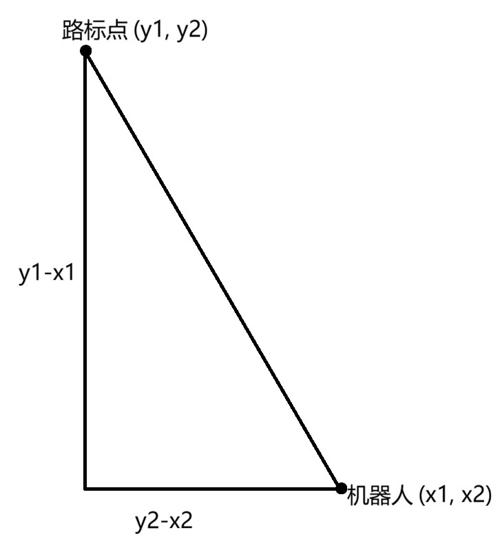
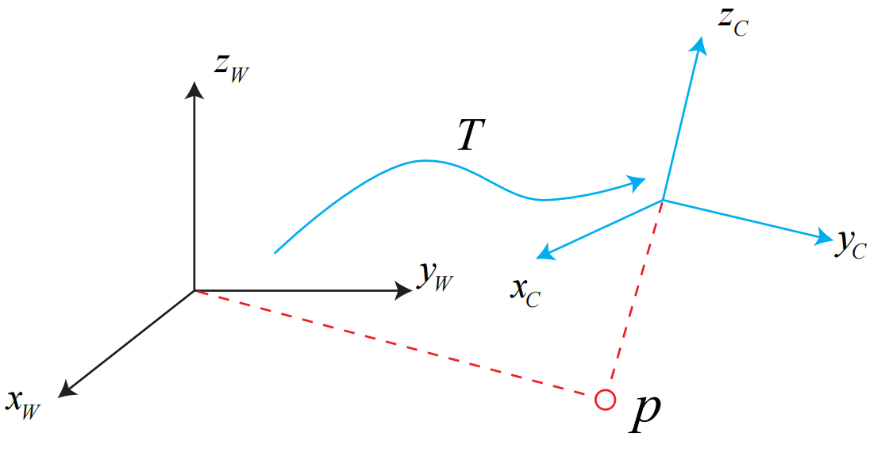
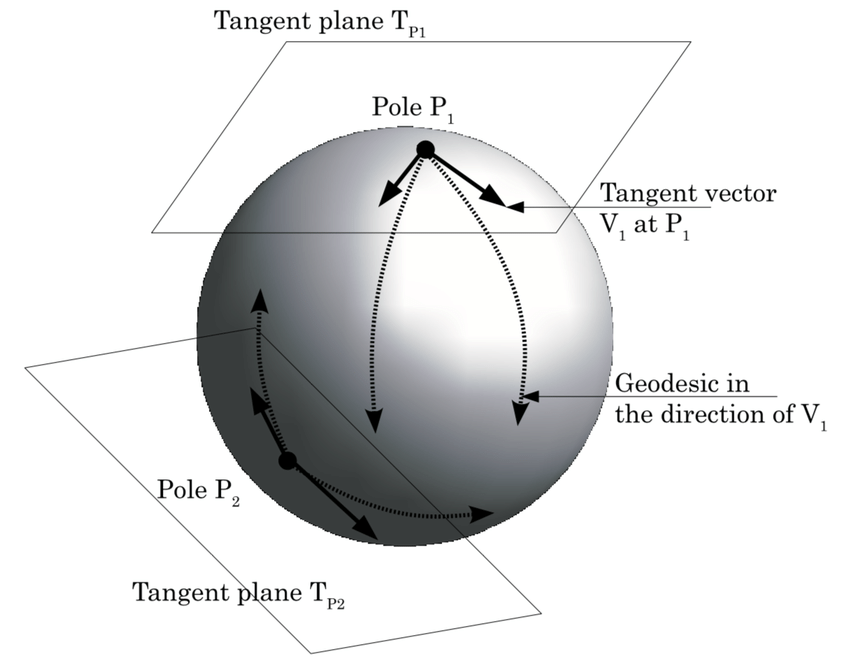

# SLAM问题的数学表述

假设：机器人带着某种传感器在未知环境中运动，怎么用数学模型来表示？

理解问题：

- 首先，由于相机是在某些时刻采集数据，所以我们只关心在该时刻下机器人的位置和地图。也就是说，在现实的一段连续时间中，我们其实使用的是`离散时刻`t=1,t=2...当中发生的事情。
- 在这些时刻，用x表示机器人自身的位置。于是各时刻的位置就记为x1,x2...，这些位置构成了机器人运动的`轨迹`
- 地图方面：我们假设地图由`路标`组成，每个时刻传感器会测量到一部分路标点，得到它们的观测数据。假设路标点一共有N个，用$y_1,y_2...y_N$表示它们

那么在这样的设定中，“机器人携带传感器在陌生环境中运动”就由以下两件事描述：

1. 什么是**运动**？机器人的`位置x`在`k-1时刻`到`k时刻`是如何变化的
2. 什么是**观测**？机器人在`k时刻`在**位置$x_k$**处看到某个**路标点$y_j$**时，如何用数学模型来表示


## 运动

`传感器`：

- 机器人会携带一个**测量自身运动的`传感器`**，例如惯性传感器。

- 这种传感器可以测量有关运动读数（但是不一定直接就是位置之差，还可以是加速度、角速度等）

`运动方程`：

我们给机器人发送指令：如“前进1m”，“左转90°”，“油门踩到底”，“刹车”。无论什么情况，我们都可以用一个数学公式表示：
$$
x_k = f(x_{k-1},u_k,w_k)
$$

- $x_k$：表示小车在k时刻的位置
- $u_k$：运动传感器的`读取（从运动传感器获取数据）`或`输入（把这些数据送入系统进行处理）`

- $w_k$：为该过程加入噪声（因为现实中传感器的数据不可能是完美的）


## 观测

在上面的`运动方程`中，我们在公式里面添加噪声$w_k$，这样使得该模型变为`随机模型`。

🤔为什么要这样做？

👉在现实中，即使我们下达了“前进1m”的命令，这并不代表机器人真的前进了1m。事实上，机器人可能某次只前进了0.9m，另一次前进了1.1m，再一次由于轮胎打滑，所以就没有前进。于是我们这种`随机性`描述为运动过程中的`噪声`，这个噪声是随机的。**所以，如果我们不去理会这个噪声，只根据指令来确定的位置与实际位置相差很远。**（如果所有指令都是准确的，就没必要`估计（如状态估计）`了）

- `观测方程`

  观测方程描述的是：当机器人在 **位置$x_k$** 上看到某个 **路标点$y_j$** 时，产生了一个 **观测数据$z_{k,j}$**。我们用一个抽象的函数h来描述这个关系：
  $$
  z_{k,j} = h(y_i,x_k,v_{k,j})
  $$

  - $v_{k,j}$：这次观测里的噪声
  - 由于观测所用的传感器形式很多，这里的观测数据z及观测方程h也有很多不同的形式


## 运动和观测的具体表示

> 根据小萝卜的真实运动和传感器的种类，存在着若干种`参数化`方式

例如，机器人在平面中运动，那么它的位姿由两个`位置`和一个`转角`来描述，即$x_k=[x_1,x_2,θ]_k^T$，其中$x_1,x_2$是两个轴上的位置而$θ$是转角。同时，输入的指令是两个时间间隔位置和转角的变化量$u_k=[Δx_1,Δx_2,dθ]_k^T$

所以该`运动方程`可以具体化为：
$$
\begin{bmatrix}x_1\\\\x_2\\\\\theta\end{bmatrix}_k=\begin{bmatrix}x_1\\\\x_2\\\\\theta\end{bmatrix}_{k-1}+\begin{bmatrix}\Delta x_1\\\\\Delta x_2\\\\\Delta\theta\end{bmatrix}_k+\boldsymbol{w}_k.
$$

- $\boldsymbol{w}_k$：表示噪声，噪声的形式是$\begin{bmatrix}w_x\\w_y\\w_\theta\end{bmatrix}_k$，分别是x,y,θ方向上的噪声

> [!WARNING]
>
> 这个公式是一个`简单的线性关系`。
>
> 不过，**并不是所有的输入指令都是位移和角度的变化量**，比如“油门”或者“控制杆”的输入就是`速度`或`加速度`量，所以也存在着其他形式更加复杂的运动方程，那时我们可能需要进行动力学分析。


假设机器人携带着一个`二维激光传感器`，

我们知道激光传感器观测一个 2D 路标点时，能够测到两个量：路标点与小萝卜本体之间的**距离*r***和**夹角*ϕ***。

记第$j$个**`路标点`在世界坐标系中的位置**为$y_j=[y_1,y_2]_j^\mathrm{T}$，**机器人对第j个路标的观测量，即位姿为$z_{k,j}=[r_{k,j},\phi_{k,j}]^\mathrm{T}$（这个是要我们求的）**，观测数据为，那么`观测方程`就写为
$$
\begin{bmatrix}r_{k,j}\\\\\phi_{k,j}\end{bmatrix}=\begin{bmatrix}\sqrt{\left(y_{1,j}-x_{1,k}\right)^2+\left(y_{2,j}-x_{2,k}\right)^2}\\\arctan\left(\frac{y_{2,j}-x_{2,k}}{y_{1,j}-x_{1,k}}\right)\end{bmatrix}+\boldsymbol{v}.
$$

- $x_k$：机器人在$k$时刻在**世界坐标系**下的位置
- $v$：观测噪声，形式为$\begin{bmatrix}v_r\\v_\phi\end{bmatrix}$，分别表示距离上的噪声和方位角上的噪声



可见，针对不同的传感器，这两个方程有不同的参数化形式。如果我们保持通用性，把它们取成通用的抽象形式，那么 SLAM 过程可总结为两个基本方程：
$$
\left.\left\{\begin{array}{ll}\boldsymbol{x}_k=f\left(\boldsymbol{x}_{k-1},\boldsymbol{u}_k,\boldsymbol{w}_k\right),&k=1,\cdots,K\\\boldsymbol{z}_{k,j}=h\left(\boldsymbol{y}_j,\boldsymbol{x}_k,\boldsymbol{v}_{k,j}\right),&(k,j)\in\mathcal{O}\end{array}\right.\right..
$$

- 其中 *O* 是一个集合，记录着在哪个时刻观察到了哪个路标（通常不是每个路标在每个时刻都能看到的。我们在单个时刻很可能只看到一小部分）。这两个方程描述了最基本的 SLAM 问题：当知道**运动测量的读数 u**，以及**传感器的读数 z** 时，如何求解`定位问题`（估计 **x**）和`建图问题`（估计 **y**）？这时，我们就把 SLAM 问题建模成了一个`状态估计`问题：如何通过带有噪声的测量数据，估计内部的、隐藏着的状态变量？

- 态估计问题的求解，与**两个方程的具体形式**，以及**噪声服从哪种分布**有关。

  按照运动和观测方程是否为**线性**，噪声是否服从**高斯分布**进行分类，分为`线性`**/**`非线性`和`高斯`**/**`非高斯`系统。

  - **线性高斯系统**：它的无偏的最优估计可以由`卡尔曼滤波器`（Kalman Filter，KF）给出

  - **非线性非高斯系统**：会使用以`扩展卡尔曼滤波器`（Extended Kalman Filter，EKF）和`非线性优化`两大类方法去求解。

    早期使用EKF，但是为了克服EKF的缺点（例如**线性化误差**和**噪声高斯分布假设**），人们开始使用`粒子滤波器（Particle Filter）`等其他滤波器，乃至使用`非线性优化`的方法。时至今日，主流视觉SLAM 使用以`图优化（Graph Optimization）`为代表的优化技术进行状态估计。我们认为优化技术已经明显优于滤波器技术，只要计算资源允许，通常都偏向于使用优化方法。

> [!NOTE]
>
> 上面所说的都是在一个二维空间里运动的机器人，然后实际上机器人是在三维空间中运动的，机器人的运动由3个轴构成，所以小萝卜的
>
> 运动要由3个轴上的平移，以及绕着`3个轴`的旋转来描述，一共有`6个自由度（平移XYZ，旋转RPY）`。


# 三维空间刚体运动

> [!NOTE]
>
> `刚体`：是物理学和机器人学里一个基础概念，表示在运动过程中，物体内部**任意两点之间的距离**始终**保持不变**的理想物体。

## 旋转矩阵

### 点和向量,坐标系

我们日常生活的空间是`三维`的，因此我们生来就习惯于`三维空间的运动`。

`三维空间`由**3个轴**组成，所以**一个空间点的位置**可以由**3个坐标**指定。

不过，我们现在要考虑`刚体`，它不光有`位置`，还有`自身的姿态`。相机也可以看成三维空间的刚体，于是**位置是指相机在空间中的哪个地方**，而**姿态则是指相机的朝向**。

> `点`就是空间当中的基本元素，没有长度，没有体积。
>
> 把两个点连接起来，就构成了`向量`。向量可以看成从某点指向另一点的一个箭头。


- 点和向量的表示

  用线性代数的知识来说，三维空间中的某个点的坐标也可以用$\mathbb{R}^3$**（这个意思是三维实数空间，是由三个实数组成的空间 $\mathbb{R}^3=\{(x,y,z)\mid x,y,z\in\mathbb{R}\}$）**来描述。怎么描述呢？

  假设在这个**线性空间**内，我们找到了该空间的一组`基`$(e_1,e_2,e_3)$,那么，任意**向量$a$**在这组基下就有一个`坐标`：

  向量 $\vec{a}$ 在基 $[\vec{e}_1,\vec{e}_2,\vec{e}_3]$ 下的坐标为 $[a_1,a_2,a_3]^T$ ，即

  <p style="text-align:center;"><b>向量 = 基矩阵 × 坐标向量 = 基向量的线性组合</b></p>

  $$
  \vec{a} =
  [\vec{e}_1,\vec{e}_2,\vec{e}_3]
  \begin{bmatrix}
  a_1\\
  a_2\\
  a_3
  \end{bmatrix}
  =
  a_1\vec{e}_1 + a_2\vec{e}_2 + a_3\vec{e}_3
  $$

  - $\begin{bmatrix}a_1\\a_2\\a_3\end{bmatrix}$：向量$\vec{a}$ 在 $[\vec{e}_1,\vec{e}_2,\vec{e}_3]$ 下的坐标（注意：前提是 $[\vec{a}]_{\{\vec{e}_1,\vec{e}_2,\vec{e}_3\}}=\begin{bmatrix}a_1\\a_2\\a_3\end{bmatrix}$，向量 $\vec a$ 在基 $\{\vec e_1,\vec e_2,\vec e_3\}$ 下的坐标向量。）

    也就是说，坐标的具体取值：

    - 跟`向量`本身有关
    - 跟`坐标系`的选取有关


- 向量的**内积**和**外积**

  - 向量的`内积`: 描述向量间的投影关系
    $$
    \vec{a}\cdot\vec{b}
    = \vec{a}^T\vec{b}
    = \sum_{i=1}^{3} a_i b_i
    = \|\vec{a}\|\,\|\vec{b}\|\cos\langle \vec{a},\vec{b}\rangle
    $$

  - 向量的`外积`: 描述向量的旋转

    有两个向量，$\vec{a} = \begin{bmatrix}a_1 \\ a_2 \\ a_3\end{bmatrix}$ $\vec{b} = \begin{bmatrix}b_1 \\ b_2 \\ b_3\end{bmatrix}$，那么

    - **表达方式1**：看起来是**行列式**，但其实是“记号技巧”

      > 其中$\vec{i}$ $\vec{j}$ $\vec{k}$ 表示单位坐标系

      $$
      \vec{a} \times \vec{b} =
      \begin{bmatrix}
      \vec{i} & \vec{j} & \vec{k} \\
      a_1 & a_2 & a_3 \\
      b_1 & b_2 & b_3
      \end{bmatrix}
      $$

    - **表达方式2**：向量结果的分量公式**（写代码常用）**

      > 本质是：**直接把叉乘结果写成向量的三个分量**

      $$
      \vec{a} \times \vec{b} =
      \begin{bmatrix}
      a_2b_3-a_3b_2 \\
      a_3b_1-a_1b_3 \\
      a_1b_2-a_2b_1
      \end{bmatrix}
      $$

    - **表达方式3**：矩阵形式**（机器人/控制超常用）**

      首先计算 向量$\vec{a}$ 的**反对称矩阵**$a^\wedge$：
      $$
      a^\wedge=
      \begin{bmatrix}
      0 & -a_3 & a_2 \\
      a_3 & 0 & -a_1 \\
      -a_2 & a_1 & 0
      \end{bmatrix}
      $$
      然后:
      $$
      \vec{a} \times \vec{b} = a^\wedge\vec{b}
      $$
      

### 坐标的欧式变换

- `世界坐标系`：如果考虑运动的机器人，那么常见的做法是设定一个`惯性坐标系`（或者叫`世界坐标系`），可以认为它是`固定不动`的，如下图中的坐标系$x_w,y_w,z_w$。
- `移动坐标系`：相机或机器人等的都是移动坐标系，如下图中的坐标系$x_c,y_c,z_c$

- `世界坐标系`到`移动坐标系`的转换：

  我们可能会问：相机视野中某个向量$p$，它在**相机坐标系**下的坐标为$p_c$，而在**世界坐标系**下的坐标为$p_w$。那么这两个坐标之间如何转换？

  这时，就需要先得到该点针对机器人坐标系的坐标值，再根据机器人位姿变换到世界坐标系中。



- **欧式变换**:

  - 直观上看，两个坐标系之间的运动由**一个旋转**加上**一个平移**组成，这种运动称为`刚体运动`。

  - 相机运动就是一个刚体运动。刚体运动过程中，同一个向量在各个坐标系下的**长度**和**夹角**都不会发生变化。

    想象你把手机抛到空中，在它落地摔碎之前，只可能有 **空间位置** 和 **姿态** 的不同，而它自己的**长度**、各个面的**角度**等性质不会有任何变化。手机并不会像橡皮那样一会儿被挤扁，一会儿被拉长。此时，我们说手机坐标系到世界坐标之间，相差了一个`欧氏变换（Euclidean Transform）`。

  > [!NOTE]
  >
  > 在欧式变换前后的两个坐标系下,同一个向量的模长和方向不发生改变,是为`欧式变换`。
  >
  > 一个欧式变换由一个`旋转`和一个`平移`组成。

  

- **旋转矩阵R**：

  - **旋转矩阵R** 的推导:

    设单位正交基$[\mathrm{e}_1,\mathrm{e}_2,\mathrm{e}_3]$经过一次旋转变成了$[\mathrm{e}_1^{\prime},\mathrm{e}_2^{\prime},\mathrm{e}_3^{\prime}]$，那么对于同一个向量a，在两个坐标系下的坐标分别为$[\mathrm{a}_1,\mathrm{a}_2,\mathrm{a}_3]^{\mathrm{T}}$和$[\mathrm{a}_1^{\prime},\mathrm{a}_2^{\prime},\mathrm{a}_3^{\prime}]^\mathrm{T}$。根据坐标的定义：

    $$
    \left.\left[\mathrm e_1,\mathrm e_2,\mathrm e_3\right]\left[\begin{array}{c}\mathrm a_1\\\mathrm a_2\\\mathrm a_3\end{array}\right.\right]=\left[\mathrm e_1',\mathrm e_2',\mathrm e_3'\right]\left[\begin{array}{c}\mathrm a_1'\\\mathrm a_2'\\\mathrm a_3'\end{array}\right]
    $$
    等式左右两边同时左乘$[\mathrm{e}_1^{\mathrm{T}},\mathrm{e}_2^{\mathrm{T}},\mathrm{e}_3^{\mathrm{T}}]^{\mathrm{T}}$,得到

    $$
    \left.\left[\begin{array}{c}\mathrm{a}_1\\\mathrm{a}_2\\\mathrm{a}_3\end{array}\right.\right]=\left[\begin{array}{ccc}\mathrm{e}_1^\mathrm{T}\mathrm{e}_1^{\prime}&\mathrm{e}_1^\mathrm{T}\mathrm{e}_2^{\prime}&\mathrm{e}_1^\mathrm{T}\mathrm{e}_3^{\prime}\\\mathrm{e}_2^\mathrm{T}\mathrm{e}_1^{\prime}&\mathrm{e}_2^\mathrm{T}\mathrm{e}_2^{\prime}&\mathrm{e}_2^\mathrm{T}\mathrm{e}_3^{\prime}\\\mathrm{e}_3^\mathrm{T}\mathrm{e}_1^{\prime}&\mathrm{e}_3^\mathrm{T}\mathrm{e}_2^{\prime}&\mathrm{e}_3^\mathrm{T}\mathrm{e}_3^{\prime}\end{array}\right]\left[\begin{array}{c}\mathrm{a}_1^{\prime}\\\mathrm{a}_2^{\prime}\\\mathrm{a}_3^{\prime}\end{array}\right]\triangleq\mathrm{Ra}^{\prime}
    $$
    我们把中间的矩阵拿出来，定义成一个 **矩阵$R$** 。这个矩阵由**两组基之间的内积**组成，刻画了旋转前后同一个向量的坐标变换关系。只要旋转是一样的，那么这个矩阵也是一样的。

    可以说，矩阵$R$ 描述了旋转本身。因此称为`旋转矩阵(Rotation matrix)`。

    同时，该矩阵各分量是两个坐标系基的内积，由于基向量的长度为 1,所以实际上是**各基向量的夹角之余弦**。所以这个矩阵也叫`方向余弦矩阵( Direction Cosine matrix)`。

  - **正交矩阵$Q$**：

    如果一个矩阵 **$Q$** 满足：
    $$
    Q^T Q = I
    $$
    那它就是正交矩阵。其中

    - $Q^T$：转置矩阵
    - $I$​：单位矩阵，即$\begin{bmatrix}1 & 0 & 0 \\0 & 1 & 0 \\0 & 0 & 1\end{bmatrix}$

  - **旋转矩阵R** 的性质
    
    - `正交矩阵`：一个矩阵满足$R^TR=I$，那该矩阵就是正交矩阵。正交矩阵满足**矩阵的转置 = 它的逆**
    
    - `行列式`：这个线性变换对空间“体积”的缩放倍数。
    
      在**2D空间**中，如果一个矩阵原来面积是1，作用后面积是3，那么det(A)=3，即面积被放大3倍
    
      在**3D空间**中，原来单位立方体体积=1，变换后体积=5，那么det(A)=5，即体积放大5倍
    
      所以，在**3D空间**中`det(R)=1`表示**作用前后物品体积不变**
    
    - 旋转矩阵是**行列式为1的正交矩阵**,任何行列式为1的正交矩阵也是一个旋转矩阵.所有旋转矩阵构成**特殊正交群 SO**:
      $$
      \mathrm{SO(n)=\{R\in\mathbb{R}^{n\times n}|RR^T=I,\det(R)=1\}}
      $$
    
      - SO(n)：特殊正交群
    
    - 由于旋转矩阵是`正交矩阵`(其转置等于其逆)，所以旋转矩阵的逆 $R^{-1}$ (即转置 $R^T$)描述了一个`相反的旋转`:
      $$
      a^{\prime}=R^{-1}a=R^{\mathrm{T}}a
      $$
    
      > [!NOTE]
      >
      > **行列式为1的正交矩阵**：
      >
      > - `二维（SO(2)）`
      >
      >   二维非常干净：**所有 det=1 的正交矩阵都长这样**
      >   $$
      >   R(\theta)=
      >   \begin{bmatrix}
      >   \cos\theta & -\sin\theta\\
      >   \sin\theta & \cos\theta
      >   \end{bmatrix}
      >   $$
      >   只有 **一个参数：角度 θ**
      >
      >   几何意义：平面绕原点旋转 θ
      >
      >   
      >
      > - `三维（SO(3)）`
      >
      >   **绕坐标轴旋转**
      >
      >   绕 x 轴：
      >   $$
      >   R_x(\theta)=
      >   \begin{bmatrix}
      >   1&0&0\\
      >   0&\cos\theta&-\sin\theta\\
      >   0&\sin\theta&\cos\theta
      >   \end{bmatrix}
      >   $$
      >   绕 y 轴：
      >   $$
      >   R_y(\theta)=
      >   \begin{bmatrix}
      >   \cos\theta&0&\sin\theta\\
      >   0&1&0\\
      >   -\sin\theta&0&\cos\theta
      >   \end{bmatrix}
      >   $$
      >   绕 z 轴：
      >   $$
      >   R_z(\theta)=
      >   \begin{bmatrix}
      >   \cos\theta&-\sin\theta&0\\
      >   \sin\theta&\cos\theta&0\\
      >   0&0&1
      >   \end{bmatrix}
      >   $$
      >   任意旋转：
      >   $$
      >   R=R_zR_yR_x
      >   $$
      >
      > - **轴角公式**
      >
      >   绕单位轴 $n=(n_x,n_y,n_z)$，角度 θ：
      >   $$
      >   R=I+\sin\theta[n]_\times+(1-\cos\theta)[n]_\times^2
      >   $$
      >   其中
      >   $$
      >   [n]_\times=
      >   \begin{bmatrix}
      >   0&-n_z&n_y\\
      >   n_z&0&-n_x\\
      >   -n_y&n_x&0
      >   \end{bmatrix}
      >   $$
      >   优点：
      >
      >   - 参数最少（3自由度）
      >   - 李代数直接用
      >   - SLAM/标定/优化全靠它


- 平移

  在欧氏变换中，除了旋转之外还有平移。考虑世界坐标系中的 **向量$a$** ，经过一次 **旋转** (用旋转矩阵$R$描述)和一次 **平移$t$** 后，得到了 **向量$a^{\prime}$**，那么把`旋转`和`平移`合到一起，有：

  $$
  a'=Ra+t
  $$
  实际当中，我们会定义 坐标系1、坐标系2，那么向量$a$在两个系下坐标为$a_1,a_2$,它们之间的关系，按照完整的写法，应该是：

  $$
  a_1=R_{12}a_2+t_{12}
  $$

  - $R_{12}$：表示把**坐标系2** 的向量变换到**坐标系1**中，由于向量乘在这个矩阵的右边，它的下标是从右读到左的。

  - $t_{12}$:是**坐标系1原点**指向**坐标系2原点**的向量在**坐标系1**下的坐标

式$a'=Ra+t$完整地表达了欧氏空间的旋转与平移，不过还存在一个小问题：这里的变换关系不是一个线性关系。假设我们进行了两次变换：$R_1, t_1$ 和 $R_2, t_2$：
$$
b = R_1 a + t_1, \quad c = R_2 b + t_2
$$

- **代码表示**

  ```c++
  // 三维坐标
  Vector3d v(1, 0, 0);
  
  // 旋转向量
  AngleAxisd rotation_vector(M_PI / 4, Vector3d(0, 0, 1));     //沿 Z 轴旋转 45 度
  
  // 欧氏变换矩阵使用 Eigen::Isometry
  Isometry3d T = Isometry3d::Identity();                     	 	// 虽然称为3d，实质上是4*4的矩阵（因为是齐次）
  T.rotate(rotation_vector);                                  	// 定义旋转：按照rotation_vector进行旋转
  T.pretranslate(Vector3d(1, 3, 4));                          	// 定义平移：把平移向量设成(1,3,4)
  
  // 用变换矩阵进行坐标变换
  Vector3d v_transformed = T * v;                                 // 相当于 R*v+t
  ```


### 变换矩阵与齐次坐标

式 $a'=Ra+t$ 完整地表达了欧氏空间的`旋转`与`平移`，不过还存在一个小问题：这里的变换关系不是一个线性关系。假设我们进行了两次变换：$R_1, t_1$ 和 $R_2, t_2$：
$$
b = R_1 a + t_1, \quad c = R_2 b + t_2
$$
那么，从 $a$ 到 $c$ 的变换为：
$$
c=R_2\left(R_1a+t_1\right)+t_2
$$
这样的形式在变换多次之后会显得很啰嗦。因此，我们引入齐次坐标和变换矩阵，重写式 $a'=Ra+t$：
$$
\begin{bmatrix} a' \\ 1 \end{bmatrix} =
\begin{bmatrix} R & t \\ 0^\top & 1 \end{bmatrix}
\begin{bmatrix} a \\ 1 \end{bmatrix} \triangleq T \begin{bmatrix} a \\ 1 \end{bmatrix}
$$
我们暂时用$\tilde{a}$表示$a$的齐次坐标。那么依靠`齐次坐标`和`变换矩阵`，两次变换的叠加就可以有很好的形式：
$$
\tilde{b}=T_1\tilde{a},\:\tilde{c}=T_2\tilde{b}\quad\Rightarrow\tilde{c}=T_2T_1\tilde{a}
$$

1. **齐次坐标**

   > 齐次坐标 = 在原坐标后面多加一个维度，用来统一表示平移和投影。
   >
   > 但是都表示同一个点。

   **举个例子：**

   - 普通二维点：$(x,y)$

     齐次坐标写成：$(x,y,1)$

   - 三维空间中的点：$(x,y,z)$

     齐次坐标：$(x,y,z,1)$

   **齐次坐标的作用**：

   - **把平移变成矩阵乘法**

     - 普通线性`变换`：$\begin{bmatrix}x'\\y'\end{bmatrix}=R\begin{bmatrix}x\\y\end{bmatrix}$，其中R是2*2的旋转矩阵，表示2维中的旋转

       但平移不能写成矩阵乘法：$x'=x+t_x$

     - 引入齐次坐标后，齐次坐标解决方案

       把点写成：$\begin{bmatrix}x\\y\\1\end{bmatrix}$

       `变换`写成：$\begin{bmatrix}R & t\\0 & 1\end{bmatrix}$，其中R是一个3\*3的旋转矩阵，表示3维中的旋转，t是一个3\*1的平移向量，表示3维中的平移

       于是：$\begin{bmatrix}x'\\y'\\1\end{bmatrix} = \begin{bmatrix}R & t\\0 & 1\end{bmatrix} \begin{bmatrix}x\\y\\1\end{bmatrix}$

   

2. **变换矩阵T**

   > 用齐次坐标，把“旋转 + 平移”这种本来不是**纯线性的变换**，变成一次**矩阵乘法（线性形式）**

   - **先看普通三维变换长什么**

     在普通欧式空间里，一个点 $a$ 经过刚体变换：$a' = Ra + t$

     其中：

     - $a$：原始点（3×1）

     - $R$：旋转矩阵（3×3）

     - $t$：平移向量（3×1）

   - 什么是`线性变换`

     线性变换长这样： $x' = Ax$ ，**只有乘法，没有加常数，这就叫线性变换**

     但是上面的式子 $Ra+t$ 不是`线性变换`（严格说是`仿射变换`）。

   - 齐次坐标怎么将`非线性变换`变为`线性变换`

     - 首先把3维的点a升维，变为4维：$a \rightarrow \begin{bmatrix}a\\1\end{bmatrix}$

     - 然后构建`变换矩阵T`：$T = \begin{bmatrix}R&t\\0&1\end{bmatrix}$，其中

       - `R`是一个3\*3的**旋转矩阵**，表示3维中的旋转
       - `t`是一个3\*1的**平移向量**，表示3维中的平移

     - 那么 $a' = Ra + t$ 就变为：
       $$
       \begin{bmatrix}a'\\1\end{bmatrix} =
       T\begin{bmatrix}a\\1\end{bmatrix} =
       \begin{bmatrix}R&t\\0&1\end{bmatrix} \begin{bmatrix}a\\1\end{bmatrix}
       $$
       

       计算得：

       - 上半部分: $a'= Ra+t$
       - 下半部分：$1 = 1$


3. **变换矩阵T的性质**：

   - `变换矩阵T` 有一个比较特别的结构：
     
     左上角为 **旋转矩阵**，右侧为 **平移向量**，左下角为 **0向量**，右下角为 1。这种矩阵又称为`特殊欧氏群`$SE$
     $$
     SE(3) = \left\{ T = \begin{bmatrix} R & t \\ 0 & 1 \end{bmatrix} \in \mathbb{R}^{4 \times 4} \middle| R \in SO(3),\, t \in \mathbb{R}^3 \right\}
     $$

   
   
   - `变换矩阵的逆`表示一个`反向的欧式变换`
     $$
     T^{-1} = \begin{bmatrix} R^T & -R^T t \\ 0 & 1 \end{bmatrix}
     $$
     
   
4. 


## 旋转向量和欧拉角

### 旋转向量

- **旋转矩阵的缺点**:
  
  - 旋转矩阵有9个量，但一次旋转只有3个自由度，这种表达方式是冗余的.
  - 旋转矩阵自带约束**(必须是行列式为1的正交矩阵)**，这些约束会给**估计**和**优化**带来困难。
  
- **旋转向量**: 

  - **概念**：任意旋转都可以用**一个旋转轴**和**一个旋转角** 来刻画。于是我们可以使用一个`向量`，其**方向表示旋转轴**而**长度表示旋转**角.这种向量称为`旋转向量`（或轴角,Axis-Angle）。

  - **例如**：假设有一个**旋转轴为n**，**角度为θ**的旋转，其对应的`旋转向量`为θn

  - **长什么样**：旋转向量$r=(x,y,z)$，表示在3D空间中三个方向上的分量

    如：
    $$
    r=(0,0,\pi/2)
    $$
    表示：

    | 分量         | 含义            |
    | ------------ | --------------- |
    | **0（X）**   | 不沿 X 轴旋转   |
    | **0（Y）**   | 不沿 Y 轴旋转   |
    | **π/2（Z）** | 沿 Z 轴旋转 90° |

- **`旋转向量`和`旋转矩阵`之间的转换:**

  假设 **旋转向量R** 表示一个绕 **单位向量n**，**角度为θ** 的旋转

  - **旋转向量**到**旋转矩阵**:
    $$
    \mathrm{R}=\cos\theta\mathrm{I}+(1-\cos\theta)\mathrm{nn}^\mathrm{T}+\sin\theta\mathrm{~n}^\mathrm{\wedge}
    $$
    其中：

    - $n=(n_x,n_y,n_z)^T$：**单位旋转轴**，其中$n^\wedge$​是n的反对称矩阵，$n^\wedge=\begin{bmatrix}0&-n_z&n_y\\n_z&0&-n_x\\-n_y&n_x&0\end{bmatrix}$
    - $\theta$：旋转角
    - $I$：3×3 单位矩阵$\begin{bmatrix}1&0&0\\0&1&0\\0&0&1\end{bmatrix}$

    **代码表示**：

    ```c++
    // 定义旋转向量，用 AngleAxisd 表示
    AngleAxisd rotation_vector(M_PI / 4, Vector3d(0, 0, 1));	//沿 Z 轴旋转 45 度
    
    // 旋转向量 转换为 旋转矩阵
    Matrix3d rotation_matrix = rotation_vector.toRotationMatrix();
    ```
    
    
    
  - **旋转矩阵**到**旋转向量**:
  
    > [!NOTE]
    >
    > 基础知识：`trace（迹）`，表示三维矩阵的对角线的和
    >
    > 任意 3D 旋转矩阵都有：
    > $$
    > \begin{aligned}\operatorname{tr}\left(R\right)&=\cos\theta\mathrm{tr}(\boldsymbol{I})+(1-\cos\theta)\mathrm{tr}\left(\boldsymbol{n}\boldsymbol{n}^{\mathrm{T}}\right)+\sin\theta\mathrm{tr}(\boldsymbol{n}^{\wedge})\\&=3\cos\theta+(1-\cos\theta)\\&=1+2\cos\theta.\end{aligned}
    > $$
    > 所以直接解：
    > $$
    > \cos\theta=\frac{\mathrm{tr}(R)-1}{2}
    > $$
    > 就得到角度。

    - 旋转角 $\theta = \arccos \left( \frac{tr(R)-1}{2} \right)$

    - `旋转轴n` 是 `矩阵R` `特征值为1`对应的`特征向量`

      什么意思呢？我们来先看
  
      - `特征值`的定义：一个变换作用在某个方向上，只会拉伸/缩放，不会改变方向时的缩放倍数。
  
        举个例子：
  
        - 假设有一个**变换矩阵A**：$A=\begin{bmatrix}2&0\\0&3\end{bmatrix}$，该矩阵的作用是：在x方向上拉伸2倍，在y方向上拉伸3倍
  
        - 然后我有一个**向量$v_1=\begin{bmatrix} 1\\0 \end{bmatrix}$**，我需要该向量经过变换矩阵A的变换，即
  
          变换后：方向没变
          $$
          Av_1=
          \begin{bmatrix}
          2\\
          0
          \end{bmatrix}
          =2v_1
          $$
          所以我们得到**特征向量**：方向为**x方向**，特征值为**2**
  
        - 然后我又有一个**向量$v_2=\begin{bmatrix} 0\\1 \end{bmatrix}$**，我需要该向量经过变换矩阵A的变换，即
  
          变换后：方向没变
          $$
          Av_2=
          \begin{bmatrix}
          0\\
          3
          \end{bmatrix}
          =3v_2
          $$
          所以我们得到**特征向量**：方向为**y方向**，特征值为**3**
  
      - `旋转轴`的定义：旋转时保持不变的方向
  
        假设：
      
        - $R$：绕某一条**旋转轴$n$**，**旋转角度$\theta$** 所对应的三维**旋转矩阵**
        - $n$：旋转轴方向（一个单位向量）
      
        如果**方向完全没变**，在三维空间中，那就意味着：
        $$
        旋转后的向量=R×原向量
        $$
      
        $$
        旋转轴方向不变，即n = Rn
        $$
      
        $$
        也就是说Rn=1 \cdot n
        $$
      
        所以我们得到**特征向量**：方向不变，特征值为1
    
    - **代码表示**
    
      ```c++
      // 定义旋转矩阵
      Matrix3d rotation_matrix = Matrix3d::Identity();
      
      // Eigen提供了一个使用 旋转矩阵 转换为 旋转向量 的方式
      AngleAxisd rotation_vector(rotation_matrix);
      ```
    
      

### 欧拉角

- 欧拉角将一次旋转分解成**3个分离的转角**。常用的一种**ZYX转角**将任意旋转分解成以下3个轴上的转角:

  - 绕物体的 Z轴 旋转,得到偏航角yaw

  - 绕`旋转yaw之后`的 Y轴 旋转,得到俯仰角pitch

  - 绕`旋转pitch之后`的 X轴 旋转,得滚转角roll

  > [!IMPORTANT]
  >
  > 欧拉角的旋转是有先后顺序的：
  >
  > 先旋转 yaw -> 再旋转 pitch -> 最后旋转 roll

- 欧拉角的一个重大缺点是**万向锁问题(奇异性问题)**: 在俯仰角为±90° 时，第一次旋转与第三次旋转将使用同一个轴，使得系统丢失了一个自由度(由3次旋转变成了2次旋转)。

  为什么呢？

  > `顺序在前的轴`转动时 **会带动** `顺序在后的轴`一起旋转**（如转动yaw角时，y轴和x轴也会跟着旋转；旋转pitch角时，x轴也会跟着旋转）**
  >
  > `顺序在后`的轴转动时 **不会带动** `顺序在前`的轴一起旋转**（如转动pitch角时，z轴不会跟着旋转；转动roll角时，z轴和y轴不会跟着旋转）**
  >
  > **（这个性质就是导致欧拉角万向锁问题的原因）**

- 代码表示

  ```c++
  // 欧拉角: 可以将旋转矩阵直接转换成欧拉角
  Vector3d euler_angles_1 = rotation_matrix.canonicalEulerAngles(0, 1, 2); // XYZ顺序，即roll-pitch-yaw顺序
  Vector3d euler_angles = rotation_matrix.canonicalEulerAngles(2, 1, 0); // ZYX顺序，即yaw-pitch-roll顺序
  ```

  

## 四元数

> `四元数`是**紧凑**的，同时也没有**奇异性**

把**四元数**与**复数**类比可以帮助你更快地理解四元数。例如，当我们想要将复平面的向量旋转$\theta$ 角时，可以给这个复向量乘以 $e^{i\theta}$。这是极坐标表示的复数，它也可以写成普通的形式，只要使用欧拉公式即可：

$$
\mathrm{e}^{i\theta}=\cos\theta+i\sin\theta
$$
这正是一个单位长度的复数。所以，在二维情况下，旋转可以由单位复数来描述。类似地，我们会看到，三维旋转则可以由单位四元数来描述。


### 四元数的定义与本质

#### 四元数的定义

一个四元数q拥有**一个实部**和**三个虚部**：
$$
q=q_0+q_1i+q_2j+q_3k
$$
其中i,j,k 为四元数的3个虚部，它们满足以下关系式**（自己和自己的运算像复数，自己和别人的运算像叉乘）**：
$$
\left.\left\{\begin{array}{l}\mathrm{i^2=j^2=k^2=ijk=-1}\\\mathrm{ij=k,ji=-k}\\\mathrm{jk=i,kj=-i}\\\mathrm{ki=j,ik=-j}\end{array}\right.\right.
$$


#### 四元数的本质

- 四元数本质上是一个**四维数**，写成：

$$
q = \begin{bmatrix}q_0,\; q_1,\; q_2,\; q_3\end{bmatrix}
$$

- 但是为了方便**理解和计算**，人们写成：
  $$
  q = [s,\; v]
  $$
  其中：

  - $s=q_0$：标量（scalar）
  - $v=[q_1,q_2,q_3]^T$：三维向量（vector）

- 所以可以用一个标量和一个向量来表达四元数：

  $$\mathrm{q=[s,v],\quad s=q_0\in\mathbb{R}\quad v=[q_1,q_2,q_3]^T\in\mathbb{R}^3}$$

  `s`为四元数的**实部**，`v`为四元数的**虚部**.有`实四元数`和`虚四元数`的概念

  - `实四元数`：一个四元数的虚部为0
  - `虚四元数`：一个四元数的实部为0


### 四元数的运算

- 首先，四元数可以写成这两种形式：
  $$
  q=s+v
  $$

  $$
  q=[s,v]
  $$

- 写两个四元数
  $$
  q_a=s_a+v_a
  $$

  $$
  q_b=s_b+v_b
  $$

#### 加法和减法

四元数$q_a,q_b$的加减运算为
$$
q_a\pm q_b=\left[s_a\pm s_b,v_a\pm v_b\right]^\mathrm{T}
$$

#### 乘法

- 我们直接计算$q_1q_2$
  $$
  q_1q_2
  =
  (s_1+v_1)(s_2+v_2)
  =
  s_1s_2 + s_1v_2 + v_1s_2 + v_1v_2
  $$
  解释：
  
  - $s_1s_2$：标量×标量
  
  - $s_1v_2$：标量×向量
  
  - $v_1s_2$：向量×标量（其实就是标量×向量）
  
  - $v_1v_2$：向量×向量。我们把v1和v2展开：
    $$
    v_1=x_1i+y_1j+z_1k
    $$
  
    $$
    v_2=x_2i+y_2j+z_2k
    $$
  
    那么，计算$v_1v_2$
    $$
    \begin{align}
    v_1 v_2
    &= (x_1 i + y_1 j + z_1 k)
       (x_2 i + y_2 j + z_2 k) \\
    &= x_1x_2 i^2 + x_1y_2 ij + x_1z_2 ik \\
    &\quad + y_1x_2 ji + y_1y_2 j^2 + y_1z_2 jk \\
    &\quad + z_1x_2 ki + z_1y_2 kj + z_1z_2 k^2 \\
    &=−(x_1x_2+y_1y_2+z_1z_2)\\
    &\quad +(y_1z_2−z_1y_2)i+(z_1x_2−x_1z_2)j+(x_1y_2−y_1x_2)k
    \end{align}
    $$
    又因为：
  
    `点乘`
    $$
    v_1\cdot v_2=
    x_1x_2+y_1y_2+z_1z_2
    $$
    `叉乘`
    $$
    v_1\times v_2
    =
    \begin{bmatrix}
    y_1z_2-z_1y_2\\
    z_1x_2-x_1z_2\\
    x_1y_2-y_1x_2
    \end{bmatrix}
    =(y_1z_2−z_1y_2)i+(z_1x_2−x_1z_2)j+(x_1y_2−y_1x_2)k
    $$
    
    所以得到$v_1v_2$：
    $$
    \boxed{
    v_1 v_2
    =
    -\,v_1\cdot v_2
    +
    v_1\times v_2
    }
    $$
    所以得到最终公式：
    $$
    \begin{aligned}q_{1}q_{2}&=s_{1}s_{2}-x_{1}x_{2}-y_{1}y_{2}-z_{1}z_{2}\\&+\left(s_1x_2+x_1s_2+y_1z_2-z_1y_2\right)i\\&+\left(s_1y_2-x_1z_2+y_1s_2+z_1x_2\right)j\\&+\left(s_1z_2+x_1y_2-y_1x_2+z_1s_2\right)k.\end{aligned}
    $$

#### 模长

四元数的模长定义为
$$
\|q_a\| = \sqrt{s_a^2 + x_a^2 + y_a^2 + z_a^2}
$$
可以验证，两个`四元数乘积的模`即为`模的乘积`。这使得**单位四元数相乘后仍是单位四元数**。
$$
\|q_a q_b\| = \|q_a\| \|q_b\|.
$$


#### 共轭

四元数的共轭是把`虚部`取成相反数：

$$
q_{a}^{*}=s_{a}-x_{a}i-y_{a}j-z_{a}k=[s_{a},-v_{a}]^{\mathrm{T}}
$$
**四元数共轭**与其**本身**相乘，会得到一个`实四元数`，其实部为`模长的平方`：
$$
q^*q=qq^*=[s_a^2+v^\mathrm{T}v,\mathbf{0}]^\mathrm{T}
$$


#### 逆

一个四元数的`逆`为
$$
q^{-1}=q^{*}/\|q\|^{2}
$$
按此定义，四元数和自己的逆的乘积为实四元数1：

$$
qq^{-1}=q^{-1}q=1
$$
如果$q$为单位四元数，其逆和共轭就是同一个量。同时，乘积的逆有和矩阵相似的性质：

$$
(q_aq_b)^{-1}=q_b^{-1}q_a^{-1}
$$


#### 数乘

和向量相似，四元数可以与数相乘：

$$
k\boldsymbol{q}=\left[ks,k\boldsymbol{v}\right]^\mathrm{T}
$$


### 四元数与旋转角度的关系

| 符号 | 对应空间轴 |
| ---- | ---------- |
| i    | x轴        |
| j    | y轴        |
| k    | z轴        |

| 复数         | 代表旋转  |
| ------------ | --------- |
| i = e^(i90°) | 旋转 90°  |
| -1           | 旋转 180° |
| -i           | 旋转 270° |

- 在`二维情况`下，任意一个**旋转**都可以用**单位复数**来描述，乘**复数i**就是绕**i轴(即x轴)**旋转90°

  如：

  - 在二维平面中，一个点可以看成复数：$z=x+yi$
    - `x` 是实部，对应水平轴
    - `y` 是虚部，对应垂直轴
  - 如果我拿出一个**单位复数**：$e^{i\theta} = \cos\theta + i \sin\theta$
  - **单位复数**去乘以二维中的点，得到：$z'= e^{i\theta} \cdot z$，就等价于把 点$z$ **旋转θ角度**后得到 $z'$

- 在`三维情况`下，任意旋转都可以用**单位四元数**表示。定义单位四元数 $q = \cos(\theta/2) + \sin(\theta/2)(u_x i + u_y j + u_z k)$，将一个点 $v = v_x i + v_y j + v_z k$ 看作纯虚四元数，旋转后的点为：$v' = q \, v \, q^{-1}$，这样就等价于把点绕 $u$ 轴旋转 θ。

  如：

  - 在三维平面中，一个点可以看成复数：$z=w+xi+yj+zk$
    - `w = cos(θ/2)` → 旋转量（半角）
    - `(x, y, z)` → 旋转轴方向
  - 如果我拿出一个**单位复数**：$q = \cos(\theta/2) +  \sin(\theta/2)(xi+yj+zk)$
  - **单位复数**去乘以三维中的点，得到：$z'= q \cdot z$，就等价于把 点$z$ **绕 u轴旋转θ**后得到 $z'$


### 单位四元数和旋转向量之间的转换

设 **单位四元数q** 表示一个绕 **单位向量$\mathrm{n=[n_x,n_y,n_z]^T}$**，**角度为θ**的旋转。

- **前提概念**

  - **旋转向量**（rotation vector）：
    $$
    \boldsymbol{r} = \theta \mathbf{n}
    $$

    - $\mathbf{n} = [n_x, n_y, n_z]^T$ 是单位向量，表示旋转轴
    - $\theta$ 是绕这个轴旋转的角度

  - **单位四元数**（unit quaternion）：
    $$
    q = [q_0, q_1, q_2, q_3]^T = [w, x, y, z]^T
    $$

    - $q_0 = w$ → **旋转量**（半角 cos）
    - $[q_1, q_2, q_3]$ → **旋转轴分量**（半角 sin 乘单位轴）


- 从`旋转向量`到`单位四元数`

  例如：旋转向量 $\theta \mathbf{n}$ → 四元数 $q$
  $$
  q = \begin{bmatrix} \cos(\theta/2) \\ n_x \sin(\theta/2) \\ n_y \sin(\theta/2) \\ n_z \sin(\theta/2) \end{bmatrix}
  $$
  解释：

  1. **θ/2** 是半角
     - 四元数公式用 **半角**，原因是四元数乘法和旋转组合需要 θ/2 才能正确表示旋转
  2. **cos(θ/2)** → 四元数的标量部分 $q_0 = w$
  3. **sin(θ/2) \* n** → 四元数的向量部分 $[q_1, q_2, q_3]$

  举个例子：

  - 旋转 90° 绕 z 轴：$\theta = π/2$，$\mathbf{n} = [0,0,1]$

  $$
  q = [\cos(π/4), 0, 0, \sin(π/4)] = [0.7071, 0, 0, 0.7071]
  $$

- 从`单位四元数`到`旋转向量`

  已知四元数：
  $$
  q = [q_0, q_1, q_2, q_3]
  $$
  求旋转向量：

  1. 旋转角度：

  $$
  \theta = 2 \arccos(q_0)
  $$

  2. 旋转轴：

  $$
  \mathbf{n} = \left[n_x,n_y,n_z\right]^\mathrm{T} = \frac{[q_1, q_2, q_3]^T}{\sin(\theta/2)}
  $$

  > [!WARNING]
  >
  > - 如果 $\theta \approx 0$（即 $q_0 \approx 1$），sin(θ/2) 会接近 0，需要特殊处理，直接取任意**单位向量**即可
  >
  >   **什么意思？**
  >
  >   **->假设我们有一个四元数表示一个非常小的旋转：**
  >   $$
  >   q = [q_0, q_1, q_2, q_3] = [0.999999, 0.000001, 0, 0]
  >   $$
  >
  >   - q0≈1 → θ 很小
  >   - q1、q2、q3 非常小 → 旋转向量接近 0
  >
  >   **->然后计算旋转角度 θ**
  >   $$
  >   \theta = 2 \arccos(q_0) \approx 2 \arccos(0.999999)
  >   $$
  >
  >   - arccos(0.999999) ≈ 0.001414 rad
  >   - θ ≈ 0.002828 rad ≈ 0.162°，非常小
  >
  >   **->计算旋转轴 n**
  >
  >   公式：
  >   $$
  >   \mathbf{n} = \frac{[q_1, q_2, q_3]}{\sin(\theta/2)}
  >   $$
  >
  >   - θ/2 ≈ 0.001414
  >   - sin(θ/2) ≈ 0.001414
  >   - [q1, q2, q3] = [0.000001, 0, 0]
  >
  >   代入：
  >   $$
  >   n_x = q_1 / \sin(\theta/2) \approx 0.000001 / 0.001414 \approx 0.000707
  >   $$
  >
  >   - 结果非常不稳定，因为**小数除小数**容易产生数值误差
  >   - **对计算机来说，这个向量方向几乎是随机的**
  >
  >   **->所以我们要进行 特殊处理**
  >
  >   - 当 θ≈0 时，旋转向量本身就非常小
  >   - 旋转轴方向对最终结果影响不大
  >   - 所以直接取任意**单位向量**（如 `[1,0,0]`,`[0,1,0]`）即可
  >
  >   然后旋转向量 = θ * n ≈ 很小的位移 → 近似无旋转
  >
  > - 旋转向量 = θ * n


### 用单位四元数表示旋转

给定一个三维空间点 $p = [x, y, z] \in \mathbb{R}^3$，以及一个由轴角 $n, \theta$ 指定的旋转，三维点 $p$ 经过旋转变后变为 $p'$。如何使用单位四元数 $q$ 表达旋转？

1. 将三维空间点用一个虚四元数 $p$ 表示：
$$
  p = [0, x, y, z] = [0, v]
$$

2. 将旋转用单位四元数 $q$ 表示：
$$
q = \begin{bmatrix} \cos(\theta/2) \\ n_x \sin(\theta/2) \\ n_y \sin(\theta/2) \\ n_z \sin(\theta/2) \end{bmatrix} = [\cos \frac{\theta}{2}, n \sin \frac{\theta}{2}]
$$

3. 旋转后的点 $p'$ 可表示为：
   $$
   p' = q p q^{-1}
   $$
   这样得到的点 $p'$ 仍为一个纯虚数，其虚部的三个分量表示旋转后3D点的坐标。

> [!NOTE]
>
> 只有**单位**四元数才能表示旋转,因此在程序中创建四元数后,要记得调用`normalize()`以将其单位化


### 代码示例

```c++
// 定义旋转向量
AngleAxisd rotation_vector(M_PI / 4, Vector3d(0, 0, 1));     //沿 Z 轴旋转 45 度

// 定义旋转矩阵（由旋转向量转换）
Matrix3d rotation_matrix = rotation_vector.toRotationMatrix();

// 四元数
// 构造四元数
// 可以直接把AngleAxis赋值给四元数，反之亦然
Quaterniond q = Quaterniond(rotation_vector);
// 也可以把旋转矩阵赋给它
q = Quaterniond(rotation_matrix);

// 使用四元数进行旋转
// 使用四元数旋转一个向量，使用重载的乘法即可
v_rotated = q * v; // 注意 数学上是qvq^{-1}，但是在写代码的时候Eigen库帮我们简化了，Eigen库内部执行的是(q * Quaternion(0,v) * q.inverse()).vec()
// 用常规向量乘法表示，则应该如下计算
Quaterniond qvq = q * Quaterniond(0, 1, 0, 0) * q.inverse();	// 最终得到的三维点要调用.vec()，现在计算出来是一个纯虚四元数
```


## 相似、放射、射影变换

### 相似变换

相似变换比欧氏变换多了一个自由度，它允许物体进行`均匀缩放`，其矩阵表示为
$$
T_S=\left[\begin{array}{cc}sR&t\\[0.3em]0^\mathrm{T}&1\end{array}\right]
$$

- $s$：缩放因子，表示我们在对向量旋转之后，可以在$x,y,z$三个坐标上进行均匀缩放。由于含有缩放，相似变换不再保持图形的面积不变。

一个边长为 1 的立方体通过相似变换后，变成边长为 10 的样子(但仍然是立方体)。**三维相似变换的集合也叫做`相似变换群`**，记作 `Sim(3)`。


### 仿射变换

仿射变换的矩阵形式如下：

$$
T_A=\left[\begin{array}{cc}A&t\\\\0^\mathrm{T}&1\end{array}\right]
$$
与欧氏变换不同的是，仿射变换**只要求$A$是一个`可逆矩阵`**，而不必是正交矩阵。仿射变换也叫`正交投影`。

**经过仿射变换之后，立方体就不再是方的了，但是各个面仍然是平行四边形。**

> [!NOTE]
>
> `可逆矩阵`
>
> 如果一个矩阵 $A$ 存在另一个矩阵 $A^{-1}$，满足：
> $$
> A A^{-1} = A^{-1} A = I
> $$
> 那么：
>
> $A$ 就叫 **可逆矩阵**
> $A^{-1}$ 叫 **逆矩阵**


### 射影变换

射影变换是最一般的变换，它的矩阵形式为

$$
T_P=\left[\begin{array}{cc}A&t\\\\a^\mathrm{T}&v\end{array}\right]
$$

- **参数**：
  
  - 它的左上角为可逆矩阵$A$
  - 右上角为平移$t$
  - 左下角为缩放$a^\mathrm{T}$
  
- `去齐次化`

  由于采用了**齐次坐标**表示，当变换后的第三个分量 $(v \neq 0)$ 时，可以将整个坐标向量同时除以v，从而得到右下角元素为 1 的标准形式。

  经过**射影变换**后，一个点的齐次坐标为：
  $$
  (x',y',v)
  $$
  由于齐次坐标只在比例意义下表示同一个点，因此需要将其恢复为普通二维坐标，即进行**去齐次化（dehomogenization）**：
  $$
  \left(\frac{x'}{v},\frac{y'}{v},1\right)
  $$
  若 $(v = 0)$，则无法进行上述归一化，此时对应的是**无穷远点**，其矩阵右下角元素为 0。

  由于齐次坐标中整体比例不影响实际表示，一个 $(3\times3)$ 的射影变换矩阵虽然包含 9 个参数，但其中有 1 个参数是冗余的，因此：

  - **二维（2D）射影变换具有 8 个自由度**；
  - **三维（3D）射影变换具有 15 个自由度**。

  射影变换是目前所讨论的变换中**最一般的一类变换**。现实世界中的**三维场景通过相机成像到二维照片的过程**，本质上可以看作一种**射影变换**。

  例如，可以想象一块原本是正方形的地板砖，在照片中往往不再保持方形。由于透视效应产生的**“近大远小”**现象，它甚至不会保持为平行四边形，而会呈现为一个不规则的四边形。这正是射影变换所描述的几何效果。


### 常见变换性质比较

| 变换名称              | 矩阵形式                                          | 自由度 | 不变性质           |
| --------------------- | ------------------------------------------------- | ------ | ------------------ |
| 欧氏变换 (Euclidean)  | $\begin{bmatrix} R & t \\ 0^T & 1 \end{bmatrix}$  | 6      | 距离、角度、体积   |
| 相似变换 (Similarity) | $\begin{bmatrix} sR & t \\ 0^T & 1 \end{bmatrix}$ | 7      | 形状、体积比例     |
| 仿射变换 (Affine)     | $\begin{bmatrix} A & t \\ 0^T & 1 \end{bmatrix}$  | 12     | 平行性、体积比     |
| 射影变换 (Projective) | $\begin{bmatrix} A & t \\ a^T & v \end{bmatrix}$  | 15     | 直线保持、透视关系 |


# 李群与李代数

- **背景：刚体运动的表示**

  上一讲你学过三维空间中刚体运动的几种表示方式，比如：

  - **旋转矩阵 $R$**：3×3矩阵，表示旋转
  - **旋转向量**：轴角形式，用一个向量表示旋转轴和旋转角
  - **欧拉角**：绕三个坐标轴依次旋转的角度
  - **四元数 $q$**：数学上更紧凑、避免万向锁的旋转表示

  这些都是 **表示旋转的方法**，帮助我们把相机或机器人在三维空间的姿态描述清楚。

- **SLAM 中的问题**

  在 `SLAM（同时定位与建图）`中，光有表示还不够：

  - 我们不仅要表示相机或机器人的位姿（位置+旋转），
  - 还要**估计它们的具体数值**，因为这些位姿 **是未知的**。

  换句话说，我们不知道相机在世界中的精确位置和朝向，只能通过观测（比如图像、特征点）来推测。

- `带约束的优化问题`：旋转矩阵自身是带有约束的（正交且行列式为 1）。它们作为优化变量时，会引入额外的约束，使优化变得困难。
- `不带约束的优化问题`：通过`李群—李代数`间的转换关系，我们希望把位姿估计变成无约束的优化问题，简化求解方式。


## 李群与李代数基础

上一讲，我们介绍了`旋转矩阵`和`变换矩阵`的定义

- `三维旋转矩阵`构成了特殊正交群$SO(3)$
  $$
  SO(3) = \left\{ R \in \mathbb{R}^{3 \times 3} \middle| RR^T = I, \det(R) = 1 \right\}
  $$

- `变换矩阵`构成了特殊欧式群$SE(3)$
  $$
  SE(3) = \left\{ T = \begin{bmatrix} R & t \\ 0^T & 1 \end{bmatrix} \in \mathbb{R}^{4 \times 4} \middle| R \in SO(3),\, t \in \mathbb{R}^3 \right\}
  $$

`旋转矩阵`和`变换矩阵`的封闭性：

> `封闭性`：对某种运算，结果仍然属于同一类对象。
>
> 例如：
>
> - 整数对 **加法** 是封闭的
>    $2 + 3 = 5$（还是整数 ✅）
> - 正整数对 **减法** 不封闭
>    $2 - 3 = -1$（不是正整数 ❌）

- **旋转矩阵 和 变换矩阵，对加法是`不封闭`的**

  换句话说，对于任意两个旋转矩阵$R_1,R_2$,按照矩阵加法的定义，`和`不再是一个旋转矩阵：

$$
R_1+R_2\not\in\mathrm{SO}(3),\quad T_1+T_2\notin\mathrm{SE}(3)
$$

- **旋转矩阵 和 变换矩阵，对乘法是`封闭`的**。
  $$
  R_1R_2\in\mathrm{SO}(3),\quad T_1T_2\in\mathrm{SE}(3)
  $$

**群**：

一个集合要被称为 **群**，必须满足 **4 条规则**：

设集合 $G$，运算是 $\cdot$

- **封闭性**
  $$
  a,b\in G \Rightarrow a\cdot b\in G
  $$
  例：
  $$
  R_1R_2\in SO(3)
  $$
  两个旋转复合还是旋转。

- **结合律**
  $$
  (a b)c=a(b c)
  $$
  🤔为什么结合律对于旋转矩阵可以成立？

  - 这里表示机器人先做旋转A，再做旋转B，再做旋转C

  - 我们发现无论我们怎么在式子中添加`()`，abc的乘法的顺序是不变的。也就是说既定的执行顺序没有改变。这也就是为什么结合律可以成立

- **单位元（Identity）**

  存在一个元素 $e$：
  $$
  ae=ea=a
  $$
  在机器人里：

  - SO(3)：单位矩阵 $I$
  - SE(3)：不动的位姿

  意思：**什么都不做**

- **逆元（Inverse）**

  对每个元素 $a$，必须存在：
  $$
  a^{-1}
  $$
  满足：
  $$
  a a^{-1}=e
  $$


### 群

- **`群`的概念**：

  `群(Group)`是一种集合加上一种运算的代数结构。我们把集合记作$A$,运算记作·,那么群可
  以记作$G=(A,\cdot)$。群要求这个运算满足以下几个条件：

  > **记忆方式**：“封结幺逆”，谐音“凤姐咬你”

  1. 封闭性：$\forall a_1, a_2\in A$, $a_1\cdot a_2\in A.$
  2. 结合律：$\forall a_1, a_2, a_3\in A$, $( a_1\cdot a_2) \cdot a_3= a_1\cdot ( a_2\cdot a_3) .$
  3. 幺元（单位元）：$\exists a_0\in A$, s.t. $\forall a\in A$, $a_0\cdot a= a\cdot a_0= a.$
  4. 逆：$\forall a\in A$, $\exists a^{- 1}\in A$, $s. t.$ $a\cdot a^{- 1}= a_0.$

- `群`的例子：

  - 整数加法群 $(\mathbb{Z}, +)$
    - **封闭性**：两个整数相加还是整数 $2+3=5\in\mathbb{Z}$
    - **结合律**：$(a+b)+c=a+(b+c)$
    - **单位元**：$a+0=0+a=a$
    - **逆元**：任意正整数$a$，存在$-a$，使得：$a+(−a)=0$

  常见的`矩阵群`：

  - 一般线性群 GL$( n)$ 指 $n\times n$ 的`可逆矩阵`，它们对矩阵乘法成群。
  - 特殊正交群 SO$( n)$ 也就是所谓的`旋转矩阵群`，其中 SO(2) 和 SO(3) 最为常见。
  - 特殊欧氏群 SE$( n)$ 也就是前面提到的 $n$ 维`欧氏变换`，如 SE(2)和 SE(3)。

- `李群`

  > `李群`是指具有连续（光滑）性质的群

  - 对于 整数群$\mathbb{Z}$ 而言，因为整数集合$\mathbb{Z}=\{\dots,-2,-1,0,1,2,\dots\}$元素是一个一个分开的，所以是`离散`的。所以整数群不是李群
  - 因为一个刚体能够`连续`地在空间中运动，所以对于 SO(*n*) 和 SE(*n*) 在实数空间上是`连续`的，所以它们是李群

  

### 李代数的引出

考虑任意旋转矩阵 $R$，我们知道它满足：
$$
RR^{\mathrm{T}} = I
$$
现在，我们说，$R$ 是某个相机的旋转，它会随时间连续地变化，即为时间的函数：$R(t)$。由于它仍是旋转矩阵，有
$$
R(t)R(t)^{\mathrm{T}} = I
$$
在等式两边对时间求导，得到：
$$
\begin{align}
\dot{\boldsymbol{R}}(t)\boldsymbol{R}(t)^\mathrm{T}
+\boldsymbol{R}(t)\dot{\boldsymbol{R}}(t)^\mathrm{T}
&= 0 \\
\dot{\boldsymbol{R}}(t)\boldsymbol{R}(t)^\mathrm{T}
&= -\boldsymbol{R}(t)\dot{\boldsymbol{R}}(t)^\mathrm{T} \\
\dot{\boldsymbol{R}}(t)\boldsymbol{R}(t)^\mathrm{T}
&= -\left(\dot{\boldsymbol{R}}(t)\boldsymbol{R}(t)^\mathrm{T}\right)^\mathrm{T}
\end{align}
$$
整理得：
$$
\dot{R}(t)R(t)^{\mathrm{T}} = -\left(\dot{R}(t)R(t)^{\mathrm{T}}\right)^{\mathrm{T}}
$$
可以看出 $\dot{R}(t)R(t)^{\mathrm{T}}$ 是一个`反对称矩阵`。

> `反对称矩阵`：
>
> 一个矩阵 $A$ 如果满足：
> $$
> A = -A^T
> $$
> 那么 矩阵A 叫**反对称矩阵（skew-symmetric matrix）**

> `反对称矩阵 与 向量 之间的转换`
>
> - **帽算子$\wedge$**：向量 -> 反对称矩阵
>
>   定义 向量a：
>   $$
>   \mathbf a=
>   \begin{bmatrix}
>   a_1\\a_2\\a_3
>   \end{bmatrix}
>   $$
>   对应 反对称矩阵：
>   $$
>   \mathbf a^\wedge
>   = 
>   A
>   =
>   \begin{bmatrix}
>   0 & -a_3 & a_2\\
>   a_3 & 0 & -a_1\\
>   -a_2 & a_1 & 0
>   \end{bmatrix}
>   $$
>   所以：
>   $$
>   a^\wedge = A
>   $$
>
> - **vee算子$\vee$**：反对称矩阵 -> 向量
>
>   如果给你一个反对称矩阵
>   $$
>   A=
>   \begin{bmatrix}
>   0 & -a_3 & a_2\\
>   a_3 & 0 & -a_1\\
>   -a_2 & a_1 & 0
>   \end{bmatrix}
>   $$
>   就定义：
>   $$
>   A^\vee=
>   \begin{bmatrix}
>   a_1\\a_2\\a_3
>   \end{bmatrix}
>   $$
>   即：
>   $$
>   A^\vee=\mathbf a
>   $$

于是，由于$\dot{\boldsymbol{R}}(t)\boldsymbol{R}(t)^\mathrm{T}$是一个反对称矩阵，我们可以找到一个三维向量$\phi(t)\in\mathbb{R}^3$与之对应：
$$
\dot{\boldsymbol{R}}(t)\boldsymbol{R}(t)^\mathrm{T}=\boldsymbol{\phi}(t)^\wedge
$$
等式两边右乘$R(t)$，由于$R$为`正交阵`，有：
$$
\begin{align}
\dot{\boldsymbol{R}}(t)
&=
\phi(t)^{\wedge}\boldsymbol{R}(t)
\\
\dot{\boldsymbol{R}}(t)
&=
\begin{bmatrix}
0 & -\phi_3 & \phi_2\\
\phi_3 & 0 & -\phi_1\\
-\phi_2 & \phi_1 & 0
\end{bmatrix}
\boldsymbol{R}(t)
\end{align}
$$
这里三维向量的 $\phi(t)$ 意义是`角速度向量`

所以 **旋转的变化率由角速度决定**。


那么如果在 $t=0$ 附近看旋转。我们假设**初始状态没有旋转**，即$R(t_0)=I$

- 按照导数定义，可以把 $R(t)$ 在 $t=0$ 附近进行**一阶泰勒展开**：
  $$
  R(t)\approx R(t_0)+\dot R(t_0)(t-t_0)
  $$
  代入：
  $$
  \begin{align}
  \dot R(t_0)
  &= \phi(t_0)^\wedge R(t_0) \\
  &= \phi(t_0)^\wedge I \\
  &= \phi(t_0)^\wedge
  \end{align}
  $$

  $$
  t-t_0 = t-0 = t
  $$

  得到：
  $$
  R(t)\approx I+\phi(0)^\wedge t
  $$
  **这个式子表示**：从`单位矩阵`出发，沿着 $\phi^\wedge$ 的方向移动。

  所以 $\phi^\wedge$ 表示旋转在 $I$ 点的`切向方向`，$\phi$ 是 **切空间元素**
  $$
  ϕ∈Tangent Space(切空间)
  $$

- 什么是`切空间`？

  

  可以想象：

  - 所有`旋转`组成一个**弯曲空间**（流形）
  - 单位矩阵是一个点
  - 角速度 $\phi$ 是该点的切向方向

  我们可以做一个假设：

  - 假设在一段很小的时间内机器人做`匀角速度运动`，也就是说**角速度保持常数**：
    $$
    \phi(t)=\phi_0
    $$

  - 于是微分方程变成：
    $$
    \dot R(t)=\phi_0^\wedge R(t)
    $$

  - 有初始值 $R(0)=I$，解之，得：
    $$
    \boldsymbol{R}(t)=\exp\left(\boldsymbol{\phi}_0^\wedge t\right)
    $$

- 读者可以验证上式对微分方程和初始值均成立。这说明在 $t = 0$ 附近，旋转矩阵可以由 $\exp(\phi_0 t)$ 计算出来。我们看到，旋转矩阵 $\boldsymbol{R}$ 与另一个反对称矩阵 $\phi_0 t$ 通过指数关系发生了联系。但是矩阵的指数是什么呢？这里我们有两个问题需要澄清：

  1. 给定某时刻的 $\boldsymbol{R}$，我们就能求得一个 $\phi$，它描述了 $\boldsymbol{R}$ 在局部的导数关系。与 $\boldsymbol{R}$ 对应的 $\phi$ 有什么含义呢？我们说，$\phi$ 正是对应到 $\mathrm{SO}(3)$ 上的李代数 $\mathfrak{so}(3)$；

  2. 其次，给定某个向量 $\phi$ 时，矩阵指数 $\exp(\phi^\wedge)$ 如何计算？反之，给定 $\boldsymbol{R}$ 时，能否有相反的运算来计算 $\phi$？事实上，这正是李群与李代数间的指数/对数映射。


  下面我们来解决这两个问题。

  

  

