# SLAM问题的数学表述

假设：机器人带着某种传感器在未知环境中运动，怎么用数学模型来表示？

理解问题：

- 首先，由于相机是在某些时刻采集数据，所以我们只关心在该时刻下机器人的位置和地图。也就是说，在现实的一段连续时间中，我们其实使用的是`离散时刻`t=1,t=2...当中发生的事情。
- 在这些时刻，用x表示机器人自身的位置。于是各时刻的位置就记为x1,x2...，这些位置构成了机器人运动的`轨迹`
- 地图方面：我们假设地图由`路标`组成，每个时刻传感器会测量到一部分路标点，得到它们的观测数据。假设路标点一共有N个，用$y_1,y_2...y_N$表示它们

那么在这样的设定中，“机器人携带传感器在陌生环境中运动”就由以下两件事描述：

1. 什么是**运动**？机器人的`位置x`在`k-1时刻`到`k时刻`是如何变化的
2. 什么是**观测**？机器人在`k时刻`在**位置$x_k$**处看到某个**路标点$y_j$**时，如何用数学模型来表示


## 运动

`传感器`：

- 机器人会携带一个**测量自身运动的`传感器`**，例如惯性传感器。

- 这种传感器可以测量有关运动读数（但是不一定直接就是位置之差，还可以是加速度、角速度等）

`运动方程`：

我们给机器人发送指令：如“前进1m”，“左转90°”，“油门踩到底”，“刹车”。无论什么情况，我们都可以用一个数学公式表示：
$$
x_k = f(x_{k-1},u_k,w_k)
$$

- $x_k$：表示小车在k时刻的位置
- $u_k$：运动传感器的`读取（从运动传感器获取数据）`或`输入（把这些数据送入系统进行处理）`

- $w_k$：为该过程加入噪声（因为现实中传感器的数据不可能是完美的）


## 观测

在上面的`运动方程`中，我们在公式里面添加噪声$w_k$，这样使得该模型变为`随机模型`。

🤔为什么要这样做？

👉在现实中，即使我们下达了“前进1m”的命令，这并不代表机器人真的前进了1m。事实上，机器人可能某次只前进了0.9m，另一次前进了1.1m，再一次由于轮胎打滑，所以就没有前进。于是我们这种`随机性`描述为运动过程中的`噪声`，这个噪声是随机的。**所以，如果我们不去理会这个噪声，只根据指令来确定的位置与实际位置相差很远。**（如果所有指令都是准确的，就没必要`估计（如状态估计）`了）

- `观测方程`

  观测方程描述的是：当机器人在 **位置$x_k$** 上看到某个 **路标点$y_j$** 时，产生了一个 **观测数据$z_{k,j}$**。我们用一个抽象的函数h来描述这个关系：
  $$
  z_{k,j} = h(y_i,x_k,v_{k,j})
  $$

  - $v_{k,j}$：这次观测里的噪声
  - 由于观测所用的传感器形式很多，这里的观测数据z及观测方程h也有很多不同的形式


## 运动和观测的具体表示

> 根据小萝卜的真实运动和传感器的种类，存在着若干种`参数化`方式

例如，机器人在平面中运动，那么它的位姿由两个`位置`和一个`转角`来描述，即$x_k=[x_1,x_2,θ]_k^T$，其中$x_1,x_2$是两个轴上的位置而$θ$是转角。同时，输入的指令是两个时间间隔位置和转角的变化量$u_k=[Δx_1,Δx_2,dθ]_k^T$

所以该`运动方程`可以具体化为：
$$
\begin{bmatrix}x_1\\\\x_2\\\\\theta\end{bmatrix}_k=\begin{bmatrix}x_1\\\\x_2\\\\\theta\end{bmatrix}_{k-1}+\begin{bmatrix}\Delta x_1\\\\\Delta x_2\\\\\Delta\theta\end{bmatrix}_k+\boldsymbol{w}_k.
$$

- $\boldsymbol{w}_k$：表示噪声，噪声的形式是$\begin{bmatrix}w_x\\w_y\\w_\theta\end{bmatrix}_k$，分别是x,y,θ方向上的噪声

> [!WARNING]
>
> 这个公式是一个`简单的线性关系`。
>
> 不过，**并不是所有的输入指令都是位移和角度的变化量**，比如“油门”或者“控制杆”的输入就是`速度`或`加速度`量，所以也存在着其他形式更加复杂的运动方程，那时我们可能需要进行动力学分析。


假设机器人携带着一个`二维激光传感器`，

我们知道激光传感器观测一个 2D 路标点时，能够测到两个量：路标点与小萝卜本体之间的**距离*r***和**夹角*ϕ***。

记第$j$个**`路标点`在世界坐标系中的位置**为$y_j=[y_1,y_2]_j^\mathrm{T}$，**机器人对第j个路标的观测量，即位姿为$z_{k,j}=[r_{k,j},\phi_{k,j}]^\mathrm{T}$（这个是要我们求的）**，观测数据为，那么`观测方程`就写为
$$
\begin{bmatrix}r_{k,j}\\\\\phi_{k,j}\end{bmatrix}=\begin{bmatrix}\sqrt{\left(y_{1,j}-x_{1,k}\right)^2+\left(y_{2,j}-x_{2,k}\right)^2}\\\arctan\left(\frac{y_{2,j}-x_{2,k}}{y_{1,j}-x_{1,k}}\right)\end{bmatrix}+\boldsymbol{v}.
$$

- $x_k$：机器人在$k$时刻在**世界坐标系**下的位置
- $v$：观测噪声，形式为$\begin{bmatrix}v_r\\v_\phi\end{bmatrix}$，分别表示距离上的噪声和方位角上的噪声

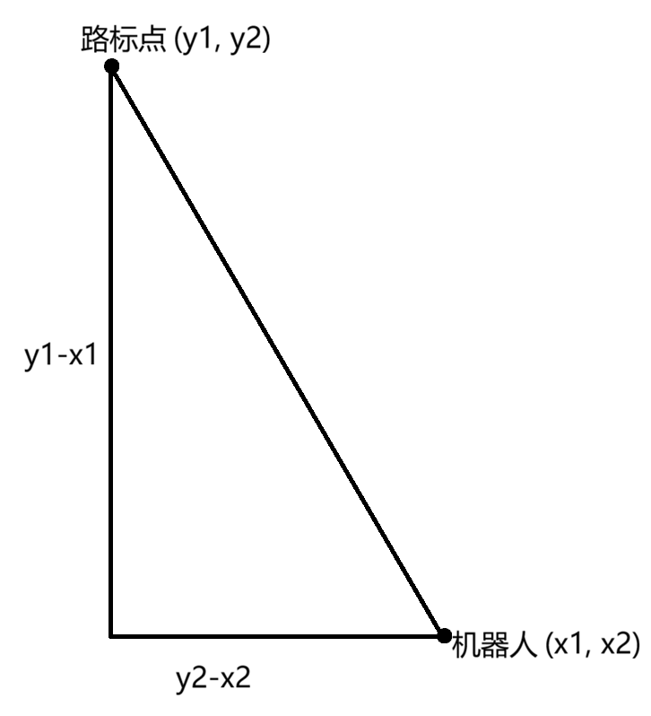

可见，针对不同的传感器，这两个方程有不同的参数化形式。如果我们保持通用性，把它们取成通用的抽象形式，那么 SLAM 过程可总结为两个基本方程：
$$
\left.\left\{\begin{array}{ll}\boldsymbol{x}_k=f\left(\boldsymbol{x}_{k-1},\boldsymbol{u}_k,\boldsymbol{w}_k\right),&k=1,\cdots,K\\\boldsymbol{z}_{k,j}=h\left(\boldsymbol{y}_j,\boldsymbol{x}_k,\boldsymbol{v}_{k,j}\right),&(k,j)\in\mathcal{O}\end{array}\right.\right..
$$

- 其中 *O* 是一个集合，记录着在哪个时刻观察到了哪个路标（通常不是每个路标在每个时刻都能看到的。我们在单个时刻很可能只看到一小部分）。这两个方程描述了最基本的 SLAM 问题：当知道**运动测量的读数 u**，以及**传感器的读数 z** 时，如何求解`定位问题`（估计 **x**）和`建图问题`（估计 **y**）？这时，我们就把 SLAM 问题建模成了一个`状态估计`问题：如何通过带有噪声的测量数据，估计内部的、隐藏着的状态变量？

- 态估计问题的求解，与**两个方程的具体形式**，以及**噪声服从哪种分布**有关。

  按照运动和观测方程是否为**线性**，噪声是否服从**高斯分布**进行分类，分为`线性`**/**`非线性`和`高斯`**/**`非高斯`系统。

  - **线性高斯系统**：它的无偏的最优估计可以由`卡尔曼滤波器`（Kalman Filter，KF）给出

  - **非线性非高斯系统**：会使用以`扩展卡尔曼滤波器`（Extended Kalman Filter，EKF）和`非线性优化`两大类方法去求解。

    早期使用EKF，但是为了克服EKF的缺点（例如**线性化误差**和**噪声高斯分布假设**），人们开始使用`粒子滤波器（Particle Filter）`等其他滤波器，乃至使用`非线性优化`的方法。时至今日，主流视觉SLAM 使用以`图优化（Graph Optimization）`为代表的优化技术进行状态估计。我们认为优化技术已经明显优于滤波器技术，只要计算资源允许，通常都偏向于使用优化方法。

> [!NOTE]
>
> 上面所说的都是在一个二维空间里运动的机器人，然后实际上机器人是在三维空间中运动的，机器人的运动由3个轴构成，所以小萝卜的
>
> 运动要由3个轴上的平移，以及绕着`3个轴`的旋转来描述，一共有`6个自由度（平移XYZ，旋转RPY）`。


# 三维空间刚体运动

> [!NOTE]
>
> `刚体`：是物理学和机器人学里一个基础概念，表示在运动过程中，物体内部**任意两点之间的距离**始终**保持不变**的理想物体。

## 旋转矩阵

### 点和向量,坐标系

我们日常生活的空间是`三维`的，因此我们生来就习惯于`三维空间的运动`。

`三维空间`由**3个轴**组成，所以**一个空间点的位置**可以由**3个坐标**指定。

不过，我们现在要考虑`刚体`，它不光有`位置`，还有`自身的姿态`。相机也可以看成三维空间的刚体，于是**位置是指相机在空间中的哪个地方**，而**姿态则是指相机的朝向**。

> `点`就是空间当中的基本元素，没有长度，没有体积。
>
> 把两个点连接起来，就构成了`向量`。向量可以看成从某点指向另一点的一个箭头。


- 点和向量的表示

  用线性代数的知识来说，三维空间中的某个点的坐标也可以用$\mathbb{R}^3$**（这个意思是三维实数空间，是由三个实数组成的空间 $\mathbb{R}^3=\{(x,y,z)\mid x,y,z\in\mathbb{R}\}$）**来描述。怎么描述呢？

  假设在这个**线性空间**内，我们找到了该空间的一组`基`$(e_1,e_2,e_3)$,那么，任意**向量$a$**在这组基下就有一个`坐标`：

  向量 $\vec{a}$ 在基 $[\vec{e}_1,\vec{e}_2,\vec{e}_3]$ 下的坐标为 $[a_1,a_2,a_3]^T$ ，即

  <p style="text-align:center;"><b>向量 = 基矩阵 × 坐标向量 = 基向量的线性组合</b></p>

  $$
  \vec{a} =
  [\vec{e}_1,\vec{e}_2,\vec{e}_3]
  \begin{bmatrix}
  a_1\\
  a_2\\
  a_3
  \end{bmatrix}
  =
  a_1\vec{e}_1 + a_2\vec{e}_2 + a_3\vec{e}_3
  $$

  - $\begin{bmatrix}a_1\\a_2\\a_3\end{bmatrix}$：向量$\vec{a}$ 在 $[\vec{e}_1,\vec{e}_2,\vec{e}_3]$ 下的坐标（注意：前提是 $[\vec{a}]_{\{\vec{e}_1,\vec{e}_2,\vec{e}_3\}}=\begin{bmatrix}a_1\\a_2\\a_3\end{bmatrix}$，向量 $\vec a$ 在基 $\{\vec e_1,\vec e_2,\vec e_3\}$ 下的坐标向量。）

    也就是说，坐标的具体取值：

    - 跟`向量`本身有关
    - 跟`坐标系`的选取有关


- 向量的**内积**和**外积**

  - 向量的`内积`: 描述向量间的投影关系
    $$
    \vec{a}\cdot\vec{b}
    = \vec{a}^T\vec{b}
    = \sum_{i=1}^{3} a_i b_i
    = \|\vec{a}\|\,\|\vec{b}\|\cos\langle \vec{a},\vec{b}\rangle
    $$

  - 向量的`外积`: 描述向量的旋转

    有两个向量，$\vec{a} = \begin{bmatrix}a_1 \\ a_2 \\ a_3\end{bmatrix}$ $\vec{b} = \begin{bmatrix}b_1 \\ b_2 \\ b_3\end{bmatrix}$，那么

    - **表达方式1**：看起来是**行列式**，但其实是“记号技巧”

      > 其中$\vec{i}$ $\vec{j}$ $\vec{k}$ 表示单位坐标系

      $$
      \vec{a} \times \vec{b} =
      \begin{bmatrix}
      \vec{i} & \vec{j} & \vec{k} \\
      a_1 & a_2 & a_3 \\
      b_1 & b_2 & b_3
      \end{bmatrix}
      $$

    - **表达方式2**：向量结果的分量公式**（写代码常用）**

      > 本质是：**直接把叉乘结果写成向量的三个分量**

      $$
      \vec{a} \times \vec{b} =
      \begin{bmatrix}
      a_2b_3-a_3b_2 \\
      a_3b_1-a_1b_3 \\
      a_1b_2-a_2b_1
      \end{bmatrix}
      $$

    - **表达方式3**：矩阵形式**（机器人/控制超常用）**

      首先计算 向量$\vec{a}$ 的**反对称矩阵**$a^\wedge$：
      $$
      a^\wedge=
      \begin{bmatrix}
      0 & -a_3 & a_2 \\
      a_3 & 0 & -a_1 \\
      -a_2 & a_1 & 0
      \end{bmatrix}
      $$
      然后:
      $$
      \vec{a} \times \vec{b} = a^\wedge\vec{b}
      $$
      

### 坐标的欧式变换

- `世界坐标系`：如果考虑运动的机器人，那么常见的做法是设定一个`惯性坐标系`（或者叫`世界坐标系`），可以认为它是`固定不动`的，如下图中的坐标系$x_w,y_w,z_w$。
- `移动坐标系`：相机或机器人等的都是移动坐标系，如下图中的坐标系$x_c,y_c,z_c$

- `世界坐标系`到`移动坐标系`的转换：

  我们可能会问：相机视野中某个向量$p$，它在**相机坐标系**下的坐标为$p_c$，而在**世界坐标系**下的坐标为$p_w$。那么这两个坐标之间如何转换？

  这时，就需要先得到该点针对机器人坐标系的坐标值，再根据机器人位姿变换到世界坐标系中。

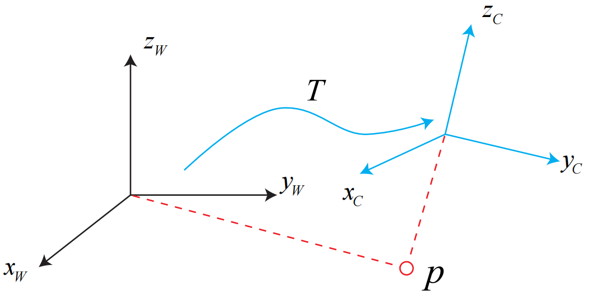

- **欧式变换**:

  - 直观上看，两个坐标系之间的运动由**一个旋转**加上**一个平移**组成，这种运动称为`刚体运动`。

  - 相机运动就是一个刚体运动。刚体运动过程中，同一个向量在各个坐标系下的**长度**和**夹角**都不会发生变化。

    想象你把手机抛到空中，在它落地摔碎之前，只可能有 **空间位置** 和 **姿态** 的不同，而它自己的**长度**、各个面的**角度**等性质不会有任何变化。手机并不会像橡皮那样一会儿被挤扁，一会儿被拉长。此时，我们说手机坐标系到世界坐标之间，相差了一个`欧氏变换（Euclidean Transform）`。

  > [!NOTE]
  >
  > 在欧式变换前后的两个坐标系下,同一个向量的模长和方向不发生改变,是为`欧式变换`。
  >
  > 一个欧式变换由一个`旋转`和一个`平移`组成。

  

- **旋转矩阵R**：

  - **旋转矩阵R** 的推导:

    设单位正交基$[\mathrm{e}_1,\mathrm{e}_2,\mathrm{e}_3]$经过一次旋转变成了$[\mathrm{e}_1^{\prime},\mathrm{e}_2^{\prime},\mathrm{e}_3^{\prime}]$，那么对于同一个向量a，在两个坐标系下的坐标分别为$[\mathrm{a}_1,\mathrm{a}_2,\mathrm{a}_3]^{\mathrm{T}}$和$[\mathrm{a}_1^{\prime},\mathrm{a}_2^{\prime},\mathrm{a}_3^{\prime}]^\mathrm{T}$。根据坐标的定义：

    $$
    \left.\left[\mathrm e_1,\mathrm e_2,\mathrm e_3\right]\left[\begin{array}{c}\mathrm a_1\\\mathrm a_2\\\mathrm a_3\end{array}\right.\right]=\left[\mathrm e_1',\mathrm e_2',\mathrm e_3'\right]\left[\begin{array}{c}\mathrm a_1'\\\mathrm a_2'\\\mathrm a_3'\end{array}\right]
    $$
    等式左右两边同时左乘$[\mathrm{e}_1^{\mathrm{T}},\mathrm{e}_2^{\mathrm{T}},\mathrm{e}_3^{\mathrm{T}}]^{\mathrm{T}}$,得到

    $$
    \left.\left[\begin{array}{c}\mathrm{a}_1\\\mathrm{a}_2\\\mathrm{a}_3\end{array}\right.\right]=\left[\begin{array}{ccc}\mathrm{e}_1^\mathrm{T}\mathrm{e}_1^{\prime}&\mathrm{e}_1^\mathrm{T}\mathrm{e}_2^{\prime}&\mathrm{e}_1^\mathrm{T}\mathrm{e}_3^{\prime}\\\mathrm{e}_2^\mathrm{T}\mathrm{e}_1^{\prime}&\mathrm{e}_2^\mathrm{T}\mathrm{e}_2^{\prime}&\mathrm{e}_2^\mathrm{T}\mathrm{e}_3^{\prime}\\\mathrm{e}_3^\mathrm{T}\mathrm{e}_1^{\prime}&\mathrm{e}_3^\mathrm{T}\mathrm{e}_2^{\prime}&\mathrm{e}_3^\mathrm{T}\mathrm{e}_3^{\prime}\end{array}\right]\left[\begin{array}{c}\mathrm{a}_1^{\prime}\\\mathrm{a}_2^{\prime}\\\mathrm{a}_3^{\prime}\end{array}\right]\triangleq\mathrm{Ra}^{\prime}
    $$
    我们把中间的矩阵拿出来，定义成一个 **矩阵$R$** 。这个矩阵由**两组基之间的内积**组成，刻画了旋转前后同一个向量的坐标变换关系。只要旋转是一样的，那么这个矩阵也是一样的。

    可以说，矩阵$R$ 描述了旋转本身。因此称为`旋转矩阵(Rotation matrix)`。

    同时，该矩阵各分量是两个坐标系基的内积，由于基向量的长度为 1,所以实际上是**各基向量的夹角之余弦**。所以这个矩阵也叫`方向余弦矩阵( Direction Cosine matrix)`。

  - **正交矩阵$Q$**：

    如果一个矩阵 **$Q$** 满足：
    $$
    Q^T Q = I
    $$
    那它就是正交矩阵。其中

    - $Q^T$：转置矩阵
    - $I$​：单位矩阵，即$\begin{bmatrix}1 & 0 & 0 \\0 & 1 & 0 \\0 & 0 & 1\end{bmatrix}$

  - **旋转矩阵R** 的性质
    
    - `正交矩阵`：一个矩阵满足$R^TR=I$，那该矩阵就是正交矩阵。正交矩阵满足**矩阵的转置 = 它的逆**
    
    - `行列式`：这个线性变换对空间“体积”的缩放倍数。
    
      在**2D空间**中，如果一个矩阵原来面积是1，作用后面积是3，那么det(A)=3，即面积被放大3倍
    
      在**3D空间**中，原来单位立方体体积=1，变换后体积=5，那么det(A)=5，即体积放大5倍
    
      所以，在**3D空间**中`det(R)=1`表示**作用前后物品体积不变**
    
    - 旋转矩阵是**行列式为1的正交矩阵**,任何行列式为1的正交矩阵也是一个旋转矩阵.所有旋转矩阵构成**特殊正交群 SO**:
      $$
      \mathrm{SO(n)=\{R\in\mathbb{R}^{n\times n}|RR^T=I,\det(R)=1\}}
      $$
    
      - SO(n)：特殊正交群
    
    - 由于旋转矩阵是`正交矩阵`(其转置等于其逆)，所以旋转矩阵的逆 $R^{-1}$ (即转置 $R^T$)描述了一个`相反的旋转`:
      $$
      a^{\prime}=R^{-1}a=R^{\mathrm{T}}a
      $$
    
      > [!NOTE]
      >
      > **行列式为1的正交矩阵**：
      >
      > - `二维（SO(2)）`
      >
      >   二维非常干净：**所有 det=1 的正交矩阵都长这样**
      >   $$
      >   R(\theta)=
      >   \begin{bmatrix}
      >   \cos\theta & -\sin\theta\\
      >   \sin\theta & \cos\theta
      >   \end{bmatrix}
      >   $$
      >   只有 **一个参数：角度 θ**
      >
      >   几何意义：平面绕原点旋转 θ
      >
      >   
      >
      > - `三维（SO(3)）`
      >
      >   **绕坐标轴旋转**
      >
      >   绕 x 轴：
      >   $$
      >   R_x(\theta)=
      >   \begin{bmatrix}
      >   1&0&0\\
      >   0&\cos\theta&-\sin\theta\\
      >   0&\sin\theta&\cos\theta
      >   \end{bmatrix}
      >   $$
      >   绕 y 轴：
      >   $$
      >   R_y(\theta)=
      >   \begin{bmatrix}
      >   \cos\theta&0&\sin\theta\\
      >   0&1&0\\
      >   -\sin\theta&0&\cos\theta
      >   \end{bmatrix}
      >   $$
      >   绕 z 轴：
      >   $$
      >   R_z(\theta)=
      >   \begin{bmatrix}
      >   \cos\theta&-\sin\theta&0\\
      >   \sin\theta&\cos\theta&0\\
      >   0&0&1
      >   \end{bmatrix}
      >   $$
      >   任意旋转：
      >   $$
      >   R=R_zR_yR_x
      >   $$
      >
      > - **轴角公式**
      >
      >   绕单位轴 $n=(n_x,n_y,n_z)$，角度 θ：
      >   $$
      >   R=I+\sin\theta[n]_\times+(1-\cos\theta)[n]_\times^2
      >   $$
      >   其中
      >   $$
      >   [n]_\times=
      >   \begin{bmatrix}
      >   0&-n_z&n_y\\
      >   n_z&0&-n_x\\
      >   -n_y&n_x&0
      >   \end{bmatrix}
      >   $$
      >   优点：
      >
      >   - 参数最少（3自由度）
      >   - 李代数直接用
      >   - SLAM/标定/优化全靠它


- 平移

  在欧氏变换中，除了旋转之外还有平移。考虑世界坐标系中的 **向量$a$** ，经过一次 **旋转** (用旋转矩阵$R$描述)和一次 **平移$t$** 后，得到了 **向量$a^{\prime}$**，那么把`旋转`和`平移`合到一起，有：

  $$
  a'=Ra+t
  $$
  实际当中，我们会定义 坐标系1、坐标系2，那么向量$a$在两个系下坐标为$a_1,a_2$,它们之间的关系，按照完整的写法，应该是：

  $$
  a_1=R_{12}a_2+t_{12}
  $$

  - $R_{12}$：表示把**坐标系2** 的向量变换到**坐标系1**中，由于向量乘在这个矩阵的右边，它的下标是从右读到左的。

  - $t_{12}$:是**坐标系1原点**指向**坐标系2原点**的向量在**坐标系1**下的坐标

式$a'=Ra+t$完整地表达了欧氏空间的旋转与平移，不过还存在一个小问题：这里的变换关系不是一个线性关系。假设我们进行了两次变换：$R_1, t_1$ 和 $R_2, t_2$：
$$
b = R_1 a + t_1, \quad c = R_2 b + t_2
$$

- **代码表示**

  ```c++
  // 三维坐标
  Vector3d v(1, 0, 0);
  
  // 旋转向量
  AngleAxisd rotation_vector(M_PI / 4, Vector3d(0, 0, 1));     //沿 Z 轴旋转 45 度
  
  // 欧氏变换矩阵使用 Eigen::Isometry
  Isometry3d T = Isometry3d::Identity();                     	 	// 虽然称为3d，实质上是4*4的矩阵（因为是齐次）
  T.rotate(rotation_vector);                                  	// 定义旋转：按照rotation_vector进行旋转
  T.pretranslate(Vector3d(1, 3, 4));                          	// 定义平移：把平移向量设成(1,3,4)
  
  // 用变换矩阵进行坐标变换
  Vector3d v_transformed = T * v;                                 // 相当于 R*v+t
  ```


### 变换矩阵与齐次坐标

式 $a'=Ra+t$ 完整地表达了欧氏空间的`旋转`与`平移`，不过还存在一个小问题：这里的变换关系不是一个线性关系。假设我们进行了两次变换：$R_1, t_1$ 和 $R_2, t_2$：
$$
b = R_1 a + t_1, \quad c = R_2 b + t_2
$$
那么，从 $a$ 到 $c$ 的变换为：
$$
c=R_2\left(R_1a+t_1\right)+t_2
$$
这样的形式在变换多次之后会显得很啰嗦。因此，我们引入齐次坐标和变换矩阵，重写式 $a'=Ra+t$：
$$
\begin{bmatrix} a' \\ 1 \end{bmatrix} =
\begin{bmatrix} R & t \\ 0^\top & 1 \end{bmatrix}
\begin{bmatrix} a \\ 1 \end{bmatrix} \triangleq T \begin{bmatrix} a \\ 1 \end{bmatrix}
$$
我们暂时用$\tilde{a}$表示$a$的齐次坐标。那么依靠`齐次坐标`和`变换矩阵`，两次变换的叠加就可以有很好的形式：
$$
\tilde{b}=T_1\tilde{a},\:\tilde{c}=T_2\tilde{b}\quad\Rightarrow\tilde{c}=T_2T_1\tilde{a}
$$

1. **齐次坐标**

   > 齐次坐标 = 在原坐标后面多加一个维度，用来统一表示平移和投影。
   >
   > 但是都表示同一个点。

   **举个例子：**

   - 普通二维点：$(x,y)$

     齐次坐标写成：$(x,y,1)$

   - 三维空间中的点：$(x,y,z)$

     齐次坐标：$(x,y,z,1)$

   **齐次坐标的作用**：

   - **把平移变成矩阵乘法**

     - 普通线性`变换`：$\begin{bmatrix}x'\\y'\end{bmatrix}=R\begin{bmatrix}x\\y\end{bmatrix}$，其中R是2*2的旋转矩阵，表示2维中的旋转

       但平移不能写成矩阵乘法：$x'=x+t_x$

     - 引入齐次坐标后，齐次坐标解决方案

       把点写成：$\begin{bmatrix}x\\y\\1\end{bmatrix}$

       `变换`写成：$\begin{bmatrix}R & t\\0 & 1\end{bmatrix}$，其中R是一个3\*3的旋转矩阵，表示3维中的旋转，t是一个3\*1的平移向量，表示3维中的平移

       于是：$\begin{bmatrix}x'\\y'\\1\end{bmatrix} = \begin{bmatrix}R & t\\0 & 1\end{bmatrix} \begin{bmatrix}x\\y\\1\end{bmatrix}$

   

2. **变换矩阵T**

   > 用齐次坐标，把“旋转 + 平移”这种本来不是**纯线性的变换**，变成一次**矩阵乘法（线性形式）**

   - **先看普通三维变换长什么**

     在普通欧式空间里，一个点 $a$ 经过刚体变换：$a' = Ra + t$

     其中：

     - $a$：原始点（3×1）

     - $R$：旋转矩阵（3×3）

     - $t$：平移向量（3×1）

   - 什么是`线性变换`

     线性变换长这样： $x' = Ax$ ，**只有乘法，没有加常数，这就叫线性变换**

     但是上面的式子 $Ra+t$ 不是`线性变换`（严格说是`仿射变换`）。

   - 齐次坐标怎么将`非线性变换`变为`线性变换`

     - 首先把3维的点a升维，变为4维：$a \rightarrow \begin{bmatrix}a\\1\end{bmatrix}$

     - 然后构建`变换矩阵T`：$T = \begin{bmatrix}R&t\\0&1\end{bmatrix}$，其中

       - `R`是一个3\*3的**旋转矩阵**，表示3维中的旋转
       - `t`是一个3\*1的**平移向量**，表示3维中的平移

     - 那么 $a' = Ra + t$ 就变为：
       $$
       \begin{bmatrix}a'\\1\end{bmatrix} =
       T\begin{bmatrix}a\\1\end{bmatrix} =
       \begin{bmatrix}R&t\\0&1\end{bmatrix} \begin{bmatrix}a\\1\end{bmatrix}
       $$
       

       计算得：

       - 上半部分: $a'= Ra+t$
       - 下半部分：$1 = 1$


3. **变换矩阵T的性质**：

   - `变换矩阵T` 有一个比较特别的结构：
     
     左上角为 **旋转矩阵**，右侧为 **平移向量**，左下角为 **0向量**，右下角为 1。这种矩阵又称为`特殊欧氏群`$SE$
     $$
     SE(3) = \left\{ T = \begin{bmatrix} R & t \\ 0 & 1 \end{bmatrix} \in \mathbb{R}^{4 \times 4} \middle| R \in SO(3),\, t \in \mathbb{R}^3 \right\}
     $$

   
   
   - `变换矩阵的逆`表示一个`反向的欧式变换`
     $$
     T^{-1} = \begin{bmatrix} R^T & -R^T t \\ 0 & 1 \end{bmatrix}
     $$
     


## 旋转向量和欧拉角

### 旋转向量

- **旋转矩阵的缺点**:
  
  - 旋转矩阵有9个量，但一次旋转只有3个自由度，这种表达方式是冗余的.
  - 旋转矩阵自带约束**(必须是行列式为1的正交矩阵)**，这些约束会给**估计**和**优化**带来困难。
  
- **旋转向量**: 

  - **概念**：任意旋转都可以用**一个旋转轴**和**一个旋转角** 来刻画。于是我们可以使用一个`向量`：

    - `方向`表示**旋转轴**
    - `长度`表示旋**转角**

    这种向量称为`旋转向量`（或轴角,Axis-Angle）。

  - **几何意义**：

    - `旋转向量的方向`表示**旋转轴的方向**。
    - `旋转向量的模长`表示**绕旋转轴旋转的角度**。

    > [!IMPORTANT]
    >
    > 当一个东西绕某个旋转轴旋转时，会造成`位移`。
    >
    > **`旋转`与`位移`的关系**很敏感，因为可以想象得到，当一个物品在离旋转轴很远的地方绕该旋转轴旋转，即使旋转角度很小，其位移还是非常大

  - **例如**：假设有一个**旋转轴为n**，**角度为θ**的旋转，其对应的`旋转向量`为θn

  - **长什么样**：旋转向量$r=(x,y,z)$，表示在3D空间中三个方向上的分量

    如：
    $$
    r=(0,0,\pi/2)
    $$
    表示：

    | 分量         | 含义            |
    | ------------ | --------------- |
    | **0（X）**   | 不沿 X 轴旋转   |
    | **0（Y）**   | 不沿 Y 轴旋转   |
    | **π/2（Z）** | 沿 Z 轴旋转 90° |

- **`旋转向量`和`旋转矩阵`之间的转换:**

  假设 **旋转向量R** 表示一个绕 **单位向量n**，**角度为θ** 的旋转

  - **旋转向量**到**旋转矩阵**:`罗德里格斯公式`
    $$
    \mathrm{R}=\cos\theta\mathrm{I}+(1-\cos\theta)\mathrm{nn}^\mathrm{T}+\sin\theta\mathrm{~n}^\mathrm{\wedge}
    $$
    其中：

    - $n=(n_x,n_y,n_z)^T$：**单位旋转轴**，其中$n^\wedge$​是n的`反对称矩阵`，$n^\wedge=\begin{bmatrix}0&-n_z&n_y\\n_z&0&-n_x\\-n_y&n_x&0\end{bmatrix}$
    - $\theta$：旋转角
    - $I$：3×3 单位矩阵$\begin{bmatrix}1&0&0\\0&1&0\\0&0&1\end{bmatrix}$

    **代码表示**：

    ```c++
    // 定义旋转向量，用 AngleAxisd 表示
    AngleAxisd rotation_vector(M_PI / 4, Vector3d(0, 0, 1));	//沿 Z 轴旋转 45 度
    
    // 旋转向量 转换为 旋转矩阵
    Matrix3d rotation_matrix = rotation_vector.toRotationMatrix();
    ```
    
    
    
  - **旋转矩阵**到**旋转向量**:
  
    > [!NOTE]
    >
    > 基础知识：`trace（迹）`，表示三维矩阵的对角线的和
    >
    > 任意 3D 旋转矩阵都有：
    > $$
    > \begin{aligned}\operatorname{tr}\left(R\right)&=\cos\theta\mathrm{tr}(\boldsymbol{I})+(1-\cos\theta)\mathrm{tr}\left(\boldsymbol{n}\boldsymbol{n}^{\mathrm{T}}\right)+\sin\theta\mathrm{tr}(\boldsymbol{n}^{\wedge})\\&=3\cos\theta+(1-\cos\theta)\\&=1+2\cos\theta.\end{aligned}
    > $$
    > 所以直接解：
    > $$
    > \cos\theta=\frac{\mathrm{tr}(R)-1}{2}
    > $$
    > 就得到角度。

    - 旋转角 $\theta = \arccos \left( \frac{tr(R)-1}{2} \right)$

    - `旋转轴n` 是 `矩阵R` `特征值为1`对应的`特征向量`

      什么意思呢？我们来先看
  
      - `特征值`的定义：一个变换作用在某个方向上，只会拉伸/缩放，不会改变方向时的缩放倍数。
  
        举个例子：
  
        - 假设有一个**变换矩阵A**：$A=\begin{bmatrix}2&0\\0&3\end{bmatrix}$，该矩阵的作用是：在x方向上拉伸2倍，在y方向上拉伸3倍
  
        - 然后我有一个**向量$v_1=\begin{bmatrix} 1\\0 \end{bmatrix}$**，我需要该向量经过变换矩阵A的变换，即
  
          变换后：方向没变
          $$
          Av_1=
          \begin{bmatrix}
          2\\
          0
          \end{bmatrix}
          =2v_1
          $$
          所以我们得到**特征向量**：方向为**x方向**，特征值为**2**
  
        - 然后我又有一个**向量$v_2=\begin{bmatrix} 0\\1 \end{bmatrix}$**，我需要该向量经过变换矩阵A的变换，即
  
          变换后：方向没变
          $$
          Av_2=
          \begin{bmatrix}
          0\\
          3
          \end{bmatrix}
          =3v_2
          $$
          所以我们得到**特征向量**：方向为**y方向**，特征值为**3**
  
      - `旋转轴`的定义：旋转时保持不变的方向
  
        假设：
      
        - $R$：绕某一条**旋转轴$n$**，**旋转角度$\theta$** 所对应的三维**旋转矩阵**
        - $n$：旋转轴方向（一个单位向量）
      
        如果**方向完全没变**，在三维空间中，那就意味着：
        $$
        旋转后的向量=R×原向量
        $$
      
        $$
        旋转轴方向不变，即n = Rn
        $$
      
        $$
        也就是说Rn=1 \cdot n
        $$
      
        所以我们得到**特征向量**：方向不变，特征值为1
    
    - **代码表示**
    
      ```c++
      // 定义旋转矩阵
      Matrix3d rotation_matrix = Matrix3d::Identity();
      
      // Eigen提供了一个使用 旋转矩阵 转换为 旋转向量 的方式
      AngleAxisd rotation_vector(rotation_matrix);
      ```
    
      

### 欧拉角

- 欧拉角将一次旋转分解成**3个分离的转角**。常用的一种**ZYX转角**将任意旋转分解成以下3个轴上的转角:

  - 绕物体的 Z轴 旋转,得到偏航角yaw

  - 绕`旋转yaw之后`的 Y轴 旋转,得到俯仰角pitch

  - 绕`旋转pitch之后`的 X轴 旋转,得滚转角roll

  > [!IMPORTANT]
  >
  > 欧拉角的旋转是有先后顺序的：
  >
  > 先旋转 yaw -> 再旋转 pitch -> 最后旋转 roll

- 欧拉角的一个重大缺点是**万向锁问题(奇异性问题)**: 在俯仰角为±90° 时，第一次旋转与第三次旋转将使用同一个轴，使得系统丢失了一个自由度(由3次旋转变成了2次旋转)。

  为什么呢？

  > `顺序在前的轴`转动时 **会带动** `顺序在后的轴`一起旋转**（如转动yaw角时，y轴和x轴也会跟着旋转；旋转pitch角时，x轴也会跟着旋转）**
  >
  > `顺序在后`的轴转动时 **不会带动** `顺序在前`的轴一起旋转**（如转动pitch角时，z轴不会跟着旋转；转动roll角时，z轴和y轴不会跟着旋转）**
  >
  > **（这个性质就是导致欧拉角万向锁问题的原因）**

- 代码表示

  ```c++
  // 欧拉角: 可以将旋转矩阵直接转换成欧拉角
  Vector3d euler_angles_1 = rotation_matrix.canonicalEulerAngles(0, 1, 2); // XYZ顺序，即roll-pitch-yaw顺序
  Vector3d euler_angles = rotation_matrix.canonicalEulerAngles(2, 1, 0); // ZYX顺序，即yaw-pitch-roll顺序
  ```

  

## 四元数

> `四元数`是**紧凑**的，同时也没有**奇异性**

把**四元数**与**复数**类比可以帮助你更快地理解四元数。例如，当我们想要将复平面的向量旋转$\theta$ 角时，可以给这个复向量乘以 $e^{i\theta}$。这是极坐标表示的复数，它也可以写成普通的形式，只要使用欧拉公式即可：

$$
\mathrm{e}^{i\theta}=\cos\theta+i\sin\theta
$$
这正是一个单位长度的复数。所以，在二维情况下，旋转可以由单位复数来描述。类似地，我们会看到，三维旋转则可以由单位四元数来描述。


### 四元数的定义与本质

#### 四元数的定义

一个四元数q拥有**一个实部**和**三个虚部**：
$$
q=q_0+q_1i+q_2j+q_3k
$$
其中i,j,k 为四元数的3个虚部，它们满足以下关系式**（自己和自己的运算像复数，自己和别人的运算像叉乘）**：
$$
\left.\left\{\begin{array}{l}\mathrm{i^2=j^2=k^2=ijk=-1}\\\mathrm{ij=k,ji=-k}\\\mathrm{jk=i,kj=-i}\\\mathrm{ki=j,ik=-j}\end{array}\right.\right.
$$


#### 四元数的本质

- 四元数本质上是一个**四维数**，写成：

$$
q = \begin{bmatrix}q_0,\; q_1,\; q_2,\; q_3\end{bmatrix}
$$

- 但是为了方便**理解和计算**，人们写成：
  $$
  q = [s,\; v]
  $$
  其中：

  - $s=q_0$：标量（scalar）
  - $v=[q_1,q_2,q_3]^T$：三维向量（vector）

- 所以可以用一个标量和一个向量来表达四元数：

  $$\mathrm{q=[s,v],\quad s=q_0\in\mathbb{R}\quad v=[q_1,q_2,q_3]^T\in\mathbb{R}^3}$$

  `s`为四元数的**实部**，`v`为四元数的**虚部**.有`实四元数`和`虚四元数`的概念

  - `实四元数`：一个四元数的虚部为0
  - `虚四元数`：一个四元数的实部为0


### 四元数的运算

- 首先，四元数可以写成这两种形式：
  $$
  q=s+v
  $$

  $$
  q=[s,v]
  $$

- 写两个四元数
  $$
  q_a=s_a+v_a
  $$

  $$
  q_b=s_b+v_b
  $$

#### 加法和减法

四元数$q_a,q_b$的加减运算为
$$
q_a\pm q_b=\left[s_a\pm s_b,v_a\pm v_b\right]^\mathrm{T}
$$

#### 乘法

- 我们直接计算$q_1q_2$
  $$
  q_1q_2
  =
  (s_1+v_1)(s_2+v_2)
  =
  s_1s_2 + s_1v_2 + v_1s_2 + v_1v_2
  $$
  解释：
  
  - $s_1s_2$：标量×标量
  
  - $s_1v_2$：标量×向量
  
  - $v_1s_2$：向量×标量（其实就是标量×向量）
  
  - $v_1v_2$：向量×向量。我们把v1和v2展开：
    $$
    v_1=x_1i+y_1j+z_1k
    $$
  
    $$
    v_2=x_2i+y_2j+z_2k
    $$
  
    那么，计算$v_1v_2$
    $$
    \begin{align}
    v_1 v_2
    &= (x_1 i + y_1 j + z_1 k)
       (x_2 i + y_2 j + z_2 k) \\
    &= x_1x_2 i^2 + x_1y_2 ij + x_1z_2 ik \\
    &\quad + y_1x_2 ji + y_1y_2 j^2 + y_1z_2 jk \\
    &\quad + z_1x_2 ki + z_1y_2 kj + z_1z_2 k^2 \\
    &=−(x_1x_2+y_1y_2+z_1z_2)\\
    &\quad +(y_1z_2−z_1y_2)i+(z_1x_2−x_1z_2)j+(x_1y_2−y_1x_2)k
    \end{align}
    $$
    又因为：
  
    `点乘`
    $$
    v_1\cdot v_2=
    x_1x_2+y_1y_2+z_1z_2
    $$
    `叉乘`
    $$
    v_1\times v_2
    =
    \begin{bmatrix}
    y_1z_2-z_1y_2\\
    z_1x_2-x_1z_2\\
    x_1y_2-y_1x_2
    \end{bmatrix}
    =(y_1z_2−z_1y_2)i+(z_1x_2−x_1z_2)j+(x_1y_2−y_1x_2)k
    $$
    
    所以得到$v_1v_2$：
    $$
    \boxed{
    v_1 v_2
    =
    -\,v_1\cdot v_2
    +
    v_1\times v_2
    }
    $$
    所以得到最终公式：
    $$
    \begin{aligned}q_{1}q_{2}&=s_{1}s_{2}-x_{1}x_{2}-y_{1}y_{2}-z_{1}z_{2}\\&+\left(s_1x_2+x_1s_2+y_1z_2-z_1y_2\right)i\\&+\left(s_1y_2-x_1z_2+y_1s_2+z_1x_2\right)j\\&+\left(s_1z_2+x_1y_2-y_1x_2+z_1s_2\right)k.\end{aligned}
    $$

#### 模长

四元数的模长定义为
$$
\|q_a\| = \sqrt{s_a^2 + x_a^2 + y_a^2 + z_a^2}
$$
可以验证，两个`四元数乘积的模`即为`模的乘积`。这使得**单位四元数相乘后仍是单位四元数**。
$$
\|q_a q_b\| = \|q_a\| \|q_b\|.
$$


#### 共轭

四元数的共轭是把`虚部`取成相反数：

$$
q_{a}^{*}=s_{a}-x_{a}i-y_{a}j-z_{a}k=[s_{a},-v_{a}]^{\mathrm{T}}
$$
**四元数共轭**与其**本身**相乘，会得到一个`实四元数`，其实部为`模长的平方`：
$$
q^*q=qq^*=[s_a^2+v^\mathrm{T}v,\mathbf{0}]^\mathrm{T}
$$


#### 逆

一个四元数的`逆`为
$$
q^{-1}=q^{*}/\|q\|^{2}
$$
按此定义，四元数和自己的逆的乘积为实四元数1：

$$
qq^{-1}=q^{-1}q=1
$$
如果$q$为单位四元数，其逆和共轭就是同一个量。同时，乘积的逆有和矩阵相似的性质：

$$
(q_aq_b)^{-1}=q_b^{-1}q_a^{-1}
$$


#### 数乘

和向量相似，四元数可以与数相乘：

$$
k\boldsymbol{q}=\left[ks,k\boldsymbol{v}\right]^\mathrm{T}
$$


### 四元数与旋转角度的关系

| 符号 | 对应空间轴 |
| ---- | ---------- |
| i    | x轴        |
| j    | y轴        |
| k    | z轴        |

| 复数         | 代表旋转  |
| ------------ | --------- |
| i = e^(i90°) | 旋转 90°  |
| -1           | 旋转 180° |
| -i           | 旋转 270° |

- 在`二维情况`下，任意一个**旋转**都可以用**单位复数**来描述，乘**复数i**就是绕**i轴(即x轴)**旋转90°

  如：

  - 在二维平面中，一个点可以看成复数：$z=x+yi$
    - `x` 是实部，对应水平轴
    - `y` 是虚部，对应垂直轴
  - 如果我拿出一个**单位复数**：$e^{i\theta} = \cos\theta + i \sin\theta$
  - **单位复数**去乘以二维中的点，得到：$z'= e^{i\theta} \cdot z$，就等价于把 点$z$ **旋转θ角度**后得到 $z'$

- 在`三维情况`下，任意旋转都可以用**单位四元数**表示。定义单位四元数 $q = \cos(\theta/2) + \sin(\theta/2)(u_x i + u_y j + u_z k)$，将一个点 $v = v_x i + v_y j + v_z k$ 看作纯虚四元数，旋转后的点为：$v' = q \, v \, q^{-1}$，这样就等价于把点绕 $u$ 轴旋转 θ。

  如：

  - 在三维平面中，一个点可以看成复数：$z=w+xi+yj+zk$
    - `w = cos(θ/2)` → 旋转量（半角）
    - `(x, y, z)` → 旋转轴方向
  - 如果我拿出一个**单位复数**：$q = \cos(\theta/2) +  \sin(\theta/2)(xi+yj+zk)$
  - **单位复数**去乘以三维中的点，得到：$z'= q \cdot z$，就等价于把 点$z$ **绕 u轴旋转θ**后得到 $z'$


### 单位四元数和旋转向量之间的转换

设 **单位四元数q** 表示一个绕 **单位向量$\mathrm{n=[n_x,n_y,n_z]^T}$**，**角度为θ**的旋转。

- **前提概念**

  - **旋转向量**（rotation vector）：
    $$
    \boldsymbol{r} = \theta \mathbf{n}
    $$

    - $\mathbf{n} = [n_x, n_y, n_z]^T$ 是单位向量，表示旋转轴
    - $\theta$ 是绕这个轴旋转的角度

  - **单位四元数**（unit quaternion）：
    $$
    q = [q_0, q_1, q_2, q_3]^T = [w, x, y, z]^T
    $$

    - $q_0 = w$ → **旋转量**（半角 cos）
    - $[q_1, q_2, q_3]$ → **旋转轴分量**（半角 sin 乘单位轴）


- 从`旋转向量`到`单位四元数`

  例如：旋转向量 $\theta \mathbf{n}$ → 四元数 $q$
  $$
  q = \begin{bmatrix} \cos(\theta/2) \\ n_x \sin(\theta/2) \\ n_y \sin(\theta/2) \\ n_z \sin(\theta/2) \end{bmatrix}
  $$
  解释：

  1. **θ/2** 是半角
     - 四元数公式用 **半角**，原因是四元数乘法和旋转组合需要 θ/2 才能正确表示旋转
  2. **cos(θ/2)** → 四元数的标量部分 $q_0 = w$
  3. **sin(θ/2) \* n** → 四元数的向量部分 $[q_1, q_2, q_3]$

  举个例子：

  - 旋转 90° 绕 z 轴：$\theta = π/2$，$\mathbf{n} = [0,0,1]$

  $$
  q = [\cos(π/4), 0, 0, \sin(π/4)] = [0.7071, 0, 0, 0.7071]
  $$

- 从`单位四元数`到`旋转向量`

  已知**四元数**：
  $$
  q = [q_0, q_1, q_2, q_3]
  $$
  求**旋转向量**：

  1. 旋转角度：

  $$
  \theta = 2 \arccos(q_0)
  $$

  2. 旋转轴：

  $$
  \mathbf{n} = \left[n_x,n_y,n_z\right]^\mathrm{T} = \frac{[q_1, q_2, q_3]^T}{\sin(\theta/2)}
  $$

  > [!WARNING]
  >
  > - 如果 $\theta \approx 0$（即 $q_0 \approx 1$），sin(θ/2) 会接近 0，需要特殊处理，直接取任意**单位向量**即可
  >
  >   **什么意思？**
  >
  >   **->假设我们有一个四元数表示一个非常小的旋转：**
  >   $$
  >   q = [q_0, q_1, q_2, q_3] = [0.999999, 0.000001, 0, 0]
  >   $$
  >
  >   - q0≈1 → θ 很小
  >   - q1、q2、q3 非常小 → 旋转向量接近 0
  >
  >   **->然后计算旋转角度 θ**
  >   $$
  >   \theta = 2 \arccos(q_0) \approx 2 \arccos(0.999999)
  >   $$
  >
  >   - arccos(0.999999) ≈ 0.001414 rad
  >   - θ ≈ 0.002828 rad ≈ 0.162°，非常小
  >
  >   **->计算旋转轴 n**
  >
  >   公式：
  >   $$
  >   \mathbf{n} = \frac{[q_1, q_2, q_3]}{\sin(\theta/2)}
  >   $$
  >
  >   - θ/2 ≈ 0.001414
  >   - sin(θ/2) ≈ 0.001414
  >   - [q1, q2, q3] = [0.000001, 0, 0]
  >
  >   代入：
  >   $$
  >   n_x = q_1 / \sin(\theta/2) \approx 0.000001 / 0.001414 \approx 0.000707
  >   $$
  >
  >   - 结果非常不稳定，因为**小数除小数**容易产生数值误差
  >   - **对计算机来说，这个向量方向几乎是随机的**
  >
  >   **->所以我们要进行 特殊处理**
  >
  >   - 当 θ≈0 时，旋转向量本身就非常小
  >   - 旋转轴方向对最终结果影响不大
  >   - 所以直接取任意**单位向量**（如 `[1,0,0]`,`[0,1,0]`）即可
  >
  >   然后旋转向量 = θ * n ≈ 无旋转，也就是说物体基本不会位移
  >
  > - 旋转向量 = θ * n


### 用单位四元数表示旋转

给定一个三维空间点 $p = [x, y, z] \in \mathbb{R}^3$，以及一个由轴角 $n, \theta$ 指定的旋转，三维点 $p$ 经过旋转变后变为 $p'$。如何使用单位四元数 $q$ 表达旋转？

1. 将三维空间点用一个虚四元数 $p$ 表示：
$$
  p = [0, x, y, z] = [0, v]
$$

2. 将旋转用单位四元数 $q$ 表示：
$$
q = \begin{bmatrix} \cos(\theta/2) \\ n_x \sin(\theta/2) \\ n_y \sin(\theta/2) \\ n_z \sin(\theta/2) \end{bmatrix} = [\cos \frac{\theta}{2}, n \sin \frac{\theta}{2}]
$$

3. 旋转后的点 $p'$ 可表示为：
   $$
   p' = q p q^{-1}
   $$
   这样得到的点 $p'$ 仍为一个纯虚数，其虚部的三个分量表示旋转后3D点的坐标。

> [!NOTE]
>
> 只有**单位**四元数才能表示旋转,因此在程序中创建四元数后,要记得调用`normalize()`以将其单位化


### 代码示例

```c++
// 定义旋转向量
AngleAxisd rotation_vector(M_PI / 4, Vector3d(0, 0, 1));     //沿 Z 轴旋转 45 度

// 定义旋转矩阵（由旋转向量转换）
Matrix3d rotation_matrix = rotation_vector.toRotationMatrix();

// 四元数
// 构造四元数
// 可以直接把AngleAxis赋值给四元数，反之亦然
Quaterniond q = Quaterniond(rotation_vector);
// 也可以把旋转矩阵赋给它
q = Quaterniond(rotation_matrix);

// 使用四元数进行旋转
// 使用四元数旋转一个向量，使用重载的乘法即可
v_rotated = q * v; // 注意 数学上是qvq^{-1}，但是在写代码的时候Eigen库帮我们简化了，Eigen库内部执行的是(q * Quaternion(0,v) * q.inverse()).vec()
// 用常规向量乘法表示，则应该如下计算
Quaterniond qvq = q * Quaterniond(0, 1, 0, 0) * q.inverse();	// 最终得到的三维点要调用.vec()，现在计算出来是一个纯虚四元数
```


## 相似、放射、射影变换

### 相似变换

相似变换比欧氏变换多了一个自由度，它允许物体进行`均匀缩放`，其矩阵表示为
$$
T_S=\left[\begin{array}{cc}sR&t\\[0.3em]0^\mathrm{T}&1\end{array}\right]
$$

- $s$：缩放因子，表示我们在对向量旋转之后，可以在$x,y,z$三个坐标上进行均匀缩放。由于含有缩放，相似变换不再保持图形的面积不变。

一个边长为 1 的立方体通过相似变换后，变成边长为 10 的样子(但仍然是立方体)。**三维相似变换的集合也叫做`相似变换群`**，记作 `Sim(3)`。


### 仿射变换

仿射变换的矩阵形式如下：

$$
T_A=\left[\begin{array}{cc}A&t\\\\0^\mathrm{T}&1\end{array}\right]
$$
与欧氏变换不同的是，仿射变换**只要求$A$是一个`可逆矩阵`**，而不必是正交矩阵。仿射变换也叫`正交投影`。

**经过仿射变换之后，立方体就不再是方的了，但是各个面仍然是平行四边形。**

> [!NOTE]
>
> `可逆矩阵`
>
> 如果一个矩阵 $A$ 存在另一个矩阵 $A^{-1}$，满足：
> $$
> A A^{-1} = A^{-1} A = I
> $$
> 那么：
>
> $A$ 就叫 **可逆矩阵**
> $A^{-1}$ 叫 **逆矩阵**


### 射影变换

射影变换是最一般的变换，它的矩阵形式为

$$
T_P=\left[\begin{array}{cc}A&t\\\\a^\mathrm{T}&v\end{array}\right]
$$

- **参数**：
  
  - 它的左上角为可逆矩阵$A$
  - 右上角为平移$t$
  - 左下角为缩放$a^\mathrm{T}$
  
- `去齐次化`

  由于采用了**齐次坐标**表示，当变换后的第三个分量 $(v \neq 0)$ 时，可以将整个坐标向量同时除以v，从而得到右下角元素为 1 的标准形式。

  经过**射影变换**后，一个点的齐次坐标为：
  $$
  (x',y',v)
  $$
  由于齐次坐标只在比例意义下表示同一个点，因此需要将其恢复为普通二维坐标，即进行**去齐次化（dehomogenization）**：
  $$
  \left(\frac{x'}{v},\frac{y'}{v},1\right)
  $$
  若 $(v = 0)$，则无法进行上述归一化，此时对应的是**无穷远点**，其矩阵右下角元素为 0。

  由于齐次坐标中整体比例不影响实际表示，一个 $(3\times3)$ 的射影变换矩阵虽然包含 9 个参数，但其中有 1 个参数是冗余的，因此：

  - **二维（2D）射影变换具有 8 个自由度**；
  - **三维（3D）射影变换具有 15 个自由度**。

  射影变换是目前所讨论的变换中**最一般的一类变换**。现实世界中的**三维场景通过相机成像到二维照片的过程**，本质上可以看作一种**射影变换**。

  例如，可以想象一块原本是正方形的地板砖，在照片中往往不再保持方形。由于透视效应产生的**“近大远小”**现象，它甚至不会保持为平行四边形，而会呈现为一个不规则的四边形。这正是射影变换所描述的几何效果。


### 常见变换性质比较

| 变换名称              | 矩阵形式                                          | 自由度 | 不变性质           |
| --------------------- | ------------------------------------------------- | ------ | ------------------ |
| 欧氏变换 (Euclidean)  | $\begin{bmatrix} R & t \\ 0^T & 1 \end{bmatrix}$  | 6      | 距离、角度、体积   |
| 相似变换 (Similarity) | $\begin{bmatrix} sR & t \\ 0^T & 1 \end{bmatrix}$ | 7      | 形状、体积比例     |
| 仿射变换 (Affine)     | $\begin{bmatrix} A & t \\ 0^T & 1 \end{bmatrix}$  | 12     | 平行性、体积比     |
| 射影变换 (Projective) | $\begin{bmatrix} A & t \\ a^T & v \end{bmatrix}$  | 15     | 直线保持、透视关系 |


# 李群与李代数

- **背景：刚体运动的表示**

  上一讲我们学过三维空间中刚体运动的几种表示方式，比如：

  - **旋转矩阵 $R$**：3×3矩阵，表示旋转
  - **旋转向量**：轴角形式，用一个向量表示旋转轴和旋转角
  - **欧拉角**：绕三个坐标轴依次旋转的角度
  - **四元数 $q$**：数学上更紧凑、避免万向锁的旋转表示

  这些都是 **表示旋转的方法**，帮助我们把相机或机器人在三维空间的姿态描述清楚。

- **SLAM 中的问题**

  在 `SLAM（同时定位与建图）`中，光有表示还不够：

  - 我们不仅要表示相机或机器人的位姿（位置+旋转），
  - 还要**估计它们的具体数值**，因为这些位姿 **是未知的**。

  换句话说，我们不知道相机在世界中的精确位置和朝向，只能通过`观测`（比如图像、特征点）来推测。

- 🤔在之前我们知道，旋转矩阵是带有约束的，也就是说用`旋转矩阵`来解决SLAM中的问题就会带上`约束`。这种情况显然不是我们想要的。我们想要的是`不带约束的优化问题`。而`李群-李代数`用来解决SLAM中的问题就可以转换为不带约束的优化问题

  <div style="text-align: center; color: red;">（我们可以把旋转矩阵和李群-李代数都当成一种数学工具）</div>

  - `带约束的优化问题`：旋转矩阵自身是带有约束的（正交且行列式为 1）。它们作为优化变量时，会引入额外的约束，使优化变得困难。
  - `不带约束的优化问题`：通过`李群—李代数`间的转换关系，我们希望把位姿估计变成无约束的优化问题，简化求解方式。


## 李群与李代数基础

上一讲，我们介绍了`旋转矩阵`和`变换矩阵`的定义

- `三维旋转矩阵`构成了特殊正交群$SO(3)$（其中3代表了三维，如果是2维就是$SO(2)$）
  $$
  SO(3) = \left\{ R \in \mathbb{R}^{3 \times 3} \middle| RR^T = I, \det(R) = 1 \right\}
  $$

- `三位变换矩阵`构成了特殊欧式群$SE(3)$（其中3代表了三维，如果是2维就是$SE(2)$）
  $$
  SE(3) = \left\{ T = \begin{bmatrix} R & t \\ 0^T & 1 \end{bmatrix} \in \mathbb{R}^{4 \times 4} \middle| R \in SO(3),\, t \in \mathbb{R}^3 \right\}
  $$

🤔为什么`旋转矩阵`和`变换矩阵`的定义是用`旋转矩阵`和`变换矩阵`来做定义？而不是欧拉角、四元数这些

| 表示方式 | 是不是本体定义   |
| -------- | ---------------- |
| 旋转矩阵 | ✅ 是（定义本身） |
| 欧拉角   | ❌ 只是参数化     |
| 四元数   | ❌ 也是参数化     |


`旋转矩阵`和`变换矩阵`的封闭性：

> `封闭性`：对某种运算，结果仍然属于同一类对象。
>
> 例如：
>
> - 整数对 **加法** 是封闭的
>    $2 + 3 = 5$（还是整数 ✅）
> - 正整数对 **减法** 不封闭
>    $2 - 3 = -1$（不是正整数 ❌）

- **旋转矩阵 和 变换矩阵，对加法是`不封闭`的**

  换句话说，对于任意两个旋转矩阵$R_1,R_2$,按照矩阵加法的定义，`和`不再是一个旋转矩阵：

$$
R_1+R_2\not\in\mathrm{SO}(3),\quad T_1+T_2\notin\mathrm{SE}(3)
$$

- **旋转矩阵 和 变换矩阵，对乘法是`封闭`的**。
  $$
  R_1R_2\in\mathrm{SO}(3),\quad T_1T_2\in\mathrm{SE}(3)
  $$

**群**：

一个集合要被称为 **群**，必须满足 **4 条规则**：

设集合 $G$，运算是 $\cdot$

- **封闭性**
  $$
  a,b\in G \Rightarrow a\cdot b\in G
  $$
  例：
  $$
  R_1R_2\in SO(3)
  $$
  两个旋转复合还是旋转。

- **结合律**
  $$
  (a b)c=a(b c)
  $$
  **🤔为什么结合律对于旋转矩阵可以成立？**

  - 这里表示机器人先做旋转A，再做旋转B，再做旋转C

  - 我们发现无论我们怎么在式子中添加`()`，abc的乘法的顺序是不变的。也就是说既定的执行顺序没有改变。这也就是为什么结合律可以成立

- **单位元（Identity）**

  - 存在一个元素 $e$：

  $$
  ae=ea=a
  $$
  - **含义**：在机器人里，单位元表示**什么都不做**
  - SO(3)：单位矩阵 $I$
    
  - SE(3)：不动的位姿
  
- **逆元（Inverse）**

  - 对每个元素 $a$，必须存在：$a^{-1}$，满足$a a^{-1}=e$
  - **含义**：坐标系转换的反方向
  
  - **例如**：
  
    存在一个元素$T_{wb}$，表示从 body（机器人）坐标系 → world（世界）坐标系。
  
    那么其逆元$T_{wb}^{-1} = T_{bw}$，表示从 world 坐标系 → body 坐标系


### 群

- **`群`的概念**：

  `群(Group)`是一种集合加上一种运算的代数结构。我们把集合记作$A$，运算记作·,那么群可
  以记作$G=(A,\cdot)$。群要求这个运算满足以下几个条件：

  > **记忆方式**：“封结幺逆”，谐音“凤姐咬你”

  1. 封闭性：$\forall a_1, a_2\in A$, $a_1\cdot a_2\in A.$

  2. 结合律：$\forall a_1, a_2, a_3\in A$, $( a_1\cdot a_2) \cdot a_3= a_1\cdot ( a_2\cdot a_3) .$

  3. 幺元（`单位元`）：$\exists a_0\in A$, s.t. $\forall a\in A$, $a_0\cdot a= a\cdot a_0= a.$

     `单位元`的含义：表示不动

  4. 逆：$\forall a\in A$, $\exists a^{- 1}\in A$, $s. t.$ $a\cdot a^{- 1}= a_0.$

- **`群`的例子**：

  - 整数加法群 $(\mathbb{Z}, +)$
    - **封闭性**：两个整数相加还是整数 $2+3=5\in\mathbb{Z}$
    - **结合律**：$(a+b)+c=a+(b+c)$
    - **单位元**：$a+0=0+a=a$
    - **逆元**：任意正整数$a$，存在$-a$，使得：$a+(−a)=0$

  常见的`矩阵群`：

  - 一般线性群 GL$( n)$ 指 $n\times n$ 的`可逆矩阵`，它们对矩阵乘法成群。
  - 特殊正交群 SO$( n)$ 也就是所谓的`旋转矩阵群`，其中 SO(2) 和 SO(3) 最为常见。
  - 特殊欧氏群 SE$( n)$ 也就是前面提到的 $n$ 维`欧氏变换`，如 SE(2)和 SE(3)。

  

### 李群

> `李群`是指具有连续（光滑）性质的群，<span style="color:red">是“客观存在的几何结构”，不依赖于我们怎么去表示</span>

- 区分`离散`与`连续`：

  - 对于 整数群$\mathbb{Z}$ 而言，因为整数集合$\mathbb{Z}=\{\dots,-2,-1,0,1,2,\dots\}$元素是一个一个分开的，所以是`离散`的。所以整数群不是李群

  - 因为一个刚体能够`连续`地在空间中运动，所以对于 SO(*n*) 和 SE(*n*) 在实数空间上是`连续`的，所以它们是李群

- 连续、可导、光滑

  - `连续`：当 x 很接近 a 时，f(x) 也很接近 f(a)

    例如：$f(x)=|x|$，在 x=0：

    - 左边极限 = 0
    - 右边极限 = 0
    - 函数值 = 0

    所以该函数连续

  - `可导`：变化率存在

    如对于：$f(x)=|x|$，在$x=0$处：

    - 左导数为：-1
    - 右导数为：1

    左导数!=右导数，所以该函数不可导

  - `光滑`：可以一直求导，而且所有阶导数都连续

    比如：$f(x)=\sin x$

    它可以求：一阶导、二阶导、三阶导...无限次导，而且导数都连续。**所以该函数是光滑的**。

  

- `李群` 的组成结构：

  - `群元`：李群包含所有的群元集合。比如：
    - 李群$SO(3)$ 包含了所有 旋转（群元）
    - 李群$SE(3)$ 包含了所有 位姿（群元）
  - `群运算`：群元之间的运算叫做群运算，如：
    - 旋转叠加
    - 位姿相乘
  - `连续且光滑的结构`：这就意味着：
    - 群元之间可以“连续变化”
    - 因为李群是连续的，可以在单位元附近做线性近似，从而得到李代数（局部参数空间）

- 李群的`自由度（DoF）`：

  李群具有固定的自由度，表示描述<span style="color:red">李群中每个群元所需的<b>最少参数数量</b></span>。

  - SO(3)表示 所有三维旋转，所以是 3DoF
  - SE(3)表示 所有三维位移+所有三维旋转，所以是 6DoF

- `参数`：<span style="color:red">是“你用来描述群元的方式”</span>，这种方式可以有很多种

  比如说，我们可以用以下这几种东西来表示群元

  - 欧拉角 (roll, pitch, yaw)

  - 四元数 (w, x, y, z)
  - 轴角 $\theta \mathbf{n}$

> [!IMPORTANT]
>
>  <div style="color:red"; align="center">DoF ≠ 参数个数</div>
>
> 但是DoF与参数个数还是有关系的：
>
> - 参数个数 >= DoF，可能等于，也可能大于（有冗余）
>
> - 参数个数 < DoF，描述不完整，无法表示所有群元
>
> 举个例子：
>
> - SO(3)（旋转群）
>
>   - **自由度 DoF = 3**
>     - 因为旋转有三个独立方向：绕 X、Y、Z
>
>   - **参数化方式**：
>     - 欧拉角：3 个 → 刚好等于 DoF ✅
>     - 四元数：4 个 → 多了 1 个，存在约束 $||q||=1$ ⚠️
>     - 旋转矩阵：9 个 → 多了 6 个，存在 正交 + det=1 的约束 ⚠️
>
> - SE(3)（位姿群）
>
>   - **自由度 DoF = 6**
>     - 平移 3
>     - 旋转 3
>   - **参数化方式**：
>     - 旋转矩阵 + 平移 → 12 个数，但旋转矩阵有约束 → 约束后剩下 6 DoF
>     - 四元数 + 平移 → 4+3 =7 个数，但四元数有单位长度约束 → 最终自由度 = 3 + 3 =6

> [!NOTE]
>
> `单位元`在李群中的含义：
>
> - **单位元表示“不动”的操作**
>   - 旋转群 SO(3)：单位元 $I_3$ -> 不旋转
>   - 变换群 SE(3)：单位元 $I_6$ -> 不运动（没有位移，也没有旋转）
> - **单位元是`切空间`的描点**
>   - 李群是流形 -> 可以做微分
>   - <span style="color:red">李代数就是李群在单位元处的切空间</span>


### 李代数的引出

- **我们从李群的定义开始推倒**：
  
  考虑任意`旋转矩阵` $R$，我们知道它满足：（**正交矩阵的性质**，保证物体在旋转后本身的长宽等保持不变）
  $$
  RR^{\mathrm{T}} = I
  $$
  现在，我们说，$R$ 是某个相机的旋转，它会随时间连续地变化，即为时间的函数：$R(t)$。由于它仍是旋转矩阵，有
  $$
  R(t)R(t)^{\mathrm{T}} = I
  $$
  在等式两边**对时间求导**，得到：
  $$
  \begin{align}
  \dot{\boldsymbol{R}}(t)\boldsymbol{R}(t)^\mathrm{T}
  +\boldsymbol{R}(t)\dot{\boldsymbol{R}}(t)^\mathrm{T}
  &= 0 \\
  \dot{\boldsymbol{R}}(t)\boldsymbol{R}(t)^\mathrm{T}
  &= -\boldsymbol{R}(t)\dot{\boldsymbol{R}}(t)^\mathrm{T} \\
  \text{因为} (AB)^T &= B^TA^T，得到： \\
  \dot{\boldsymbol{R}}(t)\boldsymbol{R}(t)^\mathrm{T}
  &= -\left(\dot{\boldsymbol{R}}(t)\boldsymbol{R}(t)^\mathrm{T}\right)^\mathrm{T}
  \end{align}
  $$
  整理得：
  $$
  \dot{R}(t)R(t)^{\mathrm{T}} = -\left(\dot{R}(t)R(t)^{\mathrm{T}}\right)^{\mathrm{T}}
  $$
  可以看出 $\dot{R}(t)R(t)^{\mathrm{T}}$ 是一个`反对称矩阵`。
  
  > `反对称矩阵`：
  >
  > 一个矩阵 $A$ 如果满足：
  > $$
  > A = -A^T
  > $$
  > 那么 矩阵A 叫**反对称矩阵（skew-symmetric matrix）**


- 于是，因为$\dot{\boldsymbol{R}}(t)\boldsymbol{R}(t)^\mathrm{T}$是一个`反对称矩阵`，所以我们可以找到一个`三维向量`$\phi(t)\in\mathbb{R}^3$与之对应：
  $$
  \dot{\boldsymbol{R}}(t)\boldsymbol{R}(t)^\mathrm{T}=\boldsymbol{\phi}(t)^\wedge
  $$

  > `反对称矩阵 与 向量 之间的转换`
  >
  > - **帽算子$\wedge$**：向量 -> 反对称矩阵
  >
  >   定义 向量a：
  >   $$
  >   \mathbf a=
  >      \begin{bmatrix}
  >      a_1\\a_2\\a_3
  >      \end{bmatrix}
  >   $$
  >   对应 反对称矩阵：
  >   $$
  >   \mathbf a^\wedge
  >   =
  >   A
  >   =
  >   \begin{bmatrix}
  >   0 & -a_3 & a_2\\
  >   a_3 & 0 & -a_1\\
  >   -a_2 & a_1 & 0
  >   \end{bmatrix}
  >   $$
  >   所以：
  >   $$
  >   a^\wedge = A
  >   $$
  >
  > - **vee算子$\vee$**：反对称矩阵 -> 向量
  >
  >   如果给你一个反对称矩阵
  >   $$
  >   A=
  >   \begin{bmatrix}
  >   0 & -a_3 & a_2\\
  >   a_3 & 0 & -a_1\\
  >   -a_2 & a_1 & 0
  >   \end{bmatrix}
  >   $$
  >   就定义：
  >   $$
  >   A^\vee=
  >   \begin{bmatrix}
  >   a_1\\a_2\\a_3
  >   \end{bmatrix}
  >   $$
  >   即：
  >   $$
  >   A^\vee=\mathbf a
  >   $$

  等式两边右乘$R(t)$，由于$R$为`正交阵`，有：
  $$
  \begin{align}
  \dot{\boldsymbol{R}}(t)
  &=
  \phi(t)^{\wedge}\boldsymbol{R}(t)
  \\
  \dot{\boldsymbol{R}}(t)
  &=
  \begin{bmatrix}
  0 & -\phi_3 & \phi_2\\
  \phi_3 & 0 & -\phi_1\\
  -\phi_2 & \phi_1 & 0
  \end{bmatrix}
  \boldsymbol{R}(t)
  \end{align}
  $$
  **结论：这里三维向量的 $\phi(t)$ 意义是`角速度向量`**

  **推导**：

  - **从几何运动出发**

    - 假设 **惯性坐标系**（静止系）中有一个 **固定向量$x$**，它不随时间变化。

    - 它在`旋转坐标`系中的表达为：
      $$
      y(t) = R(t)x
      $$
      其中：

      - `旋转坐标系`：以非惯性坐标系为观察坐标系。就像是你不再是站在路边看戏的观众（惯性系），而是直接跳上了一个正在旋转的旋转木马，并以此为基准来观察世界。

        例如在rviz中world是惯性系，而我在小车的base_link来观察其他坐标系，base_link就是旋转坐标系

      - **$x$：**是向量在**惯性坐标系**（静止系）中的“真实”坐标。它在惯性坐标系是固定的，不随时间变化。
      - **$R(t)$：**是一个**旋转矩阵**。它描述了随着时间的推移，旋转坐标系相对于静止坐标系转了多少度。它通常满足 $R^T R = I$。

      - **$y(t)$：**是同一个向量在**旋转坐标系**中观察到的坐标。因为坐标系在转，所以即使 $x$ 在**惯性坐标系**没动，$y(t)$ 也会随时间变化。

      现在对时间求导：
      $$
      \dot y(t) = \dot R(t)x
      $$
      代入我们在上面推导出来的 $\dot{\boldsymbol{R}}(t)=\phi(t)^{\wedge}\boldsymbol{R}(t)$，得到：
      $$
      \dot y(t) = \phi(t)^\wedge R(t) x
      $$
      但因为上面的式子 $R(t)x = y(t)$，代入得：
      $$
      \dot y(t) = \phi(t)^\wedge  y(t)
      $$
      
  
  - `定理`：
  
    > **在三维欧氏空间 $\mathbb{R}^3$ 中**：
    >
    > 任意一个 $3\times3$ 的`反对称矩阵` $A$，都存在唯一一个`向量`$\omega \in \mathbb{R}^3$，使得：
    > $$
    > A x = \omega \times x
    > \quad \forall x \in \mathbb{R}^3
    > $$
    > 其中$x$是**三维欧氏空间**中的**任意一个向量**
  
    根据定理，我们改写上面的公式：
  
    三维空间中：
    $$
    \phi(t)^\wedge y(t) = \phi(t) \times y(t)
    $$
    也就是说：
    $$
    \dot y(t) = \phi(t) \times y(t)
    $$
  
  - 我们得到的 $\dot y(t) = \phi(t) \times y(t)$ 就是`刚体旋转的经典公式`
  
    > **在`经典刚体运动学`中**：
    >
    > 一个`向量`（普通的位置向量）绕角速度 $\omega$ 旋转时，它的变化率是：
    > $$
    > \dot y = \omega \times y
    > $$
    > 其中：
    >
    > - $y$：某个向量在空间中的表达。这个向量在旋转坐标系中表示，并且它随着时间变化。
    >
    > - $\omega$：角速度向量，表示物体或坐标系的旋转速率及其方向。**角速度向量的方向**是旋转轴的方向，而其**大小**表示旋转的角速度（单位：弧度/秒）。
    >
    >   `右手定则`：将右手的四指弯曲，沿着旋转的方向转动，拇指指向的方向就是角速度向量 $\omega$ 的方向。也就是说：
    >
    >   - 如果物体沿逆时针方向旋转（从上方看），那么角速度向量 $\omega$ 会指向**观察者**（即**上方**）。
    >   - 如果物体沿顺时针方向旋转（从上方看），那么角速度向量 $\omega$ 会指向**远离观察者**（即**下方**）。
    >
    > - $\dot y$：是向量 $y$ 随时间的变化率，表示的是向量 $y$ 的**瞬时速度**（即向量的时间导数）。
    >
    >   **大小**：$|\dot{y}| = |\omega| \cdot |y| \cdot \sin \theta$
    >
    >   **方向**：`右手定则`：用右手的四指指向 $\omega$ 的方向并弯曲到 $y$ 的方向，那么大拇指指向的方向就是 $\dot{y}$ 的方向。（即垂直于 $\omega$ 和 $y$ 所在的平面）
    
    对比：
    $$
    \dot y(t) = \phi(t) \times y(t)
    $$
    立刻得到：
    $$
    \phi(t) = \omega(t)
    $$
    也就是说这个`三维向量`$\phi$ 就是`角速度`
  
  
  
- 依据：

  - 旋转矩阵 $R(t)$ 是`平滑`的，并且**在非常小的时间间隔内，其变化可以用线性近似来描述**。
  - 对于非常小的旋转（即小的 $t - t_0$），旋转矩阵的变化是`线性`的，可以通过**泰勒展开**来表示，而忽略高阶项。
  
  我们在 $t=0$ 附近看旋转。我们假设 **初始状态没有旋转**，即 $R(t_0)=I$
  
  **（注意：我们取一个非常小的旋转是为了保证`线性近似`）**
  
  - 按照`导数定义`，可以把 $R(t)$ 在 $t=0$ 附近进行**一阶泰勒展开**：
    
    > [!NOTE]
    >
    > 这样做的原因是：
    >
    > 李代数的本质就是李群在单位元附近的切平面
    >
    > 而一阶泰勒展开就是在二维中就是函数在某一点的切线
    >
    > 在三维中就是某个三维图形在某一点的切平面
    
    > `泰勒展开`：
    >
    > 对普通函数 $f(x)$ 来说：**（在矩阵 / 李群里也是一样）**
    > $$
    > f(x)=f(x_0)+\frac{f^{\prime}(x_0)}{1!}(x-x_0)+\frac{f^{\prime\prime}(x_0)}{2!}(x-x_0)^2+\cdots+\frac{f^{(n)}(x_0)}{n!}(x-x_0)^n+R_n
    > $$
    > 成立的前提是：
    >
    > 1. $f$ 在 $x_0$ 附近可导
    > 2. $x$ 足够接近 $x_0$
    >
    > $f(x)$在$x_0$处的`切线` = 泰勒展开的一阶项，即$f(x_0)+\frac{f^{\prime}(x_0)}{1!}(x-x_0)$
    
    $$
    R(t)\approx R(t_0)+\dot R(t_0)(t-t_0)
    $$
    （旋转矩阵在某个点 $t_0$ 附近可导的含义是，**旋转矩阵的元素对于时间或某个参数（比如角度）在该点具有明确的导数**，并且这一导数在该点是连续的。简单来说，它描述了**旋转矩阵随参数（如角度或时间）变化的变化率**。）
    
    代入：
    $$
    \begin{align}
    \dot R(t_0)
    &= \phi(t_0)^\wedge R(t_0) \\
    &= \phi(t_0)^\wedge I \\
    &= \phi(t_0)^\wedge
    \end{align}
    $$
    
    $$
    t-t_0 = t-0 = t
    $$
    
    得到：
    $$
    R(t)\approx I+\phi(t_0)^\wedge t
    $$
    **这个式子表示**：从`单位矩阵`出发，沿着 $\phi^\wedge$ 的方向移动。
    
    所以 $\phi^\wedge$ 表示旋转在 $I$ 点的`切向方向`，$\phi$ 是 **切空间元素**
    $$
    ϕ∈Tangent Space(切空间)
    $$


- 什么是`切空间`？

    > 我们通常在几何学中将`切空间`理解为在**某一点上**与**曲面**接触的**平面**上的**所有向量**。

    也就是说`切空间`是**流形**中某一点处的“切平面”，它包含了所有可以在该点“切”到流形的方向向量。

    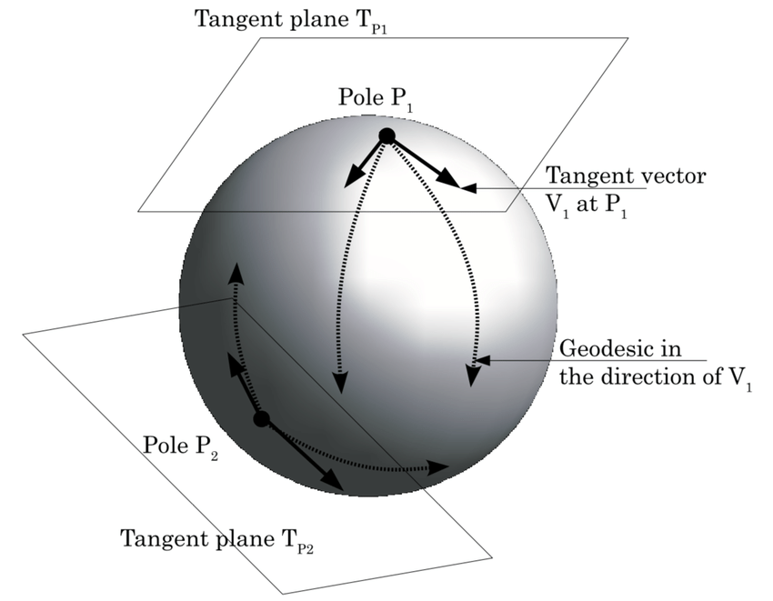

    其中：

    - `切平面 (Tangent Plane)`：图中的 **Tangent plane $T_{P_1}$** 和 **Tangent plane $T_{P_2}$** 是切平面，它们分别位于球面上的两个点 $P_1$ 和 $P_2$。切平面是与球面相切的平面，在这两个点附近，它们是球面局部的平坦近似。
    - `切向量（Tangent Vector）`：在图中，**切向量** $V_1$ 在点 $P_1$ 上指示了该点的局部切向量。切向量是球面上的一个向量，指向切平面上某个方向，并且与球面在点 $P_1$ 处的法向量垂直。

    可以想象：

    - 所有`旋转`组成一个旋转群（$SO(n)$），它是一个`流形`，它的切空间包含了在该点的旋转方向和速度，通常用李代数来描述。

    - `单位矩阵`是切空间中的一个点（就是上图中的一个点）
    - `角速度` $\phi$ 是该点（单位矩阵点）切空间中的一个方向向量。这个向量描述了旋转的速度，它是切空间中的一个元素，并与旋转群的李代数中的元素一一对应。

    我们可以做一个假设：

    - 假设在一段很小的时间内机器人做`匀角速度运动`，也就是说**角速度保持常数**：
      $$
      \phi(t)=\phi_0
      $$

    - 于是微分方程变成：
      $$
      \dot R(t)=\phi_0^\wedge R(t)
      $$

    - 有初始值 $R(0)=I$，解之，得：
      $$
      \boldsymbol{R}(t)=\exp\left(\boldsymbol{\phi}_0^\wedge t\right)
      $$


    - 读者可以验证上式对微分方程和初始值均成立。**这说明在 $t = 0$ 附近，旋转矩阵可以由 $\exp(\phi_0 t)$ 计算出来**。我们看到，旋转矩阵 $\boldsymbol{R}$ 与另一个反对称矩阵 $\phi_0 t$ 通过指数关系发生了联系。但是矩阵的指数是什么呢？这里我们有两个问题需要澄清：
    
      1. 给定某时刻的 $\boldsymbol{R}$，我们就能求得一个 $\phi$，它描述了 $\boldsymbol{R}$ 在局部的导数关系。与 $\boldsymbol{R}$ 对应的 $\phi$ 有什么含义呢？我们说，$\phi$ 正是对应到 $\mathrm{SO}(3)$ 上的李代数 $\mathfrak{so}(3)$；
    
      2. 其次，给定某个向量 $\phi$ 时，矩阵指数 $\exp(\phi^\wedge)$ 如何计算？反之，给定 $\boldsymbol{R}$ 时，能否有相反的运算来计算 $\phi$？事实上，这正是李群与李代数间的`指数/对数映射`。


      下面我们来解决这两个问题。


### 李代数的定义

> <span style="color:red;">每个李群都有与之对应的李代数。</span>李代数描述了李群的局部性质，准确地说，是单位元附近的**正切空间**。

- **李代数的定义**：

  > `李代数`是李群在`单位元`处的“`切空间（tangent space）`”，用来描述李群的局部结构和无穷小变化

  `李代数`由一个`集合` $\mathrm{V}$，一个`数域` $\mathrm{F}$ 和一个`二元运算（也称为 李括号）` $[ , ]$ 组成。

  **（ 李代数 = 一个可以做“`加法` + `数乘` + `特殊乘法（李括号）`”的`向量空间` ）**

  - `集合 V`：集合就是一堆元素放在一起，如所有二维向量表示为$V={(x,y)∣x,y∈R}$。

    在李代数中，`集合 V`就是李代数里的`元素空间`

    **例如**：经典李代数 $\mathfrak{so}(3)$ 里面的 集合 $V$ 是 **所有 3×3 反对称矩阵**

  - `数域 F`：允许你使用的数字类型

    | 数域 | 含义   |
    | ---- | ------ |
    | R    | 实数   |
    | C    | 复数   |
    | Q    | 有理数 |

  - `二元运算 [,]`：`二元`就是两个输入，李代数定义了一个新的`运算`叫**李括号**，写成[X,Y]

- 如果它们满**足以下几条性质**，则称 $(\mathrm{V}, \mathrm{F}, [ , ])$ 为一个李代数，记作 $\mathfrak{g}$。

  1. `封闭性` $\forall X, Y \in \mathrm{V}, [X, Y] \in \mathrm{V}$.
  2. `双线性` $\forall X, Y, Z \in \mathrm{V}, a, b \in \mathrm{F}$，有：$$[X, aY + bZ] = a[X, Y] + b[X, Z], \quad [aX + bY, Z] = a[X, Z] + b[Y, Z].$$

  3. `自反性` $\forall X \in \mathrm{V}, [X, X] = 0.$

  4. `雅可比等价` $\forall X, Y, Z \in \mathrm{V}, [X, [Y, Z]] + [Z, [X, Y]] + [Y, [Z, X]] = 0.$

- 如果用**两个三维向量的叉积**举例：

    - `封闭性`：三维向量的集合就是$\mathbb R^3$，李代数要求$[X,Y]\in V$，我们代入得$X\times Y\in\mathbb R^3$，所以成立！

      （两个三维向量叉乘还是三维向量）
    
    - `双线性`：我们可以假设$X=[x_1,x_2,x_3]$，$Y=[y_1,y_2,y_3]$，$Z=[z_1,z_2,z_3]$。直接代入公式：
    
      - 李代数要求 $[X,aY+bZ]=a[X,Y]+b[X,Z]$
    
        代入得
        $$
        \begin{aligned} X \times (aY + bZ) &= \begin{pmatrix} a(x_2y_3 - x_3y_2) + b(x_2z_3 - x_3z_2) \\[6pt] a(x_3y_1 - x_1y_3) + b(x_3z_1 - x_1z_3) \\[6pt] a(x_1y_2 - x_2y_1) + b(x_1z_2 - x_2z_1) \end{pmatrix} \\[15pt] &= a \begin{pmatrix} x_2y_3 - x_3y_2 \\ x_3y_1 - x_1y_3 \\ x_1y_2 - x_2y_1 \end{pmatrix} + b \begin{pmatrix} x_2z_3 - x_3z_2 \\ x_3z_1 - x_1z_3 \\ x_1z_2 - x_2z_1 \end{pmatrix} \\[15pt] &= a(X \times Y) + b(X \times Z) \end{aligned}
        $$
        证明得：
        $$
        \boxed{
        X\times(aY+bZ)
        =a(X\times Y)+b(X\times Z)
        }
        $$
    
      - 李代数要求 $\quad[aX + bY, Z] = a[X, Z] + b[Y, Z]$
    
        - 代入得
          $$
          \begin{aligned} (aX + bY) \times Z &=  \begin{pmatrix} (ax_2 + by_2)z_3 - (ax_3 + by_3)z_2 \\[6pt] (ax_3 + by_3)z_1 - (ax_1 + by_1)z_3 \\[6pt] (ax_1 + by_1)z_2 - (ax_2 + by_2)z_1 \end{pmatrix} \\[15pt] &= \begin{pmatrix} a(x_2z_3 - x_3z_2) + b(y_2z_3 - y_3z_2) \\[6pt] a(x_3z_1 - x_1z_3) + b(y_3z_1 - y_1z_3) \\[6pt] a(x_1z_2 - x_2z_1) + b(y_1z_2 - y_2z_1) \end{pmatrix} \\[15pt] &= a \begin{pmatrix} x_2z_3 - x_3z_2 \\ x_3z_1 - x_1z_3 \\ x_1z_2 - x_2z_1 \end{pmatrix} + b \begin{pmatrix} y_2z_3 - y_3z_2 \\ y_3z_1 - y_1z_3 \\ y_1z_2 - y_2z_1 \end{pmatrix} \\[15pt] &= a(X \times Z) + b(Y \times Z) \end{aligned}
          $$
    
        - 证明得：
          $$
          \boxed{
          (aX+bY)\times Z =a(X\times Z)+b(Y\times Z)
          }
          $$


  - 后面得性质也可以用`代入法`得方式来计算

    

### 李代数 $\mathfrak{so}(3)$

之前提到的$\phi$，事实上是一种李代数。SO(3)对应的李代数是定义在$\mathbb{R}^3$上的`向量`，我们记作$\phi$。根据前面的推导，每个$\phi$都可以生成一个反对称矩阵：
$$
\boldsymbol{\Phi} = \phi^\wedge = \begin{bmatrix}
0 & -\phi_3 & \phi_2 \\
\phi_3 & 0 & -\phi_1 \\
-\phi_2 & \phi_1 & 0
\end{bmatrix} \in \mathbb{R}^{3\times 3}.
$$
在此定义下，两个向量$\phi_1, \phi_2$的李括号为
$$
[\phi_1, \phi_2] = (\boldsymbol{\Phi}_1 \boldsymbol{\Phi}_2 - \boldsymbol{\Phi}_2 \boldsymbol{\Phi}_1)^\vee.
$$
读者可以验证该定义下的李括号满足上面的几条性质。由于向量$\phi$与反对称矩阵是一一对应的，在不引起歧义的情况下，就说 **$\mathfrak{so}(3)$的元素是`三维向量`或者`三维反对称矩阵`**，不加区别：
$$
\mathfrak{so}(3) = \left\{ \phi \in \mathbb{R}^3, \boldsymbol{\Phi} = \phi^\wedge \in \mathbb{R}^{3\times 3} \right\}
$$


### 李代数 $\mathfrak{se}(3)$

对于SE(3)，它也有对应的李代数$\mathfrak{se}(3)$。为节省篇幅，这里就不介绍如何引出$\mathfrak{se}(3)$了。与$\mathfrak{so}(3)$相似，$\mathfrak{se}(3)$位于$\mathbb{R}^6$空间（表示6维向量空间）中：
$$
\mathfrak{se}(3)=\left\{\boldsymbol{\xi}=\left[\begin{array}{c}
\boldsymbol{\rho} \\
\boldsymbol{\phi}
\end{array}\right] \in \mathbb{R}^{6}, \boldsymbol{\rho} \in \mathbb{R}^{3}, \boldsymbol{\phi} \in \mathfrak{so}(3), \boldsymbol{\xi}^{\wedge}=\left[\begin{array}{cc}
\boldsymbol{\phi}^{\wedge} & \boldsymbol{\rho} \\
\boldsymbol{0}^{\mathrm{T}} & 0
\end{array}\right] \in \mathbb{R}^{4 \times 4}\right\}
$$

- 我们把每个$\mathfrak{se}(3)$元素记作$\boldsymbol{\xi}$，它是一个`六维向量`。

  - 前三维为`平移`**（但含义与变换矩阵中的平移不同，分析见后）**，记作$\boldsymbol{\rho}$；
  - 后三维为`旋转`，记作$\boldsymbol{\phi}$，实质上是$\mathfrak{so}(3)$元素。

- 同时，**我们拓展了$^\wedge$符号的含义**。在$\mathfrak{se}(3)$中，同样使用$^\wedge$符号，将一个六维向量转换成四维矩阵，<span style="color:red;">但这里不再表示反对称</span>：
  $$
  \boldsymbol{\xi}^{\wedge}=\left[\begin{array}{cc}
  \boldsymbol{\phi}^{\wedge} & \boldsymbol{\rho} \\
  \boldsymbol{0}^{\mathrm{T}} & 0
  \end{array}\right] \in \mathbb{R}^{4 \times 4}.
  $$
  我们仍使用$^\wedge$和$^\vee$符号来指代“`从向量到矩阵`”和“`从矩阵到向量`”的关系，以保持和$\mathfrak{so}(3)$上的一致性。它们依旧是一一对应的。

  读者可以简单地把$\mathfrak{se}(3)$理解成“**由一个平移加上一个$\mathfrak{so}(3)$元素构成的向量**”（尽管这里的$\boldsymbol{\rho}$还不直接是平移）。

- 李代数$\mathfrak{se}(3)$亦有类似于$\mathfrak{so}(3)$的`李括号`：

$$
[\boldsymbol{\xi}_1, \boldsymbol{\xi}_2]=(\boldsymbol{\xi}_1^{\wedge}\boldsymbol{\xi}_2^{\wedge}-\boldsymbol{\xi}_2^{\wedge}\boldsymbol{\xi}_1^{\wedge})^{\vee}.
$$


## 指数与对数映射

### $SO(3)$上的指数映射

> [!NOTE]
>
> `exp()`：其实就是 **指数函数**。
>
> - **标量指数函数**：$e^x=1+x+\frac{x^2}{2!}+\frac{x^3}{3!}+\cdots$
> - **矩阵指数函数**：就是把 $x$ 换成矩阵，$\exp(A)=I+A+\frac{A^2}{2!}+\frac{A^3}{3!}+\cdots$

**现在来考虑第二个问题：如何计算$\exp(\phi^\wedge)?$**

- 显然它是一个矩阵的指数，在李群和李代数中，称为`指数映射(Exponential Map)`。
  任意矩阵的指数映射可以写成一个`泰勒展开`，但是只有**在`收敛`的情况下才会有结果**，其结果仍是一个矩阵：
  $$
  \exp(A)=\sum_{n=0}^\infty\frac1{n!}A^n.
  $$
  同样地，对 so(3) 中任意元素$\phi$,我们亦可按此方式定义它的指数映射：

  $$
  \exp(\phi^\wedge)=\sum_{n=0}^\infty\frac{1}{n!}(\phi^\wedge)^n.
  $$

- 推导$\exp(\phi^\wedge)=\sum_{n=0}^\infty\frac{1}{n!}(\phi^\wedge)^n.$的计算式子：

  如果是直接根据式子$\exp(\phi^\wedge)=\sum_{n=0}^\infty\frac{1}{n!}(\phi^\wedge)^n.$来计算的话，我们没法直接计算。因为我们难以计算矩阵的无穷次幂。

  下面我们要推导出一种计算指数映射的简便方法。

  - 由于 **ϕ** 是`三维向量`，我们可以定义它的`模长`和它的`方向`，分别记作 *θ* 和 **a**，于是有$ϕ=θa$

    其中，**$a$是一个长度为 1 的`方向向量`**，即$\|a\|=1$。对于`反对称矩阵`$a^\wedge$,有以下两条性质：
    $$
    \boldsymbol{a}^{\wedge}\boldsymbol{a}^{\wedge}=\begin{bmatrix}&-a_2^2-a_3^2&a_1a_2&a_1a_3\\&a_1a_2&-a_1^2-a_3^2&a_2a_3\\&a_1a_3&a_2a_3&-a_1^2-a_2^2\end{bmatrix}=\boldsymbol{a}\boldsymbol{a}^\mathrm{T}-\boldsymbol{I}
    $$
    

    以及

    $$
    a^\wedge a^\wedge a^\wedge=a^\wedge(aa^\mathrm{T}-I)=-a^\wedge.
    $$

  - 这两个式子提供了处理 $\boldsymbol{a}^{\wedge}$ 高阶项的方法。我们可以把指数映射写成
    $$
    \begin{aligned}\exp\left(\phi^{\wedge}\right)&=\exp\left(\theta\boldsymbol{a}^{\wedge}\right)=\sum_{n=0}\frac{1}{n!}\left(\theta\boldsymbol{a}^{\wedge}\right)^{n}\\&=I+\theta a^{\wedge}+\frac{1}{2!}\theta^{2}a^{\wedge}a^{\wedge}+\frac{1}{3!}\theta^{3}a^{\wedge}a^{\wedge}a^{\wedge}+\frac{1}{4!}\theta^{4}(a^{\wedge})^{4}+...\\&=\boldsymbol{a}\boldsymbol{a}^{\mathrm{T}}-\boldsymbol{a}^{\wedge}\boldsymbol{a}^{\wedge}+\theta\boldsymbol{a}^{\wedge}+\frac{1}{2!}\theta^{2}\boldsymbol{a}^{\wedge}\boldsymbol{a}^{\wedge}-\frac{1}{3!}\theta^{3}\boldsymbol{a}^{\wedge}-\frac{1}{4!}\theta^{4}\left(\boldsymbol{a}^{\wedge}\right)^{2}+...\\&=\boldsymbol{aa}^{\mathrm{T}}+\underbrace{\left(\theta-\frac{1}{3!}\theta^{3}+\frac{1}{5!}\theta^{5}-...\right)}_{\sin\theta}\boldsymbol{a}^{\wedge}-\underbrace{\left(1-\frac{1}{2!}\theta^{2}+\frac{1}{4!}\theta^{4}-...\right)}_{\cos\theta}\boldsymbol{a}^{\wedge}\boldsymbol{a}^{\wedge}\\&=a^\wedge a^\wedge+I+\sin\theta a^\wedge-\cos\theta a^\wedge a^\wedge\\&=(1-\cos\theta)\boldsymbol{a}^\wedge a^\wedge+I+\sin\theta\boldsymbol{a}^\wedge\\&=\cos\theta\boldsymbol{I}+(1-\cos\theta)\boldsymbol{aa}^\mathrm{T}+\sin\theta\boldsymbol{a}^\mathrm{\wedge}.\end{aligned}
    $$

  - 最后我们得到之前用过的`罗德里格斯公式`：
    $$
    \exp(\theta\boldsymbol{a}^\wedge)=\cos\theta\boldsymbol{I}+(1-\cos\theta)\boldsymbol{a}\boldsymbol{a}^\mathrm{T}+\sin\theta\boldsymbol{a}^\wedge.
    $$
    我们知道：
    
    - 李代数：旋转向量 $\theta a$
    - 李群：旋转矩阵 $R$
    
    这表明：
    
    - $\mathfrak{so}(3)$ 实际上就是由所谓的 **旋转向量$\theta a$** 组成的空问，而指数映射即**罗德里格斯公式**。
    
    - 通过`指数映射`，我们把 $\mathfrak{so}(3)$ 中任意一个**向量**对应到了一个位于 $\mathrm{SO}(3)$ 中的**旋转矩阵**。
    
    - 反之，如果定义`对数映射`，也能把 $\mathrm{SO}(3)$ 中的元素对应到 $\mathfrak{so}(3)$ 中：
      $$
      \phi = \ln(R)^{\vee} = \left(\sum_{n=0}^{\infty} \frac{(-1)^n}{n+1}(R - I)^{n+1}\right)^{\vee}.
      $$

- `指数映射`的**性质**如何？

  - 指数映射只是一个`满射`，并不是`单射`，也就是说：

    - 每个 $\mathrm{SO}(3)$ 中的元素，都可以找到一个 $\mathfrak{so}(3)$ 元素与之对应
    - 但是可能存在多个 $\mathfrak{so}(3)$ 中的元素，对应到同一个 $\mathrm{SO}(3)$。

    这是因为至少对于旋转角 $\theta$，我们知道多转 $360^\circ$ 和没有转是一样的——它具有`周期性`。

    但是，如果我们把旋转角度固定在 $\pm \pi$ 之间，那么李群和李代数元素是一一对应的。


### $SE(3)$上的指数映射

下面介绍 $\mathfrak{se}(3)$ 上的指数映射。为了节省篇幅，我们不再像 $\mathfrak{so}(3)$ 那样详细推导指数映射。

因为李代数$\mathfrak{se}(3)$的元素为：
$$
\xi=
\begin{bmatrix}
\rho\\
\phi
\end{bmatrix}
$$
其对应的矩阵形式是：

- $\phi^\wedge \in \mathfrak{so}(3)$（角速度）

- $\rho$ 是平移部分

$$
\xi^\wedge=
\begin{bmatrix}
\phi^\wedge & \rho\\
0^T & 0
\end{bmatrix}
$$

所以 $\mathfrak{se}(3)$ 上的指数映射形式如下：
$$
\exp(\xi^\wedge) = \begin{bmatrix} \sum_{n=0}^{\infty} \frac{1}{n!} (\phi^\wedge)^n & \sum_{n=0}^{\infty} \frac{1}{(n+1)!} (\phi^\wedge)^n \rho \\ \mathbf{0}^T & 1 \end{bmatrix}
\\
\triangleq \begin{bmatrix} R & J\rho \\ \mathbf{0}^T & 1 \end{bmatrix} = T.
$$

- 推导$J$：

  令$ϕ = θa$，其中$a$为单位向量。对exp进行泰勒展开：
  $$
  \begin{aligned}\sum_{n=0}^{\infty}\frac{1}{(n+1)!}(\phi^{\wedge})^{n}&=\boldsymbol{I}+\frac{1}{2!}\theta\boldsymbol{a}^{\wedge}+\frac{1}{3!}\theta^{2}{(\boldsymbol{a}^{\wedge})}^{2}+\frac{1}{4!}\theta^{3}{(\boldsymbol{a}^{\wedge})}^{3}+\frac{1}{5!}\theta^{4}{(\boldsymbol{a}^{\wedge})}^{4}\cdots\\&=\frac{1}{\theta}\left(\frac{1}{2!}\theta^{2}-\frac{1}{4!}\theta^{4}+\cdots\right)(\boldsymbol{a}^{\wedge})+\frac{1}{\theta}\left(\frac{1}{3!}\theta^{3}-\frac{1}{5}\theta^{5}+\cdots\right)\left(\boldsymbol{a}^{\wedge}\right)^{2}+\boldsymbol{I}\\&=\frac{1}{\theta}\left(1-\cos\theta\right)\left(\boldsymbol{a}^{\wedge}\right)+\frac{\theta-\sin\theta}{\theta}\left(\boldsymbol{a}\boldsymbol{a}^{T}-\boldsymbol{I}\right)+\boldsymbol{I}\\&=\frac{\sin\theta}{\theta}\boldsymbol{I}+\left(1-\frac{\sin\theta}{\theta}\right)\boldsymbol{a}\boldsymbol{a}^T+\frac{1-\cos\theta}{\theta}\boldsymbol{a}^\wedge\triangleq J.\end{aligned}
  $$
  从结果上看，$\xi$的指数映射左上角的 $R$ 是我们熟知的 SO(3)中的元素，与 se(3)当中的旋转部分$\phi$对应。而右上角的$J$由上面的推导给出：

$$
\boldsymbol{J}=\frac{\sin\theta}\theta\boldsymbol{I}+\left(1-\frac{\sin\theta}\theta\right)\boldsymbol{a}\boldsymbol{a}^\mathrm{T}+\frac{1-\cos\theta}\theta\boldsymbol{a}^\mathrm{\wedge}.
$$

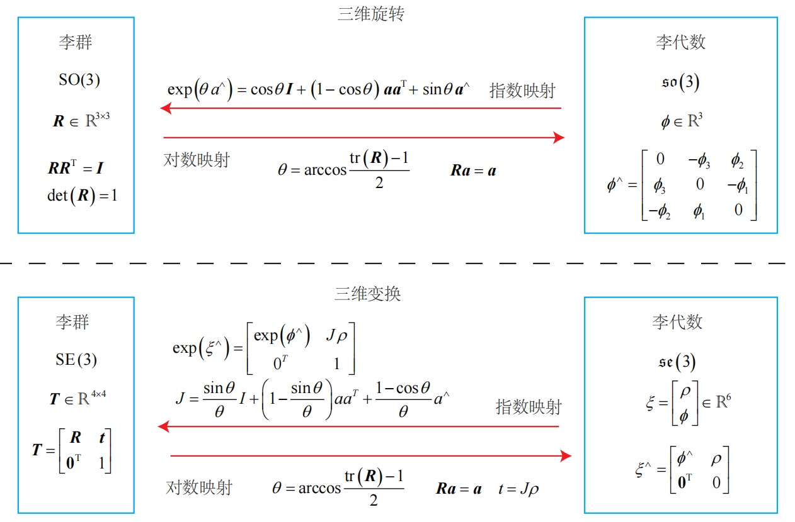


## 李代数求导与扰动模型

### BCH 公式与近似形式

> 使用`李代数`的一大动机是进行`优化`，而在优化过程中`导数`是非常必要的信息(我们会在第 6 讲详细介绍 )。

> `导数`的定义：
>
> 设函数 $f(x)$，在点 $x_0$ 处的导数定义为：
> $$
> f^{\prime}(x_0)=\lim_{h\to0}\frac{f(x_0+h)-f(x_0)}{h}
> $$

- 根据导数的定义，我们知道对`李群`求导数必须要使用加法。而在上面我们说到

  - 在`李群`中，加法是没有定义的

  - 但是在`李代数`中，加法是有定义的

  - 🤓也就是说我们可以把`李群`转换为`李代数`，然后在`李代数`求导，然后再把求导的结果转换为`李群`
  
- 🤔下面来考虑一个问题：<span style="color:red">李代数在做运算时，与李群的对应关系是怎么样的？</span>

  虽然我们已经清楚了 SO(3)和 SE(3)上的李群与李代数关系，

  但是，当在 SO(3) 中完成`两个矩阵乘法`时，李代数中 so(3)上发生了什么改变呢？

  反过来说，当 so(3) 上做两个李代数的加法时，SO(3)上是否对应着两个矩阵的乘积？如果成立，相当于：
  $$
  \exp\left(\phi_1^\wedge\right)\exp\left(\phi_2^\wedge\right)=\exp\left(\left(\phi_1+\phi_2\right)^\wedge\right)?
  $$
  很显然，当$\phi_1,\phi_2$​为标量时，该式子成立。但此处我们计算的是`矩阵`的**指数函数**，而非标量的指数。换言之，我们在研究下式是否成立：
  $$
  \ln\left(\exp\left(A\right)\exp\left(B\right)\right)=A+B ?
  $$
  ❌并不成立！这是因为`标量`是`对易`的（即$ab=ba$），但是`矩阵`是`不对易`的（即$AB \ne BA$）

  两个李代数指数映射乘积的完整形式，由 `Baker-Campbell Hausdorff 公式（BCH 公式）`给出。

- `BCH公式`

  由于其完整形式较复杂，我们只给出其展开式的前几项：
  $$
  \ln\left(\exp\left(A\right)\exp\left(B\right)\right)=A+B+\frac{1}{2}\left[A,B\right]+\frac{1}{12}\left[A,\left[A,B\right]\right]-\frac{1}{12}\left[B,\left[A,B\right]\right]+\cdots
  $$
  其中`[]`代表李括号。

  BCH公式告诉我们，当处理两个矩阵指数之积时，它们会产生一些由李括号组成的余项。

  特别地，考虑 SO(3)上的李代数$\ln\left(\exp\left(\phi_1^{\wedge}\right)\exp\left(\phi_2^{\wedge}\right)\right)^{\vee}$，当$\phi_1$或$\phi_2$为`小量（即非常小的量，它接近于零，但不是完全为零）`时，小量二次以上的项都可以被忽略掉。此时，BCH 拥有`线性近似`表达：
  $$
  \ln\left(\exp\left(\phi_1^\wedge\right)\exp\left(\phi_2^\wedge\right)\right)^\vee\approx\left\{\begin{array}{ll}J_l(\phi_2)^{-1}\phi_1+\phi_2&\text{当}\phi_1\text{为小量，}\\J_r(\phi_1)^{-1}\phi_2+\phi_1&\text{当}\phi_2\text{为小量}.\end{array}\right.
  $$
  - 其中：

    - 左乘雅可比：
      $$
      J_{l}=J=\frac{\sin\theta}{\theta}I+\left(1-\frac{\sin\theta}{\theta}\right)aa^{T}+\frac{1-\cos\theta}{\theta}a^{\wedge}. \\
      J_l^{-1}=\frac{\theta}{2}\cot\frac{\theta}{2}I+\left(1-\frac{\theta}{2}\cot\frac{\theta}{2}\right)aa^T-\frac{\theta}{2}a^\wedge.
      $$

    - 右乘雅可比：
      $$
      J_r(\phi)=J_l(-\phi).
      $$

  - 解释：

    - 当 **$\phi_1$ 很小** 时，本质是在做：在 $\exp(\phi_2^\wedge)$ 附近，加一个“微小扰动”

      当 **$\phi_2$ 很小** 时，本质是在做：在 $\exp(\phi_1^\wedge)$ 附近，加一个“微小扰动”

    - $J_l(\phi_2)^{-1}$ 和 $J_r(\phi_1)^{-1}$ 分别是根据 $\phi_2$ 和 $\phi_1$ 定义的旋转矩阵。它们是 **扰动矩阵**，描述了小量旋转对整体旋转的影响。在这种近似中，旋转的影响是 **线性的**，而不是完全的非线性。

    - 当 $\phi_1$ 或 $\phi_2$ 足够小的时候（例如角度很小的旋转），旋转群 $SO(3)$ 的行为接近`线性`。因为旋转矩阵 $\exp(\phi^\wedge)$ 在小量 $\phi$ 下可以用 **一阶泰勒展开** 来近似。因此，我们可以忽略掉二次以上的高阶项，得到上面的线性近似。

  - 第一个近似为例：

    当 $\phi_1$ 很小时（接近零），则旋转的影响主要由 $\phi_2$ 来主导。

    该式告诉我们，当对一个旋转矩阵 $R_2$（李代数为 $\phi_2$）左乘一个微小旋转矩阵 $R_1$（李代数为 $\phi_1$）时，可以近似地看作，在原有的李代数 $\phi_2$ 上加上了一项 $J_l(\phi_2)^{-1}\phi_1$。

  - 第二个近似：

    当 $\phi_2$ 很小时（接近零），旋转的影响主要由 $\phi_1$ 来主导。

    描述了右乘一个微小位移的情况。

  于是，李代数在 BCH 近似下，分成了左乘近似和右乘近似两种，在使用时我们须注意使用的`左乘模型`还是`右乘模型`。
  本书以左乘为例。左乘 BCH 近似雅可比 $J_l$ 事实上就是式的内容：
  $$
  J_l = J = \frac{\sin\theta}{\theta}I + \left(1 - \frac{\sin\theta}{\theta}\right)aa^\mathrm{T} + \frac{1 - \cos\theta}{\theta}a^\wedge.
  $$
  它的逆为：
  $$
  - J_l^{-1} = \frac{\theta}{2}\cot\frac{\theta}{2}I + \left(1 - \frac{\theta}{2}\cot\frac{\theta}{2}\right)aa^\mathrm{T} - \frac{\theta}{2}a^\wedge.
  $$


### SO(3) 李代数上的求导

🤔问题：我们讨论一个**带有李代数的函数**，如何关于该**李代数求导**的问题。

- 在 SLAM 中，我们要估计一个相机的位置和姿态，该位姿是由 SO(3)上的`旋转矩阵`或 SE(3) 上的`变换矩阵`描述的。不妨设某个时刻机器人的位姿为$T$。它观察到了一个世界坐标位于$p$ 的点，产生了一个观测数据$z$。那么，由坐标变换关系知：
  $$
  z=Tp+w
  $$
  其中：

  - 变换矩阵$T$：相机的 **位姿**，表示相机在世界坐标系中的旋转和位移。也就是说，**T** 是一个 **SE(3)** 变换矩阵，描述了相机从世界坐标系到相机坐标系的变换（world -> camera）。
  - 世界坐标$p$：这是一个点的 **世界坐标（三维向量）**，它表示了**某个物体（这是一个被相机观测到的物体）**在**世界坐标系**中的位置。
  - 观测数据$z$：相机观测到的 该点在相机坐标系下的位置。
  - 观测噪声$w$：在测量过程中引入的误差。它可以是测量误差、传感器噪声等。

  对于这个公式，我们实际要求的是`相机在世界坐标系下的位姿`$T$，也就是说我们要根据观测点来计算相机在世界观测系下最接近真实位姿的预测点

- 其中 **w** 为随机噪声。由于它的存在，**z** 往往不可能精确地满足 **z** = **T p** 的关系。所以，我们通常会计算理想的观测与实际数据的误差：
  $$
  e=z-Tp
  $$

- 假设一共有$N$个这样的路标点和观测，于是就有$N$个与上面一样的式子$e=z-Tp$。
  
  那么，对小萝卜的位姿估计，相当于是寻找一个最优的$T$，使得`整体误差`$e$最小化：
  $$
  \min_{\boldsymbol{T}}J(\boldsymbol{T})=\sum_{i=1}^N\left\|\boldsymbol{z}_i-\boldsymbol{T}\boldsymbol{p}_i\right\|_2^2.
  $$
  其中：

  - $\boldsymbol{T}$：这是你`要估计的相机位姿`，它通常表示为一个变换矩阵，属于 $SE(3)$。这个矩阵描述了相机在世界坐标系中的位置（平移）和方向（旋转）。

  - $J(\boldsymbol{T})$：这是`代价函数`，目标是**最小化**它。代表了`观测噪声`。我们希望通过优化得到一个最小的 $J(\boldsymbol{T})$，从而找到最优的相机位姿。

  - $\left\| z_i - T p_i \right\|_2^2$：这是`每个观测误差的平方欧氏范数`。具体地：

    - $z_i$ 是第 $i$ 次观测的结果，通常是**传感器观测到的点在相机坐标系中的位置**，可能有测量误差。

    - $p_i$ 是第 $i$ 次观测的**世界坐标系中的点位置**。

    - $T p_i$ 是将世界坐标系中的点 $p_i$ 通过当前估计的位姿 $T$ 变换到相机坐标系中的结果。

    - $\left\| z_i - T p_i \right\|_2^2$ 计算了这个变换后的点与实际观测数据之间的误差的平方。
  
  - 求和符号 $\sum_{i=1}^N$：表示对所有观测点 $i$ 从 1 到 $N$ 的误差进行求和，即对每个观测值的误差进行累加。最终的代价函数是所有这些误差的总和。

🤔求解此问题，需要计算目标函数 *J* 关于变换矩阵 **T** 的导数。我们把具体的算法留到后面再讲。

这里的重点是，<span style="color:red">我们经常会构建与位姿有关的函数，然后讨论该误差函数关于位姿的<b>导数</b>（得到的是 误差随位姿变化的速度【误差变化率】，我们将导数=0，通过利用导数计算更新量，我们可以逐步调整当前位姿，使误差逐步减小，最终逼近最优位姿），以调整当前的估计值</span>。

- 然而，SO(3)*,* SE(3) 上并没有良好定义的加法，它们只是`群`。
- 如果我们把 **T** 当成一个`普通矩阵`来处理优化，那就必须对它加以约束。
- 而从`李代数`角度来说，由于**李代数由向量组成**，具有良好的加法运算。

> [!IMPORTANT]
>
> 因此，使用李代数解决求导问题的思路分为两种：
>
> 1. 用`李代数`表示姿态，然后根据李代数加法来对李代数求导。
> 2. 对`李群`左乘或右乘微小扰动，然后对该扰动求导，称为左扰动和右扰动模型。
>
> 第一种方式对应到李代数的`求导模型`，而第二种则对应到`扰动模型`。下面来讨论这两种思路的异同。


#### 思路1：李代数求导

> `导数的定义`
> $$
> f'(x_0) = \lim_{\Delta x \to 0} \frac{\Delta y}{\Delta x} = \lim_{\Delta x \to 0} \frac{f(x_0 + \Delta x) - f(x_0)}{\Delta x}
> $$

假设我们对一个空间点 **p** 进行了旋转，得到了 旋转后的点**Rp**。现在，要计**算`旋转之后点的坐标`相对于`旋转`的导数（表达的含义是当 旋转R 发生了一个很小的变化时，Rp会怎么变？）**，我们不严谨地记为：
$$
\frac{\partial\left(\boldsymbol{R}\boldsymbol{p}\right)}{\partial\boldsymbol{R}}.
$$
**由于 SO(3) 没有加法**，所以该导数无法按照导数的定义进行计算。设 **R** 对应的李代数为 **ϕ**，我们转而计算
$$
\frac{\partial\left(\exp\left(\phi^{\wedge}\right)\boldsymbol{p}\right)}{\partial\phi}.
$$
按照导数的定义，有：
$$
\begin{aligned}\frac{\partial\left(\exp\left(\boldsymbol{\phi}^{\wedge}\right)\boldsymbol{p}\right)}{\partial\phi}
&=\lim_{\delta\phi\to0}\frac{\exp\left(\left(\phi+\delta\phi\right)^{\wedge}\right)p-\exp\left(\phi^{\wedge}\right)p}{\delta\phi}\\
&BCH线性近似：\exp\left(\left(\phi+\Delta\phi\right)^{\wedge}\right)=\exp\left(\left(J_{l}\Delta\phi\right)^{\wedge}\right)\exp\left(\phi^{\wedge}\right)=\exp\left(\phi^{\wedge}\right)\exp\left(\left(J_{r}\Delta\phi\right)^{\wedge}\right). \\
&=\lim_{\delta\phi\to0}\frac{\exp\left(\left(\boldsymbol{J}_l\delta\phi\right)^{\wedge}\right)\exp\left(\phi^{\wedge}\right)p-\exp\left(\phi^{\wedge}\right)p}{\delta\phi}\\
&泰勒展开舍去高阶项后的近似（但由于取了极限，可以写等号）。注意这里泰勒展开是e^x的公式\\
&=\lim_{\delta\phi\to0}\frac{\left(\boldsymbol{I}+\left(\boldsymbol{J}_l\delta\boldsymbol{\phi}\right)^{\wedge}\right)\exp\left(\boldsymbol{\phi}^{\wedge}\right)\boldsymbol{p}-\exp\left(\boldsymbol{\phi}^{\wedge}\right)\boldsymbol{p}}{\delta\phi}\\
&将反对称符号看作叉积，交换之后变号。即A\times B=-B\times A\\
&=\lim_{\delta\phi\to0}\frac{\left(\boldsymbol{J}_l\delta\phi\right)^{\wedge}\exp\left(\phi^{\wedge}\right)\boldsymbol{p}}{\delta\phi}\\
&=\lim_{\delta\boldsymbol{\phi}\to\mathbf{0}}\frac{-(\exp\left(\boldsymbol{\phi}^{\wedge}\right)\boldsymbol{p})^{\wedge}\boldsymbol{J}_{l}\delta\phi}{\delta\boldsymbol{\phi}} \\
&分子分母同时约掉\delta\boldsymbol{\phi}，然后李代数\exp\left(\boldsymbol{\phi}^{\wedge}\right)变回李群R \\
&=-(\boldsymbol{R}\boldsymbol{p})^{\wedge}\boldsymbol{J}_{l}.\end{aligned}
$$


#### 思路2：扰动模型（更为简单实用）

> 扰动模型分为`左扰动模型（左乘）`和`右扰动模型（右乘）`。这里展示的是`左扰动模型`

另一种求导方式是对$R$进行一次扰动$\Delta R$，看结果相对于扰动的变化率。这个扰动可以乘在左边也可以乘在右边，最后结果会有一点儿微小的差异，我们以左扰动为例。

所谓`左扰动模型`，就是**在群元素 $R = \exp(\phi^\wedge)$ 上施加一个微小扰动（无穷小旋转）**，定义步骤是：

- 左扰动定义为：
  $$
  R(\varphi) = \exp(\varphi^\wedge)\, R
  $$
  这里：

  - $\varphi \in \mathbb{R}^3$ 是**无穷小扰动**
  - 是“左乘”，所以叫**左扰动**

- 然后我们要求的$\frac{\partial\left(\boldsymbol{Rp}\right)}{\partial\varphi}$​就变为
  $$
  \frac{\partial (Rp)}{\partial \phi}
  =
  \lim_{\varphi \to 0}
  \frac{ \exp(\varphi^\wedge) R p - R p}{\varphi}
  $$

设左扰动$\Delta R$对应的李代数为$\varphi$。然后，对$\varphi$求导，即：
$$
\begin{aligned}\frac{\partial\left(\boldsymbol{Rp}\right)}{\partial\varphi}
&=\lim_{\varphi\to0}\frac{\exp\left(\varphi^{\wedge}\right)\exp\left(\phi^{\wedge}\right)p-\exp\left(\phi^{\wedge}\right)p}{\varphi}\\
&泰勒展开舍去高阶项后的近似（但由于取了极限，可以写等号）。\\
&=\lim_{\varphi\to0}\frac{\left(\boldsymbol{I}+\boldsymbol{\varphi}^{\wedge}\right)\exp\left(\boldsymbol{\phi}^{\wedge}\right)\boldsymbol{p}-\exp\left(\boldsymbol{\phi}^{\wedge}\right)\boldsymbol{p}}{\varphi}\\
&消除相等的项，然后李代数\exp\left(\boldsymbol{\phi}^{\wedge}\right)变回李群R \\
&=\lim_{\varphi\to0}\frac{\varphi^\wedge Rp}{\varphi}\\
&将反对称符号看作叉积，交换之后变号。即A\times B=-B\times A\\
&=\lim_{\varphi\to0}\frac{-(Rp)^\wedge\varphi}{\varphi}
=-(Rp)^\wedge.\end{aligned}
$$

<div style="text-align: center; color: red; font-weight: bold;">（与导数模型相比，扰动模型得到的结果省去了一个雅可比的计算，更为简单实用）</div>


### SE(3) 李代数上的求导

> 因为我们知道`扰动模型`更好，所以这里直接用扰动模型来计算

假设某空间点$p$ 经过一次变换$T$（对应李代数为$\xi$），得到$Tp$。现在，给$T$左乘一个扰动$\Delta T=\exp\left(\delta\xi^{\wedge}\right)$，我们设扰动项的李代数为$\delta\boldsymbol{\xi}=[\delta\boldsymbol{\rho},\delta\phi]^\mathrm{T}$，那么：
$$
\[
\begin{aligned}
\frac{\partial (T p)}{\partial \delta \boldsymbol{\xi}}
&=
\lim_{\delta \boldsymbol{\xi} \to 0}
\frac{
\exp(\delta \boldsymbol{\xi}^\wedge)\exp(\boldsymbol{\xi}^\wedge)p
-
\exp(\boldsymbol{\xi}^\wedge)p
}{\delta \boldsymbol{\xi}} \\[6pt]

&=
\lim_{\delta \boldsymbol{\xi} \to 0}
\frac{
\left(I + \delta \boldsymbol{\xi}^\wedge\right)\exp(\boldsymbol{\xi}^\wedge)p
-
\exp(\boldsymbol{\xi}^\wedge)p
}{\delta \boldsymbol{\xi}} \\[6pt]

&=
\lim_{\delta \boldsymbol{\xi} \to 0}
\frac{
\delta \boldsymbol{\xi}^\wedge \exp(\boldsymbol{\xi}^\wedge)p
}{\delta \boldsymbol{\xi}} \\[10pt]

&=
\lim_{\delta \boldsymbol{\xi} \to 0}
\frac{
\begin{bmatrix}
\delta \boldsymbol{\phi}^\wedge & \delta \boldsymbol{\rho} \\
\mathbf{0}^T & 0
\end{bmatrix}
\begin{bmatrix}
R p + t \\
1
\end{bmatrix}
}{\delta \boldsymbol{\xi}} \\[10pt]

&=
\lim_{\delta \boldsymbol{\xi} \to 0}
\frac{
\begin{bmatrix}
\delta \boldsymbol{\phi}^\wedge (R p + t) + \delta \boldsymbol{\rho} \\
\mathbf{0}^T
\end{bmatrix}
}{[\delta \boldsymbol{\rho}, \delta \boldsymbol{\phi}]^T} \\[10pt]

&=
\begin{bmatrix}
I & -(R p + t)^\wedge \\
\mathbf{0}^T & \mathbf{0}^T
\end{bmatrix}
\;\triangleq\;
(Tp)^\odot
\end{aligned}
\]
$$

> 定义算符$\odot$：
>
> 把一个齐次坐标的空间点变换成一个 4 *×* 6 的矩阵。此式稍微需要解释的是矩阵求导方面的顺序，假设 **a**, **b**, **x**, **y** 都是列向量，那么在我们的符号写法下，
>
> 有如下的规则：
> $$
> \begin{aligned}&\frac{\mathrm{d}\begin{bmatrix}a\\\\b\end{bmatrix}}{\mathrm{d}\begin{bmatrix}x\\\\y\end{bmatrix}}=\left(\frac{\mathrm{d}[\boldsymbol{a},\boldsymbol{b}]^\mathrm{T}}{\mathrm{d}\begin{bmatrix}x\\\\y\end{bmatrix}}\right)^\mathrm{T}=\begin{bmatrix}\frac{\mathrm{d}\boldsymbol{a}}{\mathrm{d}\boldsymbol{x}}&\frac{\mathrm{d}\boldsymbol{b}}{\mathrm{d}\boldsymbol{x}}\\\\\frac{\mathrm{d}\boldsymbol{a}}{\mathrm{d}\boldsymbol{y}}&\frac{\mathrm{d}\boldsymbol{b}}{\mathrm{d}\boldsymbol{y}}\end{bmatrix}^\mathrm{T}=\begin{bmatrix}\frac{\mathrm{d}\boldsymbol{a}}{\mathrm{d}\boldsymbol{x}}&\frac{\mathrm{d}\boldsymbol{a}}{\mathrm{d}\boldsymbol{y}}\\\frac{\mathrm{d}\boldsymbol{b}}{\mathrm{d}\boldsymbol{x}}&\frac{\mathrm{d}\boldsymbol{b}}{\mathrm{d}\boldsymbol{y}}\end{bmatrix}\end{aligned}
> $$


# 相机与图像

在前面两讲中，我们介绍了“机器人如何表示自身位姿”的问题，部分地解释了 SLAM 经典模型中变量的含义和`运动方程`部分。

本讲将讨论“机器人如何观测外部世界”，也就是`观测方程`部分。在以相机为主的视觉 SLAM 中，观测主要是指**相机成像**的过程。

## 相机模型

- `相机模型`：相机将**三维世界中的坐标点**（单位为米）映射到**二维图像平面**（单位为像素）的过程
- `针孔模型`：针孔模型是很常用而且有效的模型，它描述了一束光线通过针孔之后，在针孔背面投影成像的关系。
- `畸变`：由于相机镜头上的透镜的存在，使得光线投影到成像平面的过程中会产生畸变

- `相机内参`：针孔模型与畸变能够把外部的三维点投影到相机内部成像平面，构成`相机的内参数`

### 针孔相机模型

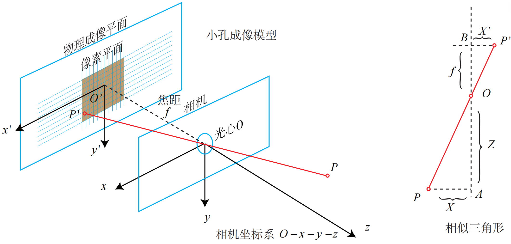

- **点与像的空间关系**

  设$P$的坐标为$[X,Y,Z]^{\mathrm{T}},|P^\prime$为$[X^\prime,Y^\prime,Z^\prime]^{\mathrm{T}}$,并且设物理成像平面到小孔的距离为$f$(焦距)。那么，根据三角形相似关系，有：
  $$
  \frac{Z}{f}=-\frac{X}{X^{\prime}}=-\frac{Y}{Y^{\prime}}. \\
  负号表示成的像是倒立的。小孔成像得到的就是倒立的图像
  $$
  但是实际上，我们使用手机拍摄照片时得到的图像是正像（这是因为计算机软件会帮我们把倒像变为正像），那么这个时候为了让模型更符合实际，我们可以等价地**把成像平面对称地放到相机前方**（不加限制的），和三维空间点一起放在摄像机坐标系的同一侧。

  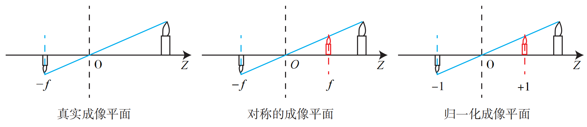

  这样子我们可以把公式中的负号去掉使式子更加简洁：
  $$
  \frac{Z}{f}=\frac{X}{X^{\prime}}=\frac{Y}{Y^{\prime}}. 
  $$
  得到`点P`在`成像平面`中的坐标：
  $$
  X^{\prime}=f\frac{X}{Z} \\
  Y^{\prime}=f\frac{Y}{Z}
  $$
  在不引起歧义的情况下，我们也不加限制地称这一种情况为`针孔模型`。


- **点在`像素坐标系`下**

  在上面，我们描述了点P与它的像之间的空间关系。不过，在相机中，我们最终获得的是一个个的像素，这需要在成像平面上对像进行采样和量化。为了描述传感器将感受到的光线转换成图像像素的过程，我们设在`物理成像平面`上固定着一个`像素平面o-u-v`。我们在像素平面得到了`P'的像素坐标`：$[u,v]^T$

  - **`像素坐标系`的定义**：**`原点o'`位于图像的左上角，`u轴`向右与x轴平行，`v轴`向下与y轴平行**。

    （像素坐标系与成像平面之间，相差了一个**缩放**和一个**原点的平移**）

  - **`像素坐标系`与`成像平面`的关系**：

    `成像平面`的计数单位：米

    `像素坐标系`的计数单位：像素

    我们假设：像素坐标在

    - 在`u轴`上缩放了α倍（即1m对应了α个像素，横向像素密度=α(pixel/m)）
    - 在`v轴`上缩放了β倍（即1m对应了β个像素，纵向像素密度=β(pixel/m)）

    - `原点`平移了$[c_x,c_y]^T$（单位是像素）

    > [!NOTE]
    >
    > **解释：为什么像素坐标在u轴与v轴上的缩放倍数不一致？**
    >
    > 这是因为像素可能不是`正方形`，所以 横向像素密度 != 纵向像素密度

    那么$P'$在成像平面的坐标与`像素坐标`$[u,v]^T$的关系为：

    <div align="center"><font color="red">教材约定，把 物理成像平面 的 x'轴 重新定义为向右</font></div>

    $$
    \begin{cases}u=\alpha X^{\prime}+c_x\\v=\beta Y^{\prime}+c_y&\end{cases}.
    $$
    我们代入**点P在`成像平面`的坐标**$X^{\prime}=f\frac{X}{Z} \\ Y^{\prime}=f\frac{Y}{Z}$，并把 $\alpha f$合并为$f_x$，把$\beta f$合并为$f_y$ 得到：
    $$
    \begin{cases}u=f_x\frac{X}{Z}+c_x\\v=f_y\frac{Y}{Z}+c_y&\end{cases}.
    $$
    其中：$f$单位为米，$\alpha,\beta$单位为像素/米，所以$f_x,f_y$单位为像素。$c_x,c_y$单位也为像素

    如果把这个式子变为矩阵，那就变为：
    $$
    \begin{pmatrix}u\\\\v\\\\1\end{pmatrix}=\frac{1}{Z}\begin{pmatrix}f_x&0&c_x\\\\0&f_y&c_y\\\\0&0&1\end{pmatrix}\begin{pmatrix}X\\\\Y\\\\Z\end{pmatrix}\overset{\Delta}{\operatorname*{=}}\frac{1}{Z}\boldsymbol{K}\boldsymbol{P}.
    $$
    把$Z$挪到左侧：
    $$
    Z\begin{pmatrix}u\\\\v\\\\1\end{pmatrix}=\begin{pmatrix}f_x&0&c_x\\\\0&f_y&c_y\\\\0&0&1\end{pmatrix}\begin{pmatrix}X\\\\Y\\\\Z\end{pmatrix}\triangleq\boldsymbol{K}\boldsymbol{P}.
    $$
    其中：

    - $K$​：相机的`内参数矩阵`。通常认为，相机的内参在出厂之后是固定的，不会在使用过程中发生变化。有的相机生产厂商会告诉你相机的内参，而有时需要你自己确定相机的内参，也就是所谓的`标定`（张正友标定法）。

  - **相机的`外参`**

    > [!NOTE]
    >
    > `外参`会随着相机运动发生改变，同时也是 SLAM 中待估计的目标，代表着机器人的轨迹。

    - **为什么需要外参？**

      在上面，我们得到了**`相机坐标系`下的点P**到**`像素坐标系`下的点P'**的变化：
      $$
      P'=\frac{1}{Z}KP
      $$
      <span style="color:red">问题：点P必须是相机坐标系下的点，但是点P通常是在世界坐标系下的。所以我们还需要做世界坐标到相机坐标的转换</span>

    - **`外参`的作用**

      假设点$P$在`世界坐标系`下是$P_w$，在`相机坐标系`下是$P_c$，在`像素坐标系`下是$P'$

      - 点$P$在世界坐标系下的表示：
        $$
        \mathbf{P}_w = (X_w, Y_w, Z_w)
        $$

      - 但投影公式需要点$P$在相机坐标系下的表示（即$P_c$）：
        $$
        \mathbf{P}_c = (X_c, Y_c, Z_c)
        $$

      所以`外参`就是描述把 世界坐标系下的点$P_w$ 转换为 相机坐标系下的点$P_c$

    - **`外参`的组成**

      外参由以下两个元素组成

      旋转矩阵$R$：表示 世界坐标系到相机坐标系 的旋转

      平移向量$t$：表示 世界原点在相机坐标系 中的位移
      $$
      P_c = R P_w + t \\
      P'=\frac{1}{Z}KP_c
      $$

- `归一化`

  我们可以把一个**世界坐标点**先转换到**相机坐标系**，再除掉它最后一维的数值（即该点距离相机成像平面的深度），这相当于把最后一维进行归一化处理，得到点 *P* 在相机`归一化平面`上的投影：
  $$
  (\boldsymbol{RP}_w+\boldsymbol{t})=\underbrace{\left[X,Y,Z\right]^\mathrm{T}}_\text{相机坐标}\to\underbrace{\left[X/Z,Y/Z,1\right]^\mathrm{T}}_\text{归一化坐标}.
  $$
  因为此时P点的相机坐标的Z维为1，我们可以理解为此时点P变为 **相机光心前方z=1处的平面** 上的一个点，这个Z=1的平面也叫`归一化平面`


### 透镜问题：畸变

#### 径向畸变

> `径向畸变`的产生原因：透镜自身的形状对光线传播的影响

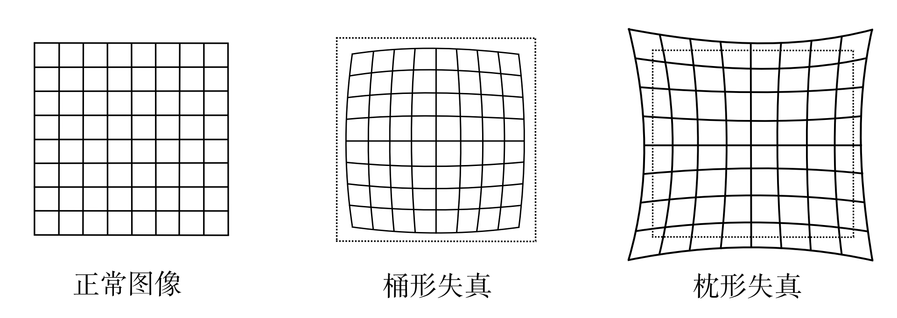

径向畸变也可以分为`桶形畸变`、`枕形畸变`。产生这些畸变跟透镜本身有关


#### 切向畸变

> `切向畸变`的产生原因：在机械组装过程中，透镜和成像平面不可能完全平行，这使得光线穿过透镜投影到成像面时的位置发生变化

如下图，由于工艺问题，`摄像头传感器`与`垂直平面`并不平行，这就导致光线到达摄像头传感器的位置并不是实际位置。（在这张图中的表现就是成像要整体向上）

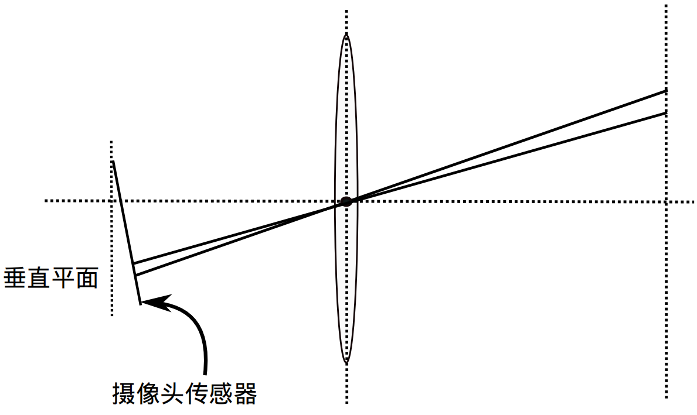


#### 畸变的数学表达

- 考虑`归一化平面`上的任意一点P，`坐标`为$[x,y]^T$，也可以写成`极坐标`形式$[r,\theta]^T$，其中$r$表示点P与坐标系原点之间的距离，$\theta$表示与水平轴的夹角。

  `径向畸变`可看成坐标点沿着长度方向发生了变化，也就是其**距离原点的长度**发生了变化。

  `切向畸变`可以看成坐标点沿着切线方向发生了变化，也就是**水平夹角**发生了变化。

- **构建相机镜头的`畸变模型`**（使用多项式近似的方法）

  - `径向畸变模型`：点离图像中心越远，位置被“拉伸或压缩”的程度越大
    $$
    \begin{aligned}x_{\mathrm{distorted}}&=x(1+k_1r^2+k_2r^4+k_3r^6)\\y_{\mathrm{distorted}}&=y(1+k_1r^2+k_2r^4+k_3r^6)\end{aligned}.
    $$
    其中：

    - $x, y$：**理想无畸变坐标（归一化平面）**
    - $x_{distorted}, y_{distorted}$：**实际成像后的坐标（畸变后点的归一化坐标）**
    - $r^2 = x^2 + y^2$：点到图像中心的距离平方
    - $k_1, k_2, k_3$：畸变系数

    这个公式描述了图像离中心近时几乎没有畸变，但是离中心越远畸变效果越大

  - `切向畸变模型`：
    $$
    \begin{aligned}x_{\mathrm{distorted}}&=x+2p_1xy+p_2(r^2+2x^2)\\y_{\mathrm{distorted}}&=y+p_1(r^2+2y^2)+2p_2xy\end{aligned}.
    $$
    其中：

    - $x, y$：理想坐标（归一化平面）
    - $x_{distorted}, y_{distorted}$：实际成像后的坐标（畸变后点的归一化坐标）
    - $r^2 = x^2 + y^2$：点到图像中心的距离平方
    - $p_1, p_2$：切向畸变系数

  - 汇总：

    联合上面两个式子，对于相机坐标系中的一点 **P**，我们能够通过 5 个畸变系数找到这个点在像素平面上的正确位置：

    - 将三维空间点投影到归一化图像平面。设它的归一化坐标为 $[x,y]^T$。

    - 对归一化平面上的点计算`径向畸变`和`切向畸变`。
      $$
      \begin{cases}x_\mathrm{distorted}=x(1+k_1r^2+k_2r^4+k_3r^6)+2p_1xy+p_2(r^2+2x^2)\\y_\mathrm{distorted}=y(1+k_1r^2+k_2r^4+k_3r^6)+p_1(r^2+2y^2)+2p_2xy&\end{cases}.
      $$

    - 将畸变后的点通过内参数矩阵投影到像素平面，得到该点在图像上的正确位置。
      $$
      \begin{cases}u=f_xx_\mathrm{distorted}+c_x\\v=f_yy_\mathrm{distorted}+c_y&\end{cases}.
      $$


### 单目相机的成像过程

1. 首先，世界坐标系下有一个固定的点$P$，世界坐标为$P_w$

2. 由于相机在运动，它的运动由 `外参`$R,t$ 或 变换矩阵$T \in SE(3)$ 描述。$P$的相机坐标为$\tilde{P}_c = R P_w + t$

3. 这时的$\tilde{P}_c$的分量为$X,Y,Z$ ,把它们投影到`归一化`平面$Z=1$上，得到$P$的归一化坐标：$P_c=[X/Z,Y/Z,1]^{\mathrm{Tの}}$。

4. 有`畸变`时，根据畸变参数计算$P_c$发生畸变后的坐标。

5. 最后，$P$的归一化坐标经过`内参`后，对应到它的像素坐标：$P_uv=KP_c$


# 非线性优化

- **导入**：在前面我们介绍了经典SLAM模型的运动方程和观测方程。

  - `运动方程`和`观测方程`中的位姿可以由`变换矩阵`$SE(3)$来描述，然后用`李代数`进行优化。

  - `观测方程`由相机成像模型给出，其中**内参**是随相机固定的，而**外参**则是相机的位姿。

- **问题**：现实世界存在`噪声`

  因为噪声，**运动方程和观测方程的等式** 不是精确成立的。

  所以，与其**假设数据必须符合方程**，不如来讨论<span style="color:red">如何在有噪声的数据中进行准确的状态估计</span>。

  👉这就是非线性优化讨论的问题


## 状态估计问题

- **经典SLAM模型**：一个运动方程 + 一个观测方程
  $$
  \left.\left\{\begin{array}{l}\boldsymbol{x}_k=f\left(\boldsymbol{x}_{k-1},\boldsymbol{u}_k\right)+\boldsymbol{w}_k\\\boldsymbol{z}_{k,j}=h\left(\boldsymbol{y}_j,\boldsymbol{x}_k\right)+\boldsymbol{v}_{k,j}\end{array}\right.\right.
  $$
  对`运动方程`：

  - $x_k$：表示相机在k时刻的位姿
  - $u_k$：运动传感器的`读取（从运动传感器获取数据）`和`输入（把这些数据送入系统进行处理）`

  - $w_k$：为该过程加入噪声（因为现实中传感器的数据不可能是完美的）


  对`观测方程`：

    - $x_k$：表示相机在 时刻k 在 世界坐标系 中的位姿


    - $y_j$：第$j$个路标在世界坐标系中的位姿（未知）
    - $h(x_k	, y_j)$：理想观测（预测值），得到 时刻k中 第j个路标 在 相机坐标系 下的 相机测量的值
    - $z_{k,j}$：在 时刻$k$ 机器人对 第$j$个路标 的观测
    - $v_{k,j}$：各种观测噪声


- **把 SLAM 的“`抽象观测方程`”具体展开成“`相机成像公式`”**：

  因为我们知道`抽象观测方程`是：$z_{k,j} = h(x_k, y_j)$，当我们用相机成像来表达，就变为：
  $$
  s z_{k,j} = K(R_k y_j + t_k)
  $$
  其中：

  - $P_c = R_k y_j + t_k$：把路标点从世界坐标系变到相机坐标系

  - $K P_c$​：乘以内参，得到$K P_c =
    \begin{bmatrix}
    f_x & 0 & c_x \\
    0 & f_y & c_y \\
    0 & 0 & 1
    \end{bmatrix}
    \begin{bmatrix}
    X_c \\ Y_c \\ Z_c
    \end{bmatrix}
    =
    \begin{bmatrix}
    f_x X_c + c_x Z_c \\
    f_y Y_c + c_y Z_c \\
    Z_c
    \end{bmatrix}$，但是这里仍然是齐次坐标，而不是真正的像素坐标

  - $s$：就是$P'=\frac{1}{Z}KP_c$中的$Z$，用于做归一化，即得到$z_{k,j} =
    \begin{bmatrix}
    u \\ v
    \end{bmatrix}
    =
    \begin{bmatrix}
    \frac{f_x X_c}{Z_c} + c_x \\
    \frac{f_y Y_c}{Z_c} + c_y
    \end{bmatrix}$。这一步是把路标点从**相机坐标**变为**像素坐标**

- **运动与观测中的`噪声`**

  在运动和观测中，我们通常假设两个噪声$w_k,v_{k,j}$满足`零均值的高斯分布（也叫高斯分布）`：
  $$
  \boldsymbol{w}_k\sim\mathcal{N}\left(\boldsymbol{0},\boldsymbol{R}_k\right),\boldsymbol{v}_k\sim\mathcal{N}\left(\boldsymbol{0},\boldsymbol{Q}_{k,j}\right).
  $$
  其中：

  - $\mathcal{N}$：表示这两个噪声满足高斯分布
  - $0$：表示零均值（在$x=0$处是高峰）
  - $\boldsymbol{R}_k,\boldsymbol{Q}_{k,j}$：协方差矩阵$\mathbf{R}=\begin{bmatrix}\sigma_x^2&\mathrm{cov}_{xy}\\\mathrm{cov}_{yx}&\sigma_y^2\end{bmatrix}$，其中
    - $\sigma_x^2$：x方向误差
    - $\sigma_y^2$：y方向误差
    - $\mathrm{cov}_{xy}$：表示x误差变大时，y会不会也跟着变？（如过机器人往前走时x误差变大，y也随着偏，那就具有相关性）
    - $\mathrm{cov}_{yx}$：表示y误差变大时，x会不会也跟着变？

  那么我们得到我们要求的：

  > `状态估计问题`：
  >
  > 在这些噪声的影响下，我们希望通过带噪声的数据（带噪声的运动数据、带噪声的观测数据）来推断机器人的`位姿x`与`地图y（特征点）`

- **处理`状态估计问题`的两种方法**：

  - `增量/渐进的方法（滤波器）`

    > `增量方法`：由于在 SLAM 过程中，这些数据是随时间逐渐到来的，所以在直观上，我们应该**持有一个当前时刻的估计状态**，然后**用新的数据来更新它**。

    最常用的方法是`滤波器`，尤其是`扩展卡尔曼滤波器（EKF）`及其衍生方法

  - `批量的方法`

    > `批量的方法`：把数据“攒”起来一并处理

    例如：我们可以把 0 到 *k* 时刻所有的输入和观测数据都放在一起，问，在这样的输入和观测下，如何估计整个 0 到 *k* 时刻的轨迹与地图？

    | 维度           | 增量方法（Incremental / Filtering） | 批量方法（Batch / Optimization）          |
    | -------------- | ----------------------------------- | ----------------------------------------- |
    | 🎯 核心思想     | 只关注**当前时刻状态 $x_k$**        | 同时优化**所有状态 $x_{0:k}$ + 地图 (y)** |
    | 🧠 数学形式     | 递推更新（贝叶斯滤波）              | 全局最小化（非线性优化）                  |
    | 📌 典型方法     | EKF-SLAM、UKF、粒子滤波             | BA（Bundle Adjustment）、图优化           |
    | 📍 是否保留历史 | ❌ 不显式保留（或被压缩）            | ✅ 显式保留所有历史变量                    |
    | 🔄 更新方式     | 来一帧 → 更新一次                   | 收集一批 → 一起优化                       |
    | ⚡ 实时性       | ✅ 强（适合在线）                    | ❌ 弱（原始形式不实时）                    |
    | 🎯 精度         | 中等（线性化误差累积）              | 高（全局一致性好）                        |
    | 📉 误差处理     | 局部传播误差                        | 全局统一调整误差                          |
    | 🔗 数据利用     | 只用当前 + 上一时刻                 | 用**全部历史观测**                        |
    | 🧩 闭环处理     | 困难（需要额外机制）                | 天然支持（全局优化）                      |
    | 💻 计算复杂度   | 低（但状态增长会变慢）              | 高（尤其大规模时）                        |

  - **折衷上面两者的方法**：

    批量的方法可以在更大的范围达到最优化，比增量方法强。

    但是批量的方法实时性弱，增量方法实时性强

    所以在SLAM中，实用的方法是一些折衷的方法。比如：

    `滑动窗口估计法`：我们固定一些历史轨迹，仅对当前时刻附近的一些轨迹进行优化


### 批量状态估计与最大后验估计

- **前言**：

  因为相比而言，`批量方法`更加适合我们理解，而且理解了`批量方法`后我们也可以更容易理解`增量方法`，所以我们先讨论`批量方法`

- **问题引出**：考虑从 $1$到$N$ 的所有时刻，并假设有 $M$ 个路标点。

  - 定义所有时刻的 **机器人在世界坐标系下的位姿** 和 **路标点在世界坐标系下的坐标** 为：
    $$
    x=\{x_1,\ldots,x_N\},\quad y=\{y_1,\ldots,y_M\}.
    $$

  - 定义所有时刻的 **机器人的控制输入** 和 **相机的观测数据** 为：
    $$
    u = \{u_1, ..., u_N\},z=\{z_{k,j}\}
    $$

  - 从`概率学`的观点来看，`状态估计问题`等同于已知**输入数据 $u$** 和**观测数据 $z$** 的条件下，求**状态 $x,y$** 的**条件概率分布**
    $$
    P(x,y|z,u).\\
    表示在z,u已经发生的前提下，x,y发生的概率
    $$

    > [!IMPORTANT]
    >
    > **特例**：从许多图像中重建三维空间结构`Structure from Motion（SfM）`
    >
    > - 当我们不知道控制输入，只有一张张的图像时，即只考虑观测方程带来的数据时，相当于估计 $P(x, y|z)$ 的条件概率分布，即如何从许多图像中重建三维空间结构。

- 计算$P(x,y|z,u)$：
  $$
  P\left(\boldsymbol{x},\boldsymbol{y}|\boldsymbol{z},\boldsymbol{u}\right)
  \overset{\text{条件概率的定义}}{=} \frac{P(\boldsymbol{x},\boldsymbol{y},\boldsymbol{z},\boldsymbol{u})}{P(\boldsymbol{z},\boldsymbol{u})}
  \overset{\text{贝叶斯法则}}{=} \frac{P\left(\boldsymbol{z},\boldsymbol{u}|\boldsymbol{x},\boldsymbol{y}\right)P\left(\boldsymbol{x},\boldsymbol{y}\right)}{P\left(\boldsymbol{z},\boldsymbol{u}\right)}
  $$
  **在把 $z,u$ 当作已观测数据时，说明 $z,u$ 是已经发生的事情，因此 $z,u$ 发生的概率$P(z,u)$是固定的，即为1**
  
  所以：
  $$
  \underbrace{P(x,y|z,u)}_{\text{后验}}
  \propto
  \underbrace{P(z,u|x,y)}_{\text{似然}}
  \underbrace{P(x,y)}_{\text{先验}} \\ 
  \propto 的意思是正比于
  $$
  在`贝叶斯法则`下，有这么几个概念：

  - `先验`：$P(x,y)$，表示在看数据之前，你对$(x,y)$的原始相信程度
  
  - `似然`：$P(z,u|x,y)$，表示如果$(x,y)$是真的，那么观测到$(z,u)$的概率是多少
  - `后验`：$P(x,y|z,u)$，表示在看到数据$(z,u)$后，$(x,y)$有多大概率成立
  
  $$
  \boxed{
  \text{后验} = \text{似然} \times \text{先验}
  }
  $$
  
  > **举个例子**：
  >
  > - 场景：判断是否生病
  >
  > - 假设：
  >   $$
  >   P(z,x)=P(z|x)P(x)
  >   $$
  >
  >   - $x$：是否生病
  >
  >   - $z$：检测结果（阳性）
  >
  > - `先验`：$P(x)$，人为假设大部分人是健康的
  >
  > - `似然`：$P(z|x)$
  >   
  >   - 如果生病 -> 很可能测出阳性的概率
  >   - 如果没病 -> 也可能测出阳性的概念（误报）
  >   
  > - `后验`：$P(x|z)$，已经测出阳性了，你到底有多大概率真的生病？
  
- **$P(x,y|z,u)$的条件分布很难求解，怎么办呢？**

  > [!NOTE]
  >
  > 为什么 $P(x|z)$条件分布难求解？
  >
  > 1. 这个条件分布本身是什么模型？我们很难去定义。我们很难定义这是一个高斯分布还是别的什么分布
  > 2. 即使我把模型定义了，模型的参数怎么估计？
  
  当这个问题很难求的时候，我们可以去求：
  
  - `最大后验估计（Maximize a Posterior,MAP）`：

    > 在观察到数据 $z,u$ 之后，选择一个 $x,y$ ，使得 **后验概率 $P(x,y|z,u)$ 最大**
    >
    > 也就是说：<span style="color:red">相信传感器 + 相信历史</span>

    $$
    (x,y)^*{}_{MAP}=\arg\max P\left(x,y|z,u\right)=\arg\max P(z,u|x,y)P(x,y).
    $$
  
  - `最大似然估计（Maximize Likelihood Estimation,MLE）`（只看当前观测）
  
    > 选择一个 $x,y$，使得 **观测数据出现的概率最大**
    > 也就是说：<span style="color:red">只相信传感器</span>
  
    $$
    (x,y)^*{}_{MLE}=\arg\max P(z,u|x,y).
    $$
  
    例如：
  
    - 传感器说：你离墙 2 米
    - 那么，所有离墙 2 米的位置 都是合理的
    - MLE会选择：最符合当前观测的位置，**完全不考虑之前在哪里**。
  
    

- **求`概率最大值`而不去求`概率分布`**

  - 🤔如果我们直接去求$P\left(\boldsymbol{x},\boldsymbol{y}|\boldsymbol{z},\boldsymbol{u}\right)$的概率分布，然后再去找最大值，会很困难：

    因为这是一个高维分布，非线性，形状不规则的概率分布

  - 所以我们不求$P\left(\boldsymbol{x},\boldsymbol{y}|\boldsymbol{z},\boldsymbol{u}\right)$的概率分布，而是直接去求一个**可能的最大值**，这是可行的：
    $$
    \boxed{
    \text{MAP：找一个最可能的 }(x,y)，而不是求整个概率分布
    }
    $$

    $$
    (x,y)^*_{\text{MAP}} = \arg\max P(x,y|z,u)
    $$

    **含义**：在所有可能的 $x,y$ 中，找一个让概率最大的

  - 用**贝叶斯公式**展开：
    $$
    (x,y)^*_{\text{MAP}} =\arg\max P(z,u|x,y)\left.P(x,y)\right.
    $$
    `贝叶斯法则`告诉我们，求解**最大后验概率**等价于**最大化`似然`和`先验`的乘积**。

    > [!NOTE]
    >
    > 这里贝叶斯展开后忽略了分母。这是因为我们要求的是概率最大值出现的位置，即x
    >
    > 而$P(z,u)$表达的意思是观测数据和控制数据本身出现的概率（如某一张图像像素刚好这样排列，某一段轨迹刚好这样），所以是一个 大于0的常数
    >
    > 而这个常数不会改变“哪个(x,y)取得最大值”，只会缩放概率的数值

  - **求`最大似然估计`**

    进一步说，我们可以说**我不知道机器人位姿或路标大概在什么地方**，此时就没有了**先验**。那么，此时就可以求解`最大似然估计`
    $$
    (\boldsymbol{x},\boldsymbol{y})_{\mathrm{MLE}}^*=\arg\max P(\boldsymbol{z},\boldsymbol{u}|\boldsymbol{x},\boldsymbol{y}).
    $$
    `似然`的含义：直观理解就是“**在现在的位姿下，可能产生怎样的观测数据**”。

    由于我们知道观测数据，所以`最大似然估计`可以理解成：“**在什么样的状态下，最可能产生现在观测到的数据**”。


### 最小二乘的引出

- 我们知道，在观测模型中，我们得到的观测值是：
  $$
  \boldsymbol{z}_{k,j}=h\left(\boldsymbol{y}_j,\boldsymbol{x}_k\right)+\boldsymbol{v}_{k,j}
  $$

- 然后我们还知道：

  - $h\left(\boldsymbol{y}_j,\boldsymbol{x}_k\right)$：理想（无噪声）观测，也就是说相机真的在 $x_k$，路标真的在 $y_j$，相机观察的值就是固定的
  - 噪声项$\boldsymbol{v}_k\sim\mathcal{N}\left(\boldsymbol{0},\boldsymbol{Q}_{k,j}\right)$

  > [!NOTE]
  >
  > 高斯噪声加到谁身上，谁就变成高斯分布（均值被平移）

  所以：
  $$
  z_{k,j} \sim \mathcal{N}(h(x_k, y_j), Q_{k,j})
  $$
  也就是说此时此时观测数据的条件概率为（结果依然是一个高斯分布）：
  $$
  \boxed{P(\boldsymbol{z}_{j,k}|\boldsymbol{x}_k,\boldsymbol{y}_j)=N\left(h(\boldsymbol{y}_j,\boldsymbol{x}_k),\boldsymbol{Q}_{k,j}\right).}
  $$


- **求单次观测的`最大似然估计`**——`最小化负对数`

  > `最小化负对数`：
  >
  > - 在概率模型和机器学习里，它通常等价于`最大化概率（最大似然）`
  >
  > - `最大似然`：
  >
  >   - 假设你有一组观测数据 $\mathcal{D}$，模型参数是 $\theta$，我们希望：
  >     $$
  >     \max_{\theta} \; p(\mathcal{D} \mid \theta)
  >     $$
  >     也就是：**找到让数据出现概率最大的参数**。
  >
  >   - 对于 该组观测数据$\mathcal{D}$ 中的每个 观测值$\mathcal{D}_i$，
  >
  >     每一个 观测值$\mathcal{D}_i$ 在 参数$\theta$ 下都有自己出现的概率，即 $p(\mathcal{D}_i \mid \theta)$
  >
  >     那么 该组观测数据$\mathcal{D}$ 同时出现的概率就是 $p(\mathcal{D} \mid \theta) = \mathcal{P}\left(\mathcal{D}_{1}|\boldsymbol{\theta}\right)\times\mathcal{P}\left(\mathcal{D}_{2}|\boldsymbol{\theta}\right)\times\mathcal{P}\left(\mathcal{D}_{3}|\boldsymbol{\theta}\right)\times\cdots\times\mathcal{P}\left(\mathcal{D}_{n}|\boldsymbol{\theta}\right)$​，也写做：
  >     $$
  >     \boxed{p(\mathcal{D} \mid \theta) = \prod_i p(D_i \mid \theta)}
  >     $$
  >     （这个过程可以解释为 每个观测值$\mathcal{D}_i$都在为参数$\theta$的真是面貌投票）
  >
  >     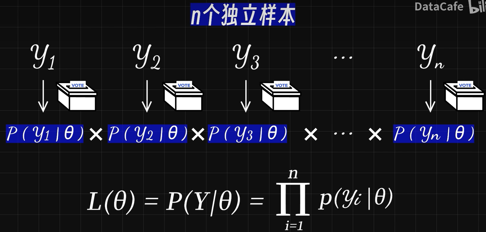
  >
  >   - **选择概率模型**
  >
  >     光有公式不够，我们还需要选一个概率模型（也就是概率是怎么样的分布）
  >     $$
  >     L(\theta)=P(Y|\theta)=\prod_{i=1}^n\overbrace{p(y_i\mid\theta)}^{\text{概率分布}}
  >     $$
  >     比如，如果是抛硬币问题，选择伯努利分布
  >     $$
  >     L(\theta)=P(Y|\theta)=\prod_{i=1}^n\overbrace{\theta^{y_i}(1-\theta)^{1-y_i}}^{\text{伯努利分布}}
  >     $$
  >     如果是测量误差就使用正态分布
  >     $$
  >     L(\theta)=P(Y|\theta)=\prod_{i=1}^n\overbrace{\frac{1}{\sqrt{2\pi\sigma^2}}\exp{(-\frac{(y_i,\mu)^2}{2\sigma^2})}}^\text{正态分布}
  >     $$
  >
  >   - **估计`参数`$\theta$**
  >
  >     我们去估计参数的值（随便猜），然后取 $p(\mathcal{D} \mid \theta)$最大时 对应的 参数$\theta$
  >
  >     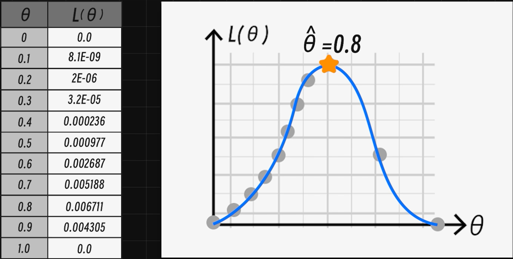
  >
  > - 🤔**为什么要取对数？**
  >
  >   我们看最大化概率的计算公式：
  >   $$
  >   L(\theta)=P(Y|\theta)=\prod_{i=1}^n\overbrace{p(y_i\mid\theta)}^{\text{概率分布}}
  >   $$
  >   我们很容易发现这个连乘会造成一个问题：如果一个概率很小（如$10^{-100}$），在计算机中连乘就直接变成0了
  >
  > - 🤔**怎么办呢？`最小化负对数`**
  >
  >   - `取对数`：（把连乘变为连加，并且数值更加稳定）
  >     $$
  >     \log p(\mathcal{D}|\theta) = \sum_i \log p(x_i|\theta)
  >     $$
  >     **（取对数后，仍然取`最大化对数概率`）**
  >
  >   - 其实取对数就已经能供解决问题了。🤔那为什么还要`最小化负对数`？
  >
  >     这是因为很多优化算法（如梯度下降）习惯写成：$\min_{\theta}\mathrm{~loss}$
  >
  >     其中$loss$就是`损失函数`，$\boxed{\mathrm{Loss}(\theta)=-\log p(\mathcal{D}|\theta)}$
  >
  >     - 如果模型预测数据的概率高 → loss 小 → 模型好
  >
  >     - 如果模型预测数据的概率低 → loss 大 →模型差
  >
  >     所以：
  >     $$
  >     \max_\theta\log p(\mathcal{D}|\theta)\quad\Longleftrightarrow\quad\min_\theta-\log p(\mathcal{D}|\theta)
  >     $$
  >
  > - **结论**：
  >
  >   <div style="color: red; text-align: center;">最大化概率 == 最大化对数概率 == 最小化负对数概率</div>

  - 因为前面说$\boxed{P(\boldsymbol{z}_{j,k}|\boldsymbol{x}_k,\boldsymbol{y}_j)=N\left(h(\boldsymbol{y}_j,\boldsymbol{x}_k),\boldsymbol{Q}_{k,j}\right).}$是一个高斯分布

    对于**任意`高维`**高斯分布$\boldsymbol{x}\sim\mathcal{N}(\boldsymbol{\mu},\boldsymbol{\Sigma})$，它的`概率密度函数`展开形式为：
    $$
    P(\boldsymbol{x})={\frac{1}{\sqrt{(2\pi)^{N}\operatorname*{det}(\boldsymbol{\Sigma})}}}\exp\left(-{\frac{1}{2}}(\boldsymbol{x}-\boldsymbol{\mu})^{\mathrm{T}}\boldsymbol{\Sigma}^{-1}(\boldsymbol{x}-\boldsymbol{\mu})\right).
    $$
    对其取`负对数`，变为：（此时原本 最大化$P(x)$ 变为了 最小化$P(x)$ ）
    $$
    -\ln\left(P\left(\boldsymbol{x}\right)\right)=\frac{1}{2}\ln\left(\left(2\pi\right)^{N}\det\left(\boldsymbol{\Sigma}\right)\right)+\frac{1}{2}{\left(\boldsymbol{x}-\boldsymbol{\mu}\right)}^{\mathrm{T}}\boldsymbol{\Sigma}^{-1}\left(\boldsymbol{x}-\boldsymbol{\mu}\right).
    $$
    - 因为 **第一项**$\frac{1}{2}\ln\left(\left(2\pi\right)^{N}\det\left(\boldsymbol{\Sigma}\right)\right)$ 与x无关，所以可以直接省略
    - 只需使 **第二项**$\frac{1}{2}{\left(\boldsymbol{x}-\boldsymbol{\mu}\right)}^{\mathrm{T}}\boldsymbol{\Sigma}^{-1}\left(\boldsymbol{x}-\boldsymbol{\mu}\right).$ 最小化，就得到了对状态的最大似然估计。
  
  - 又因为在前面我们知道**SLAM的观测模型** $z_{k,j} \sim \mathcal{N}(h(x_k, y_j), Q_{k,j})$ ，该式子就是一个`高维高斯分布`
  
    所以代入 **SLAM 的观测模型**，对其求`最大似然估计`：
    $$
    (x_k, y_j)^* = \arg\max \mathcal{N}(h(y_j, x_k), Q_{k,j})
    $$
    其中：
  
    - $h(\boldsymbol{y}_j,\boldsymbol{x}_k)$：均值
    - $Q_{k,j}$：协方差矩阵
  
    然后使用`最小化负对数`
    $$
    (x_k, y_j)^*
    =
    \arg\min
    (z_{k,j} - h(x_k, y_j))^T
    Q_{k,j}^{-1}
    (z_{k,j} - h(x_k, y_j))
    $$
  
  - **SLAM 的优化，其实就是在最小化一种“带权的误差长度” —— 这个长度叫`马氏距离`**
  
    **推导过程**：
  
    - 在上面我们得到了 $(z-h(x,y))^TQ^{-1}(z-h(x,y))$ 
  
      假设我们定义`误差`：$e=z-h(x,y)$
  
      那么这个式子就变成了 $e^TQ^{-1}e$
  
    - `二次型`
  
      > `二次型`：是一个关于多个变量的**二次齐次多项式**（“齐次”意味着每一项的次数**正好都是 2**）
      >
      > 例如：
      >
      > - （二元）： $f(x, y) = ax^2 + bxy + cy^2$
      > - （三元）： $f(x, y, z) = x^2 + 2y^2 - 3z^2 + 4xy$
  
      那么根据`二次型`的定义，我们很容易看出下面这个式子是一种二次型：
      $$
      e^TAe
      $$
      我们可以这样理解：
  
      - 普通平方：$x^2$
      - 向量平方：$e^T e$
      - 加权平方：$e^T A e$
  
    - **与`欧氏距离`的关系**
  
      普通欧式距离：$\|e\|^2=e^Te$，🤔为什么？
  
      > `欧式距离`（欧式距离就是某个点离坐标系原点的距离）
      >
      > - `一维`
      >
      >   假设一个点距离原点为$x$，即$e=x$
      >
      >   那么欧式距离的平方就是：$\|e\|^2=x^2$
      >
      > - `二维`
      >
      >   假设一个点位于坐标系的$(e_x,e_y)$处，那么欧氏距离的平方就是：$\|e\|^2=e_x^2+e_y^2$
      >
      >   我们写成`矩阵`的形式$e=\begin{bmatrix}e_x\\e_y\end{bmatrix}$，那么欧氏距离的平方：
      >   $$
      >   \|e\|^2=e^Te=\begin{bmatrix}e_x&e_y\end{bmatrix}\begin{bmatrix}e_x\\e_y\end{bmatrix}=e_x^2+e_y^2
      >   $$
      >
      > - **推广到`n维`**
      >
      >   如果：
      >   $$
      >   e =
      >   \begin{bmatrix}
      >   e_1 \\
      >   e_2 \\
      >   \vdots \\
      >   e_n
      >   \end{bmatrix}
      >   $$
      >   那么：
      >   $$
      >   e^T e = e_1^2 + e_2^2 + \cdots + e_n^2
      >   $$
      >   正好就是：
      >   $$
      >   \|e\|^2
      >   $$
  
      而我们讨论的式子是：$e^TQ^{-1}e$ 。🤔我们发现，这个式子又跟我们认识的`欧氏距离`不太一样了。这其实是因为：
  
      - 普通欧氏距离是：$\|e\|^2=e^Te=e^TIe$ ，也就是说这里$Q$只是变成了单位矩阵$I$
      - 我们讨论$e^TQ^{-1}e$时，可以理解为 **不同方向的误差，被放大/缩小了**
  
      **举个例子**：
  
      假设误差是二维：
      $$
      e =
      \begin{bmatrix}
      e_x \\
      e_y
      \end{bmatrix}
      $$
      如果协方差矩阵：
      $$
      Q =
      \begin{bmatrix}
      1 & 0 \\
      0 & 100
      \end{bmatrix}
      \Rightarrow
      Q^{-1} =
      \begin{bmatrix}
      1 & 0 \\
      0 & 0.01
      \end{bmatrix}
      $$
      代入：
      $$
      e^T Q^{-1} e = e_x^2 + 0.01 e_y^2
      $$
      意味着：
  
      - $e_x$：正常惩罚
      - $e_y$：几乎不惩罚
  
      物理意义
  
      - **哪个方向噪声大，表示该方向标准差大， 同样的误差 $e$，相对于噪声来说更小 -> 惩罚小**
      - **哪个方向噪声小，表示该方向标准差小。同样的误差 $e$，相对于噪声来说更大 -> 惩罚大**
  
    - **引出`马氏距离`**
  
      `马氏距离`的定义：类似于加权欧氏距离
      $$
      d_M(e)=\sqrt{e^TQ^{-1}e}
      $$
      马氏距离与欧式距离的区别
  
      | 距离类型 | 公式           | 特点             |
      | -------- | -------------- | ---------------- |
      | 欧氏距离 | $e^T e$        | 所有方向一样     |
      | 马氏距离 | $e^T Q^{-1} e$ | 不同方向权重不同 |
  
    - **为什么 $Q^{-1}$ 叫“`信息矩阵`”？**
  
      我们知道 协方差$Q$ 表示 **不确定性**
  
      那么 协方差的逆$Q^{-1}$ 就表示 **确定性（也叫信息量）**
  
      👉**所以**：信息矩阵越大 → 这个观测越“可信” → 对误差e的惩罚越重


- **因式分解**

  > `独立的定义`：
  >
  > 如果随机变量 $X, Y$ 独立：
  > $$
  > P(X, Y) = P(X)\,P(Y)
  > $$
  > `马尔可夫性`：
  >
  > 未来只和“现在”有关，和“更早的过去”无关
  > $$
  > P(x_k\mid x_1,x_2,\ldots,x_{k-1})=P(x_k\mid x_{k-1})
  > $$
  > `链式法则`：（绝对成立）
  > $$
  > P(z_1,z_2,\ldots,z_n\mid x,y)=\prod_iP(z_i\mid z_1,\ldots,z_{i-1},x,y)
  > $$

  通常假设各个时刻的输入和观测是相互独立的，这意味着各个**输入之间是独立**的，各个**观测之间是独立**的，并且**输入和观测也是`独立`**的。于是我们可以对联合分布进行因式分解
  $$
  P(\boldsymbol{z},\boldsymbol{u}\mid\boldsymbol{x},\boldsymbol{y})=P(\boldsymbol{u}\mid\boldsymbol{x},\boldsymbol{y})\cdot P(\boldsymbol{z}\mid\boldsymbol{u},\boldsymbol{x},\boldsymbol{y})
  $$

  - 因为 假设1：**控制 不依赖 路标点位置**，所以：
    $$
    P(\boldsymbol{u}\mid\boldsymbol{x},\boldsymbol{y})=P(\boldsymbol{u}\mid\boldsymbol{x})
    $$
    因为 假设2：**观测 与 控制 条件独立**，所以：
    $$
    P(\boldsymbol{z}\mid\boldsymbol{u},\boldsymbol{x},\boldsymbol{y})=P(\boldsymbol{z}\mid\boldsymbol{x},\boldsymbol{y})
    $$
    其中：

    - $P(\boldsymbol{u}|\boldsymbol{x})$：控制项。因为控制只来自运动模型，所以$P(u\mid x,y)=P(u\mid x)$
    - $P(\boldsymbol{z}|\boldsymbol{x},\boldsymbol{y})$：观测项。因为观测不依赖控制，所以$P(z\mid u,x,y)=P(z\mid x,y)$

  - 将`控制项`变为乘积

    使用`马尔可夫性`，表示**当前控制只和上一时刻状态$x_{k-1}$、当前状态$x_k$有关**。和更早的无关。
    $$
    P(\boldsymbol{u}|\boldsymbol{x})=\prod_kP(\boldsymbol{u}_k|\boldsymbol{x}_{k-1},\boldsymbol{x}_k)
    $$

  - 将`观测项`变成乘积

    - 因为`概率链式法则`：
      $$
      P(z_1,z_2,\ldots,z_n\mid x,y)=\prod_iP(z_i\mid z_1,\ldots,z_{i-1},x,y)
      $$

    - 因为**观测**之间`条件独立`：

      在已知所有位姿 $x$ 和地图点 $y$ 的情况下，每个观测$z$ 之间互不影响，所以`概率链式法则`中的$P(z_i\mid z_1,\ldots,z_{i-1},x,y)$根据`条件独立`替换为$P(z_i\mid x,y)$，得到：
      $$
      P(\boldsymbol{z}\mid\boldsymbol{x},\boldsymbol{y})=\prod_iP(z_i\mid x,y)
      $$

    - 又因为`局部性原理`：

      每个观测 $z_{k,j}$ 其实只和：当前位姿 $x_k$，对应地图点 $y_j$ 有关
      $$
      P(\boldsymbol{z}|\boldsymbol{x},\boldsymbol{y})=\prod_{k,j}P(\boldsymbol{z}_{k,j}|\boldsymbol{x}_k,\boldsymbol{y}_j)
      $$

  - 得到最终联合分布的因式分解：
    $$
    P\left(\boldsymbol{z},\boldsymbol{u}|\boldsymbol{x},\boldsymbol{y}\right)=\prod_kP\left(\boldsymbol{u}_k|\boldsymbol{x}_{k\boldsymbol{-}1},\boldsymbol{x}_k\right)\prod_{k,j}P\left(\boldsymbol{z}_{k,j}|\boldsymbol{x}_k,\boldsymbol{y}_j\right)
    $$

  <div style="color:red;text-align:center;">这说明我们可以独立地处理各时刻的运动和观测。</div>

- 获得一个`最小二乘问题`（从 概率问题 变为 优化问题）

  定义各次输入和观测数据与模型之间的误差：
  $$
  e_{u,k}=x_k-f\left(\boldsymbol{x}_{k-1},\boldsymbol{u}_k\right) \\
  e_{z,j,k}=\boldsymbol{z}_{k,j}-h\left(\boldsymbol{x}_{k},\boldsymbol{y}_{j}\right),
  $$

  - **从`最大似然`出发**：

    前面我们推导了：
    $$
    P\left(\boldsymbol{z},\boldsymbol{u}|\boldsymbol{x},\boldsymbol{y}\right)=\prod_kP\left(\boldsymbol{u}_k|\boldsymbol{x}_{k\boldsymbol{-}1},\boldsymbol{x}_k\right)\prod_{k,j}P\left(\boldsymbol{z}_{k,j}|\boldsymbol{x}_k,\boldsymbol{y}_j\right)
    $$
    此时我们要求 $max P$，即找到一组$(x,y)$，使观测和控制最合理

  - 我们代入`高斯分布`，并取`负对数`

    - 对于`控制项`：$u_k\sim\mathcal{N}(f(x_{k-1},x_k),R_k)$，所以负对数变为：
      $$
      e_{u,k}^TR_k^{-1}e_{u,k} \\
      可以看出这是一个马氏距离
      $$

    - 对于`观测项`：$z_{k,j}\sim\mathcal{N}(h(x_k,y_j),Q_{k,j})$，所以负对数变为：
      $$
      e_{z,k,j}^TQ_{k,j}^{-1}e_{z,k,j} \\
      可以看出这是一个马氏距离
      $$

    - 合并起来得到一个`最小二乘问题`（解等价于状态的最大似然估计）：
      $$
      (x^*,y^*)
      =\arg\min_{x,y}J(x,y)
      =\sum_ke_{u,k}^\mathrm{T}R_k^{-1}e_{u,k}+\sum_k\sum_je_{z,k,j}^\mathrm{T}Q_{k,j}^{-1}e_{z,k,j}.
      $$
      其中：

      - $(x^*,y^*)$：找到一组最优的 轨迹$x$ 和 地图$y$
      - $J(x,y)$：误差总和（损失函数 / 代价函数），由 运动误差$e_{u,k}$（表示你的轨迹是否符合运动模型） 和 观测误差$e_{z,k,j}$（表示你预测的观测是否接近真实观测） 组成

      > 由于实际中存在噪声，我们估计的轨迹 (x) 和地图 (y) 代入运动方程与观测方程时，无法让所有关系完全成立（总会有误差）。因此，SLAM 的做法不是去“精确满足方程”，而是从一个初始估计出发，不断对 (x,y) 做小幅调整，使所有运动误差和观测误差的加权总和逐步减小，直到无法再明显降低为止。**这个不断调整、逐步降低误差并最终停在某个极小值的过程，就是一个典型的`非线性优化`过程**。

  

### 例子：批量状态估计

现有一个非常简单的离散时间系统**（这是一个“纯状态估计模型”，不是完整的SLAM模型）**：
$$
\begin{aligned}x_k&=x_{k-1}+u_k+w_k,&w_k&\sim\mathcal{N}(0,Q_k)\\z_k&=x_k+n_k,&n_k&\sim\mathcal{N}(0,R_k)\end{aligned}
$$
这两个式子可以表达一辆沿$x$轴前进或后退的汽车。

第一个公式为**运动方程**，$u_k$为传感器输入，$w_k$为噪声；

第二个公式为**观测方程**，$x_k$为相机在k时刻的位姿，$z_k$为对汽车位置的测量（传感器直接测量$x_k$的位置），$n_k$为噪声。

取时间$k=1,\ldots,3$，现希望根据已有的$v,y$进行状态估计。设初始状态$x_{0}$已知。下面来推导`批量(batch)状态的最大似然估计`。

- 求`最大似然估计`

  令 批量状态变量为$x=[x_{0},x_{1},x_{2},x_{3}]^{\mathrm{T}}$，批量观测变量为$z=[z_1,z_2,z_3]^\mathrm{T}$， 批量传感器输入为$\boldsymbol{u}=[u_1,u_2,u_3]^\mathrm{T}$

  - 从`最大后验估计(MAP)`出发：$x^*=\arg\max P(x|u,z)$，

    - 用贝叶斯公式得到：$P(x|u,z)=\frac{P(u,z|x)P(x)}{P(u,z)}$。

      因为$P(u,z)$ 与 $x$ 无关（一个常数）

      且如果假设 $x_0$ 已知 ⇒ $P(x)$ 是常数（或固定）

    - 所以优化时可以忽略常数项，得到：
      $$
      x^*=\arg\max P(u,z|x)
      $$

  - 把`联合概率`拆开 $P(u,z|x)$

    利用链式法则：$P(u,z|x)=P(u|x)\operatorname{P}(z|u,x)$

    在这个系统中有两个重要的**条件独立性假设**：

    - **控制量的条件独立性**

      系统模型：
      $$
      x_k = x_{k-1} + u_k + w_k
      $$
      可以改写为：
      $$
      u_k = x_k - x_{k-1} - w_k
      $$
      因此：
      $$
      P(u_k|x) = P(u_k|x_{k-1},x_k)
      $$
      并且各时刻独立：
      $$
      P(u|x) = \prod_{k=1}^3 P(u_k|x_{k-1},x_k)
      $$

    - **观测的条件独立性**

      观测模型：
      $$
      z_k = x_k + n_k
      $$
      说明：
      $$
      P(z_k|x) = P(z_k|x_k)
      $$
      且各时刻独立：
      $$
      P(z|x) = \prod_{k=1}^3 P(z_k|x_k)
      $$

    - **合并**

      于是：
      $$
      P(u,z|x) = P(u|x)\,P(z|x)
      $$
      代入得到：
      $$
      P(u,z|x) =
      \left(\prod_{k=1}^3 P(u_k|x_{k-1},x_k)\right)
      \left(\prod_{k=1}^3 P(z_k|x_k)\right)
      $$

  - 得到最大似然估计
    $$
    \begin{gathered}x_{\mathrm{map}}^*=\arg\max P(x|\boldsymbol{u},\boldsymbol{z})=\arg\max P(\boldsymbol{u},\boldsymbol{z}|\boldsymbol{x})\\=\prod_{k=1}^{3}P(u_{k}|x_{k-1},x_{k})\prod_{k=1}^{3}P(z_{k}|x_{k}),\end{gathered}
    $$

    - 对于`运动方程`，我们知道：
      $$
      P(u_k|x_{k-1},x_k)=\mathcal{N}(x_k-x_{k-1},Q_k),
      $$

    - 对于`观测方程`，我们知道：
      $$
      P\left(z_k|x_k\right)=\mathcal{N}\left(x_k,R_k\right).
      $$

- 构建`误差变量`：
  $$
  e_{u,k}=x_k-x_{k-1}-u_k, \\
  e_{z,k}=z_k-x_k,
  $$

- 得到`最小二乘`的目标函数：
  $$
  \min\sum_{k=1}^3e_{u,k}^\mathrm{T}Q_k^{-1}e_{u,k}+\sum_{k=1}^3e_{z,k}^\mathrm{T}R_k^{-1}e_{z,k}.
  $$
  因为这个系统是线性系统，我们可以将其写成向量形式

- 对误差做打包（所有误差）

  - 因为误差变量每一项都不一样，很乱，所以需要变为矩阵形式来方便计算：

    - 运动误差：$e_{u,k} = x_k - x_{k-1} - u_k$

    - 观测误差：$e_{z,k} = z_k - x_k$

  - 统一公式写为
    $$
    y-Hx=e
    $$

    | 符号 | 含义                   |
    | ---- | ---------------------- |
    | x    | 所有状态（未知量）     |
    | y    | 所有“观测数据”（已知） |
    | H    | 把状态映射成观测的矩阵 |
    | e    | 所有误差               |

  - 矩阵$H$
    $$
    H=\begin{bmatrix}1&-1&0&0\\0&1&-1&0\\0&0&1&-1\\0&1&0&0\\0&0&1&0\\0&0&0&1\end{bmatrix}
    $$

    - 前3行：`运动模型`

      例如第一行：
      $$
      1\cdot x_0 -1\cdot x_1 = x_0 - x_1
      $$
      对应：
      $$
      e_{u,1} = x_1 - x_0 - u_1
      $$
      👉 实际上：
      $$
      u_1 \approx x_1 - x_0
      $$
      所以：**前3行 = 运动约束**

    - 后3行：`观测模型`

      例如：
      $$
      0\cdot x_0 +1\cdot x_1 = x_1
      $$
      对应：
      $$
      z_1 \approx x_1
      $$
      👉 **后3行 = 观测约束**

  - Σ 是什么？
    $$
    \Sigma = \text{diag}(Q_1, Q_2, Q_3, R_1, R_2, R_3)
    $$
    意思：

    - 前3个：运动噪声
    - 后3个：观测噪声

    本质：**每一项误差的“可信度权重”**

  - 问题改写为：
    $$
    x_{\mathrm{map}}^*=\arg\min e^\mathrm{T}\Sigma^{-1}e
    $$

- 之后我们将看到，这个问题有唯一的解：
  $$
  x_{\mathrm{map}}^*=(H^\mathrm{T}\Sigma^{-1}H)^{-1}H^\mathrm{T}\Sigma^{-1}y.
  $$
  

## 非线性最小二乘

- 先考虑一个简单的问题：
  $$
  \min_{\boldsymbol{x}}F(\boldsymbol{x})=\frac{1}{2}\|f\left(\boldsymbol{x}\right)\|^2=\frac{1}{2}f(x)^Tf(x)
  $$
  其中：

  - $\boldsymbol{x}\in\mathbb{R}^n$：表示 $x$ 是n维的
  - $f$是任意`标量非线性函数`（输入是一个数，输出也是一个数）$f(\boldsymbol{x}):\mathbb{R}^n\mapsto\mathbb{R}$（表示输入的$x$是n维，而输出是1维的）
  - $f(x)$：**残差向量（vector）**
  - $F(x)$：**目标函数（scalar）**
  
- 当$f$很简单时：

  令目标函数的导数为0，然后求`极值`。

  因为导数为0得到的极值，可能是极大值、极小值、鞍点，只需要比较这些函数值即可。
  $$
  \frac{\mathrm{d}F}{\mathrm{d}x}=0.
  $$

- 当$f$很复杂时：

  出现一个问题：$\frac{\mathrm{d}F}{\mathrm{d}x}=0.$难求或$\frac{\mathrm{d}F}{\mathrm{d}x}=0.$难解

  <span style="color:red">使用迭代方式求解</span>（从一个初始值出发，不断地更新当前的优化变量，使目标函数下降）：

  1. 给定某个初始值 $x_0$

  2. 对于第$k$次迭代，寻找一个`增量`$\Delta x_k$，使得$\left\|f\left(x_k+\Delta x_k\right)\right\|_2^2$达到极小值。

     **（待解决的问题：这个增量$\Delta x_k$要怎么寻找呢？）**

  3. 若$\Delta x_k$足够小，则停止。

  4. 否则，令$x_{k+1}=x_k+\Delta x_k$，返回第2步。

  **总结迭代方法**：让求解导数为零的问题，变成了一个不断寻找增量使函数值不断下降的过程。直到某个时刻增量非常小，无法使函数下降，则算法收敛，目标达到了一个极小，也就完成寻找极小值的过程。

  

### 一阶梯度和二阶梯度法

现在考虑第$k$次迭代，假设我们在$x_k$处，想要寻到增量$\Delta x_k$**（注意$x$是n维的）**，那么最直观的方式是将目标函数在$x_k$附近进行`泰勒展开`：
$$
F(x_{k}+\Delta x_{k})\approx F(x_{k})+J\left(x_{k}\right)^{\mathrm{T}}\Delta x_{k}+\frac{1}{2}\Delta x_{k}^{\mathrm{T}}H(x_{k})\Delta x_{k}.
$$
其中：

- $\Delta x_k$：增量

- $J(x) =
  \begin{bmatrix}
  \frac{\partial F}{\partial x_1} \\
  \frac{\partial F}{\partial x_2} \\
  \frac{\partial F}{\partial x_3}
  \end{bmatrix}$，是$F(x)$关于$x$的**一阶导数**（也叫`梯度`、`雅可比矩阵`）
- $H(x)=\begin{bmatrix}\frac{\partial^2F}{\partial x_1^2}&\frac{\partial^2F}{\partial x_1\partial x_2}&\cdots\\\frac{\partial^2F}{\partial x_2\partial x_1}&\frac{\partial^2F}{\partial x_2^2}&\cdots\\\vdots&\vdots&\ddots\end{bmatrix}$，是$F(x)$关于$x$的**二阶导数**（也叫`海塞矩阵`）


### 只保留一阶梯度：最速下降法

> `最速下降法`：对目标函数做了一阶近似，把一个非线性函数f线性化成了**一次函数**，这种近似自然是极其不精确的。

$$
F(x_{k}+\Delta x_{k})\approx F(x_{k})+J\left(x_{k}\right)^{\mathrm{T}}\Delta x_{k}
$$

**🤔 $\Delta x_{k}$ 取什么值的时候 $F(x)$ 下降最快呢？**

- 先说结论：$\Delta x_{k}=-J(x_k)$ 时 $F(x)$ 下降最快，即 $\Delta x^*=-J(x_k).$。

- <span style="color:red">推导</span>：

  - 设：
    $$
    \Delta x_k = \lambda P_k
    $$
    其中：

    - $\lambda > 0$：步长（走多远）
    - $P_k$：单位方向向量（$\|P_k\|=1$）

  - 我们将$f(x)$在$x_k$处做一阶泰勒展开：
    $$
    f(x) = f(x_k) + f'(x_k)^T (x - x_k) \\
    f(x) - f(x_k) = f'(x_k)^T (x - x_k) \\
    令x=x_{k+1}代入 \\
    f(x_{k+1}) - f(x_k)= f'(x_k)^T (x_{k+1} - x_k) \\
    代入x_{k+1}=x_k+\lambda P_k \\
    f(x_{k+1})-f(x_k)=f^{\prime}(x_k)^T(x_k+\lambda P_k-x_k) \\
    f(x_{k+1})-f(x_k)=f^{\prime}(x_k)^T\lambda P_k
    $$

  - 我们如果想要求`最小值`，那 $f(x_{k+1})-f(x_k)$ 一定要小于0。同理 $f'(x_k)^T \lambda P_k$ 也小于0。

    因为 $f'(x_k)^T P_k$ 是两个向量相乘，所以：
    $$
    f^{\prime}(x_k)^TP_k=\|f^{\prime}(x_k)\|\|P_k\|\cos\theta
    $$
    其中：

    - $\theta$：是向量$f'(x_k)^T$与向量$P_k$得夹角

    由于：

    - $\|P_k\| = 1$

    所以：
    $$
    f^{\prime}(x_k)^TP_k=\|P_k\|\cos\theta
    $$

  - 那么很显然，当 $\theta$ 为 180° 时，即向量$f'(x_k)^T$与向量$P_k$的夹角是180°时，目标函数是下降得最快的。

    这是因为当向量$f'(x_k)^T$与向量$P_k$得夹角是180°时，表明向量$f'(x_k)^T$与向量$P_k$**在同一条直线上**，并且**方向相反**。

    所以得到 $P_k=-f^{\prime}(x_k)$， 即 $P_k=-\frac{J(x_k)}{\|J(x_k)\|}$

  - <span style="color:red">证明得：负梯度方向是下降最快的方向</span>


最速下降法的理解：

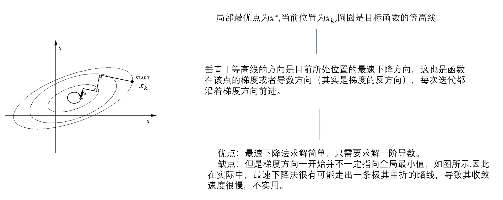


### 二阶梯度法：牛顿法

> `牛顿法`：仅依赖于目标函数的二阶导，在很多情况下是不现实的

- **我们从二阶泰勒展开式开始推导**：
  $$
  F(x_{k}+\Delta x_{k})\approx F(x_{k})+J\left(x_{k}\right)^{\mathrm{T}}\Delta x_{k}+\frac{1}{2}\Delta x_{k}^{\mathrm{T}}H(x_{k})\Delta x_{k}.
  $$
  其中：

  - $F(x)$：目标函数（标量）

  - $J(x)=\nabla F(x)$：梯度（列向量）

  - $H(x)=\nabla^2 F(x)$：Hessian（矩阵）
  - $\Delta x_k$：我们要找的**增量（step）**

- **目标：找到一个最优的增量 $\Delta x_k$**

  我们当前在点：$x_k$，我们希望找到一个 小步长$\Delta x_{k}$ ，使得 函数值$F(x_k+\Delta x_k)$ 尽量小。

  但是这个函数很复杂，我们不好直接最小化，所以我们**使用 二阶泰勒展开 来近似它**，即上面的这个二阶泰勒展开式
  $$
  使得F(x_k+\Delta x_k)\approx\text{一个二次函数}
  $$
  而且**二次函数可以直接求最小值**

- **把问题变成一个`二次优化问题`**

  我们定义：
  $$
  \phi(\Delta x_k)=F(x_k)+J(x_k)^T\Delta x_k+\frac{1}{2}\Delta x_k^TH(x_k)\Delta x_k
  $$
  注意到，因为$F(x_k)$是一个常数，对`最小化`没有影响，所以我们把这个项去除：
  $$
  \phi(\Delta x_k)=J(x_k)^T\Delta x_k+\frac{1}{2}\Delta x_k^TH(x_k)\Delta x_k
  $$

- **关键步骤：对$\Delta x_{k}$求导**

  因为我们是要求 $\phi(\Delta x_k)$ 的`最小值`，又因为该函数是一个`二次函数`，所以我们要求该函数的`极值`，所以：
  $$
  \frac{\partial\phi}{\partial\Delta x_k}=0
  $$
  现在我们要逐项求导：

  - **第一项**：$J(x_k)^T\Delta x_k$

    其中：

    - $J(x_k)^T$：常数向量，表示梯度
    - $\Delta x_k$：变量向量

    所以导数为： $J(x_k)$

  - **第二项**：$\frac{1}{2}\Delta x_k^TH(x_k)\Delta x_k$

    这是一个`二次型`

    有一个非常重要的公式：

    如果：
    $$
    f(x)
    =
    \frac12 x^T H x
    $$
    那么：
    $$
    \nabla f(x)
    =
    H x
    $$
    （当 H 是对称矩阵，Hessian 一定是对称的）

    所以：
    $$
    \frac{\partial}{\partial \Delta x_k}
    \left(
    \frac12
    \Delta x_k^T
    H(x_k)
    \Delta x_k
    \right)
    =
    H(x_k)
    \Delta x_k
    $$

  - 把这两项导数加起来：
    $$
    J(x_k)+H(x_k)\Delta x_k=0
    $$

- **解求导后的方程**

  我们要解：
  $$
  J(x_k)+H(x_k)\Delta x_k=0 \\
  转换为 \\
  H(x_k)\Delta x_k=-J(x_k)
  $$
  两边同时乘 $H(x_k)^{-1}$ ，得到：
  $$
  \Delta x_k=-H(x_k)^{-1}J(x_k)
  $$

- **然后我们得到了`牛顿法的核心公式`**

  上式代入：
  $$
  x_{k+1}=x_k+\Delta x_k
  $$
  得到`牛顿迭代公式`：
  $$
  \boxed{x_{k+1}=x_k-H(x_k)^{-1}\nabla F(x_k)}
  $$
  因为牛顿法使用了`海塞矩阵（Hessian）`，

  > `海塞矩阵`：
  >
  > - 它知道：梯度方向、曲率（弯曲程度），所以可以 <span style="color:red">一步跳到最小值</span>
  >
  >   **（这就代表了如果函数是 严格二次函数 ，那么 一次就收敛）**
  >
  > - 但是有一个问题：在问题规模较大时非常困难，我们通常倾向于避免$H$的计算。


### 高斯牛顿法

> `高斯牛顿法`的思想：将`残差向量`$f(x)$进行一阶的泰勒展开

> [!NOTE]
>
> `最速下降法`和`牛顿法`虽然直观，但实用中存在一些缺点
>
> - 最速下降法过于贪婪，容易走出锯齿路线，增加迭代次数
> - 牛顿法迭代次数少，但是需要计算复杂的H矩阵，并且H不一定是正定矩阵

- 因为我们要求解的原始问题是：
  $$
  \min_{\boldsymbol{x}}F(\boldsymbol{x})=\frac{1}{2}\|f\left(\boldsymbol{x}\right)\|^2=\frac{1}{2}f(x)^Tf(x)
  $$

- 现在我们设：
  $$
  x=x_k+\Delta x
  $$

- 代入原式得：
  $$
  F(x_k+\Delta x)=\frac{1}{2}\|f(x_k+\Delta x)\|^2=\frac{1}{2}f(x_k+\Delta x)^Tf(x_k+\Delta x)
  $$

- 🤔怎么计算$f(x_k+\Delta x)$？使用`泰勒展开近似`

  - 我们在 $x_k$ 附近求`泰勒展开`：
    $$
    f(x_k+\Delta x)\approx f(x_k)+J(x_k)\Delta x
    $$
    其中：

    + $J(x_k)=\frac{\partial f}{\partial x}$ 是`雅可比矩阵`

  - 然后我们把泰勒展开式代回原式，得到：
    $$
    F(x_k+\Delta x)\approx\frac{1}{2}\|f(x_k)+J(x_k)\Delta x\|^2
    $$

- 然后我们展开这个平方：
  $$
  \frac{1}{2}\|f(x_k)+J(x_k)\Delta x\|^2=\frac{1}{2}(f(x_k)+J(x_k)\Delta x)^T(f(x_k)+J(x_k)\Delta x)=\frac{1}{2}\left[f(x_k)^Tf(x_k)+2f(x_k)^TJ(x_k)\Delta x+\Delta x^TJ(x_k)^TJ(x_k)\Delta x\right]
  $$

- 然后我们对$\Delta x$求导并令其为0

  - 最小值条件：
    $$
    \frac{\partial}{\partial\Delta x}=0
    $$

  - 逐项求导：
    - 第一项：$f_k^Tf_k$是常数，求导为0
    - 第二项：$f_k^TJ_k\Delta x$，导数为$J_k^Tf_k$
    - 第三项：$\frac{1}{2}\Delta x^{T}J_{k}^{T}J_{k}\Delta x$，导数为$J_k^TJ_k\Delta x$

  - 合并求导项：
    $$
    J_k^Tf_k+J_k^TJ_k\Delta x=0
    $$
    整理得`高斯牛顿方程`：
    $$
    \boxed{J_k^TJ_k\Delta x=-J_k^Tf_k}
    $$

- 解出步长$\Delta x$

  理论上：
  $$
  \boxed{
  \Delta x
  =
  -
  (
  J_k^T
  J_k
  )^{-1}
  J_k^T
  f_k
  }
  $$
  但实际工程中：

  不会求逆，而是：
  $$
  \boxed{\text{解线性方程}} \\
  J_k^TJ_k\Delta x=-J_k^Tf_k
  $$

- 更新参数

  这是所有迭代法的统一形式：
  $$
  \boxed{
  x_{k+1}
  =
  x_k
  +
  \Delta x
  }
  $$
  所以得到`高斯-牛顿迭代公式`：
  $$
  \boxed{
  x_{k+1}
  =
  x_k
  -
  (
  J_k^T
  J_k
  )^{-1}
  J_k^T
  f_k
  }
  $$


### 列文伯格—马夸尔特方法（阻尼牛顿法）

> `列文伯格—马夸尔特方法`：高斯牛顿法中采用的近似二阶泰勒展开只能在展开点附近有较好的近似效果，所以我们很自然地想到应该给 $\Delta\boldsymbol{x}$ 添加一个范围，称为`信赖区域（Trust Region）`。这个范围定义了在什么情况下二阶近似是有效的，这类方法也称为`信赖区域方法（Trust Region Method）`。在信赖区域里边，我们认为近似是有效的；出了这个区域，近似可能会出问题。

- 🤔如何确定**信赖区域的范围**呢？

  - 一个比较好的方法是根据我们的近似模型跟实际函数之间的差异来确定：

    如果差异小，说明近似效果好，我们扩大近似的范围；

    如果差异大，就缩小近似的范围。

  - 我们定义一个指标 *ρ* 来**刻画近似的好坏程度**：
    $$
    \rho=\frac{f\left(\boldsymbol{x}+\Delta\boldsymbol{x}\right)-f\left(\boldsymbol{x}\right)}{\boldsymbol{J}\left(\boldsymbol{x}\right)^\mathrm{T}\Delta\boldsymbol{x}}.
    $$
    其中：

    - 分子：**实际函数**下降的值
    - 分母：**近似模型**下降的值

    $\rho$的三种情况：

    - 如果 $\rho$ 接近于 1，则近似是好的。
    - 如果 $\rho$ 太小，说明实际减小的值远少于近似减小的值，则认为**近似比较差，需要缩小近似范围**。
    - 如果 $\rho$ 比较大，则说明实际下降的比预计的更大，我们可以**放大近似范围**。

- 我们回到原始问题：
  $$
  \min_{\boldsymbol{x}}F(\boldsymbol{x})=\frac{1}{2}\|f\left(\boldsymbol{x}\right)\|^2=\frac{1}{2}f(x)^Tf(x)
  $$

  > 我们构建一个改良版的非线性优化框架，该框架会比高斯牛顿法有更好的效果：
  >
  > 1. **人为给定初始值$x_0$，以及初始优化半径$\mu$**
  >
  > 2. 对于第$k$次迭代，在高斯牛顿法的基础上加上信赖区域，求解：
  >    $$
  >    \min_{\Delta\boldsymbol{x}_k}\frac12\Big\|f\left(\boldsymbol{x}_k\right)+\boldsymbol{J}\left(\boldsymbol{x}_k\right)^\mathrm{T}\Delta\boldsymbol{x}_k\Big\|^2,\quad\mathrm{s.t.}\quad\left\|\boldsymbol{D}\Delta\boldsymbol{x}_k\right\|^2\leqslant\mu
  >    $$
  >    其中
  >
  >    - $\mu$：信赖区域的半径，这就把信赖区域变成一个球。
  >
  >    - $D$：系数矩阵，因为有$\mu$的存在，所以信赖区域就变成了一个椭球
  >
  >      `列文伯克`提出的优化方法中，$D$取单位矩阵$I$，相当于把$\Delta\boldsymbol{x}_k$约束在一个球中**（也就是说所有变量允许的步长一样大。但问题是在现实中，不同变量对误差的影响差别非常大，也就是说不同维度“敏感度”不同。所以$D$取单位矩阵$I$其实并不合理）**
  >
  >      `马夸尔特`提出的优化方法中，$D$取**非负数对角矩阵（主对角线之外的元素全为0的方阵）**（实际中通常用$J^TJ$的对角元素平方根，即$D=\operatorname{diag}\left(\sqrt{(J^TJ)_{11}},\ldots,\sqrt{(J^TJ)_{nn}}\right)=\begin{bmatrix}\sqrt{(J^TJ)_{11}}&0&0&\cdots&0\\0&\sqrt{(J^TJ)_{22}}&0&\cdots&0\\0&0&\sqrt{(J^TJ)_{33}}&\cdots&0\\\vdots&\vdots&\vdots&\ddots&\vdots\\0&0&0&\cdots&\sqrt{(J^TJ)_{nn}}\end{bmatrix}$，使得在梯度小的维度上约束范围更大一些，这就解决了`列文伯克`提出的方式的问题）
  >
  > 3. 按式子 $\rho=\frac{f\left(\boldsymbol{x}+\Delta\boldsymbol{x}\right)-f\left(\boldsymbol{x}\right)}{\boldsymbol{J}\left(\boldsymbol{x}\right)^\mathrm{T}\Delta\boldsymbol{x}}$ 计算 $\rho$
  >
  > 4. 若 $\rho>\frac34$ （阈值是一个经验值），则设置 $\mu=2\mu$（这个近似范围扩大的倍数是一个经验值）
  >
  >   这里表示 该模型非常可靠，可以**扩大信任域**
  >
  > 5. 若 $\rho<\frac14$ （阈值是一个经验值），则设置 $\mu=0.5\mu$（这个近似范围缩小的倍数是一个经验值）
  >
  >   这里表示 模型很差，需要**缩小信任域**
  >
  > 6. 如果 $\rho$ 大于 某阈值($\mathrm{\eta}$，是否接受步长)，则认为`近似可行（注意：这里表达的是“至少不坏”，而不是“很好”）`。令 $x_{k+1}=x_k+\Delta x_k$ 
  >
  >   这是一个`迭代`的过程，如果 $\rho>\mathrm{\eta}$ 则接受**步长$\Delta\boldsymbol{x}_{k}$**，然后就更新$x_k$。否则**步长$\Delta\boldsymbol{x}_{k}$**被拒绝，不更新$x_k$。算法继续迭代...（即第7步）
  >
  > 7. 判断算法是否收敛。如不收敛则返回 第2步，否则结束。

- 无论如何，我们都需要解这个子问题来获得`梯度`：
  $$
  \min_{\Delta\boldsymbol{x}_k}\frac12\Big\|f\left(\boldsymbol{x}_k\right)+\boldsymbol{J}\left(\boldsymbol{x}_k\right)^\mathrm{T}\Delta\boldsymbol{x}_k\Big\|^2,
  \quad\mathrm{s.t.}\quad
  \left\|\boldsymbol{D}\Delta\boldsymbol{x}_k\right\|^2\leqslant\mu
  $$
  这个子问题是**带不等式约束**的**优化问题**，我们用 **拉格朗日乘子$\lambda$** 把约束项放到目标函数中，构成`拉格朗日函数`

  - **明确问题中的`目标函数`和`约束条件`，以构造`拉格朗日函数`**
    - 约束条件：$\left\|\boldsymbol{D}\Delta\boldsymbol{x}_k\right\|^2\leqslant\mu$，拉格朗日方法要求约束写成：$\left\|\boldsymbol{D}\Delta\boldsymbol{x}_k\right\|^2-\mu\leq0$
    - 目标函数：$\frac12\Big\|f\left(\boldsymbol{x}_k\right)+\boldsymbol{J}\left(\boldsymbol{x}_k\right)^\mathrm{T}\Delta\boldsymbol{x}_k\Big\|^2$
    - 构造拉格朗日函数：$L(\Delta\boldsymbol{x}_k,\lambda)=\frac12{\left\|f\left(\boldsymbol{x}_k\right)+\boldsymbol{J}\left(\boldsymbol{x}_k\right)^\mathrm{T}\Delta\boldsymbol{x}_k\right\|}^2+\lambda\left({\left\|\boldsymbol{D}\Delta\boldsymbol{x}_k\right\|}^2-\mu\right)$

  - 解方程组$\begin{cases}L_{\Delta x}=0\\L_{\lambda}=0&\end{cases}$

    - 计算$L_{\Delta x}=0$，即$L(\Delta\boldsymbol{x}_k,\lambda)=\frac12{\left\|f\left(\boldsymbol{x}_k\right)+\boldsymbol{J}\left(\boldsymbol{x}_k\right)^\mathrm{T}\Delta\boldsymbol{x}_k\right\|}^2+\lambda\left({\left\|\boldsymbol{D}\Delta\boldsymbol{x}_k\right\|}^2-\mu\right)$对$\Delta\boldsymbol{x}_{k}$求导

      - 对**第一项** $\frac{1}{2}\|f(\boldsymbol{x}_k)+\boldsymbol{J}(\boldsymbol{x}_k)^T\Delta\boldsymbol{x}_k\|^2$

        用一个标准公式：
        $$
        \nabla_x
        \frac12
        \|a+Bx\|^2
        =
        B
        (
        a+Bx
        )
        $$
        这里：
        $$
        a=f(\boldsymbol{x}_k) \\
        B=\boldsymbol{J}(\boldsymbol{x}_k)
        $$
        所以求导得：
        $$
        \boldsymbol{J}(\boldsymbol{x}_k)
        \left(
        f(\boldsymbol{x}_k)
        +
        \boldsymbol{J}(\boldsymbol{x}_k)^T
        \Delta\boldsymbol{x}_k
        \right)
        $$

      - 对**第二项** $\lambda\left(\left\|D\Delta\boldsymbol{x}_k\right\|^2-\mu\right)$

        改写这个式子：
        $$
        \lambda\left(\left\|D\Delta\boldsymbol{x}_k\right\|^2-\mu\right)
        =\lambda\left\|D\Delta\boldsymbol{x}_k\right\|^2 - \lambda\mu \\ 
        =\lambda(\boldsymbol{D}\Delta\boldsymbol{x}_k)^T(\boldsymbol{D}\Delta\boldsymbol{x}_k) - \lambda\mu
        $$

        - 对 $\lambda(\boldsymbol{D}\Delta\boldsymbol{x}_k)^T(\boldsymbol{D}\Delta\boldsymbol{x}_k)$ 求导：

          因为一个重要公式：
          $$
          \nabla_x(x^TAx)=2Ax\quad\text{(A 对称)}
          $$
          代入得求导后：
          $$
          2\lambda\boldsymbol{D}^T\boldsymbol{D}\Delta\boldsymbol{x}_k
          $$

        - 对 $\lambda\mu$ 求导：为0

      - **合并两个求导项**：
        $$
        \begin{aligned}\boldsymbol{J}(\boldsymbol{x}_k)\left(f(\boldsymbol{x}_k)+\boldsymbol{J}(\boldsymbol{x}_k)^T\Delta\boldsymbol{x}_k\right)+2\lambda\boldsymbol{D}^T\boldsymbol{D}\Delta\boldsymbol{x}_k&=0\\(\boldsymbol{x}_k)f(\boldsymbol{x}_k)+\boldsymbol{J}(\boldsymbol{x}_k)\boldsymbol{J}(\boldsymbol{x}_k)^T\Delta\boldsymbol{x}_k+2\lambda\boldsymbol{D}^T\boldsymbol{D}\Delta\boldsymbol{x}_k&=0\\\left(\boldsymbol{J}(\boldsymbol{x}_k)\boldsymbol{J}(\boldsymbol{x}_k)^T+2\lambda\boldsymbol{D}^T\boldsymbol{D}\right)\Delta\boldsymbol{x}_k&=-\boldsymbol{J}(\boldsymbol{x}_k)f(\boldsymbol{x}_k)\end{aligned}
        $$

    - 计算$L_{\lambda}=0$，即$L(\Delta\boldsymbol{x}_k,\lambda)=\frac12{\left\|f\left(\boldsymbol{x}_k\right)+\boldsymbol{J}\left(\boldsymbol{x}_k\right)^\mathrm{T}\Delta\boldsymbol{x}_k\right\|}^2+\lambda\left({\left\|\boldsymbol{D}\Delta\boldsymbol{x}_k\right\|}^2-\mu\right)$对$\lambda$求导

      - 对**第一项** $\frac{1}{2}\|f(\boldsymbol{x}_k)+\boldsymbol{J}(\boldsymbol{x}_k)^T\Delta\boldsymbol{x}_k\|^2$，求得为0
      - 对**第二项** $\lambda\left(\left\|D\Delta\boldsymbol{x}_k\right\|^2-\mu\right)$，求得为$\|\boldsymbol{D}\Delta\boldsymbol{x}_k\|^2=\mu$

    - 得到`核心方程组`：
      $$
      \boxed{\begin{cases}\left(\boldsymbol{J}(x_k)\boldsymbol{J}(x_k)^{T}+2\lambda\boldsymbol{D}^{T}\boldsymbol{D}\right)\Delta\boldsymbol{x}_{k}=-\boldsymbol{J}(x_k)f(\boldsymbol{x}_{k})\\\\\|\boldsymbol{D}\Delta\boldsymbol{x}_{k}\|^{2}=\mu&&&\end{cases}}
      $$
      其中：

      - 第一个方程是 **stationarity 条件**（梯度为零）
      - 第二个方程是 **约束激活条件**（互补条件）

    - **解开这个`核心方程组`的思路**：

      这个方程组是**线性方程 + 非线性方程耦合**（因为 $\lambda$ 乘在 $D^TD$ 上，影响 $\Delta\boldsymbol{x}_{k}$ 的解，所以第二个方程实际上是关于 $\lambda$ 的非线性方程）。

      一般求解方法：

      1. **给定 $\lambda$**，解线性方程求 $\Delta\boldsymbol{x}_{k}$：
         $$
         (\boldsymbol{J}\boldsymbol{J}^\mathrm{T} + 2\lambda \boldsymbol{D}^\mathrm{T}\boldsymbol{D}) \,\Delta \boldsymbol{x}_k = -\boldsymbol{J} f(\boldsymbol{x}_k)
         $$

      2. **检查信赖域约束**：
         $$
         \|\boldsymbol{D}\Delta \boldsymbol{x}_k\|^2 \stackrel{?}{=} \mu
         $$

      3. 如果不满足，再**调整 λ**（通常增大 λ 缩小步长，减小 λ 放大步长），重复 1-2 步，直到满足约束。

      直观理解：

      - λ = 0 → Δx 是普通高斯牛顿步**（约束可能未激活）**
      - λ 越大，Δx 越小，步长被控制在信赖域内，不会跳出安全区域。
      - λ 控制 **步长大小**，保证 Δx 在球面（或椭圆）$\|\boldsymbol{D}\Delta x\|^2 = \mu$ 上


---


# 视觉里程计1

> SLAM系统分为`前端`和`后端`，
>
> 其中前端也称为视觉里程计（VO）。VO 根据相邻图像的信息估计出粗略的相机运动，给后端提供较好的初始值。
>
> VO算法主要分为两类：
>
> - `特征点法（主流）`：具有稳定，对光照、动态物体不敏感的优势，是目前比较成熟的解决方案。
> - `直接法`

## 特征点法

### 特征点

> `VO`的核心问题：如何根据图像来估计相机运动

- **问题**：图像本身是一个由亮度和色彩组成的矩阵，如果直接从矩阵层面考虑运动估计，将会非常困难。

- **做法**：

  - 从图像中选取比较**有代表性的点**。这些点在相机视角发生少量变化后会保持不变，于是我们能在各个图像中找到相同的点。

    （在**经典SLAM**中，我们称这些点为`路标`。在**视觉SLAM**中，路标是指`图像特征`）

  - 然后，在这些点的基础上，讨论相机位姿估计问题，以及这些点的定位问题。

- `图像特征`

  > `图像特征`：是一组与计算任务相关的信息，计算任务取决于具体的应用。（**`特征`是图像信息的另一种数字表达式**，一组好的特征对于在指定任务上的最终表现至关重要）

  `图像特征`：

  - 数字图像在计算机中以`灰度值矩阵`的方式存储，所以最简单的，**单个图像像素也是一种“特征”**。

  - 但是，在视觉里程计中，我们希望 **特征点在相机运动之后保持稳定**

    而**灰度值受光照、形变、物体材质的影响严重**，在不同图像间变化非常大，不够稳定。

    理想的情况是，当场景和相机视角发生少量改变时，算法还能从图像中判断哪些地方是同一个点。

    所以，**仅凭`灰度值`是不够的，我们需要对图像提取特征点**。

- `特征点`

  - 特征点是图像里一些**特别的地方**，如图像中的`角点`、`边缘`、`区块`

    `角点`：图像中局部灰度变化很明显的点，比如建筑物的拐角、棋盘格的交点等。

    `边缘`：图像中灰度变化大的线，比如墙与地面交界的线。

    `区域`：图像中灰度几乎没有变化的局部区域，比如一面均匀的墙、一块天空、一块草地

    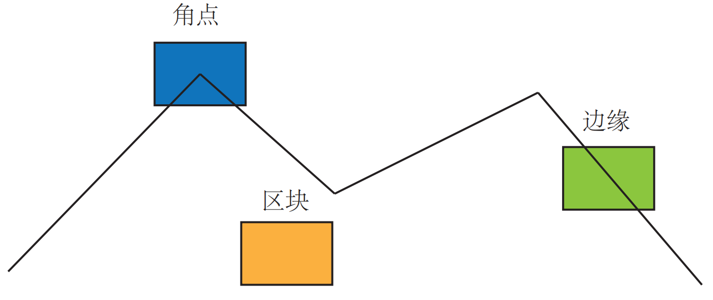

  - 我们可以把图像中的`角点`、`边缘`和`区块`都当成图像中有代表性的地方。

    - `角点`：较容易识别。

      角点的特点：局部区域中的灰度值在两个方向上（水平方向和垂直方向）都有明显变化，所以它在不同的图像中比较容易被唯一识别。

    - `边缘`：较难识别。

      边缘的问题：沿着边缘的**灰度变化方向**相对一致，所以局部看起来很相似，没有明显的“唯一特征”。

    - `区块`：最困难

      因为每个像素点看起来都很相似 → 在另一张图中很难找到对应点，所以没有可辨认的特征

    > 那么我们知道，一种 **直观的提取特征的方式** 就是**在不同图像间辨认`角点`**，确定它们的对应关系。在这种做法中，`角点`就是所谓的`特征`。

  - **方法论**

    - **纯角点提取算法（2000年前）**：Harris 角点、FAST 角点、GFTT 角点 等

    - 纯角点提取算法已经无法满足，设计了**更多稳定的局部图像特征算法**（现代）：

      1. 例如：从远处看上去是角点的地方，当相机走近之后，可能就不显示为角点了。或者，当旋转相机时，角点的外观会发生变化，我们也就不容 易辨认出那是同一个角点。

      2. `现代提出的特征点`：SIFT、SURF、ORB

      3. 人工设计的特征点拥有如下性质：

         - 可重复性（Repeatability）：相同的特征可以在不同的图像中找到。

         - 可区别性（Distinctiveness）：不同的特征有不同的表达。

         - 高效率（Efficiency）：同一图像中，特征点的数量应远小于像素的数量。

         - 本地性（Locality）：特征仅与一小片图像区域相关。

  - **特征点的`组成`**

    `特征点`由`关键点`和`描述子`组成。

    - `关键点`：该特征点在图像的位置，有些特征点还具有朝向、大小等信息。

    - `描述子`：通常是一个向量，按照某种人为设计的方式，描述了该关键点周围像素的信息。

      描述子的设计原则：<span style="color:red">外观相似的特征应该有相似的描述子</span>

      因此，只要**两个特征点的描述子在向量空间上的距离相近**，就可以认为它们是**同样的特征点**。

- **历史上提出的`图像特征`**

  - 第一种：**精确，在相机的运动和光照变化下仍具有相似的表达，但是需要巨大的计算量**

    例如：`SIFT（尺度不变特征变换，Scale-Invariant FeatureTransform）`

    - 它充分考虑了在图像变换过程中出现的光照、尺度、旋转等变化，

    - 但随之而来的是极大的计算量。
    - 由于整个 SLAM 过程中图像特征的提取与匹配仅仅是诸多环节中的一个，普通 PC 的 CPU 还无法实时地计算 SIFT 特征，进行定位与建图。所以在 SLAM 中我们甚少使用这种“奢侈”的图像特征。

  - 第二种：**适当降低精度和鲁棒性，以提升计算的速度**

    例如：

    - `FAST 关键点（检测子 检测出来的实例）`属于计算特别快的一种`特征点`**（注意这里“关键点”的表述，说明它没有描述子）**

    - `ORB（Oriented FAST and Rotated BRIEF）特征`是具有代表性的实时`图像特征`。

      - 改进了`FAST检测子（快速检测图像中的角点（关键点候选位置））`不具有方向性的问题
      - 采用速度极快的二进制`描述子 BRIEF`

      使整个图像特征提取的环节大大加速。


### ORB 特征

ORB 特征也是由`关键点`和`描述子`两部分组成。

- `关键点`：“Oriented FAST”，是一种改进的FAST角点
- `描述子`：BRIEF

提取ORB特征分为两个步骤：

- `FAST 角点提取`：找出**图像中的“角点”**。相较于原版的 FAST，ORB 中计算了特征点的主方向，为后续的 BRIEF 描述子增加了`旋转不变特性`。

- `BRIEF 描述子`：对前一步提取出特征点的周围图像区域进行描述。ORB 对 BRIEF 进行了一些改进，主要是指在 BRIEF 中使用了先前计算的方向信息。


#### FAST关键点

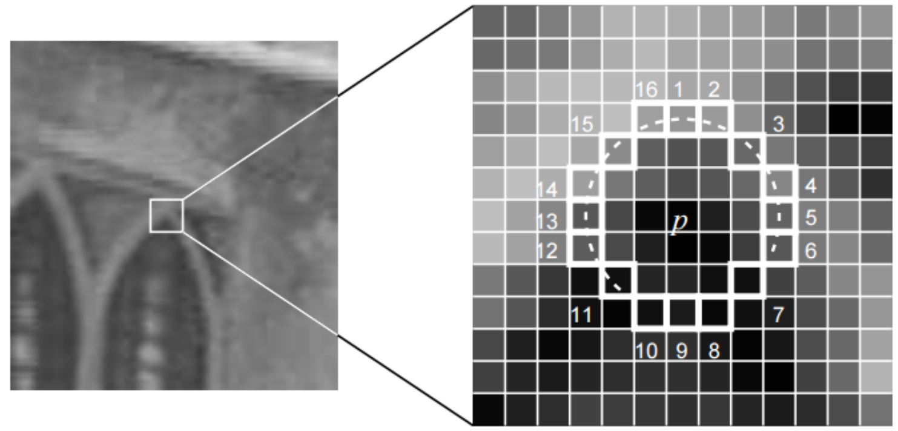

- **概念**：FAST是一种角点，主要检测局部像素灰度变化明显的地方，以速度快著称

- **思想**：如果一个像素与邻域的像素差别较大（过亮或过暗），那么它更可能是角点。相比于其他角点检测算法，FAST 只需**比较像素亮度的大小**，十分快捷。

- **检测过程**：

  1. 在图像中选取像素$p$，假设它的亮度为$I_{p}$。

  2. 设置一个阈值$T$(比如$I_p$的 20% )。
  3. 以像素$p$为中心，选取**半径为3的圆上（不包括 中心像素$p$）**的 16 个像素点。
  4. 假如选取的圆上有连续的$N$个点的亮度大于$I_p+T$或小于$I_p-T$，那么像素$p$可以被认为是特征点($N$通常取 12，即为 FAST-12。其他常用的$N$取值为 9 和 11，它们分别被称为 FAST-9 和 FAST-11 )。
  5. 循环以上四步，对每一个像素执行相同的操作。

  > [!NOTE]
  >
  > `预测试操作`：在 FAST-12 算法中，为了更高效，可以添加一项预测试操作，以快速地排除绝大多数不是角点的像素。
  >
  > 具体操作为
  >
  > - 对于每个像素，直接检测邻域圆上的第 1,5,9,13 个像素的亮度。
  > - 只有当这 4个像素中有 3 个同时大于$I_p+T$或小于$I_p-T$时，当前像素才有可能是一个角点，否则应该直接排除。
  > - 这样的预测试操作大大加速了角点检测。

  > [!NOTE]
  >
  > `角点“扎堆”现象`
  >
  > 原始的 FAST 角点经常出现“扎堆”的现象。所以在第一遍检测之后，还需要用`非极大值抑制（Non-maximal suppression）`，在一定区域内仅保留响应极大值的角点，避免角点集中的问题。

- **优缺点**

  - **优点**：FAST 特征点的计算仅仅是比较像素间亮度的差异所所以速度非常快
  - **缺点**：重复性不强、分布不均匀、FAST角点**不具有方向信息**且存在**尺度问题**（在远处看像角点的地方，接近后看就不是角点了）

  为此，ORB对FAST角点进行改进：

  针对 **FAST 角点不具有方向性和尺度的弱点**，ORB 添加了`尺度和旋转的描述`。

  - `尺度不变性`由构建图像`金字塔`，并在金字塔的每一层上检测角点来实现

  - `特征的旋转`是由`灰度质心法（Intensity Centroid）`实现的。

- `金字塔`

  金字塔是计算图视觉中常用的一种处理方式。**金字塔底层是原始图像**。

  原理：每往上一层，就对图像进行一个固定倍率的缩放，这样我们就有了不同分辨率的图像。较小的图像可以看

  成是远处看过来的场景。

  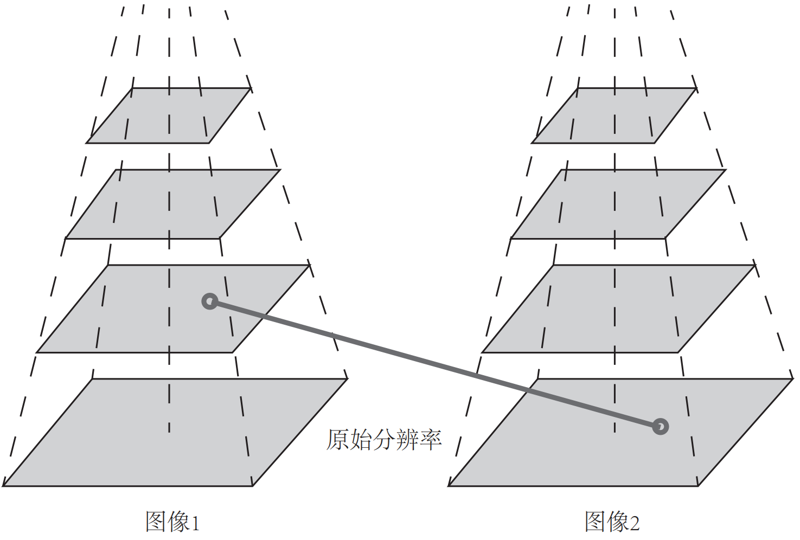

  在特征匹配算法中，我们可以**匹配不同层上的图像**，从而实现`尺度不变性`。

  例如，如果相机在后退，那么我们应该能够在上一个图像金字塔的上层和下一个图像的下层中找到

  匹配。

- `灰度质心法`

  - `质心`：以**图像块灰度值**作为权重的中心

    - 我们类比`物理学中的质心`：其实就是一个物体的重心（按重量算的平均位置）：
      $$
      x_c=\frac{\sum_im_ix_i}{\sum_im_i},\quad y_c=\frac{\sum_im_iy_i}{\sum_im_i}
      $$
      其中：

      - $m_i$是第$i$个小部分的质量
      - $x_i,y_i$是它的位置坐标
      - 质心的意思就是"按重量算的平均位置"。

    - `灰度质心法中的质心`：把图像块（patch）当作一个“平面物体”，把每个像素的**灰度值当作质量 $m_i$**
      $$
      x_c = \frac{\sum_i I_i \cdot x_i}{\sum_i I_i}, \quad y_c = \frac{\sum_i I_i \cdot y_i}{\sum_i I_i}
      $$
      其中：

      - $I_i$ 是像素 $i$ 的灰度值
      - $x_i, y_i$ 是像素的坐标
      - 得到的 $(x_c, y_c)$ 就是**灰度质心**，也就是“灰度加权的中心位置”。

  - **操作步骤**：

    1. 在一个小的图像块$B$中，定义图像块的`矩`为

       > `矩`：矩（moment）是一种**加权平均**，可以描述“分布的特征”。
       >
       > - 对一个一维函数 $f(x)$：
       >
       > $$
       > M_n = \sum_i x_i^n f(x_i)
       > $$
       >
       > - 对二维函数（图像）$I(x,y)$：
       >
       > $$
       > M_{pq} = \sum_x \sum_y x^p y^q I(x,y)
       > $$
       >
       > 这里：
       >
       > - $p, q$ 是矩的阶数（整数）
       > - $I(x,y)$ 是像素灰度值
       > - $M_{00}$ -> 总灰度（类似总“质量”）
       > - $M_{10}, M_{01}$ -> 灰度质心位置的分子部分

       $$
       m_{pq}=\sum_{x,y\in B}x^py^qI(x,y),\quad p,q=\{0,1\}.
       $$

       其中：

       - $m_{00} = \sum I(x,y)$ → **总灰度**
       - $m_{10} = \sum x I(x,y), \quad m_{01} = \sum y I(x,y)$ → 计算灰度质心
       - 高阶矩（$p+q \ge 2$） → 描述图像块的形状、方向、分布等特征

    2. 通过矩可以找到图像块的`质心`$C$：
       $$
       C=(\frac{m_{10}}{m_{00}},\frac{m_{01}}{m_{00}}).
       $$

    3. 连接图像块的 几何中心$O$ 与 质心$C$，得到一个方向向量$\overrightarrow{OC}$，其中$\overrightarrow{OC}=(C_x-0,C_y-0)$，于是特征点的方向可以定义为
      $$
      \begin{aligned}&\theta=\arctan\left(\frac{y}{x}\right)\\&\theta=\arctan\left(\frac{m_{01}/m_{00}}{m_{10}/m_{00}}\right)\\&\theta=\arctan\left(\frac{m_{01}}{m_{10}}\right)\end{aligned}
      $$

    通过以上方法，FAST 角点便具有了尺度与旋转的描述，从而大大提升了其在不同图像之间表述的鲁棒性。所以在 ORB 中，把这种改进后的 FAST 称为 Oriented FAST。


#### BRIEF描述子

BRIEF 是一种`二进制描述子`，其描述向量由许多个0和1组成，这里的0和1编码了关键点附近两个随机像素(比如$p$和$q$)的大小关系：如果$p$比$q$大，则取 1，反之就取 0。如果我们取了128个这样的$p,q$，最后就得到 128 维由 0、1 组成的向量。

BRIEF 使用了`随机选点`的比较，速度非常快，而且由于使用了二进制表达，存储起来也十分方便，适用于实时的图像匹配。

原始的 BRIEF 描述子**不具有`旋转不变性`**，因此在图像发生旋转时容易丢失。而 ORB 在 FAST 特征点提取阶段计算了**关键点的方向**，所以可以利用方向信息，计算了旋转之后的“Steer BRIEF”特征**使 ORB 的描述子具有较好的旋转不变性**。


### 特征匹配

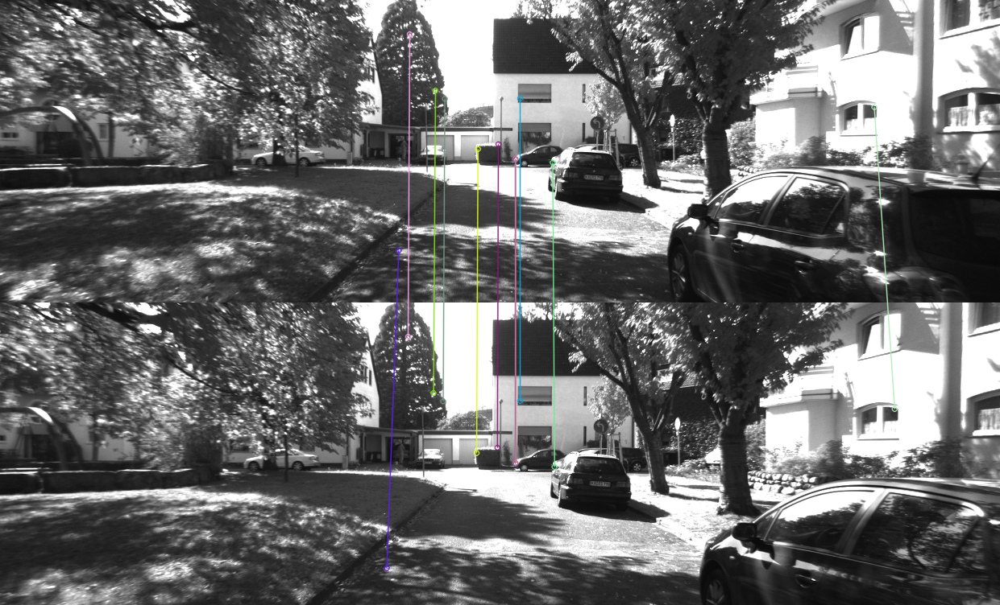

> **目前特征匹配中的不足**：
>
> `特征匹配`是视觉 SLAM 中极为关键的一步，宽泛地说，特征匹配解决了 SLAM中的`数据关联问题（data association）`，即确定当前看到的路标与之前看到的路标之间的对应关系。通过对图像与图像或者图像与地图之间的描述子进行准确匹配，我们可以为后续的姿态估计、优化等操作减轻大量负担。然而，由于图像特征的局部特性，`误匹配`的情况广泛存在，而且长期以来一直没有得到有效解决，目前已经成为视觉 SLAM 中制约性能提升的一大瓶颈。**部分原因是场景中经常存在大量的重复纹理，使得特征描述非常相似。**在这种情况下，仅利用局部特征解决误匹配是非常困难的。

- 问题：考虑两个时刻的图像：

  如果在 图像$I_t$ 中提取到 特征点$x_t^m,m=1,2,...,M$，

  在 图像$I_{t+1}$ 中提取到 特征点$x_{t+1}^n,n=1,2,...,N$ 

  **如何寻找这两个集合元素的对应关系呢？**

- 最简单的特征匹配方法就是`暴力匹配(Brute-Force Matcher )`。即对每一个特征点$x_t^m$与所有的$x_t+1^n$**测量`描述子`的距离**，然后排序，取最近的一个作为匹配点。可以这样做的原因是：

  > `描述子`距离表示了两个特征之间的相似程度

  - 不过在实际运用中还可以取**不同的`距离度量范数（测量描述子的距离的方法）`**。

    **浮点类型的描述子**：使用`欧氏距离`作为度量。

    **二进制的描述子(比如BRIEF)**：使用`汉明距离(Hamming distance)`（两个二进制串之间的汉明距离，指的是其不同位数的个数）作为度量。

  - **🤔该算法的问题**

    当特征点数量很大时，`暴力匹配法`的运算量将变得很大，特别是当想要匹配某个帧和一张地图的时候。这不符合我们在 SLAM 中的实时性需求。那么这个时候就引出了另外一个方法👇

    <div style="color: red; text-align: center;">
        快速近似最近邻（FLANN）算法 <br />
        （该算法更适用于匹配点数量极多的情况）
    </div>


## 实践：特征提取和匹配

### 相机运动估计

我们已经有了匹配好的点对，接下来，我们要根据点对来估计相机的运动。这里由于相机的原理不同，情况发生了变化：

1. 当相机为`单目`时，我们只知道 2D 的像素坐标，因而问题是根据两组 **2D** 点估计运动。该问题用对`极几何`来解决。

2. 当相机为`双目`、`RGB-D` 时，或者通过某种方法得到了距离信息，那么问题就是根据两组 **3D**点估计运动。该问题通常用 `ICP` 来解决。

3. 如果一组为 `3D`，一组为 `2D`，即，我们得到了一些 3D 点和它们在相机的投影位置，也能估计相机的运动。该问题通过 `PnP` 求解。

因此，下面几节就来介绍这三种情形下的相机运动估计。我们将从信息最少的 2D−2D 情形出发，看看它如何求解，求解过程又有哪些麻烦的问题。


## 2D−2D: 对极几何

### 对极约束

现在，假设我们从两张图像中得到了一对配对好的特征点，先来看看两个图像当中的匹配点有什么几何关系。

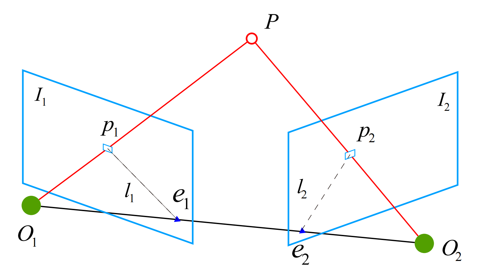

以上图为例，我们希望求取两帧图像$I_1,I_2$之间的运动，设第一帧到第二帧的运动为$R,t$。两个相机中心分别为$O_1,O_2$。现在，考虑$I_1$中有一个特征点$p_1$，它在$I_2$中对应着特征点$p_2$。我们知道两者是通过特征匹配得到的。如果匹配正确，说明它们确实是在同一个空间点在两个成像平面上的投影。这里需要一些术语来描述它们之间的几何关系。

- 首先，连线$\overrightarrow{O_1p_1}$和连线$\overrightarrow{O_2p_2}$在三维空间中会相交于点$P$。

  - 这时候点$O_1,O_2,P$三个点可以确定一个平面，称为`极平面（Epipolar plane）`。

  - $O_1O_2$连线与像平面$I_1,I_2$的交点分别为$e_1,e_2$。$e_1,e_2$称为`极点（Epipoles）`，$O_1O_2$被称为`基线（Baseline）`。

  - 极平面 与 两个像平面$I_1,I_2$ 之间的 相交线$l_1,l_2$ 为`极线（Epipolar line）`。

- 如果在`第一幅图片`的角度看，射线$\overrightarrow{O_1p_1}$是某个像素可能出现的空间位置（因为该射线上的所有点都会投影到同一个像素点）。

  假如我此时不知道 $P$ 的位置

  那么当我们在`第二幅图像`上看时，$\overrightarrow{e_2p_2}$就是 $P$ 可能出现的投影的位置。（这是因为 直线$\overrightarrow{e_2p_2}$ 是 射线$\overrightarrow{O_1p_1}$ 在第二个相机中的投影）

  > 注意：以上步骤保证正确的前提是`正确的特征匹配`

现在我们从`代数角度`来看一下这里的几何关系。

- 在`第一幅图像`的`相机坐标系（光心坐标系）`下，设 $P$ 的空间位置为：$\boldsymbol{P}=[X,Y,Z]^{\mathrm{T}}.$

- 根据`针孔相机模型`，我们知道两个 像素点$p_1,p_2$ 的在`齐次像素坐标系`中的位置为：
  $$
  s_1p_1=KP,\quad s_2p_2=K\left(RP+t\right).
  $$
  其中：

  - $s_1,s_2$：$s$即为深度$Z$，也就是 空间点$P$ 与光心的距离。$s_1$为 空间点P 在 第一相机坐标系中的深度，$s_2$为 空间点P 在 第二相机坐标系中的深度

    🤔为什么我们讨论的是`2D-2D对极几何`，可是出现深度呢？

    👉在 2D-2D 对极几何里，我们写 $s p = K P$ 只是作为推导工具，最后会把 $s$ 和 $P$ 消掉

  - $p1,p2$：分别是 空间点$P$ 在 第一幅图的齐次像素坐标系 和 第二幅图的齐次像素坐标系 下的位置，$p=\begin{bmatrix}u\\v\\1\end{bmatrix}$
  - $K$：相机内参矩阵（因为都是同一个相机拍的，只是先后顺序不同，所以$K$是一样的）
  - $R,t$：这里是$R_{21},t_{21}$，表示 空间点$P$ 从 第一幅图片的相机坐标系 转换到 第二幅图片的相机坐标系

> `齐次坐标 的核心性质`：
>
> 在齐次坐标意义下，**两个向量只要相差一个非零倍数**，就表示同一个点，即$sp\simeq p$
>
> 解释：
>
> - `尺度意义下相等`
>
>   假设有一个像素点是：$p=\begin{bmatrix}100\\200\\1\end{bmatrix}$
>
>   那么如果我把这个$p$点左乘一个非零倍数，如：$2p=\begin{bmatrix}200\\400\\2\end{bmatrix}$，还有：$0.5p=\begin{bmatrix}50\\100\\0.5\end{bmatrix}$
>
>   - 如果我们把 点$p$ 放在`普通向量`意义下：很明显它们并不相等（每一个点都是一个三维坐标）
>
>   - 如果我们把 点$p$ 放在`齐次坐标`意义下：它们表示同一个像素点（此时它们是二维坐标）
>
>     这是因为齐次坐标在表示点时，最后一维都需要变为1，即$\left(\frac{200}{2},\frac{400}{2}\right)=(100,200)$

- 由于齐次坐标的性质，我们讨论的$p_1,p_2$又是在齐次像素坐标下的。所以我们得出：
  $$
  sp\simeq p.
  $$
  这通常用于表达一个`投影关系`。例如 $s_1p_1$ 和 $p_1$ 成投影关系，它们在齐次坐标的意义下是相等的。

  那么，上述两个投影关系可写为：
  $$
  p_1\simeq KP,\quad p_2\simeq K\left(RP+t\right).
  $$
  现在，我们求 空间点$P$ 在 `归一化相机坐标系(即Z=1)` 上的坐标$x$：

  - 从 针孔相机模型 出发：
    $$
    s_1p_1=KP,\quad s_2p_2=K\left(RP+t\right).
    $$

  - 在 等式 两边同时 左乘$K^{-1}$
    $$
    K^{-1}(sp)=P
    $$
    整理：
    $$
    s(K^{-1}p)=P
    $$
    定义：
    $$
    x=K^{-1}p
    $$
    于是得到：

    这一步就变为了 三维点P = 深度s * 一个方向x（说明x是一条从相机中心出发的方向）
    $$
    P=sx
    $$
    我们知道$P=\begin{bmatrix}X\\Y\\Z\end{bmatrix}$，所以$x=\begin{bmatrix}X/Z\\Y/Z\\1\end{bmatrix}$，$x$在齐次坐标系下的意义就是 空间点$P$ 在归一化相机坐标系 中的坐标

  - 所以我们取：
    $$
    x_1=K^{-1}p_1,\quad x_2=K^{-1}p_2.
    $$
    这里的 $x_1,x_2$ 是两个像素点的`归一化平面`上的坐标。代入 $p_1\simeq KP,\quad p_2\simeq K\left(RP+t\right).$ ，得：
    $$
    x_2\simeq Rx_1+t.
    $$
    

  

  

  

  

  

  

  

