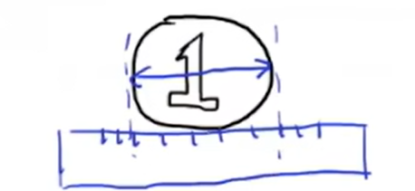
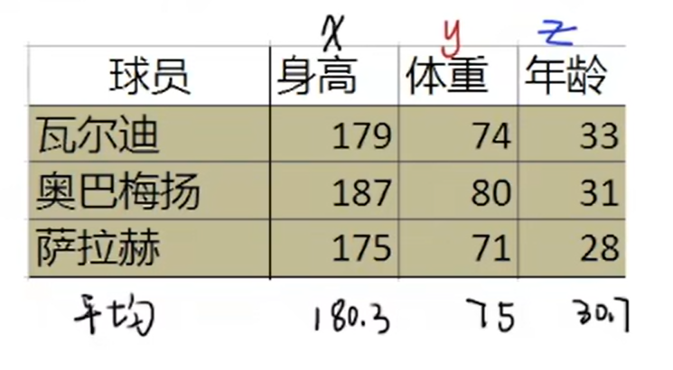
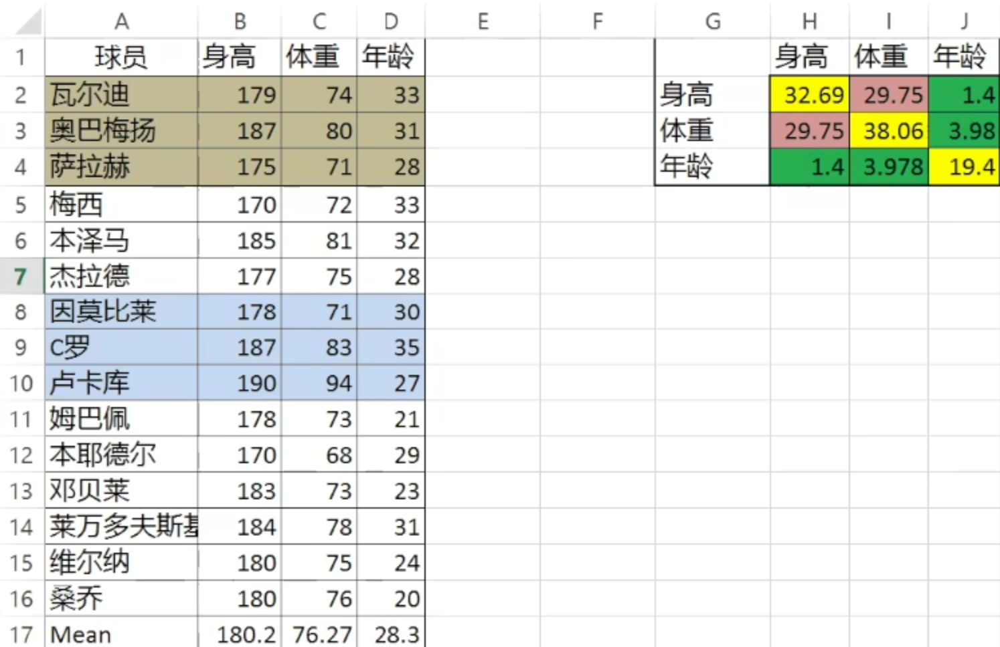
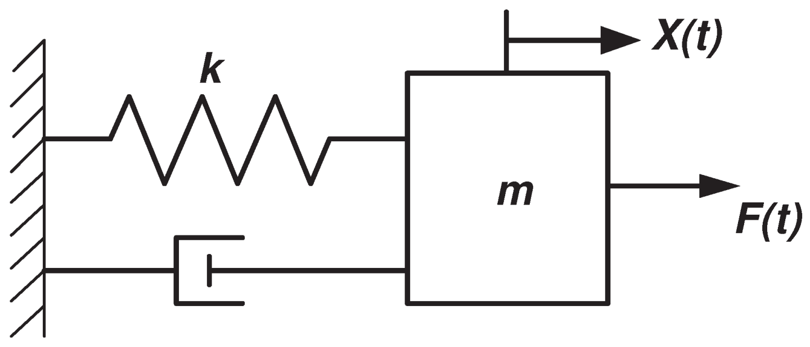

# 递归算法_Recursive Processing

`卡尔曼滤波器`是一种Optimal Recursive Data Processing Algorithm（最优化 递归 数字处理 算法）

- 卡尔曼滤波器的应用非常广泛（尤其是导航），这是因为我们生活的世界中，存在着大量的不确定性。当我们去描述一个系统的时候，这个不确是性主要体现在三个方面：

  - 不存在完美的数学模型

  - 系统的扰动不可控，也很难建模

  - 测量传感器存在误差

- **引入卡尔曼滤波**：举个例子：

  

  找不同的人来测量一个硬币的直径。我们使用$Z_k$来表示测量结果，其中$k$表示每次测量的结果。因为因为每个人测量值的不一样，尺子本身也有误差，所以说每次测量的结果会不尽相同。我们假设数据是这样的：$\begin{array}{c}{Z_{1}=50.1mm}\\{Z_{2}=50.4mm}\\{Z_{3}=50.2mm}\end{array}$

  **计算思路**：

  - 因为我们是要`估计`这个硬币的直径（即`真实数据`）。我们会很自然地想到**取三个人的`平均值`**：
    $$
    \begin{aligned}\hat{\chi}_{k}
    &=\frac{1}{k}\left(z_{1}+z_{2}+\cdots+z_{k}\right)\\
    &=\frac{1}{k}\left(z_{1}+z_{2}+\cdots+z_{k-1}\right)+\frac{1}{k}z_{k}\\
    &=\frac{1}{k}\frac{k-1}{k-1}\left(z_{1}+z_{2}+\cdots+z_{k-1}\right)+\frac{1}{k}z_{k}\\
    &=\frac{k-1}{k}\hat{\chi}_{k-1}+\frac{1}{k}z_{k}\\
    &=\hat{\chi}_{k-1}-\frac{1}{k}\hat{\chi}_{k-1}+\frac{1}{k}z_{k}\end{aligned}
    $$
    **公式解释**：

    - $Z_i$：第i次（即第i个人）测量硬币得到的值`（注意：这个值不是真实值，真实值永远是未知的）`

    - $\hat{\chi}_{k}$：带一个（`Hat符号^`）就表示**估计值**，这里表示第 $k$ 次测量时**硬币直径的估计值**
    - 在第三行中出现了：$\frac{1}{k-1}\left(z_{1}+z_{2}+\cdots+z_{k-1}\right)$，那么根据我们求`平均值`的定义，这个就是$k-1$次测量的平均值，即 $\hat{\chi}_{k-1}=\frac{1}{k-1}\left(z_{1}+z_{2}+\cdots+z_{k-1}\right)$

  - **所以我们得到公式**：
    $$
    \boxed{\hat{\chi}_{k}\quad=\quad\hat{\chi}_{k-1}\quad+\frac{1}{k}(z_{k}-\hat{\chi}_{k-1})}
    $$
    **那么由公式我们可以看到**：

    - 随着 测量次数$k$ 的增加，$\frac{1}{k}$趋近于0，那么这个时候 $\hat{\chi}_{k}\quad=\quad\hat{\chi}_{k-1}\quad$。也就是说随着测量次数的增加，测量结果就不再重要了（因为有大量的结果后，我们就可以相信估计值，所以以后的测量值就不那么重要）
    - 相反，如果 测量次数$k$ 比较小，那么 $\frac{1}{k}$趋近于无穷大，那这个时候测量的结果就可以起到很大的作用，尤其是它和估计值差距比较大的时候（尤其是测量值与估计值相差比较大时）

  - 下面我们令 $\frac{1}{k}=K_k$，那么上面的公式变为：$\boxed{\hat{\chi}_{k}\quad=\quad\hat{\chi}_{k-1}\quad+K_k(z_{k}-\hat{\chi}_{k-1})}$。这就是`卡尔曼滤波中的更新公式`

    在`卡尔曼滤波更新公式`中，这个 $K_k$ 就是 `卡尔曼增益（Kalman Gain）`

  - **结论**：

    在`卡尔曼滤波`中，**新的估计值$\hat{\chi}_{k}$** 与 **上一次的估计值$\hat{\chi}_{k-1}$** 有关，那么**上一次的估计值**又与**上上一次的估计值**有关。那么这就是一种`递归`的思想。

    而且这也是`卡尔曼滤波`的优势，因为卡尔曼滤波不需要追溯**很久以前的数据**，只需要**上一次的数据**就可以了。

- `卡尔曼增益`$K_k$

  - 首先引入两个参数：

    `估计误差`：$e_{EST}$，代表 **`估计值`与`真实值`的差距**。其中 $e$代表error(误差)，$EST$代表estimate(估计)

    `测量误差`：$e_{MEA}$，代表 **`测量值`与`真实值`的差距**。其中 $MEA$就是measurement(测量)

  - 这个时候，我们得到**`卡尔曼滤波波的核心公式`**：
    $$
    k_{k}=\frac{e_{EST_{k-1}}}{e_{EST_{k-1}}+e_{MEA_k}}
    $$
    分析一下这个公式：在$k$时刻：

    - 当 $e_{EST_{k-1}}$ 远大于 $e_{MEA_k}$ 时，$K_k$ 就会趋近于1，那么卡尔曼滤波公式变为：
      $$
      \hat{\chi}_{k}=\hat{\chi}_{k-1}+z_{k}-\hat{\chi}_{k-1}=z_{k}
      $$
      也就是说：当 **第$k-1$次的估计误差** 远大于 **第$k$次的测量误差** 时，**第$k$次的估计值**就很趋近于**测量值$z_k$**

      **（直观理解：当`估计`的误差大时，`测量`更加准确，所以需要更加信任`测量值`）**

    - 当 $e_{EST_{k-1}}$ 远小于 $e_{MEA_k}$ 时，$K_k$ 就会趋近于0，那么卡尔曼滤波公式变为：
      $$
      \hat{{\chi}_{k}}=\hat{\chi}_{k-1}.
      $$
      也就是说：当`测量误差`很大时，我们选择相信上一次的`估计值`

- **`卡尔曼滤波`的计算步骤**（循环执行）

  1. 计算 第k次的`卡尔曼增益`：$K_{k}=\frac{e_{EST_{k-1}}}{e_{EST_{k-1}}+e_{MEA_{k}}}$
  2. 计算 第k次的`估计值`$\hat{{\chi}_{k}}$： $\hat{\chi}_{k}\quad=\quad\hat{\chi}_{k-1}\quad+K_k(z_{k}-\hat{\chi}_{k-1})$
  3. 更新 第k次的`估计误差`$e_{EST_k}$：$e_{EST_k}=(1-k_k)e_{EST_{k-1}}$

  

# 数学基础：数据融合、协方差矩阵、状态空间方程、观测器问题

## 数据融合

我们从一个例子开始：假设我们用两个称（已知这两个称都有误差）去称`一个东西`，得到两个**结果**，分别是$z_1=30g$，$z_2=32g$。而且现在我们已知这两个称的数据分布都符合**正态分布**，**标准差**分别为$\sigma_{1}=2g$，$\sigma_{2}=4g$。我们要怎么估计`这个东西`的质量的**真实值$\hat{z}$** ？

**计算思路**：

- 我们要使用`卡尔曼增益的思想`：我们把$z_{1}$作为初始`估计值`，$z_{2}$当作新的`观测值`，则得到：$\hat{z}=z_{1}+k(z_{2}-z_{1}),k\in[0,1]$

  - 当$k=0$时，$\hat{z}=z_{1}$
  - 当$k=1$时，$\hat{z}=z_{2}$

- 因为我们要求质量的真实值

  所以问题转换为我们要求解合适的 `k`，使得 **$\hat{z}$的`标准差`(即$\sigma_{\hat{z}}$)** **最小**，

  也就是说要求 **$\hat{z}$的`方差`(即$Var(\hat{z})$) 最小**。
  $$
  \begin{aligned}{\sigma_{\hat{z}}^{2}}
  &=\operatorname{Var}\left(z_{1}+k(z_{2}-z_{1})\right)\\
  &=\operatorname{Var}(z_{1}-kz_{1}+kz_{2})\\
  &=\operatorname{Var}((1-k)z_{1}+kz_{2})\\
  &=\operatorname{Var}((1-k)z_{1})+\operatorname{Var}(kz_{2})\\
  &=(1-k)^{2}{\sigma_{1}^{2}}+k^{2}{\sigma_{2}^{2}}\end{aligned}
  $$
  现在我们得到了一个函数，那么为了取$\sigma_{\hat{z}}$的最小值，我们需要 **用该函数对$k$求导**，并`等于0`来求`极值`

  - 对$k$求导：
    $$
    \frac{d\sigma_{\hat z}^2}{dk}=-2(1-k)\sigma_1^2 + 2k\sigma_2^2
    $$

  - 等于0，求极值：
    $$
    -2(1-k)\sigma_1^2 + 2k\sigma_2^2=0 \\
    -{\sigma_{1}}^{2}+k{\sigma_{1}}^{2}+k{\sigma_{2}}^{2}=0 \\
    k({\sigma_{1}}^{2}+{\sigma_{2}}^{2})={\sigma_{1}}^{2} \\
    $$
    得到：
    $$
    k
    =\frac{\sigma_{1}^{2}}{\sigma_{1}^{2}+\sigma_{2}^{2}}
    =0.2
    $$

  - 现在我们得到 $k$的值。我们代入回 $\hat{z}=z_{1}+k(z_{2}-z_{1})$，得到 
    $$
    \hat{z}=30+0.2*(32-30)=30.4 \\
    \sigma_{\hat{z}}^{2}=(1-k)^{2}{\sigma_{1}^{2}}+k^{2}{\sigma_{2}^{2}}=3.2，即\sigma_{\hat{z}}=1.79
    $$
    也就是说：

    我们对这个东西的质量的预测是30.4g。并且通过数学证明该预测是最优解

## 协方差矩阵

> - `协方差`：两个变量是一起变大、一起变小，还是一个变大另一个变小？
>
>   - **正协方差 (>0)**
>      一个变量变大，另一个通常也变大
>      例如：学习时间 ↑ -> 成绩 ↑
>
>   - **负协方差 (<0)**
>      一个变量变大，另一个通常变小
>      例如：商品价格 ↑ -> 需求量 ↓
>
>   - **接近 0**
>      两个变量基本 **没有线性关系**
>
>   - **公式**：
>     $$
>     \text{Cov}(X,Y)=E[(X-E[X])(Y-E[Y])]
>     $$
>     意思是：
>
>     每个变量减去自己的 **平均值**
>
>     两个偏差 **相乘**
>
>     再求 **期望（平均）**
>
>     
>
> - `协方差矩阵`：将方差、协方差在一个矩阵中表现出来，表示**变量间的联动关系**

例如：

- 方差：
  $$
  \begin{aligned}
  &\sigma_{x}^{2}=\frac{1}{3}\left((179-180.3)^{2}+(187-180.3)^{2}+(175-180.3)^{2}\right)=24.89\\
  &\sigma_{y}^{2}=14\\
  &\sigma_{z}^{2}=4.22\end{aligned}
  $$

- 协方差：
  $$
  \sigma_{x}\sigma_{y}=\frac{1}{3}\left((119-180.3)(74-76)+(187-180.3)(80-75)+(175-180.3)(71-75)\right)=18.7=\sigma_{y}\sigma_{x} \\
  \begin{array}{ll}{\sigma_x\sigma_{z}=4.4=\sigma_z\sigma_{x}}\\{\sigma_ y\sigma_{z}=3.3=\sigma_z\sigma_y}\end{array}
  $$

- **协方差矩阵**
  $$
  P = \begin{bmatrix} \sigma_x^2 & \sigma_{xy} & \sigma_{xz} \\ \sigma_{yx} & \sigma_y^2 & \sigma_{yz} \\ \sigma_{zx} & \sigma_{zy} & \sigma_z^2 \end{bmatrix}
  =\begin{bmatrix}24.89&18.7&4.4\\18.7&14&3.3\\4.4&3.3&4.22\end{bmatrix}
  $$

- **分析数据**

  当我们掌握上面这种算法时，我们就可以统计更多的数据

  

  从这些数据我们可以分析到：

  - 身高与体重的协方差很大。这说明身高越高体重越大
  - 身高与年龄的协方差很小。很好理解，因为这些球员都是成年的，身高就基本固定，所以这两者基本就没什么关系
  - 体重与年龄的协方差很小。这是因为球员对自身的体重管理严格

## 状态空间表达

我们以一个`典型的弹簧震动阻尼系统`：

- 系统有一个弹簧，弹簧的胡克系数是k
- 阻尼器（弹簧下面那个）的阻尼系数是B
- 物块的质量是m，对物块向右施加的力是F，向右运动的方向是X

这个动态方程的表达式是：$m\ddot{\chi}+B\dot{\chi}+k\chi=F$

- **$m\ddot{\chi}$（惯性力，也叫假想力）**：
  - $m$ 是质量（Mass）。
  - $\ddot{\chi}$ 是位移对时间的二阶导数，即**加速度** ($a$)。根据牛顿第二定律，$F=ma$。
- **$B\dot{\chi}$（阻尼力）**：
  - $B$ 是阻尼系数（Damping coefficient），有时也写作 $c$。
  - $\dot{\chi}$ 是位移对时间的一阶导数，即**速度** ($v$)。这部分代表了与速度成正比的阻力（如空气阻力或液体粘滞力）。
- **$k\chi$（恢复力/弹簧力）**：
  - $k$ 是刚度系数或弹簧常数（Stiffness）。
  - 这部分遵循**胡克定律**，力的大小与位移 $\chi$ 成正比，方向指向平衡位置。
- **$F$（外力/驱动力）**：
  - 系统受到的随时间变化的外部激振力。如果 $F=0$，则称为“自由振动”。

